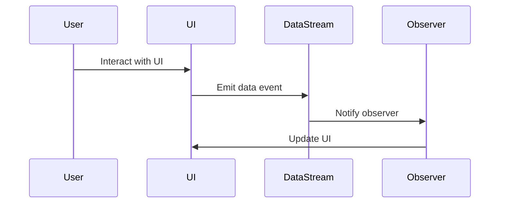

## 11.1 Introduction to Reactive Programming in Ruby

Reactive programming is a programming paradigm that focuses on asynchronous data streams and the propagation of change. It is a powerful approach that allows developers to build applications that are more responsive, resilient, and elastic. In this section, we will delve into the core concepts of reactive programming, its benefits, and how it can be applied in Ruby to enhance modern application development.

### What is Reactive Programming?

Reactive programming is a declarative programming paradigm concerned with data streams and the propagation of change. It is about building systems that react to changes in data and events. In reactive programming, data streams are the primary abstraction, and they can be anything from user inputs, messages, or data changes.

#### Core Concepts of Reactive Programming

1. **Data Streams**: At the heart of reactive programming are data streams. These are sequences of ongoing events ordered in time. Streams can emit three types of items: a value (of some type), an error, or a "completed" signal.

2. **Observers**: Observers subscribe to data streams and react to the emitted items. They define how to handle each type of item emitted by the stream.

3. **Operators**: Operators are functions that enable you to manipulate data streams. They allow you to transform, filter, combine, and compose streams.

4. **Schedulers**: Schedulers control the execution context of streams, determining when and where the streams' operations are executed.

### Benefits of Reactive Programming

Reactive programming offers several benefits that make it suitable for modern application development:

- **Responsiveness**: Applications built using reactive programming can respond to user interactions and data changes in real-time, providing a seamless user experience.

- **Resilience**: Reactive systems are designed to handle failures gracefully, ensuring that the application remains responsive even under adverse conditions.

- **Elasticity**: Reactive applications can scale up or down based on the workload, making them ideal for cloud-based environments.

- **Composability**: Reactive programming allows for the composition of complex data flows from simple, reusable components.

### Relevance of Reactive Patterns in Modern Application Development

In today's fast-paced digital world, users expect applications to be highly responsive and available at all times. Reactive programming addresses these expectations by enabling developers to build systems that are responsive, resilient, and scalable. Reactive patterns are particularly relevant in scenarios involving:

- **Real-time data processing**: Applications that require processing of real-time data, such as financial trading systems or live analytics dashboards.

- **Event-driven architectures**: Systems that rely on events to trigger actions, such as IoT applications or microservices architectures.

- **User interfaces**: Applications with complex user interfaces that need to react to user inputs and data changes dynamically.

### How Ruby Supports Reactive Programming

Ruby, with its dynamic and expressive nature, is well-suited for reactive programming. While Ruby is not inherently reactive, it provides several features and libraries that facilitate the implementation of reactive patterns:

- **EventMachine**: A Ruby library for event-driven programming, providing a framework for building scalable network applications.

- **RxRuby**: A Ruby implementation of Reactive Extensions (Rx), which provides a rich set of operators for composing asynchronous and event-based programs using observable sequences.

- **Celluloid**: A concurrent object-oriented programming framework for Ruby, which simplifies the creation of concurrent applications.

### Key Libraries and Frameworks for Reactive Programming in Ruby

1. **RxRuby**: RxRuby is a library that brings the power of Reactive Extensions to Ruby. It allows you to compose asynchronous and event-based programs using observable sequences and provides a wide range of operators for manipulating data streams.

   ```ruby
   require 'rx'

   # Create an observable sequence
   observable = Rx::Observable.range(1, 5)

   # Subscribe to the observable
   observable.subscribe(
     lambda { |x| puts "Next: #{x}" },
     lambda { |err| puts "Error: #{err}" },
     lambda { puts "Completed" }
   )
   ```

2. **EventMachine**: EventMachine is a Ruby library for event-driven I/O. It is designed to handle many connections simultaneously, making it ideal for building scalable network applications.

   ```ruby
   require 'eventmachine'

   # Define a simple echo server
   module EchoServer
     def receive_data(data)
       send_data "You sent: #{data}"
     end
   end

   # Start the EventMachine loop
   EventMachine.run {
     EventMachine.start_server "localhost", 8081, EchoServer
   }
   ```

3. **Celluloid**: Celluloid is a concurrent object-oriented programming framework for Ruby. It simplifies the creation of concurrent applications by providing a simple and intuitive API for managing concurrency.

   ```ruby
   require 'celluloid'

   # Define a simple actor
   class MyActor
     include Celluloid

     def greet
       puts "Hello from MyActor!"
     end
   end

   # Create an instance of the actor
   actor = MyActor.new
   actor.greet
   ```

### Visualizing Reactive Programming Concepts

To better understand how reactive programming works, let's visualize the flow of data in a reactive system using a sequence diagram.



**Diagram Description**: This sequence diagram illustrates the flow of data in a reactive system. The user interacts with the UI, which emits a data event to the data stream. The data stream notifies the observer, which then updates the UI.

### Try It Yourself

To get a hands-on experience with reactive programming in Ruby, try modifying the code examples provided above. For instance, you can:

- Change the range of numbers in the `RxRuby` example to see how it affects the output.
- Modify the `EventMachine` echo server to handle different types of data.
- Create additional methods in the `Celluloid` actor and see how they interact.

### References and Further Reading

- [ReactiveX - Introduction to Reactive Programming](http://reactivex.io/intro.html)
- [EventMachine Documentation](https://github.com/eventmachine/eventmachine)
- [RxRuby GitHub Repository](https://github.com/ReactiveX/RxRuby)
- [Celluloid GitHub Repository](https://github.com/celluloid/celluloid)

### Knowledge Check

Before moving on to more advanced topics in reactive programming, take a moment to review the key concepts covered in this section. Consider the following questions:

- What are the core concepts of reactive programming?
- How does reactive programming enhance application responsiveness?
- What are some key libraries and frameworks for reactive programming in Ruby?

### Embrace the Journey

Remember, this is just the beginning of your journey into reactive programming with Ruby. As you progress, you'll discover more advanced patterns and techniques that will enable you to build even more responsive and resilient applications. Keep experimenting, stay curious, and enjoy the journey!

## Quiz: Introduction to Reactive Programming in Ruby



### What is the primary abstraction in reactive programming?

- [x] Data Streams
- [ ] Classes
- [ ] Objects
- [ ] Methods

> **Explanation:** In reactive programming, data streams are the primary abstraction, representing sequences of ongoing events ordered in time.

### Which of the following is a benefit of reactive programming?

- [x] Responsiveness
- [ ] Increased complexity
- [ ] Slower performance
- [ ] Reduced scalability

> **Explanation:** Reactive programming enhances application responsiveness, making it more suitable for real-time data processing and user interactions.

### What is the role of an observer in reactive programming?

- [x] To subscribe to data streams and react to emitted items
- [ ] To create data streams
- [ ] To transform data streams
- [ ] To schedule data streams

> **Explanation:** Observers subscribe to data streams and define how to handle each type of item emitted by the stream.

### Which Ruby library is used for event-driven programming?

- [x] EventMachine
- [ ] RxRuby
- [ ] Celluloid
- [ ] ActiveRecord

> **Explanation:** EventMachine is a Ruby library for event-driven programming, providing a framework for building scalable network applications.

### What does RxRuby provide for reactive programming?

- [x] A rich set of operators for composing asynchronous and event-based programs
- [ ] A framework for building web applications
- [ ] A library for database interactions
- [ ] A tool for static analysis

> **Explanation:** RxRuby provides a rich set of operators for composing asynchronous and event-based programs using observable sequences.

### How does reactive programming improve resilience?

- [x] By handling failures gracefully
- [ ] By increasing code complexity
- [ ] By reducing code readability
- [ ] By limiting scalability

> **Explanation:** Reactive programming improves resilience by designing systems to handle failures gracefully, ensuring continued responsiveness.

### What is the function of operators in reactive programming?

- [x] To manipulate data streams
- [ ] To create data streams
- [ ] To observe data streams
- [ ] To schedule data streams

> **Explanation:** Operators are functions that enable you to manipulate data streams, allowing for transformations, filtering, and composition.

### Which of the following is NOT a core concept of reactive programming?

- [ ] Data Streams
- [ ] Observers
- [ ] Operators
- [x] Controllers

> **Explanation:** Controllers are not a core concept of reactive programming. The core concepts include data streams, observers, operators, and schedulers.

### What is the purpose of schedulers in reactive programming?

- [x] To control the execution context of streams
- [ ] To create data streams
- [ ] To transform data streams
- [ ] To observe data streams

> **Explanation:** Schedulers control the execution context of streams, determining when and where the streams' operations are executed.

### True or False: Reactive programming is only suitable for web applications.

- [ ] True
- [x] False

> **Explanation:** Reactive programming is suitable for a wide range of applications, including real-time data processing, event-driven architectures, and complex user interfaces.


