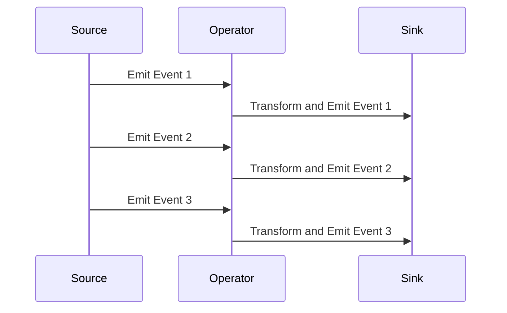

## 11.10 Testing Reactive Applications

In the world of software development, ensuring the correctness and reliability of applications is paramount. This becomes even more challenging when dealing with reactive applications, which often involve asynchronous and non-deterministic code. In this section, we will explore strategies and tools for effectively testing reactive applications in Ruby, focusing on reactive programming patterns and the unique challenges they present.

### Understanding the Challenges

Reactive applications are characterized by their use of asynchronous data streams and event-driven architectures. This introduces several challenges when it comes to testing:

1. **Asynchronous Execution**: Unlike traditional synchronous code, reactive applications execute operations asynchronously, making it difficult to predict the order of execution and the timing of events.

2. **Non-Determinism**: The non-deterministic nature of reactive applications means that the same input can lead to different outputs depending on the timing and order of events.

3. **Complex State Management**: Reactive applications often involve complex state management, where the state is updated in response to a stream of events.

4. **Error Handling**: Ensuring comprehensive coverage of error handling paths is crucial, as errors can propagate through streams in unexpected ways.

### Strategies for Testing Reactive Applications

To effectively test reactive applications, we need to adopt strategies that address these challenges. Here are some key strategies to consider:

#### 1. Testing Asynchronous Code

Testing asynchronous code requires a different approach compared to synchronous code. Here are some methods to consider:

- **Use of Callbacks and Promises**: When testing asynchronous code, it's important to use callbacks or promises to ensure that tests wait for asynchronous operations to complete before asserting results.

- **Time-based Testing**: Use time-based testing techniques to simulate the passage of time and test time-dependent behavior. This can be achieved using libraries like `timecop` in Ruby.

- **Mocking and Stubbing**: Use mocks and stubs to simulate asynchronous operations and control their behavior during tests.

#### 2. Testing Reactive Streams and Operators

Reactive streams and operators form the backbone of reactive applications. Here are some methods for testing them:

- **Observable Testing**: Use testing utilities provided by libraries like RxRuby to test observables and their behavior. This includes verifying the emissions, subscriptions, and transformations applied to streams.

- **Operator Testing**: Test individual operators to ensure they behave as expected. This includes testing operators like `map`, `filter`, `merge`, and `combineLatest`.

- **End-to-End Testing**: Conduct end-to-end tests to verify the behavior of entire reactive pipelines, ensuring that data flows correctly from source to sink.

#### 3. Using Testing Utilities

Libraries like RxRuby provide testing utilities that can simplify the process of testing reactive applications. Here are some key utilities to consider:

- **TestScheduler**: Use the `TestScheduler` to simulate the passage of time and control the execution of asynchronous operations. This allows you to test time-dependent behavior in a controlled environment.

- **TestObserver**: Use the `TestObserver` to observe and assert the emissions from observables. This utility allows you to verify the sequence and timing of emissions.

- **Marble Diagrams**: Use marble diagrams to visualize and test the behavior of reactive streams. Marble diagrams provide a graphical representation of the sequence of events in a stream.

#### 4. Mocks and Stubs for Observables

Mocks and stubs are essential tools for testing reactive applications. Here are some ways to use them effectively:

- **Mocking Observables**: Use mocks to simulate the behavior of observables and control their emissions during tests. This allows you to test how your application responds to different sequences of events.

- **Stubbing Operators**: Use stubs to replace operators with predefined behavior during tests. This allows you to isolate and test specific parts of your reactive pipeline.

- **Simulating Errors**: Use mocks and stubs to simulate errors in reactive streams and test your application's error handling logic.

#### 5. Coverage for Error Handling Paths

Ensuring comprehensive coverage of error handling paths is crucial for the reliability of reactive applications. Here are some strategies to achieve this:

- **Error Propagation Testing**: Test how errors propagate through reactive streams and ensure that they are handled correctly at each stage.

- **Fallback and Retry Logic**: Test fallback and retry logic to ensure that your application can recover from errors gracefully.

- **Error Logging and Monitoring**: Implement error logging and monitoring to track errors in production and ensure that they are addressed promptly.

### Code Examples

Let's explore some code examples to illustrate these concepts.

#### Example 1: Testing Asynchronous Code

```ruby
require 'rspec'
require 'rx_ruby'

describe 'Asynchronous Code' do
  it 'waits for asynchronous operation to complete' do
    result = nil

    RxRuby::Observable.timer(1000)
      .subscribe { result = 'Completed' }

    # Simulate the passage of time
    sleep(1.5)

    expect(result).to eq('Completed')
  end
end
```

In this example, we use `RxRuby::Observable.timer` to simulate an asynchronous operation. We then use `sleep` to wait for the operation to complete before asserting the result.

#### Example 2: Testing Reactive Streams

```ruby
require 'rspec'
require 'rx_ruby'

describe 'Reactive Streams' do
  it 'transforms data using map operator' do
    source = RxRuby::Observable.from_array([1, 2, 3])
    result = []

    source.map { |x| x * 2 }
          .subscribe { |x| result << x }

    expect(result).to eq([2, 4, 6])
  end
end
```

In this example, we test the `map` operator by transforming an array of numbers and verifying the result.

#### Example 3: Using TestScheduler

```ruby
require 'rspec'
require 'rx_ruby'

describe 'TestScheduler' do
  it 'simulates the passage of time' do
    scheduler = RxRuby::TestScheduler.new
    result = []

    RxRuby::Observable.timer(1000, scheduler)
      .subscribe { result << 'Completed' }

    scheduler.advance_by(1000)

    expect(result).to eq(['Completed'])
  end
end
```

In this example, we use `TestScheduler` to simulate the passage of time and test time-dependent behavior.

### Visualizing Reactive Streams

To better understand the flow of data in reactive streams, we can use diagrams to visualize the sequence of events.



In this sequence diagram, we visualize the flow of events from the source to the sink through an operator. This helps us understand how data is transformed and propagated in a reactive stream.

### Knowledge Check

To reinforce your understanding of testing reactive applications, consider the following questions:

1. What are the key challenges of testing asynchronous and non-deterministic code?
2. How can you use mocks and stubs to test reactive streams?
3. What is the role of the `TestScheduler` in testing reactive applications?
4. How can you ensure comprehensive coverage of error handling paths in reactive applications?

### Try It Yourself

Experiment with the code examples provided in this section. Try modifying the code to test different operators and error handling scenarios. For example, you can:

- Add additional operators to the reactive pipeline and test their behavior.
- Simulate errors in the reactive stream and test your application's error handling logic.
- Use the `TestScheduler` to test time-dependent behavior in more complex scenarios.

### Conclusion

Testing reactive applications requires a different approach compared to traditional applications. By adopting the strategies and tools discussed in this section, you can effectively test reactive applications and ensure their correctness and reliability. Remember, testing is an ongoing process, and it's important to continuously refine your testing strategies as your application evolves.

## Quiz: Testing Reactive Applications



### What is a key challenge of testing reactive applications?

- [x] Asynchronous execution
- [ ] Synchronous execution
- [ ] Lack of state management
- [ ] Simple error handling

> **Explanation:** Reactive applications often involve asynchronous execution, making it challenging to predict the order and timing of events.

### Which utility can be used to simulate the passage of time in tests?

- [ ] TestObserver
- [x] TestScheduler
- [ ] Marble Diagrams
- [ ] MockScheduler

> **Explanation:** The `TestScheduler` is used to simulate the passage of time and control the execution of asynchronous operations in tests.

### What is the purpose of using mocks and stubs in testing reactive applications?

- [x] To simulate the behavior of observables
- [ ] To replace the entire application
- [ ] To eliminate the need for tests
- [ ] To increase code complexity

> **Explanation:** Mocks and stubs are used to simulate the behavior of observables and control their emissions during tests.

### How can you ensure comprehensive coverage of error handling paths?

- [x] By testing error propagation and fallback logic
- [ ] By ignoring errors in tests
- [ ] By only testing successful paths
- [ ] By avoiding error handling altogether

> **Explanation:** Ensuring comprehensive coverage of error handling paths involves testing error propagation and fallback logic.

### What is a marble diagram used for?

- [x] Visualizing the sequence of events in a stream
- [ ] Simulating time in tests
- [ ] Replacing observables
- [ ] Increasing test complexity

> **Explanation:** Marble diagrams provide a graphical representation of the sequence of events in a stream, helping to visualize and test reactive streams.

### Which operator is used to transform data in a reactive stream?

- [x] map
- [ ] filter
- [ ] merge
- [ ] combineLatest

> **Explanation:** The `map` operator is used to transform data in a reactive stream.

### What is the role of the `TestObserver` in testing reactive applications?

- [x] To observe and assert emissions from observables
- [ ] To simulate time in tests
- [ ] To replace the entire application
- [ ] To increase code complexity

> **Explanation:** The `TestObserver` is used to observe and assert the emissions from observables, verifying the sequence and timing of emissions.

### How can you test time-dependent behavior in reactive applications?

- [x] By using the `TestScheduler`
- [ ] By ignoring time in tests
- [ ] By only testing synchronous code
- [ ] By avoiding time-based operations

> **Explanation:** The `TestScheduler` allows you to simulate the passage of time and test time-dependent behavior in a controlled environment.

### What is a key benefit of using reactive programming patterns?

- [x] Improved handling of asynchronous data streams
- [ ] Simplified synchronous execution
- [ ] Elimination of state management
- [ ] Reduced need for error handling

> **Explanation:** Reactive programming patterns improve the handling of asynchronous data streams, making it easier to manage complex state and event-driven architectures.

### True or False: Reactive applications are always deterministic.

- [ ] True
- [x] False

> **Explanation:** Reactive applications are often non-deterministic, meaning the same input can lead to different outputs depending on the timing and order of events.


