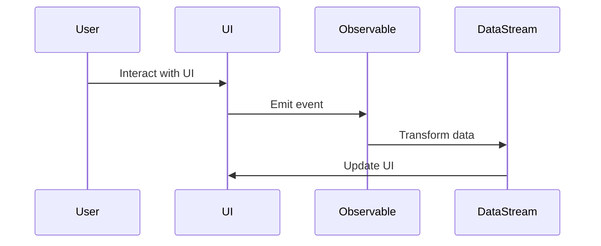

## 11.2 Functional Reactive Programming (FRP)

Functional Reactive Programming (FRP) is a programming paradigm that merges the principles of functional programming with reactive programming to manage time-varying values and asynchronous data flows. In this section, we will delve into the core concepts of FRP, explore how it differs from traditional reactive programming, and demonstrate its application in Ruby. We will also highlight the advantages of FRP, such as declarative event handling, and introduce Ruby libraries that support FRP, like [ReactiveRuby](https://github.com/zetachang/reactive-ruby).

### Understanding Functional Reactive Programming

#### What is FRP?

Functional Reactive Programming (FRP) is a declarative programming paradigm for working with time-varying values and asynchronous data streams. It allows developers to express the logic of data flows and transformations in a clear and concise manner, abstracting away the complexities of managing state and side effects.

FRP is built on two fundamental concepts:

1. **Functional Programming**: Emphasizes the use of pure functions, immutability, and higher-order functions to create predictable and testable code.
2. **Reactive Programming**: Focuses on building systems that react to changes in data or events over time, often using observable streams.

By combining these paradigms, FRP provides a powerful framework for handling dynamic and asynchronous data in a declarative way.

#### Objectives of FRP

The primary objectives of FRP are:

- **Declarative Event Handling**: Define the behavior of a system in response to events using high-level abstractions.
- **Time-Varying Values**: Model values that change over time as first-class citizens.
- **Asynchronous Data Flows**: Manage asynchronous data streams seamlessly, without explicit callbacks or state management.

### FRP vs. Traditional Reactive Programming

While both FRP and traditional reactive programming aim to handle asynchronous data, they differ in their approach and abstractions:

- **Declarative vs. Imperative**: FRP uses a declarative approach, allowing developers to specify what should happen in response to events, rather than how it should happen. Traditional reactive programming often involves imperative code with explicit state management.
- **Time-Varying Values**: FRP treats time-varying values as first-class entities, whereas traditional reactive programming may rely on event-driven callbacks.
- **Functional Abstractions**: FRP leverages functional programming concepts, such as pure functions and immutability, to create more predictable and maintainable code.

### Applying FRP Concepts in Ruby

Ruby, with its dynamic and expressive nature, is well-suited for implementing FRP concepts. Let's explore some key FRP concepts and how they can be applied in Ruby.

#### Observables and Streams

In FRP, observables represent data streams that emit values over time. Observables can be created from various sources, such as user inputs, network requests, or timers.

```ruby
require 'rx_ruby'

# Create an observable that emits values every second
observable = Rx::Observable.interval(1)

# Subscribe to the observable and print emitted values
subscription = observable.subscribe(
  lambda { |value| puts "Emitted value: #{value}" },
  lambda { |error| puts "Error: #{error}" },
  lambda { puts "Completed" }
)

# Unsubscribe after 5 seconds
sleep 5
subscription.unsubscribe
```

In this example, we use the `RxRuby` library to create an observable that emits values every second. We subscribe to the observable to receive and print the emitted values.

#### Transformations and Compositions

FRP allows us to transform and compose observables using functional operators, such as `map`, `filter`, and `reduce`.

```ruby
# Create an observable from an array
observable = Rx::Observable.from_array([1, 2, 3, 4, 5])

# Transform the observable by mapping values to their squares
squared_observable = observable.map { |value| value ** 2 }

# Subscribe to the transformed observable
squared_observable.subscribe { |value| puts "Squared value: #{value}" }
```

Here, we use the `map` operator to transform the values emitted by the observable into their squares.

#### Combining Observables

FRP provides operators to combine multiple observables, allowing us to handle complex data flows.

```ruby
# Create two observables
observable1 = Rx::Observable.from_array([1, 2, 3])
observable2 = Rx::Observable.from_array([4, 5, 6])

# Combine the observables using the `merge` operator
combined_observable = observable1.merge(observable2)

# Subscribe to the combined observable
combined_observable.subscribe { |value| puts "Combined value: #{value}" }
```

In this example, we use the `merge` operator to combine two observables into a single stream.

### Advantages of FRP

FRP offers several advantages that make it an attractive choice for handling asynchronous data flows:

- **Declarative and Concise**: FRP allows developers to express complex data flows and transformations in a concise and declarative manner, reducing boilerplate code.
- **Composability**: FRP provides powerful operators for composing and transforming observables, enabling modular and reusable code.
- **Predictability**: By leveraging functional programming principles, FRP promotes immutability and pure functions, leading to more predictable and testable code.
- **Asynchronous Handling**: FRP abstracts away the complexities of managing asynchronous data, providing a seamless way to handle events and data streams.

### Ruby Libraries Supporting FRP

Several Ruby libraries support FRP, providing tools and abstractions to work with observables and streams. One notable library is [ReactiveRuby](https://github.com/zetachang/reactive-ruby), which brings FRP concepts to Ruby applications.

#### ReactiveRuby

ReactiveRuby is a library that enables FRP in Ruby applications, allowing developers to build reactive user interfaces and handle asynchronous data flows.

- **Declarative UI**: ReactiveRuby provides a declarative way to define user interfaces, reacting to changes in data and events.
- **Data Binding**: It supports data binding, automatically updating the UI in response to changes in underlying data.
- **Integration with Ruby on Rails**: ReactiveRuby integrates seamlessly with Ruby on Rails, enabling reactive web applications.

### Visualizing FRP Concepts

To better understand the flow of data in FRP, let's visualize the process using a Mermaid.js sequence diagram.



This diagram illustrates the flow of data in an FRP system, where user interactions trigger events that are emitted by observables, transformed by data streams, and used to update the UI.

### Try It Yourself

To deepen your understanding of FRP in Ruby, try modifying the code examples provided:

- **Experiment with Different Operators**: Try using different operators, such as `filter` or `reduce`, to transform and compose observables.
- **Create Custom Observables**: Implement custom observables that emit values based on specific conditions or events.
- **Integrate with Ruby on Rails**: Use ReactiveRuby to build a simple reactive web application with Ruby on Rails.

### Knowledge Check

Before moving on, let's summarize the key takeaways:

- FRP combines functional programming and reactive programming to handle time-varying values and asynchronous data flows.
- It provides a declarative approach to event handling, promoting immutability and composability.
- Ruby libraries like ReactiveRuby support FRP, enabling reactive user interfaces and seamless data handling.

### Embrace the Journey

Remember, mastering FRP is a journey. As you explore and experiment with FRP concepts in Ruby, you'll gain a deeper understanding of how to build scalable and maintainable applications. Keep experimenting, stay curious, and enjoy the journey!

## Quiz: Functional Reactive Programming (FRP)



### What is the primary objective of Functional Reactive Programming (FRP)?

- [x] To handle time-varying values and asynchronous data flows declaratively
- [ ] To manage state changes imperatively
- [ ] To optimize memory usage in applications
- [ ] To improve the performance of synchronous code

> **Explanation:** FRP aims to handle time-varying values and asynchronous data flows in a declarative manner, abstracting away the complexities of state management.

### How does FRP differ from traditional reactive programming?

- [x] FRP uses a declarative approach, while traditional reactive programming often involves imperative code
- [ ] FRP relies on event-driven callbacks, unlike traditional reactive programming
- [ ] FRP does not support asynchronous data handling
- [ ] FRP is not compatible with functional programming principles

> **Explanation:** FRP uses a declarative approach, allowing developers to specify what should happen in response to events, rather than how it should happen, which is common in traditional reactive programming.

### Which Ruby library supports Functional Reactive Programming?

- [x] ReactiveRuby
- [ ] ActiveRecord
- [ ] Sinatra
- [ ] Nokogiri

> **Explanation:** ReactiveRuby is a library that supports Functional Reactive Programming in Ruby applications, enabling reactive user interfaces and data handling.

### What is an observable in FRP?

- [x] A data stream that emits values over time
- [ ] A static value that never changes
- [ ] A function that modifies state
- [ ] A class that handles user input

> **Explanation:** In FRP, an observable represents a data stream that emits values over time, allowing for asynchronous data handling.

### Which operator is used to transform values in an observable?

- [x] map
- [ ] reduce
- [ ] filter
- [ ] merge

> **Explanation:** The `map` operator is used to transform values emitted by an observable in FRP.

### What advantage does FRP offer in terms of code predictability?

- [x] It promotes immutability and pure functions
- [ ] It relies on mutable state and side effects
- [ ] It uses imperative programming principles
- [ ] It requires explicit state management

> **Explanation:** FRP promotes immutability and pure functions, leading to more predictable and testable code.

### How can observables be combined in FRP?

- [x] Using operators like `merge`
- [ ] By modifying global state
- [ ] By using imperative loops
- [ ] By creating new classes

> **Explanation:** Observables can be combined using operators like `merge`, allowing for complex data flows in FRP.

### What is the role of data streams in FRP?

- [x] To transform and handle asynchronous data
- [ ] To store static data
- [ ] To manage user sessions
- [ ] To execute synchronous code

> **Explanation:** Data streams in FRP are used to transform and handle asynchronous data, enabling reactive programming.

### True or False: FRP abstracts away the complexities of managing asynchronous data.

- [x] True
- [ ] False

> **Explanation:** FRP provides a seamless way to handle asynchronous data, abstracting away the complexities of state management and event handling.

### Which concept is central to both functional programming and FRP?

- [x] Immutability
- [ ] Mutable state
- [ ] Synchronous execution
- [ ] Global variables

> **Explanation:** Immutability is a central concept in both functional programming and FRP, promoting predictable and testable code.


