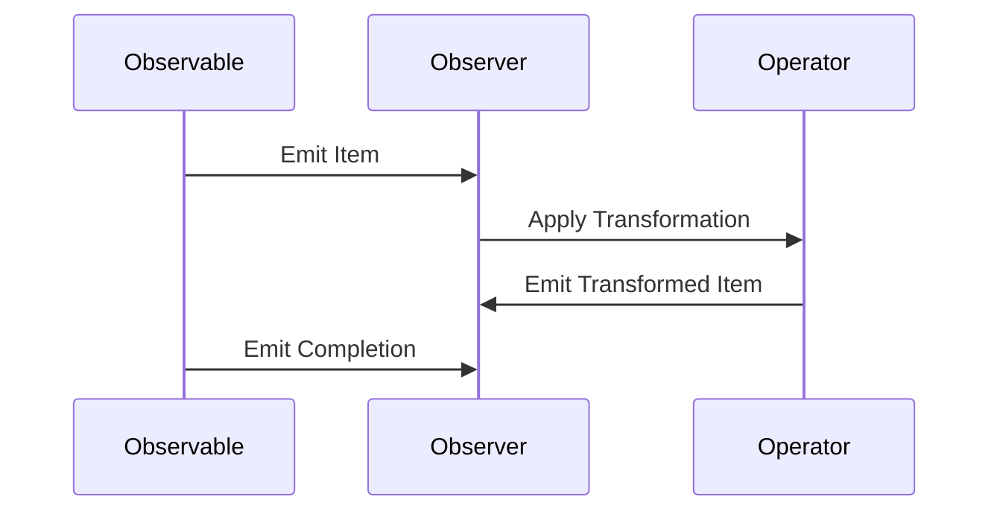

## 11.3 Reactive Extensions with RxRuby

Reactive programming is a paradigm that focuses on asynchronous data streams and the propagation of change. In this section, we delve into RxRuby, the Ruby implementation of Reactive Extensions, which provides a powerful toolkit for handling asynchronous data streams and event-based programming.

### Introduction to RxRuby

RxRuby is part of the ReactiveX family, a library for composing asynchronous and event-based programs using observable sequences. It allows developers to work with asynchronous data streams with ease, providing a consistent programming model across various languages. RxRuby is particularly useful in scenarios where you need to handle multiple asynchronous data sources, such as user interface events, network requests, or real-time data feeds.

### Key Concepts in RxRuby

Before diving into code examples, let's explore some fundamental concepts in RxRuby:

#### Observables

An **Observable** is the core building block in RxRuby. It represents a stream of data or events that can be observed. Observables emit items over time and can be finite or infinite. They provide a way to subscribe to these emissions and react accordingly.

#### Observers

An **Observer** subscribes to an Observable to receive emitted items. Observers define how to handle each item, errors, and completion events. They are the consumers of the data emitted by Observables.

#### Schedulers

**Schedulers** control the execution context of Observables. They determine the thread or event loop on which the Observable's emissions and notifications are delivered. Schedulers are crucial for managing concurrency and ensuring that operations occur on the desired thread.

#### Subjects

A **Subject** is a special type of Observable that acts as both an Observable and an Observer. It can multicast emissions to multiple Observers, making it useful for scenarios where you need to share a single data source among multiple subscribers.

### Creating and Subscribing to Observables

Let's start by creating a simple Observable in RxRuby and subscribing to it:

```ruby
require 'rx'

# Create an Observable that emits a sequence of numbers
observable = Rx::Observable.of(1, 2, 3, 4, 5)

# Subscribe to the Observable
subscription = observable.subscribe(
  lambda { |value| puts "Received: #{value}" },   # On next
  lambda { |error| puts "Error: #{error}" },      # On error
  lambda { puts "Completed" }                     # On completed
)

# Output:
# Received: 1
# Received: 2
# Received: 3
# Received: 4
# Received: 5
# Completed
```

In this example, we create an Observable that emits a sequence of numbers from 1 to 5. We then subscribe to this Observable, providing handlers for each emitted value, any errors, and the completion event.

### Transforming and Combining Data Streams

RxRuby provides a rich set of operators to transform and combine data streams. Let's explore some common operators:

#### Map Operator

The `map` operator transforms each item emitted by an Observable by applying a function to it.

```ruby
observable = Rx::Observable.of(1, 2, 3, 4, 5)

# Use the map operator to square each number
squared_observable = observable.map { |value| value * value }

squared_observable.subscribe(
  lambda { |value| puts "Squared: #{value}" },
  lambda { |error| puts "Error: #{error}" },
  lambda { puts "Completed" }
)

# Output:
# Squared: 1
# Squared: 4
# Squared: 9
# Squared: 16
# Squared: 25
# Completed
```

#### Filter Operator

The `filter` operator allows you to emit only those items from an Observable that satisfy a specified condition.

```ruby
observable = Rx::Observable.of(1, 2, 3, 4, 5)

# Use the filter operator to emit only even numbers
even_observable = observable.filter { |value| value.even? }

even_observable.subscribe(
  lambda { |value| puts "Even: #{value}" },
  lambda { |error| puts "Error: #{error}" },
  lambda { puts "Completed" }
)

# Output:
# Even: 2
# Even: 4
# Completed
```

#### Merge Operator

The `merge` operator combines multiple Observables into a single Observable, emitting items from all source Observables.

```ruby
observable1 = Rx::Observable.of(1, 2, 3)
observable2 = Rx::Observable.of(4, 5, 6)

# Merge two Observables
merged_observable = observable1.merge(observable2)

merged_observable.subscribe(
  lambda { |value| puts "Merged: #{value}" },
  lambda { |error| puts "Error: #{error}" },
  lambda { puts "Completed" }
)

# Output:
# Merged: 1
# Merged: 2
# Merged: 3
# Merged: 4
# Merged: 5
# Merged: 6
# Completed
```

### Use Cases for RxRuby

RxRuby is well-suited for various use cases, including:

#### Real-Time Data Processing

In applications that require processing real-time data streams, such as stock market tickers or IoT sensor data, RxRuby provides a robust framework for managing and transforming these streams efficiently.

#### UI Event Handling

RxRuby can simplify complex UI event handling by allowing you to treat events as data streams. This approach can lead to more maintainable and scalable code, especially in applications with dynamic user interfaces.

#### Asynchronous Network Requests

Managing multiple asynchronous network requests can be challenging. RxRuby's composable operators make it easier to handle these requests, allowing you to transform and combine responses seamlessly.

### Benefits of RxRuby

RxRuby offers several benefits for managing complex asynchronous code:

- **Declarative Code**: RxRuby promotes a declarative programming style, making code easier to read and understand.
- **Composability**: The rich set of operators allows you to compose complex data transformations and combinations with ease.
- **Concurrency Management**: Schedulers provide fine-grained control over concurrency, enabling efficient use of system resources.
- **Error Handling**: RxRuby provides robust error handling mechanisms, allowing you to gracefully manage errors in asynchronous streams.

### Visualizing RxRuby Concepts

To better understand the flow of data in RxRuby, let's visualize the interaction between Observables, Observers, and Operators using a sequence diagram:



This diagram illustrates how an Observable emits items to an Observer, which then applies transformations using operators before emitting the transformed items back to the Observer.

### Try It Yourself

Experiment with the code examples provided by modifying them to suit your needs. For instance, try creating an Observable that emits a sequence of strings and use the `map` operator to convert them to uppercase. Explore different operators and see how they affect the data stream.

### Knowledge Check

- What is the role of an Observable in RxRuby?
- How does the `map` operator transform data in a stream?
- What are the benefits of using RxRuby for asynchronous programming?

### Summary

In this section, we've explored RxRuby, a powerful tool for managing asynchronous data streams in Ruby. We've covered key concepts such as Observables, Observers, Schedulers, and Subjects, and demonstrated how to create, transform, and combine data streams using RxRuby's rich set of operators. By leveraging RxRuby, you can write more maintainable and scalable code for handling complex asynchronous scenarios.

## Quiz: Reactive Extensions with RxRuby



### What is the primary role of an Observable in RxRuby?

- [x] To represent a stream of data or events that can be observed
- [ ] To act as a scheduler for managing concurrency
- [ ] To handle errors in asynchronous code
- [ ] To provide a user interface for data streams

> **Explanation:** An Observable represents a stream of data or events that can be observed, allowing subscribers to react to emitted items.

### Which operator would you use to transform each item emitted by an Observable?

- [ ] filter
- [x] map
- [ ] merge
- [ ] subscribe

> **Explanation:** The `map` operator is used to transform each item emitted by an Observable by applying a function to it.

### What is a Subject in RxRuby?

- [x] A special type of Observable that acts as both an Observable and an Observer
- [ ] A function that transforms data in a stream
- [ ] A mechanism for handling errors
- [ ] A type of scheduler for concurrency management

> **Explanation:** A Subject is a special type of Observable that can act as both an Observable and an Observer, allowing it to multicast emissions to multiple Observers.

### How does the `filter` operator work in RxRuby?

- [x] It emits only those items from an Observable that satisfy a specified condition
- [ ] It combines multiple Observables into one
- [ ] It transforms each item emitted by an Observable
- [ ] It handles errors in the data stream

> **Explanation:** The `filter` operator emits only those items from an Observable that satisfy a specified condition, allowing selective emission of data.

### What is the benefit of using Schedulers in RxRuby?

- [x] They control the execution context of Observables
- [ ] They transform data in a stream
- [ ] They handle errors in asynchronous code
- [ ] They provide a user interface for data streams

> **Explanation:** Schedulers control the execution context of Observables, determining the thread or event loop on which emissions and notifications are delivered.

### Which operator would you use to combine multiple Observables into a single Observable?

- [ ] map
- [ ] filter
- [x] merge
- [ ] subscribe

> **Explanation:** The `merge` operator combines multiple Observables into a single Observable, emitting items from all source Observables.

### What is the main advantage of using RxRuby for UI event handling?

- [x] It simplifies complex UI event handling by treating events as data streams
- [ ] It provides a user interface for data streams
- [ ] It handles errors in asynchronous code
- [ ] It transforms data in a stream

> **Explanation:** RxRuby simplifies complex UI event handling by allowing you to treat events as data streams, leading to more maintainable and scalable code.

### How does RxRuby promote a declarative programming style?

- [x] By allowing developers to describe what should happen with data streams rather than how
- [ ] By providing a user interface for data streams
- [ ] By handling errors in asynchronous code
- [ ] By transforming data in a stream

> **Explanation:** RxRuby promotes a declarative programming style by allowing developers to describe what should happen with data streams rather than how, making code easier to read and understand.

### What is the role of an Observer in RxRuby?

- [x] To subscribe to an Observable and receive emitted items
- [ ] To act as a scheduler for managing concurrency
- [ ] To handle errors in asynchronous code
- [ ] To provide a user interface for data streams

> **Explanation:** An Observer subscribes to an Observable to receive emitted items, defining how to handle each item, errors, and completion events.

### True or False: RxRuby can only be used for handling UI events.

- [ ] True
- [x] False

> **Explanation:** False. RxRuby can be used for a variety of use cases, including real-time data processing, asynchronous network requests, and more, in addition to handling UI events.



Remember, this is just the beginning. As you progress, you'll build more complex and interactive applications using RxRuby. Keep experimenting, stay curious, and enjoy the journey!
