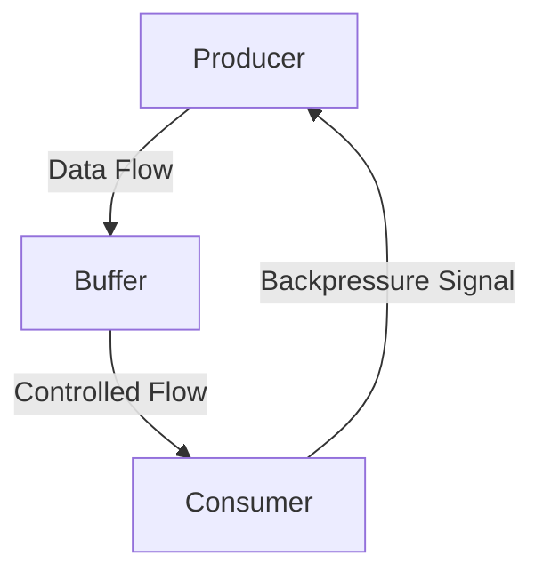

## 11.5 Backpressure and Flow Control

In the realm of reactive programming, managing the flow of data between producers and consumers is crucial to maintaining system stability and efficiency. This section delves into the concept of backpressure and flow control, exploring their significance in reactive systems, particularly within Ruby applications. We'll discuss the challenges posed by fast producers and slow consumers, and provide strategies for implementing backpressure using libraries like RxRuby.

### Understanding Backpressure

**Backpressure** is a mechanism used in reactive systems to control the rate at which data is produced and consumed. It ensures that a fast producer does not overwhelm a slow consumer, thereby maintaining system stability and preventing resource exhaustion. In essence, backpressure acts as a feedback loop, allowing consumers to signal producers to slow down or pause data emission until they are ready to process more data.

#### Importance of Backpressure

1. **System Stability**: Without backpressure, systems can become unstable as consumers struggle to keep up with the influx of data, leading to increased latency, memory overflow, or even crashes.
2. **Resource Utilization**: Efficient resource utilization is achieved by ensuring that data is processed at a manageable rate, preventing unnecessary resource consumption.
3. **Improved Responsiveness**: By balancing the data flow, systems can maintain responsiveness, providing a better user experience.

### Challenges with Fast Producers and Slow Consumers

In reactive systems, a common challenge is managing the disparity between the speed of data production and consumption. Fast producers can quickly overwhelm slow consumers, leading to several issues:

- **Buffer Overflow**: When consumers cannot process data quickly enough, buffers may overflow, resulting in data loss or system crashes.
- **Increased Latency**: As queues build up, the time taken to process each piece of data increases, leading to higher latency.
- **Resource Exhaustion**: Excessive data production can exhaust system resources, such as memory and CPU, affecting overall performance.

### Strategies for Implementing Backpressure in Ruby

Implementing backpressure in Ruby involves several strategies, often leveraging libraries like RxRuby, which provide built-in support for reactive programming patterns.

#### Using RxRuby for Backpressure

RxRuby, a Ruby implementation of Reactive Extensions (Rx), offers powerful tools for managing data flow and implementing backpressure. Let's explore some strategies using RxRuby:

1. **Buffering**: Temporarily store data until the consumer is ready to process it. This approach helps manage bursts of data but requires careful management to avoid buffer overflow.

   ```ruby
   require 'rx_ruby'

   source = Rx::Observable.interval(100) # Fast producer
   buffered = source.buffer_with_time(1000) # Buffering strategy

   buffered.subscribe(
     lambda { |data| puts "Buffered data: #{data}" },
     lambda { |error| puts "Error: #{error}" },
     lambda { puts "Completed" }
   )
   ```

2. **Throttling**: Limit the rate at which data is emitted by the producer, ensuring that consumers are not overwhelmed.

   ```ruby
   source = Rx::Observable.interval(100) # Fast producer
   throttled = source.throttle(500) # Throttle to emit every 500ms

   throttled.subscribe(
     lambda { |data| puts "Throttled data: #{data}" },
     lambda { |error| puts "Error: #{error}" },
     lambda { puts "Completed" }
   )
   ```

3. **Debouncing**: Emit data only after a specified period of inactivity, reducing the frequency of data emission.

   ```ruby
   source = Rx::Observable.from_event(event_source, 'click') # Event-based producer
   debounced = source.debounce(300) # Debounce with 300ms delay

   debounced.subscribe(
     lambda { |data| puts "Debounced data: #{data}" },
     lambda { |error| puts "Error: #{error}" },
     lambda { puts "Completed" }
   )
   ```

4. **Backpressure Operators**: Utilize specific operators designed to handle backpressure, such as `on_backpressure_buffer`, `on_backpressure_drop`, and `on_backpressure_latest`.

   ```ruby
   source = Rx::Observable.interval(100) # Fast producer
   backpressured = source.on_backpressure_buffer(10) # Buffer with limit

   backpressured.subscribe(
     lambda { |data| puts "Backpressured data: #{data}" },
     lambda { |error| puts "Error: #{error}" },
     lambda { puts "Completed" }
   )
   ```

### Impact on System Stability and Resource Utilization

Implementing backpressure and flow control has a profound impact on system stability and resource utilization:

- **Prevents Overloading**: By controlling the data flow, systems can prevent overloading, ensuring that consumers process data efficiently without being overwhelmed.
- **Optimizes Resource Usage**: Efficient flow control leads to optimal resource usage, reducing the risk of resource exhaustion and improving overall system performance.
- **Enhances Scalability**: Systems with effective backpressure mechanisms can scale more easily, handling increased loads without degradation in performance.

### Visualizing Backpressure in Reactive Systems

To better understand how backpressure works in reactive systems, let's visualize the data flow using a Mermaid.js diagram:



**Diagram Description**: This diagram illustrates the flow of data from a producer to a consumer through a buffer. The consumer sends a backpressure signal to the producer to control the rate of data flow, ensuring stability and efficiency.

### Try It Yourself

To deepen your understanding of backpressure and flow control, try modifying the code examples provided:

- **Experiment with Different Buffer Sizes**: Change the buffer size in the `on_backpressure_buffer` example to see how it affects data flow.
- **Adjust Throttle and Debounce Intervals**: Modify the intervals in the throttling and debouncing examples to observe their impact on data emission rates.
- **Combine Strategies**: Implement a combination of buffering, throttling, and debouncing to create a robust flow control mechanism.

### Further Reading

For more information on backpressure and flow control, consider exploring the following resources:

- [ReactiveX Documentation](http://reactivex.io/documentation/operators.html)
- [RxRuby GitHub Repository](https://github.com/ReactiveX/RxRuby)
- [Understanding Backpressure in Reactive Systems](https://www.reactivemanifesto.org/glossary#Back-Pressure)

### Knowledge Check

Before moving on, let's review some key concepts:

- **What is backpressure, and why is it important in reactive systems?**
- **How do buffering, throttling, and debouncing help manage data flow?**
- **What impact does backpressure have on system stability and resource utilization?**

### Embrace the Journey

Remember, mastering backpressure and flow control is a journey. As you experiment with different strategies and observe their effects, you'll gain a deeper understanding of how to build scalable and maintainable reactive systems in Ruby. Keep exploring, stay curious, and enjoy the process!

## Quiz: Backpressure and Flow Control



### What is the primary purpose of backpressure in reactive systems?

- [x] To control the rate of data flow between producers and consumers
- [ ] To increase the speed of data processing
- [ ] To eliminate the need for buffers
- [ ] To enhance the graphical user interface

> **Explanation:** Backpressure is used to control the rate of data flow, ensuring that consumers are not overwhelmed by fast producers.

### Which RxRuby operator can be used to temporarily store data until the consumer is ready?

- [x] buffer_with_time
- [ ] throttle
- [ ] debounce
- [ ] on_backpressure_drop

> **Explanation:** The `buffer_with_time` operator is used to buffer data, allowing consumers to process it at their own pace.

### What is a potential consequence of not implementing backpressure in a system?

- [x] Buffer overflow
- [ ] Increased system stability
- [ ] Reduced latency
- [ ] Enhanced resource utilization

> **Explanation:** Without backpressure, fast producers can overwhelm consumers, leading to buffer overflow and system instability.

### How does throttling help manage data flow in reactive systems?

- [x] By limiting the rate at which data is emitted
- [ ] By increasing the speed of data processing
- [ ] By eliminating the need for buffers
- [ ] By enhancing the graphical user interface

> **Explanation:** Throttling limits the rate of data emission, preventing consumers from being overwhelmed.

### Which of the following is a backpressure operator in RxRuby?

- [x] on_backpressure_buffer
- [ ] throttle
- [ ] debounce
- [ ] interval

> **Explanation:** The `on_backpressure_buffer` operator is specifically designed to handle backpressure by buffering data.

### What is the effect of debouncing in data flow control?

- [x] It emits data only after a specified period of inactivity
- [ ] It increases the speed of data processing
- [ ] It eliminates the need for buffers
- [ ] It enhances the graphical user interface

> **Explanation:** Debouncing reduces the frequency of data emission by waiting for a period of inactivity before emitting data.

### How does backpressure enhance system scalability?

- [x] By preventing overloading and ensuring efficient data processing
- [ ] By increasing the speed of data processing
- [ ] By eliminating the need for buffers
- [ ] By enhancing the graphical user interface

> **Explanation:** Backpressure prevents overloading, allowing systems to scale efficiently without performance degradation.

### What is the role of a buffer in backpressure implementation?

- [x] To temporarily store data until the consumer is ready
- [ ] To increase the speed of data processing
- [ ] To eliminate the need for throttling
- [ ] To enhance the graphical user interface

> **Explanation:** Buffers temporarily store data, allowing consumers to process it at their own pace.

### Which strategy involves limiting the rate at which data is emitted?

- [x] Throttling
- [ ] Buffering
- [ ] Debouncing
- [ ] Backpressure

> **Explanation:** Throttling involves limiting the rate of data emission to prevent overwhelming consumers.

### True or False: Backpressure is only necessary in systems with fast producers.

- [x] True
- [ ] False

> **Explanation:** Backpressure is crucial in systems with fast producers to prevent overwhelming slower consumers.


