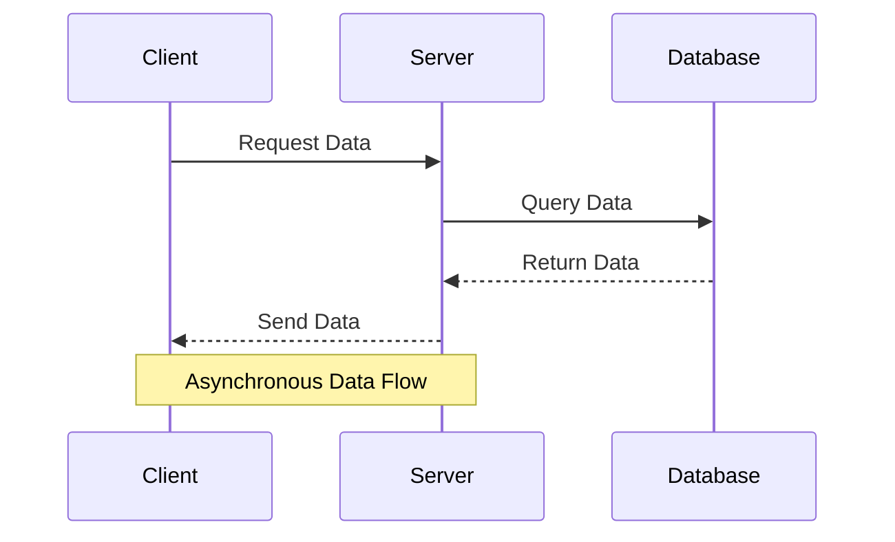

## 11.6 Asynchronous Data Streams

In the world of modern software development, handling data efficiently and responsively is paramount. Asynchronous data streams allow applications to process data as it becomes available, without blocking execution. This capability is crucial for building scalable and maintainable applications, especially in environments where data is continuously flowing, such as real-time analytics, IoT, and web applications.

### Understanding Asynchronous Data Streams

**Asynchronous data streams** refer to sequences of data that are processed independently of the main program flow. Unlike synchronous operations, where tasks are executed one after the other, asynchronous streams allow tasks to be executed concurrently, improving the responsiveness and performance of applications.

#### Key Concepts

- **Non-blocking IO**: This allows a program to initiate an IO operation and continue executing other tasks while waiting for the IO operation to complete. This is essential for handling multiple data streams simultaneously.
- **Event-driven architecture**: This design pattern relies on events to trigger actions within a system. It is particularly useful for managing asynchronous data streams, as it allows the system to react to new data as it arrives.

### Importance of Non-blocking IO and Event-driven Architecture

Non-blocking IO and event-driven architecture are foundational to managing asynchronous data streams effectively. They enable applications to handle multiple tasks concurrently, leading to better resource utilization and improved performance.

- **Scalability**: By processing data asynchronously, applications can handle more requests and data streams without being bogged down by blocking operations.
- **Responsiveness**: Users experience faster response times as the application can continue processing other tasks while waiting for data.
- **Resource Efficiency**: Non-blocking IO reduces the need for additional threads or processes, which can be resource-intensive.

### Handling Asynchronous Data Streams in Ruby

Ruby provides several libraries and frameworks to handle asynchronous data streams effectively. Two popular options are **RxRuby** and **EventMachine**.

#### RxRuby

**RxRuby** is a library for reactive programming using observables, to compose asynchronous and event-based programs. It is part of the ReactiveX family, which is known for its powerful abstractions for handling asynchronous data streams.

```ruby
require 'rx'

# Create an observable from an array
observable = Rx::Observable.from_array([1, 2, 3, 4, 5])

# Subscribe to the observable
observable.subscribe(
  lambda { |value| puts "Received value: #{value}" },
  lambda { |error| puts "Error occurred: #{error}" },
  lambda { puts "Completed" }
)
```

In this example, we create an observable from an array and subscribe to it. The observable emits each item in the array asynchronously, allowing us to process each item as it becomes available.

#### EventMachine

**EventMachine** is a Ruby library for event-driven IO, which is particularly useful for building high-performance network applications. It provides a robust framework for handling asynchronous data streams.

```ruby
require 'eventmachine'

# Define a simple server
module EchoServer
  def receive_data(data)
    send_data "You sent: #{data}"
    close_connection_after_writing
  end
end

# Start the EventMachine loop
EventMachine.run do
  EventMachine.start_server 'localhost', 8081, EchoServer
  puts 'Echo server running on localhost:8081'
end
```

This example demonstrates a simple echo server using EventMachine. The server listens for incoming connections and echoes back any data it receives. The event-driven nature of EventMachine allows it to handle multiple connections concurrently without blocking.

### Processing and Transforming Data Streams

Processing and transforming data streams is a critical aspect of working with asynchronous data. This involves applying operations such as filtering, mapping, and reducing to the data as it flows through the system.

#### Example: Transforming Data with RxRuby

```ruby
require 'rx'

# Create an observable from an array
observable = Rx::Observable.from_array([1, 2, 3, 4, 5])

# Transform the data by squaring each value
transformed = observable.map { |value| value * value }

# Subscribe to the transformed observable
transformed.subscribe(
  lambda { |value| puts "Transformed value: #{value}" },
  lambda { |error| puts "Error occurred: #{error}" },
  lambda { puts "Completed" }
)
```

In this example, we use the `map` operator to transform each value in the observable by squaring it. This demonstrates how data can be processed and transformed as it flows through the stream.

### Challenges and Best Practices

Managing asynchronous data streams comes with its own set of challenges. Here are some common issues and best practices to consider:

#### Challenges

- **Complexity**: Asynchronous code can be more complex to write and understand compared to synchronous code. It requires careful management of state and control flow.
- **Error Handling**: Errors in asynchronous operations can be harder to detect and handle. It's important to implement robust error handling mechanisms.
- **Resource Management**: Asynchronous operations can lead to resource leaks if not managed properly. Ensure that resources are released when no longer needed.

#### Best Practices

- **Use Abstractions**: Libraries like RxRuby provide powerful abstractions for managing asynchronous data streams. Use these abstractions to simplify your code.
- **Implement Proper Error Handling**: Always handle errors in asynchronous operations to prevent unexpected crashes.
- **Test Thoroughly**: Asynchronous code can be tricky to test. Use testing frameworks and tools that support asynchronous operations.
- **Monitor Performance**: Keep an eye on the performance of your application, especially when dealing with large volumes of data.

### Visualizing Asynchronous Data Streams

To better understand how asynchronous data streams work, let's visualize the flow of data through a simple system using a sequence diagram.



This diagram illustrates a typical asynchronous data flow in a client-server architecture. The client requests data from the server, which queries the database asynchronously. Once the data is available, it is sent back to the client.

### Try It Yourself

Experiment with the code examples provided in this section. Try modifying the observable in the RxRuby example to emit different types of data, or change the transformation applied to the data. In the EventMachine example, try implementing additional server functionality, such as handling different types of requests.

### References and Further Reading

- [ReactiveX Documentation](http://reactivex.io/)
- [EventMachine GitHub Repository](https://github.com/eventmachine/eventmachine)
- [Ruby IO and EventMachine](https://www.rubydoc.info/github/eventmachine/eventmachine)

### Knowledge Check

- What are asynchronous data streams and why are they important?
- How does non-blocking IO improve application performance?
- What are some common challenges when working with asynchronous data streams?
- How can libraries like RxRuby and EventMachine help manage asynchronous data?

Remember, mastering asynchronous data streams is just the beginning. As you progress, you'll be able to build more complex and responsive applications. Keep experimenting, stay curious, and enjoy the journey!

## Quiz: Asynchronous Data Streams



### What is the primary benefit of using asynchronous data streams?

- [x] Improved application responsiveness
- [ ] Simplified code structure
- [ ] Reduced memory usage
- [ ] Increased CPU usage

> **Explanation:** Asynchronous data streams allow applications to process data as it becomes available, improving responsiveness.

### Which Ruby library is commonly used for reactive programming with observables?

- [x] RxRuby
- [ ] EventMachine
- [ ] Sinatra
- [ ] Rails

> **Explanation:** RxRuby is a library for reactive programming using observables in Ruby.

### What is a key feature of event-driven architecture?

- [x] It relies on events to trigger actions within a system.
- [ ] It uses synchronous operations for data processing.
- [ ] It requires multiple threads for execution.
- [ ] It is only suitable for small applications.

> **Explanation:** Event-driven architecture relies on events to trigger actions, making it suitable for handling asynchronous data streams.

### In the EventMachine example, what does the `receive_data` method do?

- [x] It handles incoming data and sends a response.
- [ ] It initializes the server.
- [ ] It closes the server connection.
- [ ] It processes data synchronously.

> **Explanation:** The `receive_data` method handles incoming data and sends a response in the EventMachine example.

### What is a common challenge when working with asynchronous data streams?

- [x] Complexity in managing state and control flow
- [ ] Increased memory usage
- [ ] Lack of available libraries
- [ ] Limited scalability

> **Explanation:** Asynchronous code can be more complex to manage, especially in terms of state and control flow.

### How can you transform data in an RxRuby observable?

- [x] Using the `map` operator
- [ ] Using the `filter` operator
- [ ] Using the `reduce` operator
- [ ] Using the `concat` operator

> **Explanation:** The `map` operator is used to transform data in an RxRuby observable.

### What is a best practice for managing resources in asynchronous operations?

- [x] Ensure resources are released when no longer needed.
- [ ] Avoid using libraries and frameworks.
- [ ] Use synchronous operations instead.
- [ ] Increase the number of threads.

> **Explanation:** Proper resource management involves releasing resources when they are no longer needed.

### Which of the following is a benefit of non-blocking IO?

- [x] Better resource utilization
- [ ] Simplified error handling
- [ ] Reduced code complexity
- [ ] Increased memory usage

> **Explanation:** Non-blocking IO allows for better resource utilization by enabling concurrent task execution.

### What does the `subscribe` method do in RxRuby?

- [x] It registers observers to receive data from an observable.
- [ ] It creates a new observable.
- [ ] It transforms data in an observable.
- [ ] It filters data in an observable.

> **Explanation:** The `subscribe` method registers observers to receive data from an observable in RxRuby.

### True or False: Asynchronous data streams can only be used in network applications.

- [ ] True
- [x] False

> **Explanation:** Asynchronous data streams can be used in various types of applications, not just network applications.


