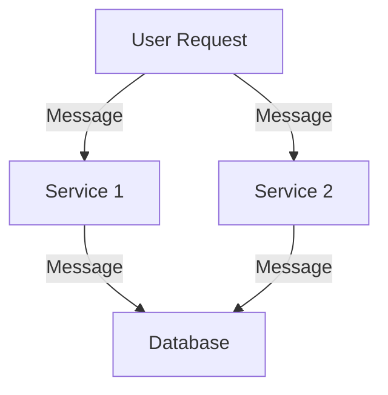
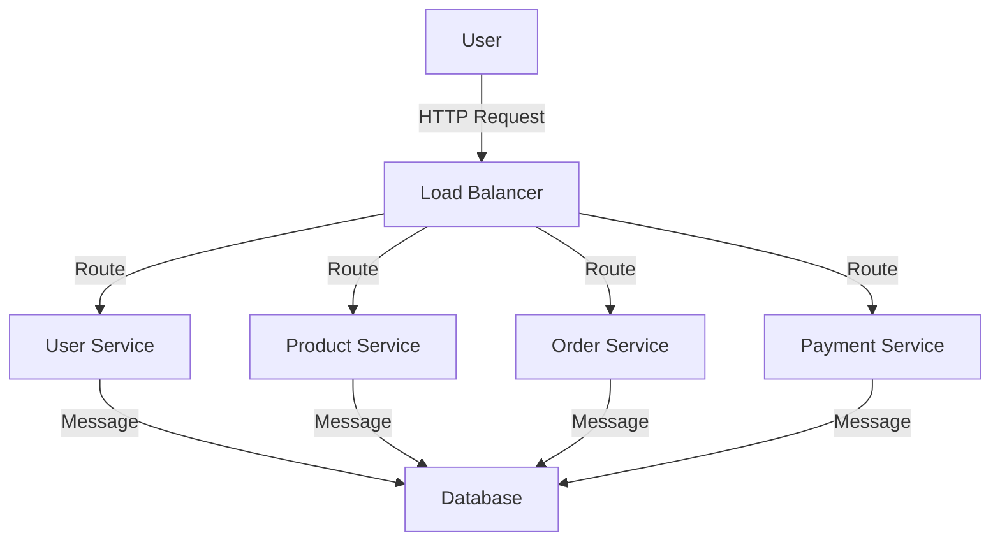

## 11.7 Designing Reactive Systems

In today's fast-paced digital world, applications must be designed to handle increasing loads, provide seamless user experiences, and recover gracefully from failures. Reactive systems offer a robust architectural approach to meet these demands. In this section, we will explore the key characteristics of reactive systems, delve into the [Reactive Manifesto](https://www.reactivemanifesto.org/), and provide strategies for designing systems that are responsive, resilient, elastic, and message-driven.

### Key Characteristics of Reactive Systems

Reactive systems are characterized by their ability to remain responsive under varying conditions, adapt to changes in load, and recover from failures. Let's break down these characteristics:

1. **Responsiveness**: A reactive system responds in a timely manner, ensuring a positive user experience. Responsiveness is the cornerstone of usability and is crucial for maintaining user engagement.

2. **Resilience**: Reactive systems are designed to handle failures gracefully. By isolating components and using replication, containment, and delegation, these systems can recover from failures without affecting the overall user experience.

3. **Elasticity**: Reactive systems can scale up or down based on demand. They efficiently utilize resources, ensuring that the system can handle varying loads without compromising performance.

4. **Message-Driven**: Reactive systems rely on asynchronous message-passing to establish boundaries between components. This approach decouples components, allowing them to interact without blocking, thus enhancing scalability and resilience.

### The Reactive Manifesto

The [Reactive Manifesto](https://www.reactivemanifesto.org/) is a foundational document that outlines the principles of reactive systems. It emphasizes the importance of building systems that are responsive, resilient, elastic, and message-driven. Let's explore how these principles guide the design of reactive systems:

- **Responsive**: The manifesto stresses the need for systems to respond quickly and consistently, even under load. This requires careful design to ensure that all components can handle requests efficiently.

- **Resilient**: Systems must be able to recover from failures and continue to operate. This involves designing components that can fail independently and recover without affecting the entire system.

- **Elastic**: Systems should be able to scale dynamically to accommodate varying loads. This requires a design that can efficiently allocate resources and manage demand.

- **Message-Driven**: Asynchronous message-passing is crucial for decoupling components and enabling them to interact without blocking. This approach enhances scalability and resilience by allowing components to operate independently.

### Strategies for Designing Reactive Systems

Designing a reactive system involves several strategies that align with the principles outlined in the Reactive Manifesto. Here are some key strategies to consider:

#### 1. Asynchronous Communication

Asynchronous communication is a cornerstone of reactive systems. By decoupling components through message-passing, systems can handle requests without blocking, improving responsiveness and scalability.

```ruby
# Example of asynchronous message-passing in Ruby using Celluloid

require 'celluloid'

class Worker
  include Celluloid

  def process(task)
    puts "Processing task: #{task}"
    # Simulate a long-running task
    sleep(2)
    puts "Task completed: #{task}"
  end
end

worker = Worker.new
worker.async.process("Task 1")
worker.async.process("Task 2")
```

In this example, we use the Celluloid library to create an asynchronous worker that processes tasks without blocking the main thread.

#### 2. Isolation and Containment

Isolating components ensures that failures in one part of the system do not affect others. This can be achieved through techniques such as microservices, where each service operates independently.



*Diagram: Isolated services communicating through messages.*

#### 3. Backpressure

Backpressure is a mechanism to prevent overwhelming a system with requests. It involves controlling the flow of data and ensuring that components can handle the load.

```ruby
# Example of implementing backpressure using a queue

require 'thread'

queue = Queue.new

producer = Thread.new do
  10.times do |i|
    queue << "Task #{i}"
    sleep(0.5) # Simulate task production rate
  end
end

consumer = Thread.new do
  while task = queue.pop
    puts "Processing #{task}"
    sleep(1) # Simulate task processing time
  end
end

producer.join
consumer.join
```

In this example, a queue is used to manage tasks, ensuring that the consumer processes tasks at a manageable rate.

#### 4. Circuit Breakers

Circuit breakers prevent a system from repeatedly trying to execute an operation that is likely to fail. They help maintain system stability by stopping operations that are unlikely to succeed.

```ruby
# Example of a simple circuit breaker pattern

class CircuitBreaker
  def initialize
    @failure_count = 0
    @threshold = 3
    @state = :closed
  end

  def call
    if @state == :open
      puts "Circuit is open. Operation not allowed."
      return
    end

    begin
      yield
      reset
    rescue StandardError => e
      handle_failure(e)
    end
  end

  private

  def handle_failure(error)
    @failure_count += 1
    puts "Operation failed: #{error.message}"
    if @failure_count >= @threshold
      @state = :open
      puts "Circuit opened due to repeated failures."
    end
  end

  def reset
    @failure_count = 0
    @state = :closed
  end
end

breaker = CircuitBreaker.new

3.times do
  breaker.call do
    raise "Simulated failure"
  end
end

breaker.call do
  puts "This will not execute because the circuit is open."
end
```

In this example, a simple circuit breaker pattern is implemented to prevent repeated execution of failing operations.

### Case Study: Designing a Reactive E-Commerce System

To illustrate the principles of reactive system design, let's consider an e-commerce platform that needs to handle high traffic, provide a seamless user experience, and recover gracefully from failures.

#### System Requirements

- **High Availability**: The system must be available 24/7, with minimal downtime.
- **Scalability**: It should handle varying loads, especially during peak shopping seasons.
- **Resilience**: The system should recover from failures without affecting the user experience.
- **Responsiveness**: Users should experience minimal latency when browsing and purchasing products.

#### Architectural Design

1. **Microservices Architecture**: The platform is divided into independent services, such as user management, product catalog, order processing, and payment gateway. Each service operates independently and communicates through asynchronous messages.

2. **Load Balancing**: A load balancer distributes incoming requests across multiple instances of each service, ensuring even distribution of traffic.

3. **Backpressure and Rate Limiting**: The system implements backpressure to manage incoming requests and rate limiting to prevent abuse.

4. **Circuit Breakers**: Circuit breakers are used to prevent cascading failures, especially in critical services like payment processing.

5. **Elastic Scaling**: The platform uses cloud-based infrastructure to scale resources up or down based on demand.



*Diagram: Reactive e-commerce system architecture.*

### Role of Backpressure, Circuit Breakers, and Other Patterns

- **Backpressure**: Ensures that the system can handle incoming requests without being overwhelmed. It helps maintain responsiveness and stability.

- **Circuit Breakers**: Prevent cascading failures by stopping operations that are likely to fail. They enhance resilience by allowing the system to recover gracefully.

- **Load Balancing**: Distributes traffic evenly across services, ensuring scalability and availability.

- **Asynchronous Communication**: Decouples components, allowing them to operate independently and enhancing scalability.

### Conclusion

Designing reactive systems requires a deep understanding of the principles outlined in the Reactive Manifesto. By focusing on responsiveness, resilience, elasticity, and message-driven communication, developers can build systems that meet the demands of modern applications. Remember, this is just the beginning. As you progress, you'll build more complex and interactive systems. Keep experimenting, stay curious, and enjoy the journey!

## Quiz: Designing Reactive Systems



### What is the cornerstone of reactive systems?

- [x] Responsiveness
- [ ] Scalability
- [ ] Elasticity
- [ ] Message-Driven

> **Explanation:** Responsiveness is the cornerstone of reactive systems, ensuring a positive user experience.

### Which principle is emphasized by the Reactive Manifesto for handling failures?

- [ ] Elasticity
- [x] Resilience
- [ ] Responsiveness
- [ ] Message-Driven

> **Explanation:** The Reactive Manifesto emphasizes resilience for handling failures gracefully.

### What is the role of backpressure in a reactive system?

- [x] To prevent overwhelming the system with requests
- [ ] To enhance message-driven communication
- [ ] To improve scalability
- [ ] To ensure responsiveness

> **Explanation:** Backpressure prevents overwhelming the system with requests, maintaining stability.

### How do circuit breakers enhance system resilience?

- [x] By stopping operations that are likely to fail
- [ ] By distributing traffic evenly
- [ ] By decoupling components
- [ ] By scaling resources dynamically

> **Explanation:** Circuit breakers enhance resilience by stopping operations that are likely to fail, preventing cascading failures.

### What is the primary benefit of asynchronous communication in reactive systems?

- [x] Decoupling components
- [ ] Enhancing resilience
- [ ] Improving elasticity
- [ ] Ensuring responsiveness

> **Explanation:** Asynchronous communication decouples components, allowing them to interact without blocking.

### Which architectural pattern is commonly used in reactive systems for isolation?

- [x] Microservices
- [ ] Monolithic
- [ ] Layered
- [ ] Client-Server

> **Explanation:** Microservices architecture is commonly used for isolation in reactive systems.

### What is the purpose of load balancing in a reactive system?

- [x] To distribute traffic evenly across services
- [ ] To prevent cascading failures
- [ ] To manage incoming requests
- [ ] To enhance message-driven communication

> **Explanation:** Load balancing distributes traffic evenly across services, ensuring scalability and availability.

### How does elasticity benefit a reactive system?

- [x] By allowing it to scale dynamically based on demand
- [ ] By enhancing resilience
- [ ] By improving responsiveness
- [ ] By decoupling components

> **Explanation:** Elasticity allows a reactive system to scale dynamically based on demand, efficiently utilizing resources.

### What is the role of message-driven communication in reactive systems?

- [x] To decouple components and enhance scalability
- [ ] To improve resilience
- [ ] To ensure responsiveness
- [ ] To manage incoming requests

> **Explanation:** Message-driven communication decouples components, enhancing scalability and resilience.

### True or False: Reactive systems are designed to handle failures without affecting the overall user experience.

- [x] True
- [ ] False

> **Explanation:** True. Reactive systems are designed to handle failures gracefully, ensuring a seamless user experience.




