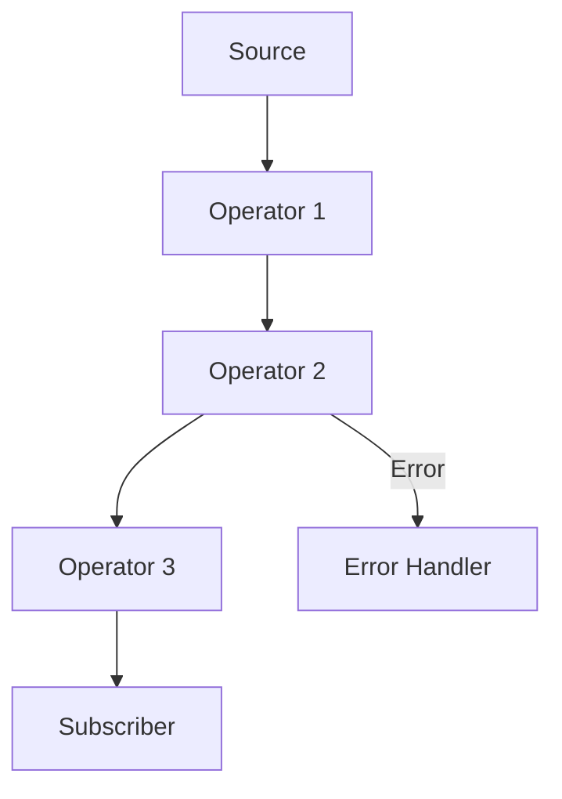
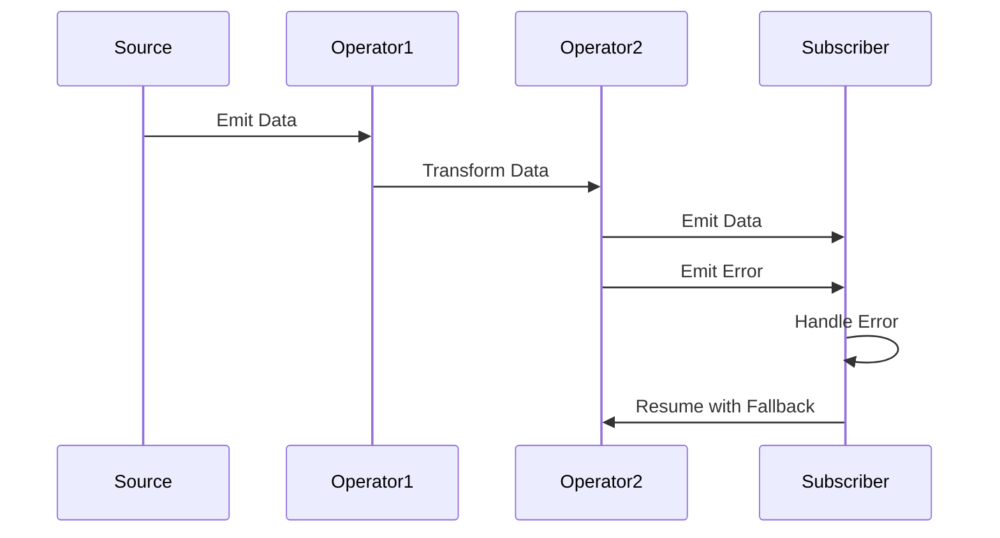

## 11.8 Error Handling in Reactive Programming

In the realm of reactive programming, managing errors effectively is crucial to maintaining the integrity and resilience of your applications. Reactive streams, by their nature, are designed to handle asynchronous data flows, and errors can propagate through these streams in ways that might disrupt the entire system if not managed properly. In this section, we will explore how errors propagate in reactive streams, delve into error handling strategies using RxRuby, and discuss the importance of designing fail-safe reactive systems.

### Understanding Error Propagation in Reactive Streams

Reactive streams are sequences of data that are processed asynchronously. In a typical reactive system, data flows through a series of transformations and operations, and errors can occur at any stage of this flow. Understanding how these errors propagate is essential for implementing effective error handling strategies.

#### Error Propagation

In reactive streams, errors are propagated downstream to subscribers. When an error occurs, the stream is typically terminated, and the error is passed to the subscriber's error handler. This behavior ensures that errors are not silently ignored and that subscribers are informed of any issues.

Consider the following diagram illustrating error propagation in a reactive stream:



In this diagram, if an error occurs in `Operator 2`, it is propagated to the `Error Handler` associated with the `Subscriber`.

### Error Handling Strategies with RxRuby

RxRuby, a Ruby implementation of Reactive Extensions (Rx), provides several operators and strategies for managing errors in reactive streams. Let's explore some of these strategies and how they can be applied to build resilient applications.

#### Using the `rescue` Operator

The `rescue` operator allows you to handle errors by providing an alternative sequence when an error occurs. This operator is useful for ensuring that your stream can continue processing even in the presence of errors.

```ruby
require 'rx'

source = Rx::Observable.range(1, 5).map do |x|
  raise 'Error at 3' if x == 3
  x
end

source.rescue { |error| Rx::Observable.just(99) }
      .subscribe(
        lambda { |x| puts "Received: #{x}" },
        lambda { |error| puts "Error: #{error}" },
        lambda { puts 'Completed' }
      )
```

In this example, when the error occurs at `x == 3`, the `rescue` operator catches the error and provides an alternative sequence containing the value `99`.

#### Implementing Retry Logic

The `retry` operator is used to resubscribe to the source observable when an error occurs. This can be useful for transient errors that may succeed upon retrying.

```ruby
require 'rx'

attempts = 0

source = Rx::Observable.create do |observer|
  attempts += 1
  puts "Attempt: #{attempts}"
  observer.on_next(1)
  observer.on_next(2)
  observer.on_error('Error at 3') if attempts < 3
  observer.on_next(3)
  observer.on_completed
end

source.retry(3)
      .subscribe(
        lambda { |x| puts "Received: #{x}" },
        lambda { |error| puts "Error: #{error}" },
        lambda { puts 'Completed' }
      )
```

In this code, the `retry` operator attempts to resubscribe to the source up to three times, allowing transient errors to be retried.

#### Using `on_error_resume_next`

The `on_error_resume_next` operator allows the stream to continue with another observable sequence when an error occurs. This operator is useful for providing a fallback sequence without terminating the stream.

```ruby
require 'rx'

source = Rx::Observable.range(1, 5).map do |x|
  raise 'Error at 3' if x == 3
  x
end

fallback = Rx::Observable.range(6, 5)

source.on_error_resume_next(fallback)
      .subscribe(
        lambda { |x| puts "Received: #{x}" },
        lambda { |error| puts "Error: #{error}" },
        lambda { puts 'Completed' }
      )
```

In this example, when an error occurs at `x == 3`, the stream resumes with the `fallback` sequence starting from `6`.

### Designing Fail-Safe Reactive Systems

In reactive programming, designing fail-safe systems is essential to ensure that errors do not disrupt the entire application. Here are some key considerations for building resilient reactive systems:

#### Maintain Responsiveness

Ensure that your application remains responsive even in the presence of errors. Use error handling operators to provide alternative sequences or retry logic to handle transient errors gracefully.

#### Implement Circuit Breakers

Consider implementing circuit breakers to prevent cascading failures. A circuit breaker monitors the error rate and temporarily halts requests to a failing service, allowing it to recover.

#### Use Backpressure

Implement backpressure mechanisms to handle situations where the data producer is faster than the consumer. This prevents overwhelming the system and allows for graceful degradation.

#### Monitor and Log Errors

Continuously monitor and log errors to gain insights into the system's behavior. Use these insights to improve error handling strategies and enhance system resilience.

### Try It Yourself

Experiment with the provided code examples by modifying the error conditions and observing how the system behaves. Try implementing additional error handling strategies, such as using custom error handlers or integrating with external monitoring tools.

### Visualizing Error Handling in Reactive Streams

To better understand the flow of error handling in reactive streams, consider the following sequence diagram:



This diagram illustrates how data flows through operators and how errors are handled and resumed with a fallback sequence.

### Knowledge Check

- What is the role of the `rescue` operator in RxRuby?
- How does the `retry` operator help in managing transient errors?
- Why is it important to maintain responsiveness in reactive systems?
- How can circuit breakers contribute to system resilience?

### Summary

In this section, we explored the intricacies of error handling in reactive programming with RxRuby. We discussed how errors propagate in reactive streams and examined various error handling strategies, including the use of operators like `rescue`, `retry`, and `on_error_resume_next`. By designing fail-safe reactive systems, we can ensure that our applications remain resilient and responsive, even in the face of errors.

Remember, mastering error handling in reactive programming is a journey. Keep experimenting, stay curious, and enjoy the process of building robust and resilient Ruby applications.

## Quiz: Error Handling in Reactive Programming



### What is the primary purpose of the `rescue` operator in RxRuby?

- [x] To provide an alternative sequence when an error occurs
- [ ] To terminate the stream immediately
- [ ] To log errors without handling them
- [ ] To ignore errors and continue the stream

> **Explanation:** The `rescue` operator is used to provide an alternative sequence when an error occurs, allowing the stream to continue processing.

### How does the `retry` operator assist in error handling?

- [x] It resubscribes to the source observable upon an error
- [ ] It logs the error and stops the stream
- [ ] It transforms the error into a success
- [ ] It ignores the error and continues the stream

> **Explanation:** The `retry` operator resubscribes to the source observable when an error occurs, which is useful for handling transient errors.

### What is the function of `on_error_resume_next` in reactive streams?

- [x] To continue with another observable sequence after an error
- [ ] To terminate the stream immediately
- [ ] To log errors without handling them
- [ ] To transform errors into data

> **Explanation:** `on_error_resume_next` allows the stream to continue with another observable sequence when an error occurs, providing a fallback mechanism.

### Why is maintaining responsiveness important in reactive systems?

- [x] To ensure the application remains usable despite errors
- [ ] To increase the error rate
- [ ] To reduce system performance
- [ ] To ignore errors completely

> **Explanation:** Maintaining responsiveness ensures that the application remains usable and responsive, even when errors occur.

### What role do circuit breakers play in reactive systems?

- [x] They prevent cascading failures by halting requests to failing services
- [ ] They increase the error rate
- [ ] They transform errors into data
- [ ] They ignore errors completely

> **Explanation:** Circuit breakers prevent cascading failures by monitoring error rates and temporarily halting requests to failing services, allowing them to recover.

### How can backpressure be beneficial in reactive systems?

- [x] It prevents overwhelming the system by managing data flow
- [ ] It increases the error rate
- [ ] It reduces system performance
- [ ] It ignores errors completely

> **Explanation:** Backpressure mechanisms manage data flow, preventing the system from being overwhelmed and allowing for graceful degradation.

### What is the significance of monitoring and logging errors?

- [x] To gain insights into system behavior and improve error handling
- [ ] To increase the error rate
- [ ] To reduce system performance
- [ ] To ignore errors completely

> **Explanation:** Monitoring and logging errors provide insights into system behavior, which can be used to improve error handling strategies and enhance resilience.

### What does the `retry` operator do when an error occurs?

- [x] Resubscribes to the source observable
- [ ] Terminates the stream
- [ ] Logs the error
- [ ] Transforms the error into data

> **Explanation:** The `retry` operator resubscribes to the source observable when an error occurs, allowing for retry logic in handling transient errors.

### How does `on_error_resume_next` differ from `rescue`?

- [x] It continues with another observable sequence without terminating the stream
- [ ] It terminates the stream immediately
- [ ] It logs errors without handling them
- [ ] It transforms errors into data

> **Explanation:** `on_error_resume_next` allows the stream to continue with another observable sequence without terminating, unlike `rescue`, which provides an alternative sequence.

### True or False: Circuit breakers increase the error rate in reactive systems.

- [ ] True
- [x] False

> **Explanation:** Circuit breakers do not increase the error rate; they help manage errors by preventing cascading failures and allowing services to recover.


