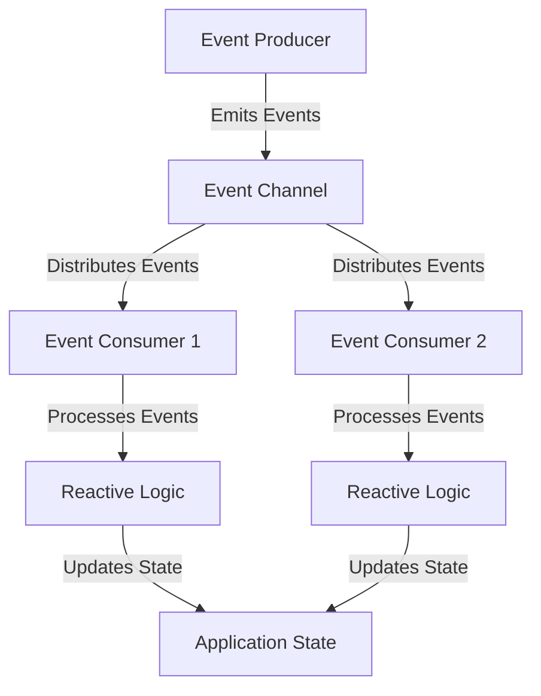

## 11.9 Integration with Event-Driven Frameworks

In the world of software development, building applications that are both efficient and scalable is a constant challenge. One of the key strategies to achieve this is through the integration of reactive programming with event-driven frameworks. In this section, we will explore how these paradigms can be combined in Ruby to create robust applications. We'll delve into the synergy between reactive programming and event-driven architecture, provide examples of integrating RxRuby with EventMachine, and discuss how to handle IO, timers, and user events reactively. Additionally, we'll highlight performance benefits, patterns for effective integration, and address potential challenges.

### Understanding Reactive Programming and Event-Driven Architecture

Before diving into integration, let's clarify what reactive programming and event-driven architecture entail.

**Reactive Programming** is a programming paradigm oriented around data flows and the propagation of change. It allows developers to express static or dynamic data flows with ease, and automatically propagate changes through the data flow. In Ruby, this is often achieved using libraries like RxRuby, which is a port of the Reactive Extensions (Rx) for Ruby.

**Event-Driven Architecture** is a software architecture pattern promoting the production, detection, consumption of, and reaction to events. An event-driven system typically consists of event producers, event consumers, and an event channel. Ruby's EventMachine is a popular library that provides an event-driven I/O framework, enabling developers to build scalable network applications.

### Synergy Between Reactive Programming and Event-Driven Architecture

The integration of reactive programming with event-driven architecture offers several advantages:

- **Asynchronous Processing**: Both paradigms inherently support asynchronous operations, allowing applications to handle multiple tasks concurrently without blocking.
- **Scalability**: By decoupling event producers and consumers, systems can scale more easily to handle increased loads.
- **Responsiveness**: Reactive systems can respond to events in real-time, providing a more interactive user experience.
- **Resilience**: The decoupled nature of event-driven systems can improve fault tolerance, as components can fail independently without affecting the entire system.

### Integrating RxRuby with EventMachine

RxRuby and EventMachine are two powerful tools in the Ruby ecosystem that can be integrated to build reactive, event-driven applications. Let's explore how to achieve this integration.

#### Setting Up RxRuby and EventMachine

First, ensure you have both RxRuby and EventMachine installed in your Ruby environment. You can add them to your `Gemfile`:

```ruby
gem 'rx_ruby'
gem 'eventmachine'
```

Then, run `bundle install` to install the gems.

#### Basic Integration Example

Let's start with a simple example that demonstrates how to use RxRuby with EventMachine to handle asynchronous events.

```ruby
require 'eventmachine'
require 'rx_ruby'

# Start the EventMachine loop
EM.run do
  # Create an observable that emits events every second
  observable = Rx::Observable.interval(1)

  # Subscribe to the observable
  observable.subscribe(
    lambda { |x| puts "Tick: #{x}" },
    lambda { |error| puts "Error: #{error}" },
    lambda { puts "Completed" }
  )

  # Stop the EventMachine loop after 5 seconds
  EM.add_timer(5) do
    EM.stop
  end
end
```

In this example, we use `Rx::Observable.interval` to create an observable that emits a sequence of numbers every second. We then subscribe to this observable to print each emitted value. The EventMachine loop is stopped after 5 seconds using `EM.add_timer`.

#### Handling IO, Timers, and User Events Reactively

One of the strengths of integrating RxRuby with EventMachine is the ability to handle various types of events reactively, including IO operations, timers, and user interactions.

##### Reactive IO Operations

EventMachine provides a non-blocking I/O framework, which can be combined with RxRuby to handle I/O operations reactively. Here's an example of reading from a TCP socket:

```ruby
require 'eventmachine'
require 'rx_ruby'

EM.run do
  # Start a TCP server
  EM.start_server('localhost', 8081, Module.new do
    def receive_data(data)
      # Emit received data as an observable
      observable = Rx::Observable.just(data)

      # Process the data reactively
      observable.subscribe(
        lambda { |msg| puts "Received: #{msg}" },
        lambda { |error| puts "Error: #{error}" },
        lambda { puts "Completed" }
      )
    end
  end)

  # Stop the EventMachine loop after 10 seconds
  EM.add_timer(10) do
    EM.stop
  end
end
```

In this example, we start a TCP server using EventMachine and emit received data as an observable using `Rx::Observable.just`. This allows us to process incoming data reactively.

##### Reactive Timers

Timers are a common requirement in event-driven applications. With RxRuby and EventMachine, you can handle timers reactively:

```ruby
require 'eventmachine'
require 'rx_ruby'

EM.run do
  # Create a timer observable that emits every 2 seconds
  timer_observable = Rx::Observable.timer(0, 2)

  # Subscribe to the timer observable
  timer_observable.subscribe(
    lambda { |x| puts "Timer tick: #{x}" },
    lambda { |error| puts "Error: #{error}" },
    lambda { puts "Completed" }
  )

  # Stop the EventMachine loop after 10 seconds
  EM.add_timer(10) do
    EM.stop
  end
end
```

Here, `Rx::Observable.timer` is used to create an observable that emits events at regular intervals, which can be used to trigger periodic actions.

##### Reactive User Events

User events, such as clicks or key presses, can also be handled reactively. While EventMachine is not typically used for GUI applications, you can simulate user events in a console application:

```ruby
require 'eventmachine'
require 'rx_ruby'

EM.run do
  # Simulate a user event observable
  user_event_observable = Rx::Observable.create do |observer|
    EM.add_periodic_timer(1) do
      observer.on_next("User event at #{Time.now}")
    end
  end

  # Subscribe to the user event observable
  user_event_observable.subscribe(
    lambda { |event| puts event },
    lambda { |error| puts "Error: #{error}" },
    lambda { puts "Completed" }
  )

  # Stop the EventMachine loop after 5 seconds
  EM.add_timer(5) do
    EM.stop
  end
end
```

In this example, we simulate user events using a periodic timer and emit these events as observables.

### Performance Benefits and Patterns for Effective Integration

Integrating reactive programming with event-driven frameworks can yield significant performance benefits:

- **Non-Blocking I/O**: EventMachine's non-blocking I/O model allows applications to handle many connections simultaneously without blocking threads.
- **Efficient Resource Utilization**: By using observables, you can efficiently manage resources and avoid unnecessary computations.
- **Scalable Event Handling**: Reactive programming allows you to handle a large number of events concurrently, making it easier to scale applications.

#### Patterns for Effective Integration

To effectively integrate reactive programming with event-driven frameworks, consider the following patterns:

- **Backpressure Management**: Use backpressure techniques to handle situations where event producers generate events faster than consumers can process them. RxRuby provides operators like `buffer` and `throttle` to manage backpressure.
- **Error Handling**: Implement robust error handling strategies to ensure that errors in one part of the system do not propagate and cause failures elsewhere. Use RxRuby's `on_error_resume_next` or `retry` operators for error recovery.
- **State Management**: Maintain application state in a way that is consistent with reactive principles. Use immutable data structures and pure functions to manage state changes.

### Challenges and How to Address Them

While the integration of reactive programming with event-driven frameworks offers many benefits, it also presents challenges:

- **Complexity**: The combination of reactive and event-driven paradigms can introduce complexity, making it harder to reason about the system. To address this, use clear abstractions and modularize your code.
- **Debugging**: Debugging reactive systems can be challenging due to the asynchronous nature of events. Use logging and monitoring tools to gain insights into system behavior.
- **Learning Curve**: Developers may need to learn new concepts and libraries, such as RxRuby and EventMachine. Provide training and documentation to help team members get up to speed.

### Visualizing Event-Driven and Reactive Integration

To better understand the integration of reactive programming with event-driven frameworks, let's visualize the flow of events and data in such a system.



In this diagram, we see how events are produced, distributed through an event channel, and consumed by event consumers. Each consumer processes events using reactive logic, which updates the application state.

### Try It Yourself

Now that we've covered the basics, it's time to experiment with the code examples provided. Try modifying the examples to:

- Change the interval of the timer observable.
- Add error handling to the TCP server example.
- Simulate different types of user events.

By experimenting with the code, you'll gain a deeper understanding of how reactive programming and event-driven frameworks can be integrated in Ruby.

### Conclusion

Integrating reactive programming with event-driven frameworks in Ruby offers a powerful approach to building scalable and maintainable applications. By leveraging libraries like RxRuby and EventMachine, developers can create systems that are responsive, resilient, and efficient. While there are challenges to overcome, the benefits of this integration make it a valuable strategy for modern software development.

Remember, this is just the beginning. As you progress, you'll discover more advanced techniques and patterns for integrating reactive programming with event-driven frameworks. Keep experimenting, stay curious, and enjoy the journey!

## Quiz: Integration with Event-Driven Frameworks



### What is the primary benefit of integrating reactive programming with event-driven frameworks?

- [x] Asynchronous processing and scalability
- [ ] Simplified code structure
- [ ] Reduced memory usage
- [ ] Easier debugging

> **Explanation:** The integration allows for asynchronous processing and scalability, enabling applications to handle multiple tasks concurrently without blocking.

### Which Ruby library is commonly used for reactive programming?

- [x] RxRuby
- [ ] Sinatra
- [ ] RSpec
- [ ] Nokogiri

> **Explanation:** RxRuby is a popular library for implementing reactive programming in Ruby.

### What is EventMachine primarily used for in Ruby?

- [x] Non-blocking I/O operations
- [ ] Database management
- [ ] GUI development
- [ ] File handling

> **Explanation:** EventMachine provides a non-blocking I/O framework, enabling scalable network applications.

### How can you handle backpressure in RxRuby?

- [x] Using operators like `buffer` and `throttle`
- [ ] Increasing the number of threads
- [ ] Reducing the number of events
- [ ] Using global variables

> **Explanation:** Operators like `buffer` and `throttle` help manage backpressure by controlling the flow of events.

### What is a common challenge when integrating reactive programming with event-driven frameworks?

- [x] Increased complexity
- [ ] Lack of libraries
- [ ] Poor performance
- [ ] Limited scalability

> **Explanation:** The combination of reactive and event-driven paradigms can introduce complexity, making it harder to reason about the system.

### What does the `Rx::Observable.interval` method do?

- [x] Creates an observable that emits a sequence of numbers at regular intervals
- [ ] Creates a new thread for each event
- [ ] Blocks the main thread until an event occurs
- [ ] Reads data from a file

> **Explanation:** `Rx::Observable.interval` creates an observable that emits a sequence of numbers at specified intervals.

### Which operator can be used in RxRuby for error recovery?

- [x] `on_error_resume_next`
- [ ] `map`
- [ ] `filter`
- [ ] `concat`

> **Explanation:** `on_error_resume_next` is used for error recovery by continuing with the next observable sequence.

### What is a key advantage of using non-blocking I/O in EventMachine?

- [x] Ability to handle many connections simultaneously
- [ ] Simplified code structure
- [ ] Reduced CPU usage
- [ ] Improved security

> **Explanation:** Non-blocking I/O allows applications to handle many connections simultaneously without blocking threads.

### How can you visualize the flow of events in a reactive, event-driven system?

- [x] Using diagrams like flowcharts
- [ ] By writing unit tests
- [ ] Through console logs
- [ ] By using global variables

> **Explanation:** Diagrams like flowcharts help visualize the flow of events and data in a system.

### True or False: Reactive programming and event-driven architecture are inherently synchronous.

- [ ] True
- [x] False

> **Explanation:** Both paradigms inherently support asynchronous operations, allowing for non-blocking processing.


