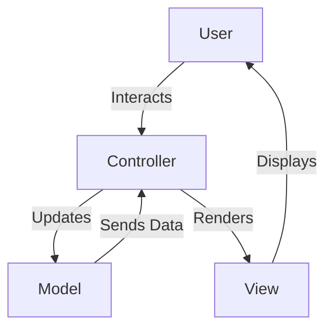
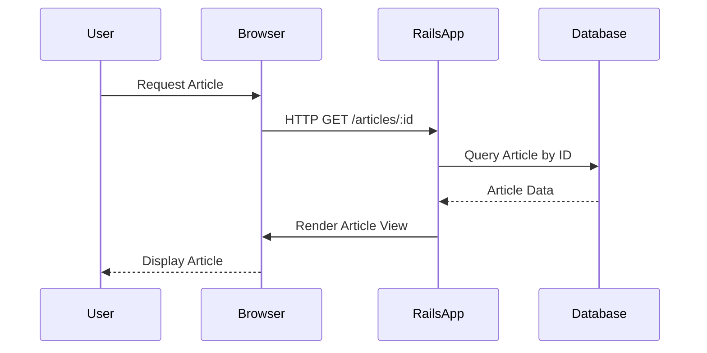

## 12.1 Model-View-Controller (MVC) Pattern in Rails

The Model-View-Controller (MVC) pattern is a cornerstone of modern web application architecture, particularly in Ruby on Rails. This pattern provides a structured approach to organizing code, promoting separation of concerns, and enhancing maintainability and scalability. In this section, we'll delve into the MVC pattern, explore how Rails implements it, and provide practical examples and best practices.

### Understanding the MVC Pattern

The MVC pattern divides an application into three interconnected components:

- **Model**: Represents the data and business logic of the application. It is responsible for managing the data, rules, and logic that define the application's behavior.
- **View**: Handles the presentation layer, displaying data to the user and capturing user input. Views are responsible for rendering the user interface.
- **Controller**: Acts as an intermediary between the Model and the View. It processes user input, interacts with the Model, and determines the appropriate View to render.

#### Diagram: MVC Pattern Overview



**Figure 1**: The MVC pattern flow, illustrating the interaction between the user, controller, model, and view.

### Rails and the MVC Pattern

Ruby on Rails is a web application framework that embraces the MVC pattern, providing a clear structure for organizing code. Let's explore how Rails implements each component:

#### Models in Rails

Models in Rails are Ruby classes that represent the data and business logic. They are typically backed by a database table and use ActiveRecord, Rails' Object-Relational Mapping (ORM) system, to interact with the database.

**Example: A Simple Model**

```ruby
class Article < ApplicationRecord
  validates :title, presence: true
  validates :content, presence: true, length: { minimum: 10 }
end
```

In this example, the `Article` model represents articles in a blogging application. It includes validations to ensure that each article has a title and content of a minimum length.

#### Views in Rails

Views in Rails are templates that generate the HTML output. They are typically written in Embedded Ruby (ERB) and are responsible for displaying data to the user.

**Example: A Simple View**

```erb
<!-- app/views/articles/show.html.erb -->
<h1><%= @article.title %></h1>
<p><%= @article.content %></p>
```

This view displays the title and content of an article. The `@article` instance variable is set in the controller and made available to the view.

#### Controllers in Rails

Controllers in Rails handle incoming requests, interact with models, and render views. They are the glue that binds the model and view together.

**Example: A Simple Controller**

```ruby
class ArticlesController < ApplicationController
  def show
    @article = Article.find(params[:id])
  end
end
```

In this example, the `show` action retrieves an article by its ID and assigns it to the `@article` instance variable, which is then used in the view.

### Benefits of the MVC Pattern

The MVC pattern offers several benefits, particularly in terms of maintainability and scalability:

- **Separation of Concerns**: By dividing responsibilities among models, views, and controllers, the MVC pattern promotes a clean separation of concerns. This makes it easier to manage and modify each component independently.
- **Scalability**: The clear structure of the MVC pattern allows for easier scaling of applications. As the application grows, new features can be added without disrupting existing code.
- **Maintainability**: The separation of concerns and clear organization of code make it easier to maintain and update applications over time.

### Best Practices for MVC in Rails

To maximize the benefits of the MVC pattern, consider the following best practices:

#### Keep Controllers Thin

Controllers should be responsible for handling requests and directing traffic, not for complex business logic. Keep controllers thin by moving business logic to models or service objects.

**Example: Refactoring a Fat Controller**

Before:

```ruby
class ArticlesController < ApplicationController
  def create
    @article = Article.new(article_params)
    if @article.title.blank?
      flash[:error] = "Title can't be blank"
      render :new
    else
      @article.save
      redirect_to @article
    end
  end
end
```

After:

```ruby
class ArticlesController < ApplicationController
  def create
    @article = Article.new(article_params)
    if @article.save
      redirect_to @article
    else
      flash[:error] = @article.errors.full_messages.to_sentence
      render :new
    end
  end
end
```

In the refactored version, validation logic is moved to the model, keeping the controller focused on request handling.

#### Make Models Rich

Models should encapsulate business logic and data validation. Use ActiveRecord callbacks and custom methods to keep business logic within models.

**Example: Adding Business Logic to a Model**

```ruby
class Article < ApplicationRecord
  before_save :capitalize_title

  private

  def capitalize_title
    self.title = title.capitalize
  end
end
```

In this example, a callback is used to ensure that article titles are capitalized before saving.

### Common Pitfalls and How to Avoid Them

While the MVC pattern is powerful, there are common pitfalls to be aware of:

- **Fat Models**: While it's important to keep controllers thin, avoid making models too complex. Consider using service objects or concerns to encapsulate complex logic.
- **Overusing Callbacks**: While callbacks can be useful, overusing them can make models difficult to understand and maintain. Use them judiciously.
- **Tight Coupling**: Avoid tightly coupling models, views, and controllers. Use dependency injection and design patterns to promote loose coupling.

### Try It Yourself

To deepen your understanding of the MVC pattern in Rails, try modifying the examples provided:

- **Experiment with Validations**: Add additional validations to the `Article` model, such as checking for unique titles.
- **Enhance Views**: Modify the view to display additional information, such as the article's creation date.
- **Refactor Controllers**: Refactor the `ArticlesController` to use a service object for creating articles.

### Visualizing MVC in Rails

To further illustrate the MVC pattern in Rails, consider the following sequence diagram:



**Figure 2**: Sequence diagram showing the flow of a request to view an article in a Rails application.

### Further Reading

For more information on the MVC pattern and Rails, consider the following resources:

- [Ruby on Rails Guides: Getting Started with Rails](https://guides.rubyonrails.org/getting_started.html)
- [RailsCasts: Understanding MVC](http://railscasts.com/episodes/2-mvc-in-rails)
- [MDN Web Docs: MVC Pattern](https://developer.mozilla.org/en-US/docs/Glossary/MVC)

### Summary

The MVC pattern is a fundamental architectural pattern in Ruby on Rails, providing a structured approach to organizing code. By separating concerns into models, views, and controllers, Rails applications become more maintainable and scalable. By following best practices and avoiding common pitfalls, developers can harness the full power of the MVC pattern to build robust web applications.

## Quiz: Model-View-Controller (MVC) Pattern in Rails



### What is the primary role of the Model in the MVC pattern?

- [x] To manage data and business logic
- [ ] To handle user input
- [ ] To render the user interface
- [ ] To route requests

> **Explanation:** The Model is responsible for managing data and business logic in the MVC pattern.

### In Rails, which component is responsible for rendering HTML output?

- [ ] Model
- [x] View
- [ ] Controller
- [ ] Router

> **Explanation:** The View is responsible for rendering HTML output in Rails.

### What is a common best practice for controllers in Rails?

- [ ] Keep them rich with business logic
- [x] Keep them thin and focused on request handling
- [ ] Use them to manage database interactions
- [ ] Avoid using them for routing

> **Explanation:** Controllers should be kept thin and focused on handling requests, with business logic moved to models or service objects.

### Which Rails component acts as an intermediary between the Model and the View?

- [ ] Model
- [ ] View
- [x] Controller
- [ ] Router

> **Explanation:** The Controller acts as an intermediary between the Model and the View in Rails.

### What is a potential pitfall of overusing callbacks in Rails models?

- [ ] They make models too thin
- [x] They can make models difficult to understand and maintain
- [ ] They simplify business logic
- [ ] They improve performance

> **Explanation:** Overusing callbacks can make models difficult to understand and maintain.

### What is the purpose of validations in a Rails model?

- [ ] To render views
- [x] To ensure data integrity
- [ ] To handle user input
- [ ] To manage routing

> **Explanation:** Validations in a Rails model ensure data integrity by enforcing rules on data before it is saved to the database.

### Which of the following is a benefit of the MVC pattern?

- [x] Separation of concerns
- [ ] Increased coupling
- [ ] Simplified database interactions
- [ ] Reduced code complexity

> **Explanation:** The MVC pattern promotes separation of concerns, making it easier to manage and modify each component independently.

### What is a common way to keep models rich in Rails?

- [ ] By adding routing logic
- [x] By encapsulating business logic and data validation
- [ ] By rendering views
- [ ] By handling HTTP requests

> **Explanation:** Models should encapsulate business logic and data validation to keep them rich.

### In the MVC pattern, what is the role of the View?

- [ ] To manage data and business logic
- [x] To render the user interface
- [ ] To handle user input
- [ ] To route requests

> **Explanation:** The View is responsible for rendering the user interface in the MVC pattern.

### True or False: The MVC pattern is only applicable to web applications.

- [ ] True
- [x] False

> **Explanation:** The MVC pattern is a general architectural pattern that can be applied to various types of applications, not just web applications.



Remember, this is just the beginning. As you progress, you'll build more complex and interactive applications. Keep experimenting, stay curious, and enjoy the journey!
