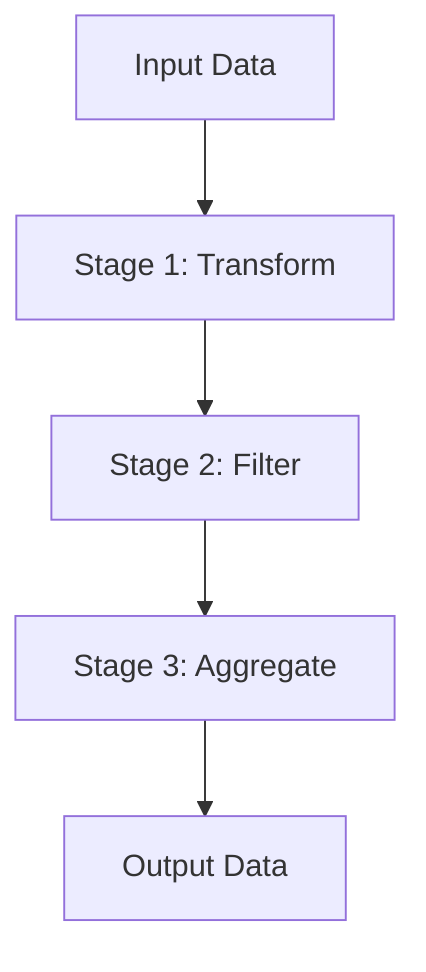

## 12.10 Pipeline Architecture

In the world of software design, the Pipeline Architecture is a powerful pattern that facilitates the processing of data through a series of stages. Each stage in the pipeline performs a specific operation on the data, transforming it and passing it to the next stage. This architecture is particularly useful in scenarios where data needs to be processed in a sequential manner, such as data transformation, stream processing, and more. In this section, we will delve into the Pipeline Architecture, explore its components, and demonstrate how it can be implemented in Ruby applications.

### Understanding Pipeline Architecture

**Pipeline Architecture** is a design pattern where data flows through a sequence of processing stages. Each stage is responsible for a specific task, and the output of one stage becomes the input for the next. This architecture is akin to an assembly line in a factory, where each worker (stage) performs a specific task on the product (data) before passing it to the next worker.

#### Key Components of Pipeline Architecture

1. **Stages**: Each stage in the pipeline performs a specific operation on the data. Stages are typically designed to be independent and reusable.

2. **Data Flow**: Data flows through the pipeline from one stage to the next. The flow can be synchronous or asynchronous, depending on the requirements.

3. **Control Flow**: The control flow determines the sequence in which stages are executed. It can be linear or conditional, allowing for branching and looping.

4. **Error Handling**: Mechanisms to handle errors that occur during data processing. This can include retry logic, logging, and fallback strategies.

5. **Performance Optimization**: Techniques to ensure the pipeline operates efficiently, such as parallel processing and resource management.

### Advantages of Pipeline Architecture

- **Modularity**: Each stage is a self-contained unit, making it easy to develop, test, and maintain.
- **Scalability**: Pipelines can be scaled horizontally by adding more instances of stages.
- **Reusability**: Stages can be reused across different pipelines, reducing development time.
- **Flexibility**: Pipelines can be easily modified by adding, removing, or reordering stages.
- **Improved Performance**: By processing data in stages, pipelines can optimize resource usage and improve throughput.

### Implementing Pipeline Architecture in Ruby

Ruby, with its expressive syntax and powerful metaprogramming capabilities, is well-suited for implementing pipeline architectures. Let's explore how to create a simple data processing pipeline in Ruby.

#### Example: A Simple Data Processing Pipeline

```ruby
# Define a simple pipeline stage
class Stage
  def initialize(name, &block)
    @name = name
    @operation = block
  end

  def process(data)
    puts "Processing data in #{@name} stage"
    @operation.call(data)
  end
end

# Define a pipeline class
class Pipeline
  def initialize
    @stages = []
  end

  def add_stage(stage)
    @stages << stage
  end

  def execute(initial_data)
    @stages.reduce(initial_data) do |data, stage|
      stage.process(data)
    end
  end
end

# Create stages
stage1 = Stage.new("Stage 1") { |data| data * 2 }
stage2 = Stage.new("Stage 2") { |data| data + 3 }
stage3 = Stage.new("Stage 3") { |data| data / 2 }

# Create a pipeline and add stages
pipeline = Pipeline.new
pipeline.add_stage(stage1)
pipeline.add_stage(stage2)
pipeline.add_stage(stage3)

# Execute the pipeline
result = pipeline.execute(10)
puts "Final result: #{result}"
```

In this example, we define a simple pipeline with three stages. Each stage performs a basic arithmetic operation on the data. The pipeline is executed with an initial input of `10`, and the final result is printed.

### Use Cases for Pipeline Architecture

Pipeline Architecture is versatile and can be applied to various scenarios, including:

- **Data Transformation**: Transforming raw data into a desired format, such as converting CSV data to JSON.
- **Stream Processing**: Processing continuous streams of data, such as log files or sensor data.
- **Image Processing**: Applying a series of filters or transformations to images.
- **ETL Processes**: Extracting, transforming, and loading data in data warehousing applications.

### Libraries Facilitating Pipeline Processing in Ruby

Several Ruby libraries can help implement pipeline architectures more efficiently:

- **Pipes**: A Ruby gem that provides a simple DSL for creating pipelines.
- **Waterfall**: A gem that allows for sequential execution of tasks with error handling.
- **Concurrent Ruby**: A library that provides concurrency abstractions, useful for parallelizing pipeline stages.

### Considerations for Pipeline Architecture

When designing a pipeline architecture, consider the following:

- **Error Handling**: Implement robust error handling to ensure the pipeline can recover from failures.
- **Performance**: Optimize the pipeline for performance by parallelizing stages and managing resources efficiently.
- **Data Integrity**: Ensure data integrity is maintained throughout the pipeline, especially in distributed systems.
- **Scalability**: Design the pipeline to scale horizontally to handle increased data volumes.

### Visualizing Pipeline Architecture

To better understand the flow of data through a pipeline, let's visualize a simple pipeline architecture using Mermaid.js:



In this diagram, data flows from the input through three stages: Transform, Filter, and Aggregate, before producing the final output.

### Try It Yourself

Experiment with the provided Ruby code by adding new stages or modifying existing ones. Try implementing error handling or parallel processing to enhance the pipeline's capabilities.

### Knowledge Check

- What are the key components of a pipeline architecture?
- How does pipeline architecture improve scalability and performance?
- What are some common use cases for pipeline architecture?
- How can error handling be implemented in a pipeline?
- What are some Ruby libraries that facilitate pipeline processing?

### Embrace the Journey

Remember, mastering pipeline architecture is a journey. As you explore and experiment, you'll discover new ways to optimize and enhance your data processing systems. Keep learning, stay curious, and enjoy the process!

## Quiz: Pipeline Architecture



### What is the primary purpose of pipeline architecture?

- [x] To process data through a sequence of stages
- [ ] To store data in a database
- [ ] To generate random data
- [ ] To encrypt data

> **Explanation:** Pipeline architecture is designed to process data through a series of stages, each performing a specific operation.

### Which of the following is a key component of pipeline architecture?

- [x] Stages
- [ ] Tables
- [ ] Views
- [ ] Indexes

> **Explanation:** Stages are the fundamental building blocks of a pipeline, each responsible for a specific task.

### How does pipeline architecture improve scalability?

- [x] By allowing stages to be scaled horizontally
- [ ] By reducing the number of stages
- [ ] By increasing the complexity of each stage
- [ ] By using a single-threaded approach

> **Explanation:** Pipelines can be scaled horizontally by adding more instances of stages, improving scalability.

### What is a common use case for pipeline architecture?

- [x] Data transformation
- [ ] Data deletion
- [ ] Data encryption
- [ ] Data backup

> **Explanation:** Pipeline architecture is commonly used for data transformation, where data is processed through multiple stages.

### Which Ruby library provides concurrency abstractions useful for pipeline processing?

- [x] Concurrent Ruby
- [ ] ActiveRecord
- [ ] Nokogiri
- [ ] Sinatra

> **Explanation:** Concurrent Ruby provides concurrency abstractions that can be useful for parallelizing pipeline stages.

### What is an important consideration when designing a pipeline architecture?

- [x] Error handling
- [ ] Data deletion
- [ ] User authentication
- [ ] Data encryption

> **Explanation:** Robust error handling is crucial to ensure the pipeline can recover from failures.

### How can performance be optimized in a pipeline architecture?

- [x] By parallelizing stages
- [ ] By increasing the number of stages
- [ ] By using a single-threaded approach
- [ ] By reducing error handling

> **Explanation:** Performance can be optimized by parallelizing stages and managing resources efficiently.

### What is the role of control flow in a pipeline architecture?

- [x] To determine the sequence of stage execution
- [ ] To store data in a database
- [ ] To encrypt data
- [ ] To generate random data

> **Explanation:** Control flow determines the sequence in which stages are executed in a pipeline.

### What is a benefit of modularity in pipeline architecture?

- [x] Easier development and maintenance
- [ ] Increased complexity
- [ ] Reduced performance
- [ ] Decreased scalability

> **Explanation:** Modularity makes it easier to develop, test, and maintain each stage independently.

### True or False: Pipeline architecture is only suitable for small data sets.

- [ ] True
- [x] False

> **Explanation:** Pipeline architecture is suitable for both small and large data sets, as it can be scaled to handle increased data volumes.




