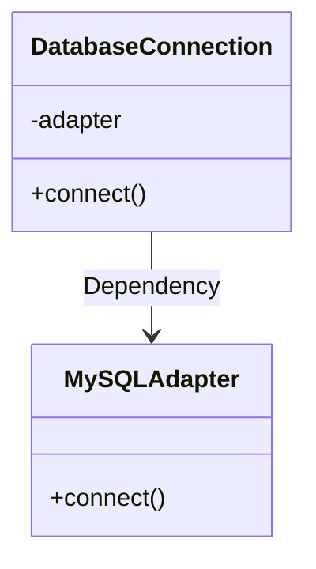

## 12.11 Dependency Injection and Inversion of Control

In the realm of software architecture, managing dependencies between objects is crucial for building scalable and maintainable applications. Dependency Injection (DI) and Inversion of Control (IoC) are two powerful patterns that facilitate this by promoting decoupling and enhancing testability. In this section, we will delve into these concepts, explore their benefits, and demonstrate how to implement them in Ruby.

### Understanding Dependency Injection (DI) and Inversion of Control (IoC)

**Dependency Injection (DI)** is a design pattern used to achieve Inversion of Control (IoC) between classes and their dependencies. Instead of a class creating its dependencies internally, they are provided externally, typically by a framework or a container. This approach leads to more modular and testable code.

**Inversion of Control (IoC)** is a broader principle where the control of object creation and lifecycle is inverted from the object itself to an external entity. DI is one of the most common ways to implement IoC.

#### Relationship Between DI and IoC

DI is a specific implementation of the IoC principle. While IoC can be achieved through various methods like service locators or event-driven architectures, DI focuses on providing dependencies directly to objects, thus promoting loose coupling and enhancing testability.

### Benefits of Using Dependency Injection

1. **Decoupling**: By injecting dependencies, classes are not tightly coupled to specific implementations, allowing for easier changes and enhancements.
2. **Testability**: Dependencies can be easily mocked or stubbed, facilitating unit testing.
3. **Maintainability**: With clear separation of concerns, code becomes easier to maintain and extend.
4. **Flexibility**: Different implementations of a dependency can be swapped without altering the dependent class.
5. **Reusability**: Components can be reused across different parts of an application or even in different projects.

### Implementing Dependency Injection in Ruby

Ruby, with its dynamic nature, provides several ways to implement DI. We will explore both manual DI and using frameworks like Dry::Container.

#### Manual Dependency Injection

Manual DI involves explicitly passing dependencies to a class, either through constructors, setters, or interfaces.

##### Constructor Injection

Constructor Injection is the most common form of DI, where dependencies are provided through a class's constructor.

```ruby
class DatabaseConnection
  def initialize(adapter)
    @adapter = adapter
  end

  def connect
    @adapter.connect
  end
end

class MySQLAdapter
  def connect
    puts "Connecting to MySQL database..."
  end
end

# Injecting dependency manually
adapter = MySQLAdapter.new
db_connection = DatabaseConnection.new(adapter)
db_connection.connect
```

In this example, `DatabaseConnection` is decoupled from the specific `MySQLAdapter` implementation, allowing for easy substitution with other adapters.

##### Setter Injection

Setter Injection involves providing dependencies through setter methods.

```ruby
class DatabaseConnection
  attr_writer :adapter

  def connect
    @adapter.connect
  end
end

# Using setter injection
db_connection = DatabaseConnection.new
db_connection.adapter = MySQLAdapter.new
db_connection.connect
```

Setter Injection provides flexibility in changing dependencies at runtime but requires additional methods for setting dependencies.

##### Interface Injection

Interface Injection is less common in Ruby due to its dynamic nature but involves providing dependencies through an interface method.

```ruby
module Adapter
  def set_adapter(adapter)
    @adapter = adapter
  end
end

class DatabaseConnection
  include Adapter

  def connect
    @adapter.connect
  end
end

# Using interface injection
db_connection = DatabaseConnection.new
db_connection.set_adapter(MySQLAdapter.new)
db_connection.connect
```

### Using Frameworks for Dependency Injection

While manual DI is straightforward, using a DI framework can simplify dependency management, especially in larger applications. One popular Ruby library for DI is [Dry::Container](https://dry-rb.org/gems/dry-container/0.8/).

#### Dependency Injection with Dry::Container

Dry::Container is part of the dry-rb ecosystem, providing a simple and flexible way to manage dependencies.

```ruby
require 'dry/container'

class DatabaseConnection
  def initialize(adapter)
    @adapter = adapter
  end

  def connect
    @adapter.connect
  end
end

class MySQLAdapter
  def connect
    puts "Connecting to MySQL database..."
  end
end

# Setting up the container
container = Dry::Container.new

container.register(:adapter) { MySQLAdapter.new }
container.register(:db_connection) { DatabaseConnection.new(container.resolve(:adapter)) }

# Resolving dependencies
db_connection = container.resolve(:db_connection)
db_connection.connect
```

In this example, `Dry::Container` manages the creation and injection of dependencies, promoting a clean separation of concerns.

### Best Practices for Dependency Injection

1. **Keep It Simple**: Start with manual DI and introduce frameworks only when necessary.
2. **Avoid Over-Injection**: Inject only what is necessary to keep classes focused and maintainable.
3. **Use Interfaces**: Define interfaces for dependencies to enhance flexibility and testability.
4. **Document Dependencies**: Clearly document the dependencies of each class for better maintainability.
5. **Be Cautious with Global State**: Avoid using global state for dependencies as it can lead to hidden couplings.

### Common Pitfalls in Dependency Injection

1. **Over-Engineering**: Introducing DI frameworks prematurely can lead to unnecessary complexity.
2. **Circular Dependencies**: Be mindful of circular dependencies, which can lead to runtime errors.
3. **Performance Overhead**: Excessive use of DI frameworks can introduce performance overhead.
4. **Misuse of Singleton**: Avoid using Singleton pattern as a substitute for DI, as it can lead to tightly coupled code.

### Visualizing Dependency Injection

To better understand the flow of dependencies in DI, let's visualize the process using a class diagram.



This diagram illustrates how `DatabaseConnection` depends on `MySQLAdapter`, with the dependency being injected externally.

### Try It Yourself

Experiment with the code examples provided by:

- Modifying the `MySQLAdapter` to simulate a different database connection.
- Implementing a new adapter class and injecting it into `DatabaseConnection`.
- Using `Dry::Container` to manage additional dependencies.

### Knowledge Check

- Explain the difference between DI and IoC.
- Describe the benefits of using DI in Ruby applications.
- Implement a simple DI example using constructor injection.
- Discuss the advantages of using a DI framework like Dry::Container.

### Embrace the Journey

Remember, mastering Dependency Injection and Inversion of Control is a journey. As you progress, you'll find these patterns invaluable in building robust and maintainable Ruby applications. Keep experimenting, stay curious, and enjoy the journey!

## Quiz: Dependency Injection and Inversion of Control



### What is Dependency Injection (DI)?

- [x] A design pattern that provides dependencies to a class externally
- [ ] A method of creating dependencies within a class
- [ ] A way to enforce strict typing in Ruby
- [ ] A pattern for managing database connections

> **Explanation:** Dependency Injection is a design pattern where dependencies are provided externally, promoting decoupling and testability.

### What is Inversion of Control (IoC)?

- [x] A principle where control of object creation is inverted from the object to an external entity
- [ ] A method of enforcing strict typing in Ruby
- [ ] A pattern for managing database connections
- [ ] A way to create dependencies within a class

> **Explanation:** Inversion of Control is a principle where the control of object creation and lifecycle is inverted, often implemented using Dependency Injection.

### Which of the following is a benefit of using Dependency Injection?

- [x] Easier testing and maintainability
- [ ] Increased coupling between classes
- [ ] Reduced flexibility in code
- [ ] More complex code structure

> **Explanation:** Dependency Injection promotes decoupling, making code easier to test and maintain.

### What is Constructor Injection?

- [x] Providing dependencies through a class's constructor
- [ ] Providing dependencies through setter methods
- [ ] Providing dependencies through interface methods
- [ ] Providing dependencies through global variables

> **Explanation:** Constructor Injection involves providing dependencies through the constructor, ensuring they are available when the object is created.

### Which Ruby library is commonly used for Dependency Injection?

- [x] Dry::Container
- [ ] ActiveRecord
- [ ] RSpec
- [ ] Nokogiri

> **Explanation:** Dry::Container is a popular Ruby library for managing dependencies and implementing Dependency Injection.

### What is a common pitfall of Dependency Injection?

- [x] Over-engineering and unnecessary complexity
- [ ] Increased coupling between classes
- [ ] Reduced testability
- [ ] Lack of flexibility in code

> **Explanation:** Introducing DI frameworks prematurely can lead to unnecessary complexity and over-engineering.

### What is Setter Injection?

- [x] Providing dependencies through setter methods
- [ ] Providing dependencies through a class's constructor
- [ ] Providing dependencies through interface methods
- [ ] Providing dependencies through global variables

> **Explanation:** Setter Injection involves providing dependencies through setter methods, allowing for runtime changes.

### What is Interface Injection?

- [x] Providing dependencies through an interface method
- [ ] Providing dependencies through a class's constructor
- [ ] Providing dependencies through setter methods
- [ ] Providing dependencies through global variables

> **Explanation:** Interface Injection involves providing dependencies through an interface method, though less common in Ruby.

### What is a key advantage of using DI frameworks like Dry::Container?

- [x] Simplified dependency management in larger applications
- [ ] Increased coupling between classes
- [ ] Reduced flexibility in code
- [ ] More complex code structure

> **Explanation:** DI frameworks like Dry::Container simplify dependency management, especially in larger applications.

### True or False: Dependency Injection can lead to circular dependencies if not managed carefully.

- [x] True
- [ ] False

> **Explanation:** Circular dependencies can occur if dependencies are not managed carefully, leading to runtime errors.




