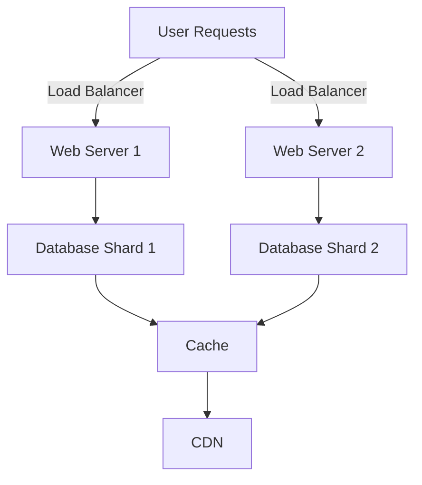

## 12.12 Scalability and High Availability Strategies

In the world of software development, ensuring that applications can handle increasing loads and remain available to users is paramount. This section delves into the strategies for achieving scalability and high availability in Ruby applications. We will explore concepts such as horizontal scaling, load balancing, database sharding, and more, with practical examples and code snippets to illustrate these techniques.

### Understanding Scalability and High Availability

**Scalability** refers to an application's ability to handle growth, whether in terms of user load, data volume, or transaction throughput. It involves designing systems that can expand their capacity to accommodate increased demand without compromising performance.

**High Availability (HA)** ensures that an application remains operational and accessible, even in the face of failures. This involves minimizing downtime and ensuring that services are resilient to disruptions.

### Techniques for Scalability

#### Horizontal Scaling

Horizontal scaling, or scaling out, involves adding more instances of a service to distribute the load. This is often more cost-effective and flexible than vertical scaling (increasing the power of a single instance).

**Example: Scaling a Ruby Web Application**

```ruby
# config/puma.rb
workers Integer(ENV['WEB_CONCURRENCY'] || 2)
threads_count = Integer(ENV['RAILS_MAX_THREADS'] || 5)
threads threads_count, threads_count

preload_app!

on_worker_boot do
  ActiveRecord::Base.establish_connection if defined?(ActiveRecord)
end
```

In this example, we configure Puma, a Ruby web server, to use multiple worker processes. This allows the application to handle more requests concurrently by leveraging multiple CPU cores.

#### Load Balancing

Load balancing distributes incoming network traffic across multiple servers to ensure no single server becomes a bottleneck. This improves both scalability and availability.

**Example: Using Nginx as a Load Balancer**

```nginx
http {
    upstream myapp {
        server app1.example.com;
        server app2.example.com;
    }

    server {
        listen 80;

        location / {
            proxy_pass http://myapp;
        }
    }
}
```

In this Nginx configuration, traffic is distributed between two application servers, `app1.example.com` and `app2.example.com`, ensuring balanced load and redundancy.

#### Database Sharding

Database sharding involves splitting a database into smaller, more manageable pieces, or shards. Each shard holds a subset of the data, allowing for parallel processing and improved performance.

**Example: Sharding with ActiveRecord**

```ruby
# config/database.yml
production:
  shard_1:
    <<: *default
    database: myapp_shard_1

  shard_2:
    <<: *default
    database: myapp_shard_2
```

By configuring multiple database connections, we can distribute data across different shards, improving query performance and scalability.

### Designing Stateless Services

Stateless services do not retain any client-specific data between requests. This design simplifies scaling because any instance of the service can handle any request.

**Example: Stateless Ruby Service**

```ruby
require 'sinatra'

get '/greet' do
  "Hello, #{params['name']}!"
end
```

This simple Sinatra application is stateless, as it does not store any session data. Each request is independent, allowing easy scaling across multiple instances.

### Role of Caching, Queuing Systems, and CDNs

#### Caching

Caching stores frequently accessed data in memory to reduce load on databases and improve response times.

**Example: Using Redis for Caching**

```ruby
require 'redis'

redis = Redis.new

# Cache a value
redis.set("user:1000", "John Doe")

# Retrieve a cached value
user = redis.get("user:1000")
```

By caching user data in Redis, we reduce database queries and enhance performance.

#### Queuing Systems

Queuing systems like Sidekiq allow background processing of tasks, freeing up web servers to handle more requests.

**Example: Background Job with Sidekiq**

```ruby
class HardWorker
  include Sidekiq::Worker

  def perform(name, count)
    puts "Doing hard work for #{name} #{count} times!"
  end
end
```

This Sidekiq worker processes tasks asynchronously, improving application responsiveness.

#### Content Delivery Networks (CDNs)

CDNs distribute static content across geographically dispersed servers, reducing latency and load on the origin server.

**Example: Configuring a CDN for Rails Assets**

```ruby
# config/environments/production.rb
config.action_controller.asset_host = 'https://cdn.example.com'
```

By serving assets through a CDN, we offload traffic from the main server, enhancing scalability and availability.

### Monitoring and Failover Strategies

#### Monitoring

Monitoring tools like New Relic or Datadog provide insights into application performance and health, enabling proactive issue resolution.

#### Failover Strategies

Failover strategies ensure continuity by automatically switching to a backup system in case of failure. This can involve redundant servers, databases, or entire data centers.

**Example: Database Failover with PostgreSQL**

```shell
# Promote a standby server to primary
pg_ctl promote -D /var/lib/postgresql/data
```

By promoting a standby PostgreSQL server, we ensure database availability even if the primary server fails.

### Try It Yourself

Experiment with the code examples provided. Try modifying the Puma configuration to use more workers, or set up a simple load balancer using Nginx. Explore caching with Redis by storing and retrieving different types of data.

### Visualizing Scalability and High Availability



*This diagram illustrates a scalable architecture with load balancing, database sharding, caching, and CDN integration.*

### Knowledge Check

- What is the difference between horizontal and vertical scaling?
- How does a load balancer improve application availability?
- Why are stateless services easier to scale?
- What role does caching play in improving performance?
- How can monitoring tools help maintain high availability?

### Summary

In this section, we've explored various strategies for achieving scalability and high availability in Ruby applications. By leveraging techniques like horizontal scaling, load balancing, database sharding, and caching, we can design systems that handle increased loads and remain resilient to failures. Remember, this is just the beginning. As you progress, you'll build more complex and robust applications. Keep experimenting, stay curious, and enjoy the journey!

## Quiz: Scalability and High Availability Strategies



### What is horizontal scaling?

- [x] Adding more instances of a service to distribute the load
- [ ] Increasing the power of a single instance
- [ ] Reducing the number of servers
- [ ] Using a single server for all requests

> **Explanation:** Horizontal scaling involves adding more instances of a service to handle increased load, rather than increasing the power of a single instance.

### How does a load balancer contribute to high availability?

- [x] By distributing traffic across multiple servers
- [ ] By storing user data
- [ ] By increasing server speed
- [ ] By reducing server costs

> **Explanation:** A load balancer distributes incoming traffic across multiple servers, ensuring no single server becomes a bottleneck and improving availability.

### What is the benefit of stateless services?

- [x] Easier to scale
- [ ] More secure
- [ ] Faster to develop
- [ ] Require more resources

> **Explanation:** Stateless services do not retain client-specific data between requests, making them easier to scale across multiple instances.

### Which tool is commonly used for caching in Ruby applications?

- [x] Redis
- [ ] Sidekiq
- [ ] Nginx
- [ ] Puma

> **Explanation:** Redis is a popular in-memory data store used for caching in Ruby applications.

### What is the purpose of a CDN?

- [x] To distribute static content across geographically dispersed servers
- [ ] To store dynamic content
- [ ] To increase server processing power
- [ ] To reduce database load

> **Explanation:** A CDN distributes static content across multiple servers, reducing latency and load on the origin server.

### What is database sharding?

- [x] Splitting a database into smaller, more manageable pieces
- [ ] Combining multiple databases into one
- [ ] Encrypting database data
- [ ] Backing up database data

> **Explanation:** Database sharding involves splitting a database into smaller pieces, or shards, to improve performance and scalability.

### How can monitoring tools help maintain high availability?

- [x] By providing insights into application performance and health
- [ ] By storing user data
- [ ] By increasing server speed
- [ ] By reducing server costs

> **Explanation:** Monitoring tools provide insights into application performance and health, enabling proactive issue resolution and maintaining high availability.

### What is a failover strategy?

- [x] Ensuring continuity by switching to a backup system in case of failure
- [ ] Increasing server speed
- [ ] Reducing server costs
- [ ] Storing user data

> **Explanation:** A failover strategy involves switching to a backup system in case of failure, ensuring continuity and availability.

### Which of the following is a queuing system used in Ruby applications?

- [x] Sidekiq
- [ ] Redis
- [ ] Nginx
- [ ] Puma

> **Explanation:** Sidekiq is a queuing system used for background processing in Ruby applications.

### True or False: Stateless services retain client-specific data between requests.

- [ ] True
- [x] False

> **Explanation:** Stateless services do not retain client-specific data between requests, making them easier to scale.




