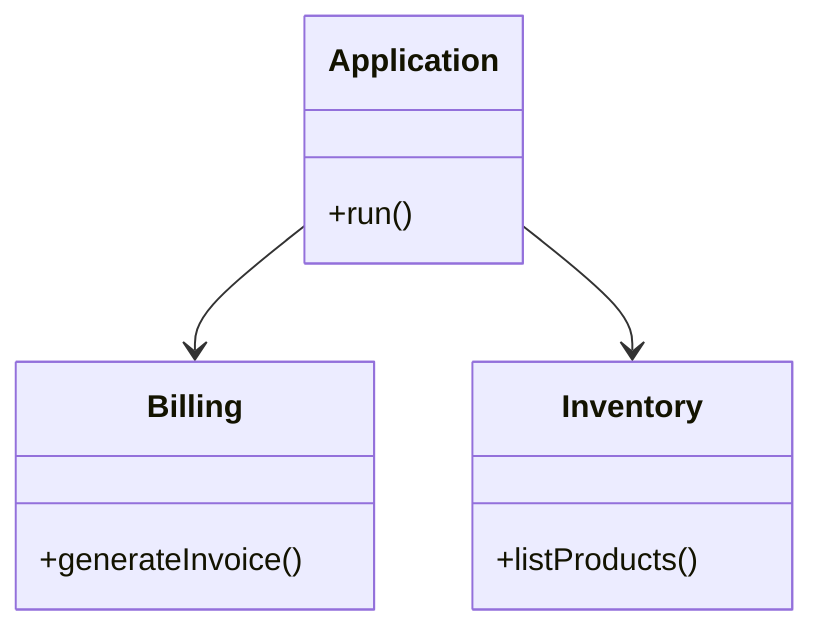

## 12.13 Modular Monolith Design

In the ever-evolving landscape of software architecture, the modular monolith design pattern offers a compelling alternative to traditional monolithic and microservices architectures. By structuring applications in a modular fashion, developers can enjoy the benefits of both worlds: the simplicity of a monolith and the flexibility of microservices. In this section, we'll delve into the concept of modular monoliths, explore their advantages, and provide practical guidance on implementing this design pattern in Ruby applications.

### What is a Modular Monolith?

A modular monolith is an architectural approach that structures a monolithic application into distinct, cohesive modules. Each module encapsulates a specific domain or functionality, promoting separation of concerns and reducing interdependencies. Unlike microservices, which distribute these modules across different services, a modular monolith keeps them within a single codebase and runtime environment.

#### Key Characteristics of a Modular Monolith

- **Modularity**: The application is divided into well-defined modules, each responsible for a specific aspect of the system.
- **Encapsulation**: Modules encapsulate their data and behavior, exposing only necessary interfaces to other parts of the application.
- **Single Deployment Unit**: The entire application is deployed as a single unit, simplifying deployment and operational concerns.
- **Inter-Module Communication**: Modules communicate through well-defined interfaces, often using in-process method calls rather than network calls.

### Advantages of Modular Monoliths

Modular monoliths offer several advantages over traditional monoliths and microservices:

- **Simplified Deployment**: With a single deployment unit, managing deployments is straightforward, reducing the operational overhead associated with microservices.
- **Improved Maintainability**: By organizing code into modules, developers can focus on specific areas of the application, making it easier to understand and maintain.
- **Enhanced Scalability**: While not as inherently scalable as microservices, modular monoliths can be scaled by deploying multiple instances of the entire application.
- **Reduced Complexity**: Avoids the complexity of distributed systems, such as network latency, data consistency, and service discovery.
- **Easier Refactoring**: Modules can be refactored independently, allowing for gradual improvements without affecting the entire system.

### Structuring Ruby Applications for Modularity

To implement a modular monolith in Ruby, it's essential to structure your application in a way that promotes modularity. Here are some key strategies:

#### 1. Define Clear Module Boundaries

Identify the distinct domains or functionalities within your application and define clear boundaries for each module. Each module should have a single responsibility and encapsulate its data and behavior.

#### 2. Use Namespaces

Leverage Ruby's module and class namespaces to organize code within each module. This helps prevent naming conflicts and makes it easier to locate related code.

```ruby
# Example of using namespaces in a Ruby application

module Billing
  class Invoice
    def generate
      # Code to generate an invoice
    end
  end
end

module Inventory
  class Product
    def list
      # Code to list products
    end
  end
end
```

#### 3. Encapsulate Data and Behavior

Ensure that each module encapsulates its data and behavior, exposing only necessary interfaces to other modules. This promotes loose coupling and reduces dependencies.

#### 4. Use Engines in Rails

Rails engines provide a powerful way to modularize Rails applications. An engine is essentially a mini-application that can be mounted within a larger application, allowing for isolated functionality.

```ruby
# Example of creating a Rails engine

# lib/my_engine/engine.rb
module MyEngine
  class Engine < ::Rails::Engine
    isolate_namespace MyEngine
  end
end
```

#### 5. Maintain Module Independence

Avoid tight coupling between modules by minimizing direct dependencies. Use dependency injection and design patterns like the facade pattern to manage interactions between modules.

### Best Practices for Maintaining Module Boundaries

Maintaining clear module boundaries is crucial for the success of a modular monolith. Here are some best practices:

- **Define Clear Interfaces**: Clearly define the interfaces that modules expose to other parts of the application. This helps manage dependencies and ensures that modules can evolve independently.
- **Minimize Shared State**: Avoid sharing state between modules. Instead, use message passing or events to communicate changes.
- **Regularly Review Boundaries**: As the application evolves, regularly review module boundaries to ensure they still align with the application's architecture and business needs.
- **Automate Testing**: Implement automated tests for each module to ensure that changes do not introduce regressions or break module boundaries.

### Scaling and Migrating to Microservices

While modular monoliths offer many benefits, there may come a time when scaling or migrating to microservices becomes necessary. Here are some considerations:

#### 1. Identify Bottlenecks

Monitor the application's performance to identify bottlenecks that may require scaling. This could involve scaling the entire application or specific modules.

#### 2. Gradual Migration

If migrating to microservices, consider a gradual approach. Start by extracting the most critical or resource-intensive modules into separate services.

#### 3. Use APIs for Communication

When transitioning to microservices, use APIs to facilitate communication between services. This allows for greater flexibility and scalability.

#### 4. Maintain Consistency

Ensure data consistency across services by implementing patterns like event sourcing or the saga pattern.

### Visualizing Modular Monolith Architecture

To better understand the modular monolith architecture, let's visualize it using a class diagram:



In this diagram, the `Application` class represents the main entry point of the monolith, while `Billing` and `Inventory` are distinct modules with their own responsibilities.

### Conclusion

The modular monolith design pattern offers a balanced approach to building scalable and maintainable Ruby applications. By structuring your codebase into well-defined modules, you can enjoy the simplicity of a monolith while reaping many of the benefits of microservices. As your application grows, you can scale or migrate to microservices as needed, ensuring that your architecture evolves with your business needs.

Remember, this is just the beginning. As you progress, you'll build more complex and interactive applications. Keep experimenting, stay curious, and enjoy the journey!

## Quiz: Modular Monolith Design



### What is a key characteristic of a modular monolith?

- [x] Modularity
- [ ] Distributed Deployment
- [ ] Network Communication
- [ ] Statelessness

> **Explanation:** A modular monolith is characterized by its modularity, where the application is divided into distinct modules.

### What is an advantage of a modular monolith over microservices?

- [x] Simplified Deployment
- [ ] Increased Network Latency
- [ ] Complex Service Discovery
- [ ] Higher Operational Overhead

> **Explanation:** Modular monoliths have simplified deployment as they are deployed as a single unit, unlike microservices which require managing multiple services.

### How can you structure a Ruby application for modularity?

- [x] Use Namespaces
- [ ] Share State Between Modules
- [ ] Avoid Encapsulation
- [ ] Use Global Variables

> **Explanation:** Using namespaces helps organize code and prevent naming conflicts, promoting modularity.

### What is a Rails engine?

- [x] A mini-application within a larger application
- [ ] A database management tool
- [ ] A network communication protocol
- [ ] A testing framework

> **Explanation:** A Rails engine is a mini-application that can be mounted within a larger application, allowing for isolated functionality.

### What is a best practice for maintaining module boundaries?

- [x] Define Clear Interfaces
- [ ] Share State Between Modules
- [ ] Use Global Variables
- [ ] Avoid Automated Testing

> **Explanation:** Defining clear interfaces helps manage dependencies and ensures modules can evolve independently.

### What should you avoid to maintain module independence?

- [x] Tight Coupling
- [ ] Dependency Injection
- [ ] Facade Pattern
- [ ] Encapsulation

> **Explanation:** Tight coupling between modules should be avoided to maintain module independence.

### When might you consider migrating to microservices?

- [x] When scaling becomes necessary
- [ ] When the application is too small
- [ ] When there are no performance issues
- [ ] When the application is already modular

> **Explanation:** Migrating to microservices may be considered when scaling becomes necessary due to performance bottlenecks.

### How can you ensure data consistency across services when migrating to microservices?

- [x] Implement Event Sourcing
- [ ] Use Global Variables
- [ ] Avoid APIs
- [ ] Share State Directly

> **Explanation:** Implementing event sourcing helps ensure data consistency across services.

### What is a benefit of using APIs for communication in microservices?

- [x] Greater Flexibility
- [ ] Increased Complexity
- [ ] Reduced Scalability
- [ ] Higher Latency

> **Explanation:** Using APIs for communication allows for greater flexibility and scalability in microservices.

### True or False: A modular monolith is deployed as multiple independent services.

- [ ] True
- [x] False

> **Explanation:** A modular monolith is deployed as a single unit, not as multiple independent services.




