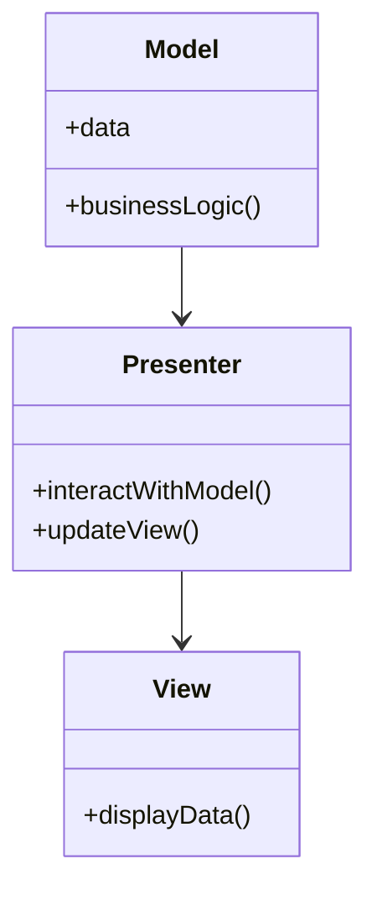
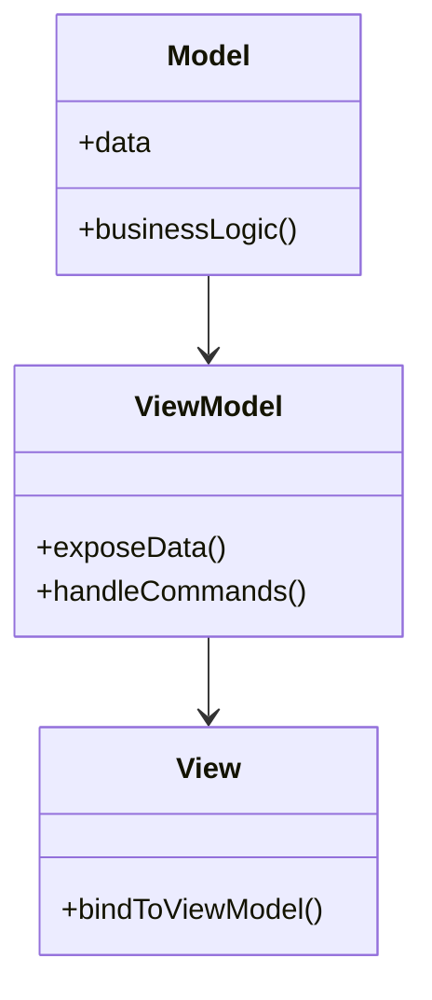

## 12.2 Model-View-Presenter (MVP) and MVVM

In the realm of software architecture, design patterns like Model-View-Presenter (MVP) and Model-View-ViewModel (MVVM) play a crucial role in structuring applications for scalability and maintainability. These patterns, while similar to the widely known Model-View-Controller (MVC), offer distinct advantages and are particularly useful in specific scenarios. In this section, we will delve into the MVP and MVVM patterns, explore their components, compare them with MVC, and discuss their applicability in Ruby applications.

### Understanding MVP and MVVM

#### Model-View-Presenter (MVP)

**Definition**: MVP is an architectural pattern that separates an application into three interconnected components: Model, View, and Presenter. This pattern is designed to facilitate a clear separation of concerns, making applications easier to manage and test.

- **Model**: Represents the data and business logic of the application. It is responsible for retrieving, storing, and manipulating data.
- **View**: The user interface component that displays data to the user. It is passive and does not contain any logic.
- **Presenter**: Acts as an intermediary between the Model and the View. It retrieves data from the Model and formats it for display in the View. The Presenter also handles user input and updates the Model accordingly.

#### Model-View-ViewModel (MVVM)

**Definition**: MVVM is an architectural pattern that also divides an application into three components: Model, View, and ViewModel. It is particularly popular in applications with complex user interfaces.

- **Model**: Similar to MVP, the Model in MVVM represents the data and business logic.
- **View**: The user interface that displays data. In MVVM, the View is more active and can bind directly to the ViewModel.
- **ViewModel**: Acts as a mediator between the View and the Model. It exposes data and commands to the View, allowing for data binding and command binding.

### Comparing MVP and MVVM with MVC

#### Similarities

- **Separation of Concerns**: All three patterns aim to separate the user interface from the business logic, promoting a clean architecture.
- **Components**: Each pattern consists of three main components that interact with each other to form the application.

#### Differences

- **Role of the View**: In MVC, the View is more active and can directly interact with the Model. In MVP, the View is passive, and in MVVM, the View can bind directly to the ViewModel.
- **Intermediary Component**: MVC uses a Controller to handle user input, while MVP uses a Presenter, and MVVM uses a ViewModel.
- **Data Binding**: MVVM supports data binding, allowing the View to automatically update when the ViewModel changes. This is not inherently supported in MVP or MVC.

### When to Use MVP or MVVM Over MVC

- **Complex User Interfaces**: MVVM is ideal for applications with complex user interfaces that require data binding.
- **Testability**: MVP and MVVM offer improved testability compared to MVC, as the Presenter and ViewModel can be tested independently of the View.
- **Separation of Concerns**: MVP provides a clearer separation of concerns, making it easier to manage and maintain large applications.

### Implementing MVP and MVVM in Ruby

#### MVP in Ruby

Let's explore how to implement the MVP pattern in a Ruby application. Consider a simple application that displays a list of books.

```ruby
# Model
class Book
  attr_accessor :title, :author

  def initialize(title, author)
    @title = title
    @author = author
  end

  def self.all
    # Simulate fetching data from a database
    [
      new("The Great Gatsby", "F. Scott Fitzgerald"),
      new("1984", "George Orwell"),
      new("To Kill a Mockingbird", "Harper Lee")
    ]
  end
end

# View
class BookView
  def display_books(books)
    books.each do |book|
      puts "Title: #{book.title}, Author: #{book.author}"
    end
  end
end

# Presenter
class BookPresenter
  def initialize(view)
    @view = view
  end

  def show_books
    books = Book.all
    @view.display_books(books)
  end
end

# Usage
view = BookView.new
presenter = BookPresenter.new(view)
presenter.show_books
```

In this example, the `Book` class represents the Model, the `BookView` class represents the View, and the `BookPresenter` class acts as the Presenter. The Presenter retrieves the list of books from the Model and passes it to the View for display.

#### MVVM in Ruby

Now, let's implement the MVVM pattern in a Ruby application. We'll use a similar example with a list of books.

```ruby
# Model
class Book
  attr_accessor :title, :author

  def initialize(title, author)
    @title = title
    @author = author
  end

  def self.all
    [
      new("The Great Gatsby", "F. Scott Fitzgerald"),
      new("1984", "George Orwell"),
      new("To Kill a Mockingbird", "Harper Lee")
    ]
  end
end

# ViewModel
class BookViewModel
  attr_reader :books

  def initialize
    @books = Book.all
  end
end

# View
class BookView
  def initialize(view_model)
    @view_model = view_model
  end

  def display_books
    @view_model.books.each do |book|
      puts "Title: #{book.title}, Author: #{book.author}"
    end
  end
end

# Usage
view_model = BookViewModel.new
view = BookView.new(view_model)
view.display_books
```

In this MVVM example, the `Book` class is the Model, the `BookViewModel` class acts as the ViewModel, and the `BookView` class is the View. The ViewModel exposes the list of books to the View, which then displays them.

### Benefits of MVP and MVVM

- **Improved Testability**: Both patterns allow for easier testing of the application logic, as the Presenter and ViewModel can be tested independently of the View.
- **Separation of Concerns**: By separating the user interface from the business logic, these patterns promote a clean and maintainable architecture.
- **Flexibility**: MVP and MVVM provide flexibility in designing user interfaces, making it easier to adapt to changing requirements.

### Limitations and Challenges

- **Complexity**: Implementing MVP or MVVM can introduce additional complexity, especially in smaller applications where the benefits may not outweigh the costs.
- **Learning Curve**: Developers may need to invest time in learning these patterns and understanding their nuances.
- **Overhead**: The additional layers introduced by these patterns can lead to increased overhead in terms of development and maintenance.

### Visualizing MVP and MVVM

To better understand the flow of data and interactions in MVP and MVVM, let's visualize these patterns using Mermaid.js diagrams.

#### MVP Diagram



**Description**: This diagram illustrates the interaction between the Model, View, and Presenter in the MVP pattern. The Presenter acts as an intermediary, retrieving data from the Model and updating the View.

#### MVVM Diagram



**Description**: This diagram shows the relationship between the Model, View, and ViewModel in the MVVM pattern. The ViewModel acts as a mediator, exposing data to the View, which can bind directly to it.

### Try It Yourself

To deepen your understanding of MVP and MVVM, try modifying the code examples provided. Experiment with adding new features, such as filtering the list of books or adding a new book to the collection. Consider how these changes affect the interaction between the components.

### References and Further Reading

- [Model-View-Presenter on Wikipedia](https://en.wikipedia.org/wiki/Model%E2%80%93view%E2%80%93presenter)
- [Model-View-ViewModel on Wikipedia](https://en.wikipedia.org/wiki/Model%E2%80%93view%E2%80%93viewmodel)
- [Ruby on Rails Guides](https://guides.rubyonrails.org/)

### Knowledge Check

- What are the main components of the MVP pattern?
- How does MVVM differ from MVP in terms of data binding?
- In what scenarios might you choose MVVM over MVC?
- What are some benefits of using MVP or MVVM in Ruby applications?
- What challenges might you face when adopting MVP or MVVM?

### Embrace the Journey

Remember, this is just the beginning. As you progress, you'll build more complex and interactive applications using these patterns. Keep experimenting, stay curious, and enjoy the journey!

## Quiz: Model-View-Presenter (MVP) and MVVM



### Which component in MVP is responsible for handling user input and updating the Model?

- [ ] Model
- [ ] View
- [x] Presenter
- [ ] ViewModel

> **Explanation:** In MVP, the Presenter acts as an intermediary between the Model and the View, handling user input and updating the Model accordingly.

### What is a key advantage of using MVVM over MVP?

- [ ] Simplicity
- [x] Data binding
- [ ] Less code
- [ ] Faster performance

> **Explanation:** MVVM supports data binding, allowing the View to automatically update when the ViewModel changes, which is a key advantage over MVP.

### In MVVM, which component exposes data and commands to the View?

- [ ] Model
- [ ] View
- [x] ViewModel
- [ ] Presenter

> **Explanation:** In MVVM, the ViewModel acts as a mediator between the View and the Model, exposing data and commands to the View.

### Which pattern is particularly useful for applications with complex user interfaces?

- [ ] MVC
- [x] MVVM
- [ ] MVP
- [ ] None of the above

> **Explanation:** MVVM is ideal for applications with complex user interfaces that require data binding.

### What is a common challenge when adopting MVP or MVVM?

- [x] Increased complexity
- [ ] Lack of flexibility
- [ ] Poor testability
- [ ] Limited scalability

> **Explanation:** Implementing MVP or MVVM can introduce additional complexity, especially in smaller applications where the benefits may not outweigh the costs.

### Which pattern allows for easier testing of the application logic?

- [ ] MVC
- [x] MVP
- [x] MVVM
- [ ] None of the above

> **Explanation:** Both MVP and MVVM allow for easier testing of the application logic, as the Presenter and ViewModel can be tested independently of the View.

### In MVP, which component is responsible for displaying data to the user?

- [ ] Model
- [x] View
- [ ] Presenter
- [ ] ViewModel

> **Explanation:** In MVP, the View is the user interface component that displays data to the user.

### What is the role of the ViewModel in MVVM?

- [ ] Handle user input
- [ ] Display data
- [x] Expose data and commands
- [ ] Retrieve data from the database

> **Explanation:** The ViewModel in MVVM acts as a mediator between the View and the Model, exposing data and commands to the View.

### Which pattern is known for providing a clearer separation of concerns?

- [ ] MVC
- [x] MVP
- [x] MVVM
- [ ] None of the above

> **Explanation:** Both MVP and MVVM provide a clearer separation of concerns compared to MVC, making it easier to manage and maintain large applications.

### True or False: In MVVM, the View can bind directly to the Model.

- [ ] True
- [x] False

> **Explanation:** In MVVM, the View binds to the ViewModel, not directly to the Model.


