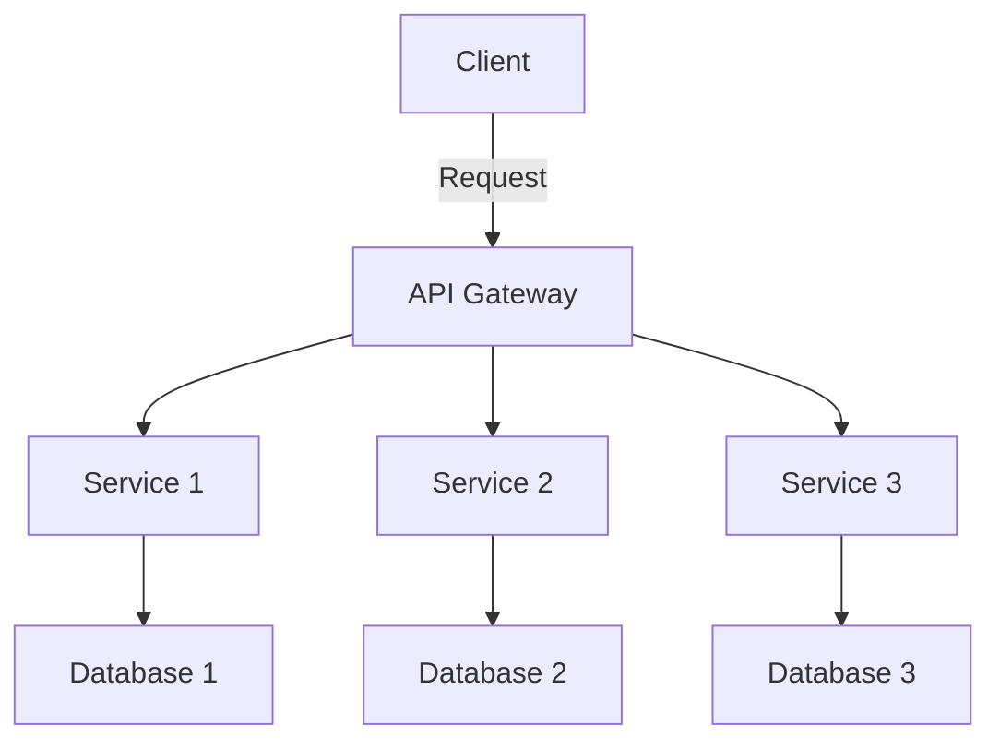

## 12.3 Microservices Architecture

Microservices architecture represents a paradigm shift in software development, emphasizing modularity, scalability, and flexibility. In this section, we will delve into the core principles of microservices architecture, explore how Ruby can be used to implement microservices, and discuss the benefits and challenges associated with this architectural style. We will also provide practical examples using Ruby frameworks like Grape and Sinatra, and highlight best practices for designing and managing microservices.

### Understanding Microservices Architecture

Microservices architecture is an approach to software development where applications are structured as a collection of loosely coupled, independently deployable services. Each service is designed to perform a specific business function and can be developed, deployed, and scaled independently.

#### Key Principles of Microservices Architecture

1. **Single Responsibility Principle**: Each microservice is responsible for a specific business capability, adhering to the principle of single responsibility.

2. **Decentralized Governance**: Microservices promote decentralized governance, allowing teams to choose the best tools and technologies for their specific services.

3. **Independent Deployment**: Services can be deployed independently, reducing the risk of system-wide failures and enabling continuous delivery.

4. **Scalability**: Microservices can be scaled independently, allowing for efficient resource utilization and improved performance.

5. **Resilience**: The architecture is designed to handle failures gracefully, with services being isolated from each other.

6. **Inter-Service Communication**: Microservices communicate with each other through well-defined APIs, often using lightweight protocols like HTTP/REST or messaging queues.

### Benefits of Microservices Architecture

- **Modularity**: Microservices promote modularity, making it easier to manage and maintain codebases.

- **Scalability**: Services can be scaled independently based on demand, optimizing resource usage.

- **Flexibility**: Teams can use different technologies and frameworks for different services, allowing for greater innovation.

- **Resilience**: The failure of one service does not necessarily impact the entire system, enhancing overall system resilience.

- **Faster Time to Market**: Independent deployment capabilities enable faster iterations and quicker time to market.

### Implementing Microservices with Ruby

Ruby, known for its simplicity and elegance, is a powerful language for building microservices. Frameworks like Grape and Sinatra provide lightweight solutions for developing RESTful APIs, making them ideal for microservices.

#### Using Grape for Microservices

Grape is a Ruby framework designed for building REST-like APIs. It is lightweight and provides a simple DSL for defining APIs.

```ruby
# app/api/my_service.rb
require 'grape'

class MyService < Grape::API
  format :json

  resource :items do
    desc 'Return a list of items'
    get do
      # Fetch items from a database or service
      { items: ['item1', 'item2', 'item3'] }
    end

    desc 'Create a new item'
    params do
      requires :name, type: String, desc: 'Item name'
    end
    post do
      # Logic to create a new item
      { message: "Item #{params[:name]} created" }
    end
  end
end
```

#### Using Sinatra for Microservices

Sinatra is another lightweight Ruby framework that is perfect for building small, modular web applications and microservices.

```ruby
# app/my_service.rb
require 'sinatra'
require 'json'

get '/items' do
  content_type :json
  # Fetch items from a database or service
  { items: ['item1', 'item2', 'item3'] }.to_json
end

post '/items' do
  content_type :json
  # Logic to create a new item
  { message: "Item #{params[:name]} created" }.to_json
end
```

### Challenges in Microservices Architecture

While microservices offer numerous benefits, they also introduce certain challenges:

- **Inter-Service Communication**: Ensuring reliable communication between services can be complex, especially in distributed systems.

- **Data Consistency**: Maintaining data consistency across services requires careful design, often involving eventual consistency models.

- **Deployment Complexity**: Managing multiple services can complicate deployment processes, necessitating robust CI/CD pipelines.

- **Monitoring and Logging**: Monitoring and logging become more complex as the number of services increases, requiring centralized solutions.

- **Security**: Ensuring security across multiple services involves managing authentication, authorization, and data protection.

### Best Practices for Designing and Managing Microservices

1. **Define Clear Boundaries**: Clearly define the boundaries and responsibilities of each microservice to avoid overlap and ensure cohesion.

2. **Use API Gateways**: Implement API gateways to manage requests, handle authentication, and provide a single entry point for clients.

3. **Implement Service Discovery**: Use service discovery mechanisms to enable services to find and communicate with each other dynamically.

4. **Adopt DevOps Practices**: Embrace DevOps practices to streamline deployment, monitoring, and management of microservices.

5. **Ensure Robust Monitoring**: Implement centralized monitoring and logging solutions to gain insights into service performance and health.

6. **Design for Failure**: Build resilience into your services by designing for failure and implementing fallback mechanisms.

7. **Automate Testing**: Use automated testing to ensure the reliability and stability of services, especially when deploying changes.

### Visualizing Microservices Architecture

To better understand the microservices architecture, let's visualize a simple microservices system using a Mermaid.js diagram.



**Diagram Description**: This diagram illustrates a basic microservices architecture where a client interacts with an API Gateway. The gateway routes requests to different services, each with its own database. This setup allows for independent scaling and management of each service.

### Try It Yourself

To deepen your understanding of microservices in Ruby, try modifying the provided code examples. Experiment with adding new endpoints, integrating a database, or implementing authentication. Consider deploying your services using Docker to simulate a production environment.

### References and Further Reading

- [Grape GitHub Repository](https://github.com/ruby-grape/grape)
- [Sinatra Official Website](http://sinatrarb.com/)
- [Microservices.io](https://microservices.io/)
- [Martin Fowler's Microservices Resource Guide](https://martinfowler.com/microservices/)

### Knowledge Check

- What are the key principles of microservices architecture?
- How can Ruby frameworks like Grape and Sinatra be used to build microservices?
- What are some challenges associated with microservices architecture?
- What best practices should be followed when designing and managing microservices?

### Embrace the Journey

Remember, mastering microservices architecture is a journey. As you explore and experiment with different frameworks and tools, you'll gain valuable insights into building scalable and maintainable applications. Keep learning, stay curious, and enjoy the process!

## Quiz: Microservices Architecture



### What is a key principle of microservices architecture?

- [x] Single Responsibility Principle
- [ ] Monolithic Design
- [ ] Centralized Governance
- [ ] Tight Coupling

> **Explanation:** Microservices architecture adheres to the Single Responsibility Principle, where each service is responsible for a specific business capability.

### Which Ruby framework is designed for building REST-like APIs?

- [x] Grape
- [ ] Rails
- [ ] RSpec
- [ ] Capistrano

> **Explanation:** Grape is a Ruby framework specifically designed for building REST-like APIs.

### What is a benefit of microservices architecture?

- [x] Modularity
- [ ] Increased Complexity
- [ ] Centralized Deployment
- [ ] Tight Coupling

> **Explanation:** Microservices architecture promotes modularity, making it easier to manage and maintain codebases.

### What is a challenge associated with microservices architecture?

- [x] Inter-Service Communication
- [ ] Monolithic Codebase
- [ ] Single Deployment Unit
- [ ] Tight Coupling

> **Explanation:** Ensuring reliable communication between services is a challenge in microservices architecture.

### Which practice is recommended for managing microservices?

- [x] Use API Gateways
- [ ] Centralize All Services
- [ ] Avoid Automation
- [ ] Ignore Monitoring

> **Explanation:** Implementing API gateways is recommended to manage requests and provide a single entry point for clients.

### What is a common protocol used for inter-service communication in microservices?

- [x] HTTP/REST
- [ ] FTP
- [ ] SMTP
- [ ] POP3

> **Explanation:** HTTP/REST is a common protocol used for inter-service communication in microservices.

### Which tool can be used for service discovery in microservices?

- [x] Consul
- [ ] Git
- [ ] Docker
- [ ] Jenkins

> **Explanation:** Consul is a tool used for service discovery in microservices architectures.

### What is a benefit of using Ruby for microservices?

- [x] Simplicity and Elegance
- [ ] High Complexity
- [ ] Centralized Control
- [ ] Monolithic Design

> **Explanation:** Ruby is known for its simplicity and elegance, making it a powerful language for building microservices.

### What is a best practice for ensuring service resilience?

- [x] Design for Failure
- [ ] Ignore Failures
- [ ] Centralize All Services
- [ ] Avoid Monitoring

> **Explanation:** Designing for failure and implementing fallback mechanisms is a best practice for ensuring service resilience.

### True or False: Microservices architecture allows for independent deployment of services.

- [x] True
- [ ] False

> **Explanation:** Microservices architecture allows for independent deployment of services, reducing the risk of system-wide failures.


