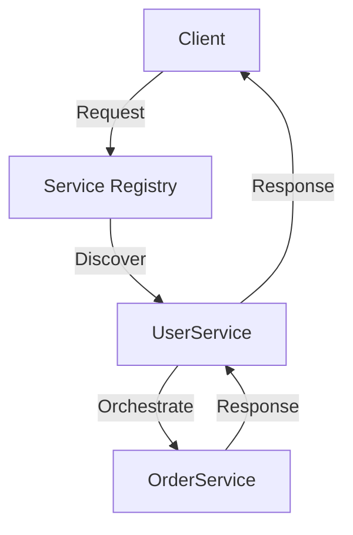

## 12.4 Service-Oriented Architecture (SOA)

Service-Oriented Architecture (SOA) is a design pattern that allows developers to build applications as a collection of loosely coupled services. Each service is a discrete unit of functionality that can be independently developed, deployed, and maintained. This architecture style promotes interoperability, reusability, and scalability, making it an ideal choice for complex, distributed systems.

### Understanding SOA

#### Key Characteristics of SOA

1. **Loose Coupling**: Services are designed to be independent, allowing them to evolve without affecting others.
2. **Interoperability**: Services communicate through standardized interfaces and protocols, enabling integration across different platforms and technologies.
3. **Reusability**: Services are designed to be reusable across different applications and contexts.
4. **Discoverability**: Services can be discovered and invoked dynamically, often through a service registry.
5. **Composability**: Services can be composed to form more complex services or applications.

#### SOA vs. Microservices

While SOA and microservices share similarities, such as promoting modularity and reusability, they differ in several key aspects:

- **Scope**: SOA typically encompasses an entire enterprise, integrating various applications and systems, whereas microservices focus on decomposing a single application into smaller, independent services.
- **Communication**: SOA often uses enterprise service buses (ESBs) for communication, while microservices favor lightweight protocols like HTTP/REST.
- **Granularity**: Microservices are generally more fine-grained than SOA services, focusing on specific business capabilities.

### Implementing SOA with Ruby

Ruby, with its dynamic nature and rich ecosystem, is well-suited for implementing SOA. Let's explore how Ruby can be used to build and orchestrate services.

#### Building Services in Ruby

To build a service in Ruby, we can use frameworks like Sinatra or Rails API. Here's a simple example using Sinatra:

```ruby
# app.rb
require 'sinatra'
require 'json'

# A simple service to manage users
class UserService < Sinatra::Base
  USERS = []

  # Endpoint to create a new user
  post '/users' do
    user = JSON.parse(request.body.read)
    USERS << user
    status 201
    user.to_json
  end

  # Endpoint to retrieve all users
  get '/users' do
    USERS.to_json
  end
end

# Start the service
UserService.run!
```

In this example, we define a `UserService` with endpoints to create and retrieve users. The service is self-contained and can be deployed independently.

#### Orchestrating Services

In an SOA environment, orchestrating services is crucial for building complex workflows. Ruby can facilitate orchestration through tools like Sidekiq for background processing or by leveraging message brokers like RabbitMQ.

Here's an example of orchestrating services using Sidekiq:

```ruby
# worker.rb
require 'sidekiq'
require 'net/http'

class UserCreationWorker
  include Sidekiq::Worker

  def perform(user_data)
    # Call the UserService to create a user
    uri = URI('http://localhost:4567/users')
    http = Net::HTTP.new(uri.host, uri.port)
    request = Net::HTTP::Post.new(uri.path, { 'Content-Type' => 'application/json' })
    request.body = user_data.to_json
    response = http.request(request)

    # Handle the response
    if response.code == '201'
      puts "User created successfully: #{response.body}"
    else
      puts "Failed to create user: #{response.body}"
    end
  end
end
```

In this example, `UserCreationWorker` is a Sidekiq worker that orchestrates the creation of a user by calling the `UserService`.

### Benefits of SOA

1. **Interoperability**: SOA enables seamless integration across different systems and platforms, facilitating communication and data exchange.
2. **Reusability**: Services can be reused across multiple applications, reducing redundancy and development time.
3. **Scalability**: Services can be scaled independently, allowing for efficient resource utilization and improved performance.
4. **Flexibility**: SOA allows for easy modification and extension of services, adapting to changing business needs.

### Challenges of SOA

1. **Service Governance**: Managing and governing a large number of services can be complex, requiring robust policies and tools.
2. **Complexity Management**: As the number of services grows, so does the complexity of managing dependencies and interactions.
3. **Performance Overhead**: The use of standardized protocols and communication layers can introduce latency and performance bottlenecks.

### Visualizing SOA

To better understand the architecture of SOA, let's visualize a typical SOA setup using a Mermaid.js diagram:



**Diagram Description**: This diagram illustrates a client interacting with a service registry to discover the `UserService`. The `UserService` then orchestrates a call to the `OrderService`, demonstrating the composability and interoperability of services in SOA.

### Try It Yourself

To deepen your understanding of SOA in Ruby, try modifying the code examples provided:

- **Add New Endpoints**: Extend the `UserService` to include endpoints for updating and deleting users.
- **Implement Error Handling**: Enhance the `UserCreationWorker` to handle different types of errors and retry failed requests.
- **Integrate a Message Broker**: Use RabbitMQ to facilitate communication between services, replacing direct HTTP calls.

### Conclusion

Service-Oriented Architecture (SOA) offers a robust framework for building scalable, interoperable applications. By leveraging Ruby's dynamic capabilities and rich ecosystem, developers can effectively implement SOA, overcoming challenges and reaping the benefits of this powerful architecture style.

Remember, this is just the beginning. As you progress, you'll build more complex and interactive applications. Keep experimenting, stay curious, and enjoy the journey!

## Quiz: Service-Oriented Architecture (SOA)



### What is a key characteristic of SOA?

- [x] Loose coupling
- [ ] Tight integration
- [ ] Monolithic design
- [ ] Single point of failure

> **Explanation:** SOA promotes loose coupling, allowing services to be independent and evolve separately.

### How does SOA differ from microservices in terms of scope?

- [x] SOA typically encompasses an entire enterprise
- [ ] SOA focuses on decomposing a single application
- [ ] SOA uses lightweight protocols like HTTP/REST
- [ ] SOA services are more fine-grained

> **Explanation:** SOA is often used to integrate various applications across an enterprise, while microservices focus on breaking down a single application.

### Which Ruby framework is suitable for building SOA services?

- [x] Sinatra
- [ ] Django
- [ ] Flask
- [ ] Express

> **Explanation:** Sinatra is a lightweight Ruby framework suitable for building services in an SOA architecture.

### What is a benefit of SOA?

- [x] Interoperability
- [ ] Increased redundancy
- [ ] Tight coupling
- [ ] Single point of failure

> **Explanation:** SOA enables interoperability across different systems and platforms.

### What is a challenge of SOA?

- [x] Service governance
- [ ] Lack of reusability
- [ ] Inflexibility
- [ ] Monolithic design

> **Explanation:** Managing and governing a large number of services can be complex in SOA.

### Which tool can be used for orchestrating services in Ruby?

- [x] Sidekiq
- [ ] Celery
- [ ] RabbitMQ
- [ ] Kafka

> **Explanation:** Sidekiq is a background processing tool in Ruby that can be used for orchestrating services.

### What is a common protocol used in SOA?

- [x] HTTP
- [ ] FTP
- [ ] SMTP
- [ ] POP3

> **Explanation:** HTTP is a common protocol used for communication in SOA.

### What does SOA promote in terms of service design?

- [x] Reusability
- [ ] Redundancy
- [ ] Tight coupling
- [ ] Single point of failure

> **Explanation:** SOA promotes the reusability of services across different applications.

### What is a common tool for service discovery in SOA?

- [x] Service registry
- [ ] Load balancer
- [ ] Firewall
- [ ] Database

> **Explanation:** A service registry is used for discovering and invoking services in SOA.

### True or False: SOA and microservices are identical in their approach.

- [ ] True
- [x] False

> **Explanation:** While SOA and microservices share similarities, they differ in scope, communication, and granularity.




