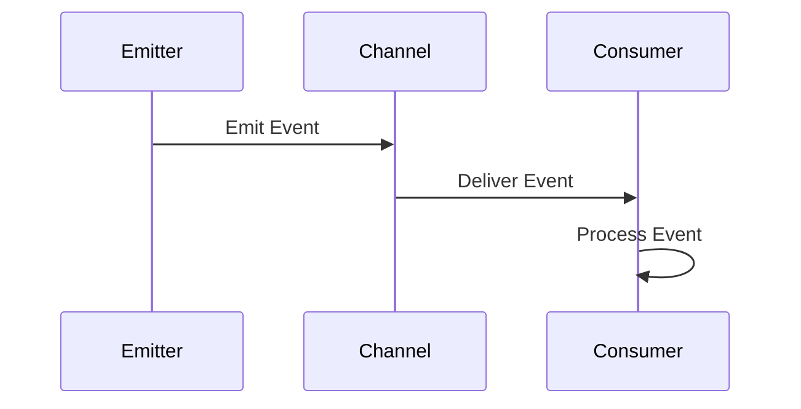

## 12.5 Event-Driven Architecture

### Introduction to Event-Driven Architecture

Event-Driven Architecture (EDA) is a design paradigm where components of a system communicate through events. This architecture is particularly beneficial for building scalable and maintainable applications, as it allows for decoupled components that can operate independently. In Ruby, EDA can be implemented using various libraries and frameworks, such as Rails Event Store, which facilitate the creation of event-driven systems.

### Key Concepts of Event-Driven Architecture

#### Event Emitters and Consumers

In EDA, the primary components are event emitters and consumers. An **event emitter** is responsible for generating events when a specific action occurs. These events are then consumed by **event consumers**, which react to the events by executing predefined actions.

- **Event Emitters**: These are components that detect changes or actions and emit events. For example, a user registration system might emit an event when a new user signs up.
- **Event Consumers**: These components listen for specific events and respond accordingly. Continuing with the user registration example, a consumer might send a welcome email when it detects a user registration event.

#### Event Channels

Events are typically transmitted over event channels, which can be queues, streams, or topics. These channels ensure that events are delivered to the appropriate consumers.

#### Event Processing

Event processing involves handling events as they occur. This can be done in real-time or batch processing, depending on the system's requirements.

### Benefits of Event-Driven Architecture

EDA offers several advantages, including:

- **Scalability**: By decoupling components, EDA allows systems to scale more easily. Components can be added or removed without affecting the entire system.
- **Flexibility**: EDA enables the integration of new features and services without significant changes to existing components.
- **Resilience**: Systems can continue to operate even if some components fail, as events can be stored and processed later.
- **Real-time Processing**: EDA supports real-time data processing, making it ideal for applications that require immediate responses.

### Implementing Event-Driven Architecture in Ruby

#### Using Rails Event Store

[Rails Event Store](https://railseventstore.org/) is a Ruby library that provides tools for implementing event-driven systems. It supports event sourcing and CQRS (Command Query Responsibility Segregation), making it a powerful choice for Ruby developers.

##### Setting Up Rails Event Store

To get started with Rails Event Store, add it to your Gemfile:

```ruby
gem 'rails_event_store'
```

Run `bundle install` to install the gem. Then, generate the necessary migrations:

```bash
rails generate rails_event_store_active_record:migration
rails db:migrate
```

##### Creating Event Emitters

To create an event emitter, define an event class that inherits from `RailsEventStore::Event`:

```ruby
class UserRegistered < RailsEventStore::Event
end
```

Emit the event when a user registers:

```ruby
event_store = RailsEventStore::Client.new
event_store.publish(UserRegistered.new(data: { user_id: user.id }))
```

##### Creating Event Consumers

Define a consumer that listens for the `UserRegistered` event:

```ruby
class SendWelcomeEmail
  def call(event)
    user_id = event.data[:user_id]
    # Logic to send a welcome email to the user
  end
end

event_store.subscribe(SendWelcomeEmail.new, to: [UserRegistered])
```

### Patterns in Event-Driven Architecture

#### Event Sourcing

Event Sourcing is a pattern where state changes are stored as a sequence of events. Instead of storing the current state, the system stores all events that led to the current state. This approach provides a complete audit trail and allows for easy state reconstruction.

##### Implementing Event Sourcing

With Rails Event Store, events are stored in a database, and the current state can be reconstructed by replaying these events.

```ruby
class UserAggregate
  def initialize
    @events = []
  end

  def apply(event)
    @events << event
    # Update state based on event
  end

  def replay(events)
    events.each { |event| apply(event) }
  end
end
```

#### CQRS (Command Query Responsibility Segregation)

CQRS is a pattern that separates the read and write operations of a system. Commands are used to change the state, while queries are used to retrieve data. This separation allows for optimized handling of read and write operations.

##### Implementing CQRS

In a Ruby application, you can implement CQRS by defining separate classes for commands and queries:

```ruby
class RegisterUserCommand
  def execute(user_data)
    # Logic to register a user
  end
end

class UserQuery
  def find_by_id(user_id)
    # Logic to retrieve user data
  end
end
```

### Best Practices and Potential Pitfalls

#### Best Practices

- **Design for Failure**: Ensure that your system can handle failures gracefully. Use retries and fallback mechanisms where appropriate.
- **Event Versioning**: As your system evolves, events may change. Implement versioning to handle different event formats.
- **Idempotency**: Ensure that event processing is idempotent, meaning that processing the same event multiple times does not have unintended side effects.

#### Potential Pitfalls

- **Complexity**: EDA can introduce complexity, especially in large systems. Carefully design your architecture to manage this complexity.
- **Eventual Consistency**: EDA systems are often eventually consistent, meaning that there may be a delay before all components reflect the latest state. Ensure that your system can handle this delay.

### Visualizing Event-Driven Architecture

Below is a Mermaid.js diagram illustrating the flow of events in an event-driven architecture:



This diagram shows how an event emitter sends an event to a channel, which then delivers the event to a consumer for processing.

### Try It Yourself

Experiment with the provided code examples by modifying the event data or adding additional consumers. Consider implementing a new feature, such as logging events to a file or database.

### Knowledge Check

- What are the main components of an event-driven architecture?
- How does event sourcing differ from traditional state storage?
- What are the benefits of using CQRS in an event-driven system?

### Conclusion

Event-Driven Architecture offers a powerful way to build scalable and maintainable applications in Ruby. By leveraging libraries like Rails Event Store, developers can implement event-driven systems that are flexible, resilient, and capable of real-time processing. As you continue to explore EDA, remember to adhere to best practices and be mindful of potential pitfalls.

## Quiz: Event-Driven Architecture



### What is the primary benefit of using Event-Driven Architecture?

- [x] Scalability and flexibility
- [ ] Simplicity and ease of use
- [ ] Reduced development time
- [ ] Increased coupling between components

> **Explanation:** Event-Driven Architecture allows for scalable and flexible systems by decoupling components and enabling independent operation.

### Which component in EDA is responsible for generating events?

- [x] Event Emitter
- [ ] Event Consumer
- [ ] Event Channel
- [ ] Event Processor

> **Explanation:** The Event Emitter is responsible for generating events in an event-driven architecture.

### What is the role of an Event Consumer?

- [x] To listen for and process events
- [ ] To generate and emit events
- [ ] To store events in a database
- [ ] To create event channels

> **Explanation:** An Event Consumer listens for specific events and processes them by executing predefined actions.

### How does Event Sourcing differ from traditional state storage?

- [x] It stores state changes as a sequence of events
- [ ] It stores only the current state
- [ ] It uses a relational database for storage
- [ ] It does not provide an audit trail

> **Explanation:** Event Sourcing stores state changes as a sequence of events, providing a complete audit trail and allowing for state reconstruction.

### What is the main advantage of using CQRS?

- [x] Separation of read and write operations
- [ ] Simplified database schema
- [ ] Faster write operations
- [ ] Reduced code complexity

> **Explanation:** CQRS separates read and write operations, allowing for optimized handling of each and improving system performance.

### Which Ruby library is commonly used for implementing EDA?

- [x] Rails Event Store
- [ ] ActiveRecord
- [ ] Sinatra
- [ ] RSpec

> **Explanation:** Rails Event Store is a Ruby library that provides tools for implementing event-driven systems.

### What is a potential pitfall of Event-Driven Architecture?

- [x] Increased complexity
- [ ] Reduced flexibility
- [ ] Lack of scalability
- [ ] Tight coupling of components

> **Explanation:** EDA can introduce complexity, especially in large systems, requiring careful design to manage it.

### What does eventual consistency mean in the context of EDA?

- [x] There may be a delay before all components reflect the latest state
- [ ] All components are always in sync
- [ ] Events are processed immediately
- [ ] Consistency is not guaranteed

> **Explanation:** Eventual consistency means there may be a delay before all components reflect the latest state, which is common in EDA systems.

### How can you ensure idempotency in event processing?

- [x] By ensuring processing the same event multiple times does not have unintended side effects
- [ ] By processing each event only once
- [ ] By storing events in a database
- [ ] By using a single event consumer

> **Explanation:** Idempotency ensures that processing the same event multiple times does not have unintended side effects, which is crucial for reliable event processing.

### True or False: Event-Driven Architecture is always the best choice for any application.

- [ ] True
- [x] False

> **Explanation:** While EDA offers many benefits, it is not always the best choice for every application. It is important to consider the specific requirements and constraints of the system.



Remember, this is just the beginning. As you progress, you'll build more complex and interactive applications using Event-Driven Architecture. Keep experimenting, stay curious, and enjoy the journey!
