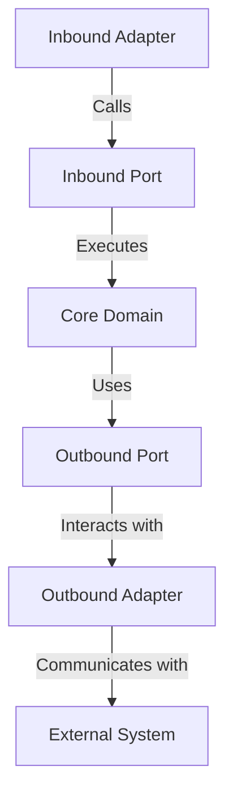

## 12.6 Hexagonal Architecture (Ports and Adapters)

Hexagonal Architecture, also known as the Ports and Adapters pattern, is a design approach that aims to create loosely coupled application components. This architecture promotes the separation of concerns, making applications more maintainable, testable, and adaptable to change. In this section, we'll delve into the principles of Hexagonal Architecture, its implementation in Ruby, and the benefits it brings to software development.

### Understanding Hexagonal Architecture

Hexagonal Architecture was introduced by Alistair Cockburn in 2005. The primary goal of this architecture is to allow an application to be equally driven by users, programs, automated tests, or batch scripts, and to be developed and tested in isolation from its eventual runtime devices and databases.

#### Goals of Hexagonal Architecture

- **Separation of Concerns**: Isolate the core business logic from external systems such as databases, user interfaces, and third-party services.
- **Testability**: Enable testing of the core application logic without involving external systems.
- **Flexibility**: Allow easy replacement or modification of external systems without affecting the core logic.
- **Maintainability**: Simplify the process of maintaining and evolving the application over time.

### Core Concepts: Ports and Adapters

Hexagonal Architecture is built around the concepts of Ports and Adapters. Let's explore these concepts in detail:

#### Ports

Ports define the entry points to the application. They are interfaces that describe the operations the application can perform. Ports can be categorized into two types:

- **Inbound Ports**: These are interfaces through which the application receives input. They represent the use cases or services that the application offers.
- **Outbound Ports**: These are interfaces through which the application interacts with external systems. They represent the dependencies of the application.

#### Adapters

Adapters are the implementations of the ports. They translate the data and operations from the external systems to the application's core logic and vice versa. Adapters can also be categorized into two types:

- **Inbound Adapters**: These handle incoming requests from external systems, such as web controllers or message listeners.
- **Outbound Adapters**: These handle outgoing requests to external systems, such as database repositories or API clients.

### Structuring a Ruby Application with Hexagonal Architecture

To implement Hexagonal Architecture in Ruby, we need to structure our application to separate the core business logic from the external systems. Here's a step-by-step guide on how to achieve this:

#### Step 1: Define the Core Domain

The core domain contains the business logic and is independent of external systems. It includes:

- **Entities**: Objects that represent the core business concepts.
- **Value Objects**: Immutable objects that represent descriptive aspects of the domain.
- **Domain Services**: Operations that don't naturally fit within an entity or value object.

```ruby
# app/domain/entities/order.rb
class Order
  attr_reader :id, :items, :status

  def initialize(id, items)
    @id = id
    @items = items
    @status = :pending
  end

  def complete
    @status = :completed
  end
end

# app/domain/value_objects/item.rb
class Item
  attr_reader :name, :price

  def initialize(name, price)
    @name = name
    @price = price
  end
end
```

#### Step 2: Define Ports

Ports are interfaces that define the operations the application can perform. In Ruby, we can use modules to define these interfaces.

```ruby
# app/ports/inbound/order_service.rb
module OrderService
  def create_order(order)
    raise NotImplementedError
  end

  def complete_order(order_id)
    raise NotImplementedError
  end
end

# app/ports/outbound/payment_gateway.rb
module PaymentGateway
  def process_payment(order)
    raise NotImplementedError
  end
end
```

#### Step 3: Implement Adapters

Adapters implement the ports and handle the interaction with external systems.

```ruby
# app/adapters/inbound/web/order_controller.rb
class OrderController
  include OrderService

  def create_order(order)
    # Handle HTTP request and call the core logic
    order = Order.new(order[:id], order[:items])
    # Call the core domain logic
    order.complete
  end

  def complete_order(order_id)
    # Handle HTTP request and call the core logic
    # Find order and complete it
  end
end

# app/adapters/outbound/payment_gateway_adapter.rb
class PaymentGatewayAdapter
  include PaymentGateway

  def process_payment(order)
    # Interact with an external payment service
    puts "Processing payment for order #{order.id}"
  end
end
```

### Benefits of Hexagonal Architecture

Hexagonal Architecture offers several benefits that make it an attractive choice for building scalable and maintainable applications:

- **Testability**: By isolating the core business logic from external systems, we can easily write unit tests for the core logic without involving external dependencies.
- **Flexibility**: The use of ports and adapters allows us to easily replace or modify external systems without affecting the core logic.
- **Maintainability**: The separation of concerns makes the application easier to understand and maintain over time.
- **Isolation of Business Logic**: The core domain is independent of external systems, ensuring that business logic is not tightly coupled with infrastructure concerns.

### Challenges in Adopting Hexagonal Architecture

While Hexagonal Architecture offers many benefits, there are also challenges to consider:

- **Complexity**: The initial setup and learning curve can be steep, especially for developers unfamiliar with the pattern.
- **Overhead**: The separation of concerns can introduce additional layers of abstraction, which may lead to increased complexity in smaller applications.
- **Cultural Shift**: Adopting Hexagonal Architecture may require a shift in mindset and development practices, which can be challenging for teams accustomed to traditional architectures.

### Visualizing Hexagonal Architecture

To better understand Hexagonal Architecture, let's visualize the structure using a Mermaid.js diagram:



**Diagram Description**: This diagram illustrates the flow of data and operations in a Hexagonal Architecture. The Inbound Adapter receives input and calls the Inbound Port, which executes the Core Domain logic. The Core Domain uses the Outbound Port to interact with the Outbound Adapter, which communicates with the External System.

### Try It Yourself

To get hands-on experience with Hexagonal Architecture, try modifying the code examples provided:

- Add a new feature to the `Order` entity, such as a method to cancel an order.
- Implement a new outbound adapter for a different payment gateway.
- Write unit tests for the core domain logic using RSpec or Minitest.

### References and Further Reading

- [Alistair Cockburn's Hexagonal Architecture](http://alistair.cockburn.us/Hexagonal+architecture)
- [Martin Fowler's Blog on Ports and Adapters](https://martinfowler.com/bliki/HexagonalArchitecture.html)
- [Ruby on Rails Guides](https://guides.rubyonrails.org/)

### Knowledge Check

Before moving on, let's summarize the key takeaways:

- Hexagonal Architecture separates the core business logic from external systems using Ports and Adapters.
- This architecture promotes testability, flexibility, and maintainability.
- Implementing Hexagonal Architecture in Ruby involves defining the core domain, ports, and adapters.

Remember, this is just the beginning. As you progress, you'll build more complex and interactive applications. Keep experimenting, stay curious, and enjoy the journey!

## Quiz: Hexagonal Architecture (Ports and Adapters)



### What is the primary goal of Hexagonal Architecture?

- [x] To create loosely coupled application components
- [ ] To increase the speed of application development
- [ ] To reduce the number of lines of code
- [ ] To eliminate the use of external libraries

> **Explanation:** Hexagonal Architecture aims to create loosely coupled application components, allowing for better separation of concerns and flexibility.

### What are Ports in Hexagonal Architecture?

- [x] Interfaces that define the operations the application can perform
- [ ] Classes that implement the business logic
- [ ] External systems that interact with the application
- [ ] Libraries used for database interaction

> **Explanation:** Ports are interfaces that define the operations the application can perform, serving as entry points to the application.

### What are Adapters in Hexagonal Architecture?

- [x] Implementations of the ports that handle interaction with external systems
- [ ] Interfaces that define the operations the application can perform
- [ ] Core business logic components
- [ ] Database connection handlers

> **Explanation:** Adapters are implementations of the ports that handle interaction with external systems, translating data and operations.

### Which of the following is a benefit of Hexagonal Architecture?

- [x] Improved testability
- [ ] Increased code complexity
- [ ] Reduced application performance
- [ ] Tight coupling of components

> **Explanation:** Hexagonal Architecture improves testability by isolating the core business logic from external systems.

### What is an Inbound Port?

- [x] An interface through which the application receives input
- [ ] An interface through which the application interacts with external systems
- [ ] A class that implements the business logic
- [ ] A database connection handler

> **Explanation:** An Inbound Port is an interface through which the application receives input, representing the use cases or services offered.

### What is an Outbound Adapter?

- [x] An implementation that handles outgoing requests to external systems
- [ ] An interface that defines the operations the application can perform
- [ ] A core business logic component
- [ ] A user interface component

> **Explanation:** An Outbound Adapter is an implementation that handles outgoing requests to external systems, interacting with dependencies.

### What challenge might you face when adopting Hexagonal Architecture?

- [x] Increased complexity and learning curve
- [ ] Reduced testability
- [ ] Tight coupling of components
- [ ] Decreased flexibility

> **Explanation:** Adopting Hexagonal Architecture can introduce increased complexity and a learning curve, especially for those unfamiliar with the pattern.

### How does Hexagonal Architecture promote flexibility?

- [x] By allowing easy replacement or modification of external systems
- [ ] By reducing the number of lines of code
- [ ] By eliminating the need for testing
- [ ] By tightly coupling components

> **Explanation:** Hexagonal Architecture promotes flexibility by allowing easy replacement or modification of external systems without affecting the core logic.

### True or False: Hexagonal Architecture is also known as the Ports and Adapters pattern.

- [x] True
- [ ] False

> **Explanation:** True. Hexagonal Architecture is also known as the Ports and Adapters pattern, emphasizing the separation of concerns.

### Which component in Hexagonal Architecture interacts directly with external systems?

- [x] Outbound Adapter
- [ ] Inbound Port
- [ ] Core Domain
- [ ] Inbound Adapter

> **Explanation:** The Outbound Adapter interacts directly with external systems, handling outgoing requests.


