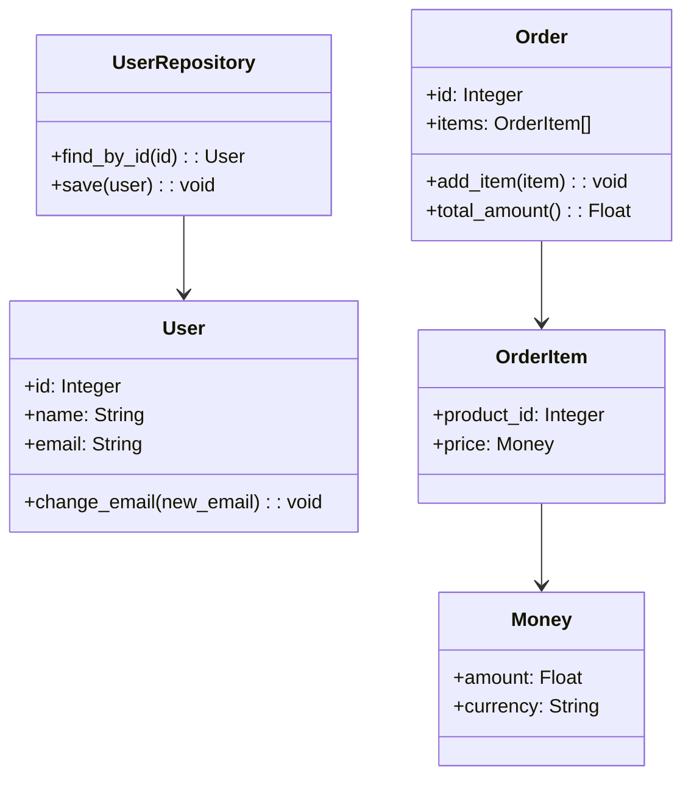

## 12.7 Domain-Driven Design (DDD) in Ruby

Domain-Driven Design (DDD) is a strategic approach to software development that focuses on modeling software to match a complex domain. It emphasizes collaboration between technical and domain experts to create a shared understanding of the domain, which is then reflected in the software design. In this section, we will explore how DDD principles can be applied in Ruby applications to manage complexity and build scalable, maintainable systems.

### Understanding Domain-Driven Design

Domain-Driven Design was introduced by Eric Evans in his seminal book "Domain-Driven Design: Tackling Complexity in the Heart of Software." The core idea of DDD is to place the domain model at the center of the software development process. Let's break down some of the key concepts of DDD:

#### Core Concepts of DDD

1. **Entities**: These are objects that have a distinct identity that runs through time and different states. In Ruby, entities are typically represented by classes where each instance has a unique identifier.

2. **Value Objects**: Unlike entities, value objects do not have a unique identity. They are defined only by their attributes. In Ruby, value objects can be implemented using immutable classes.

3. **Aggregates**: An aggregate is a cluster of domain objects that can be treated as a single unit. Each aggregate has a root entity, known as the aggregate root, which is responsible for maintaining the integrity of the aggregate.

4. **Repositories**: These are mechanisms for encapsulating storage, retrieval, and search behavior which emulates a collection of objects. In Ruby, repositories can be implemented using classes that interact with databases or other storage systems.

5. **Ubiquitous Language**: This is a shared language that is used by all team members to connect all the activities of the team with the software. It helps in reducing misunderstandings and ensures that the domain model is accurately reflected in the code.

6. **Bounded Contexts**: These define the boundaries within which a particular model is applicable. Different parts of a system may have different models, and bounded contexts help in managing these differences.

### Managing Complexity with DDD

DDD helps manage complexity by ensuring that the software design closely aligns with the business domain. This alignment is achieved through continuous collaboration between developers and domain experts. By focusing on the core domain and its logic, DDD allows teams to build systems that are more adaptable to changes in business requirements.

### Implementing DDD Patterns in Ruby

Let's explore how we can implement some of these DDD patterns in Ruby.

#### Implementing Entities

Entities in Ruby can be implemented using classes with unique identifiers. Here's a simple example:

```ruby
class User
  attr_reader :id, :name, :email

  def initialize(id, name, email)
    @id = id
    @name = name
    @email = email
  end

  def change_email(new_email)
    @email = new_email
  end

  def ==(other)
    other.is_a?(User) && other.id == id
  end
end
```

In this example, `User` is an entity with a unique `id`. The `==` method is overridden to ensure that equality is based on the `id`.

#### Implementing Value Objects

Value objects are immutable and defined by their attributes. Here's how you can implement a value object in Ruby:

```ruby
class Money
  attr_reader :amount, :currency

  def initialize(amount, currency)
    @amount = amount
    @currency = currency
  end

  def ==(other)
    other.is_a?(Money) && other.amount == amount && other.currency == currency
  end
end
```

In this example, `Money` is a value object. It is immutable, and equality is based on its attributes.

#### Implementing Aggregates

An aggregate is a group of related entities and value objects. Here's an example of an aggregate in Ruby:

```ruby
class Order
  attr_reader :id, :items

  def initialize(id)
    @id = id
    @items = []
  end

  def add_item(item)
    @items << item
  end

  def total_amount
    @items.map(&:price).reduce(0, :+)
  end
end

class OrderItem
  attr_reader :product_id, :price

  def initialize(product_id, price)
    @product_id = product_id
    @price = price
  end
end
```

In this example, `Order` is an aggregate with `OrderItem` as part of its aggregate. The `Order` class is responsible for maintaining the integrity of its items.

#### Implementing Repositories

Repositories abstract the data access layer. Here's a simple example of a repository in Ruby:

```ruby
class UserRepository
  def initialize(database)
    @database = database
  end

  def find_by_id(id)
    @database.query("SELECT * FROM users WHERE id = ?", id)
  end

  def save(user)
    @database.execute("INSERT INTO users (id, name, email) VALUES (?, ?, ?)", user.id, user.name, user.email)
  end
end
```

In this example, `UserRepository` provides methods to find and save `User` entities.

### The Role of Ubiquitous Language and Bounded Contexts

#### Ubiquitous Language

The ubiquitous language is a shared language that is used by all team members, including developers, domain experts, and stakeholders. It ensures that everyone has a common understanding of the domain and that the domain model is accurately reflected in the code.

#### Bounded Contexts

Bounded contexts help manage complexity by defining clear boundaries within which a particular model is applicable. Different parts of a system may have different models, and bounded contexts help in managing these differences. In Ruby, bounded contexts can be implemented using modules or namespaces to separate different parts of the system.

### Tools and Libraries for DDD in Ruby

Several tools and libraries can facilitate the implementation of DDD in Ruby:

- **Rails**: While Rails is not specifically designed for DDD, its conventions and structure can be adapted to support DDD principles.
- **ROM (Ruby Object Mapper)**: A powerful data mapping and persistence toolkit that can be used to implement repositories and aggregates.
- **Dry-rb**: A collection of Ruby libraries that provide tools for building applications with a focus on immutability and functional programming, which can complement DDD practices.

### Challenges and Best Practices in Adopting DDD

#### Challenges

- **Complexity**: DDD can introduce additional complexity, especially in smaller projects where the overhead may not be justified.
- **Learning Curve**: Understanding and applying DDD principles can be challenging for teams new to the approach.
- **Cultural Shift**: DDD requires a cultural shift towards collaboration and continuous communication between developers and domain experts.

#### Best Practices

- **Start Small**: Begin by applying DDD principles to a small part of the system and gradually expand as the team becomes more comfortable.
- **Focus on the Core Domain**: Prioritize the core domain and its logic, and use DDD to model it effectively.
- **Continuous Collaboration**: Foster continuous collaboration between developers and domain experts to ensure that the domain model remains aligned with business requirements.

### Visualizing Domain-Driven Design

To better understand how DDD components interact, let's visualize the relationships between entities, value objects, aggregates, and repositories using a class diagram.



This diagram illustrates how different DDD components are structured and interact with each other in a Ruby application.

### Try It Yourself

To deepen your understanding of DDD in Ruby, try modifying the code examples provided. For instance, add new methods to the `Order` class to remove items or calculate discounts. Experiment with creating new value objects or entities and see how they fit into the existing aggregates and repositories.

### Conclusion

Domain-Driven Design offers a powerful approach to managing complexity in software systems by aligning the software model with the business domain. By applying DDD principles in Ruby, developers can build scalable, maintainable applications that are adaptable to changing business requirements. Remember, this is just the beginning. As you continue to explore DDD, you'll discover new ways to model complex domains effectively. Keep experimenting, stay curious, and enjoy the journey!

## Quiz: Domain-Driven Design (DDD) in Ruby



### What is the primary goal of Domain-Driven Design (DDD)?

- [x] To align the software model with the business domain
- [ ] To optimize database queries
- [ ] To improve user interface design
- [ ] To enhance network security

> **Explanation:** The primary goal of DDD is to align the software model with the business domain, ensuring that the software accurately reflects the domain's complexities.

### Which of the following is a characteristic of a value object?

- [x] It is immutable
- [ ] It has a unique identifier
- [ ] It is responsible for maintaining aggregate integrity
- [ ] It encapsulates data storage behavior

> **Explanation:** Value objects are immutable and defined by their attributes, not by a unique identifier.

### What is the role of a repository in DDD?

- [x] To encapsulate storage, retrieval, and search behavior
- [ ] To define the boundaries of a model
- [ ] To provide a shared language for the team
- [ ] To manage user authentication

> **Explanation:** Repositories encapsulate storage, retrieval, and search behavior, emulating a collection of objects.

### What is a bounded context?

- [x] A boundary within which a particular model is applicable
- [ ] A shared language used by the team
- [ ] A mechanism for encapsulating data access
- [ ] A type of value object

> **Explanation:** Bounded contexts define the boundaries within which a particular model is applicable, helping manage complexity.

### Which Ruby library can facilitate DDD by providing tools for immutability and functional programming?

- [x] Dry-rb
- [ ] Rails
- [ ] Sinatra
- [ ] Nokogiri

> **Explanation:** Dry-rb provides tools for building applications with a focus on immutability and functional programming, complementing DDD practices.

### What is the purpose of the ubiquitous language in DDD?

- [x] To ensure a common understanding of the domain among all team members
- [ ] To optimize code performance
- [ ] To manage database transactions
- [ ] To enhance user interface design

> **Explanation:** The ubiquitous language ensures a common understanding of the domain among all team members, reducing misunderstandings.

### How can aggregates help in managing complexity in DDD?

- [x] By treating a cluster of domain objects as a single unit
- [ ] By providing a shared language for the team
- [ ] By optimizing database queries
- [ ] By enhancing network security

> **Explanation:** Aggregates help manage complexity by treating a cluster of domain objects as a single unit, with an aggregate root maintaining integrity.

### What is a common challenge when adopting DDD?

- [x] The learning curve for understanding and applying DDD principles
- [ ] The lack of available libraries in Ruby
- [ ] The inability to model complex domains
- [ ] The difficulty in optimizing database queries

> **Explanation:** A common challenge when adopting DDD is the learning curve for understanding and applying its principles effectively.

### Which of the following is NOT a core concept of DDD?

- [x] User Interface Design
- [ ] Entities
- [ ] Value Objects
- [ ] Repositories

> **Explanation:** User Interface Design is not a core concept of DDD, which focuses on entities, value objects, repositories, and other domain modeling concepts.

### True or False: DDD is only applicable to large-scale projects.

- [ ] True
- [x] False

> **Explanation:** DDD can be applied to projects of any size, though its benefits are more pronounced in complex domains.


