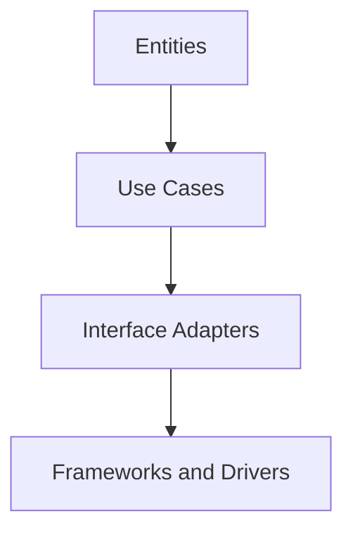

## 12.8 Clean Architecture

### Introduction to Clean Architecture

Clean Architecture is a software design philosophy that emphasizes the separation of concerns and the independence of system components. It was introduced by Robert C. Martin (also known as Uncle Bob) to address the common problems of software systems becoming difficult to maintain and scale over time. The core idea is to create a system where the business logic is independent of frameworks, databases, and user interfaces, allowing each part to evolve independently.

### Objectives of Clean Architecture

The primary objectives of Clean Architecture are:

- **Independence of Frameworks**: The architecture should not be tied to any particular framework, allowing you to swap frameworks with minimal impact on the system.
- **Testability**: The system should be easy to test, with business rules that can be tested independently of external systems.
- **Independence of UI**: The user interface should be able to change without affecting the business rules.
- **Independence of Database**: The database should be able to change without affecting the business rules.
- **Independence of External Agencies**: The system should be able to integrate with external systems without affecting the core business logic.

### The Dependency Rule

A fundamental principle of Clean Architecture is the Dependency Rule, which states that source code dependencies can only point inward. This means that the inner layers should not know anything about the outer layers. The inner layers contain the business rules, while the outer layers contain implementation details.

### Layers of Clean Architecture

Clean Architecture is typically represented by a series of concentric circles, each representing a different layer of the application. Let's explore these layers and how they can be implemented in a Ruby application.

#### 1. Entities

Entities are the innermost layer and represent the core business logic of the application. They are the most stable and independent components, containing business rules that are applicable across various use cases.

```ruby
# Example of an Entity in Ruby
class User
  attr_accessor :name, :email

  def initialize(name, email)
    @name = name
    @name = email
  end

  def valid_email?
    # Business rule for validating email
    email.match?(/\A[^@\s]+@[^@\s]+\z/)
  end
end
```

#### 2. Use Cases

Use Cases define the application-specific business rules. They orchestrate the flow of data to and from the entities and direct the entities to use their business rules to achieve the goals of the use case.

```ruby
# Example of a Use Case in Ruby
class RegisterUser
  def initialize(user_repository)
    @user_repository = user_repository
  end

  def execute(name, email)
    user = User.new(name, email)
    if user.valid_email?
      @user_repository.save(user)
    else
      raise "Invalid email address"
    end
  end
end
```

#### 3. Interface Adapters

Interface Adapters are responsible for converting data from the format most convenient for the use cases and entities to the format most convenient for some external agency such as the database or the web. This layer includes controllers, gateways, and presenters.

```ruby
# Example of an Interface Adapter in Ruby
class UserController
  def initialize(register_user_use_case)
    @register_user_use_case = register_user_use_case
  end

  def register(params)
    @register_user_use_case.execute(params[:name], params[:email])
  end
end
```

#### 4. Frameworks and Drivers

This is the outermost layer, which contains details like the database, web frameworks, and any other external tools. This layer is where the application interacts with the outside world.

```ruby
# Example of a Framework and Driver in Ruby
class UserRepository
  def save(user)
    # Code to save user to the database
  end
end
```

### Benefits of Clean Architecture

- **Decoupling**: By separating concerns, each part of the system can be developed, tested, and maintained independently.
- **Ease of Testing**: With business logic isolated from external dependencies, unit testing becomes straightforward.
- **Scalability**: The architecture supports scaling by allowing different parts of the system to evolve independently.
- **Flexibility**: The system can adapt to changes in technology and business requirements without significant rework.

### Differences and Similarities with Hexagonal Architecture

Clean Architecture and Hexagonal Architecture (also known as Ports and Adapters) share the goal of creating systems that are independent of external frameworks and technologies. Both emphasize the separation of concerns and the importance of isolating business logic.

**Similarities:**

- Both architectures aim to decouple the business logic from external systems.
- They promote testability and maintainability.
- Both use the concept of adapters to interface with external systems.

**Differences:**

- Clean Architecture uses concentric circles to represent layers, while Hexagonal Architecture uses a hexagon to represent the core application surrounded by adapters.
- Clean Architecture explicitly defines layers like entities and use cases, whereas Hexagonal Architecture focuses on ports and adapters.

### Tools and Frameworks Supporting Clean Architecture in Ruby

Several tools and frameworks can help implement Clean Architecture in Ruby:

- **Rails**: While Rails is a full-stack framework, it can be adapted to support Clean Architecture by organizing the codebase into layers.
- **Hanami**: A lightweight Ruby framework that encourages separation of concerns and can be used to implement Clean Architecture.
- **Dry-rb**: A collection of Ruby libraries that support building applications with a focus on immutability and separation of concerns.

### Visualizing Clean Architecture

To better understand Clean Architecture, let's visualize it using a Mermaid.js diagram:



This diagram illustrates the flow of dependencies in Clean Architecture, where each layer depends on the layer directly inside it.

### Try It Yourself

Experiment with the provided code examples by modifying the business rules or adding new use cases. Try implementing a new feature by creating a new use case and see how it integrates with the existing architecture.

### Knowledge Check

- Explain the Dependency Rule in Clean Architecture.
- Describe the role of entities in Clean Architecture.
- How does Clean Architecture enhance testability?

### Conclusion

Clean Architecture provides a robust framework for building scalable and maintainable applications by emphasizing the separation of concerns and independence of system components. By adopting Clean Architecture principles, Ruby developers can create systems that are flexible, testable, and adaptable to change.

## Quiz: Clean Architecture



### What is the primary goal of Clean Architecture?

- [x] To create systems with independent layers and boundaries
- [ ] To tightly couple business logic with frameworks
- [ ] To focus solely on user interface design
- [ ] To eliminate the need for testing

> **Explanation:** Clean Architecture aims to create systems with independent layers and boundaries to enhance maintainability and scalability.

### Which layer in Clean Architecture contains the core business logic?

- [x] Entities
- [ ] Use Cases
- [ ] Interface Adapters
- [ ] Frameworks and Drivers

> **Explanation:** Entities contain the core business logic in Clean Architecture.

### What is the Dependency Rule in Clean Architecture?

- [x] Source code dependencies can only point inward
- [ ] Source code dependencies can point outward
- [ ] Dependencies are not allowed
- [ ] Dependencies must be circular

> **Explanation:** The Dependency Rule states that source code dependencies can only point inward, ensuring that inner layers are independent of outer layers.

### How does Clean Architecture enhance testability?

- [x] By isolating business logic from external dependencies
- [ ] By integrating tightly with frameworks
- [ ] By focusing on user interface design
- [ ] By eliminating the need for unit tests

> **Explanation:** Clean Architecture enhances testability by isolating business logic from external dependencies, making it easier to test.

### What is a similarity between Clean Architecture and Hexagonal Architecture?

- [x] Both aim to decouple business logic from external systems
- [ ] Both focus on tightly coupling layers
- [ ] Both use a hexagon to represent layers
- [ ] Both eliminate the need for testing

> **Explanation:** Both Clean Architecture and Hexagonal Architecture aim to decouple business logic from external systems.

### Which Ruby framework can be adapted to support Clean Architecture?

- [x] Rails
- [ ] Sinatra
- [ ] Padrino
- [ ] Grape

> **Explanation:** Rails can be adapted to support Clean Architecture by organizing the codebase into layers.

### What is the role of Use Cases in Clean Architecture?

- [x] To define application-specific business rules
- [ ] To store data in the database
- [ ] To render the user interface
- [ ] To manage external frameworks

> **Explanation:** Use Cases define application-specific business rules and orchestrate the flow of data to and from entities.

### How does Clean Architecture support scalability?

- [x] By allowing different parts of the system to evolve independently
- [ ] By tightly coupling all system components
- [ ] By focusing solely on user interface design
- [ ] By eliminating the need for testing

> **Explanation:** Clean Architecture supports scalability by allowing different parts of the system to evolve independently.

### What is a key difference between Clean Architecture and Hexagonal Architecture?

- [x] Clean Architecture uses concentric circles, while Hexagonal Architecture uses a hexagon
- [ ] Clean Architecture focuses on user interface design, while Hexagonal Architecture does not
- [ ] Clean Architecture eliminates the need for testing, while Hexagonal Architecture does not
- [ ] Clean Architecture tightly couples layers, while Hexagonal Architecture does not

> **Explanation:** Clean Architecture uses concentric circles to represent layers, while Hexagonal Architecture uses a hexagon to represent the core application surrounded by adapters.

### True or False: Clean Architecture allows the database to change without affecting business rules.

- [x] True
- [ ] False

> **Explanation:** Clean Architecture allows the database to change without affecting business rules, as the business logic is independent of the database.



Remember, this is just the beginning. As you progress, you'll build more complex and interactive applications. Keep experimenting, stay curious, and enjoy the journey!

---
