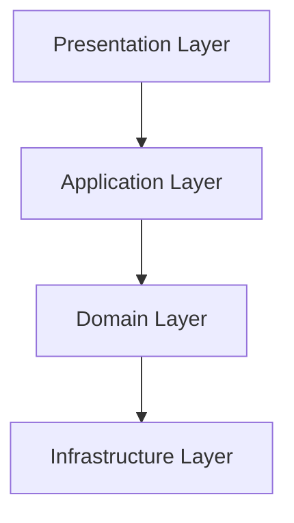

## 12.9 Layered Architecture

Layered Architecture is a widely adopted architectural pattern in software development, known for its ability to organize code into distinct layers. This organization promotes modularity, separation of concerns, and scalability. In this section, we'll delve into the Layered Architecture pattern, its typical layers, and how to apply it effectively in Ruby projects.

### Understanding Layered Architecture

Layered Architecture, also known as n-tier architecture, is a design pattern that divides an application into layers, each with specific responsibilities. This separation allows developers to manage complexity by isolating different aspects of the application, such as user interface, business logic, and data access.

#### Typical Layers in Layered Architecture

1. **Presentation Layer**: This layer is responsible for handling user interactions. It includes the user interface components and is often where input validation occurs. In web applications, this would typically include HTML, CSS, and JavaScript.

2. **Application Layer**: Also known as the service layer, this layer acts as a bridge between the presentation layer and the domain layer. It orchestrates application operations, handles user requests, and manages transactions.

3. **Domain Layer**: This layer contains the core business logic of the application. It is where the rules and operations specific to the business domain are implemented. The domain layer is independent of the presentation and infrastructure layers, making it reusable and testable.

4. **Infrastructure Layer**: This layer provides technical capabilities required by the application, such as data storage, messaging, and networking. It includes databases, file systems, and external services.

### Responsibilities of Each Layer

#### Presentation Layer

- **Responsibilities**:
  - Render the user interface.
  - Capture user input and send it to the application layer.
  - Display data received from the application layer.
  - Handle user interactions and events.

- **Example**:
  ```ruby
  # app/controllers/users_controller.rb
  class UsersController < ApplicationController
    def show
      @user = UserService.find_user(params[:id])
    end
  end
  ```

#### Application Layer

- **Responsibilities**:
  - Coordinate application activities.
  - Manage transactions and application state.
  - Serve as an intermediary between the presentation and domain layers.

- **Example**:
  ```ruby
  # app/services/user_service.rb
  class UserService
    def self.find_user(user_id)
      UserRepository.find_by_id(user_id)
    end
  end
  ```

#### Domain Layer

- **Responsibilities**:
  - Implement business rules and logic.
  - Define domain entities and value objects.
  - Ensure business invariants are maintained.

- **Example**:
  ```ruby
  # app/models/user.rb
  class User
    attr_accessor :name, :email

    def initialize(name, email)
      @name = name
      @name = email
    end

    def change_email(new_email)
      # Business logic for changing email
      self.email = new_email
    end
  end
  ```

#### Infrastructure Layer

- **Responsibilities**:
  - Handle data persistence and retrieval.
  - Integrate with external systems and services.
  - Provide technical services like logging and caching.

- **Example**:
  ```ruby
  # app/repositories/user_repository.rb
  class UserRepository
    def self.find_by_id(id)
      # Database query to find user by ID
      User.find(id)
    end
  end
  ```

### Structuring a Ruby Application Using Layers

When structuring a Ruby application using the Layered Architecture pattern, it's essential to maintain clear boundaries between layers. This separation ensures that changes in one layer do not affect others, promoting maintainability and scalability.

#### Example Structure

```plaintext
app/
  controllers/
    users_controller.rb
  services/
    user_service.rb
  models/
    user.rb
  repositories/
    user_repository.rb
```

### Flow of Dependencies and Data Between Layers

In a Layered Architecture, dependencies flow from the top layer to the bottom layer. The presentation layer depends on the application layer, which in turn depends on the domain layer. The infrastructure layer supports all other layers but does not depend on them.

#### Data Flow

- **From Presentation to Application**: User inputs are captured and sent to the application layer for processing.
- **From Application to Domain**: The application layer invokes domain logic to perform business operations.
- **From Domain to Infrastructure**: The domain layer interacts with the infrastructure layer for data persistence and retrieval.

### Benefits of Layered Architecture

1. **Modularity**: Each layer has a specific responsibility, making the codebase easier to understand and modify.

2. **Separation of Concerns**: By isolating different aspects of the application, developers can focus on one layer at a time.

3. **Reusability**: The domain layer can be reused across different applications, as it is independent of other layers.

4. **Testability**: Layers can be tested independently, allowing for more straightforward unit and integration testing.

5. **Scalability**: Applications can be scaled horizontally by distributing layers across different servers or services.

### Potential Drawbacks

1. **Increased Complexity**: Introducing multiple layers can add complexity to the application, especially for small projects.

2. **Performance Overhead**: The additional layers can introduce latency, as data must pass through each layer.

3. **Rigid Structure**: The strict separation of layers can make it challenging to implement cross-cutting concerns.

### Ruby-Specific Considerations

Ruby's dynamic nature and metaprogramming capabilities can be leveraged to implement Layered Architecture efficiently. For instance, Ruby's modules can be used to encapsulate shared functionality across layers, and its metaprogramming features can dynamically define methods and behaviors.

### Try It Yourself

To experiment with Layered Architecture in Ruby, try modifying the code examples provided. For instance, add a new feature to the `UserService` class or implement a caching mechanism in the `UserRepository` class. Observe how changes in one layer do not affect others, demonstrating the modularity and separation of concerns.

### Visualizing Layered Architecture

Below is a Mermaid.js diagram illustrating the flow of dependencies and data between layers in a Layered Architecture.



**Diagram Description**: This diagram represents the flow of dependencies in a Layered Architecture. The presentation layer depends on the application layer, which depends on the domain layer, and finally, the domain layer interacts with the infrastructure layer.

### Further Reading

For more information on Layered Architecture and its application in Ruby, consider exploring the following resources:

- [Martin Fowler's Patterns of Enterprise Application Architecture](https://martinfowler.com/books/eaa.html)
- [Ruby on Rails Guides](https://guides.rubyonrails.org/)
- [Clean Architecture by Robert C. Martin](https://www.oreilly.com/library/view/clean-architecture/9780134494272/)

### Knowledge Check

- What are the typical layers in a Layered Architecture?
- How does the flow of dependencies work in a Layered Architecture?
- What are the benefits and potential drawbacks of using Layered Architecture?

### Embrace the Journey

Remember, mastering Layered Architecture is just one step in building scalable and maintainable Ruby applications. Keep experimenting, stay curious, and enjoy the journey of software development!

## Quiz: Layered Architecture



### What is the primary purpose of the presentation layer in a layered architecture?

- [x] Handle user interactions and render the user interface
- [ ] Manage data persistence
- [ ] Implement business logic
- [ ] Coordinate application activities

> **Explanation:** The presentation layer is responsible for handling user interactions and rendering the user interface.

### Which layer in a layered architecture is responsible for implementing business rules and logic?

- [ ] Presentation Layer
- [ ] Application Layer
- [x] Domain Layer
- [ ] Infrastructure Layer

> **Explanation:** The domain layer is responsible for implementing business rules and logic.

### What is a key benefit of using a layered architecture?

- [x] Modularity and separation of concerns
- [ ] Increased complexity
- [ ] Performance overhead
- [ ] Rigid structure

> **Explanation:** A key benefit of layered architecture is modularity and separation of concerns, which makes the codebase easier to manage.

### In a layered architecture, which layer serves as an intermediary between the presentation and domain layers?

- [ ] Presentation Layer
- [x] Application Layer
- [ ] Domain Layer
- [ ] Infrastructure Layer

> **Explanation:** The application layer serves as an intermediary between the presentation and domain layers.

### What is a potential drawback of using a layered architecture?

- [ ] Modularity
- [ ] Separation of concerns
- [x] Increased complexity
- [ ] Testability

> **Explanation:** A potential drawback of layered architecture is increased complexity, especially for small projects.

### How does data typically flow in a layered architecture?

- [x] From presentation to application to domain to infrastructure
- [ ] From infrastructure to domain to application to presentation
- [ ] From domain to application to presentation to infrastructure
- [ ] From application to presentation to domain to infrastructure

> **Explanation:** Data typically flows from the presentation layer to the application layer, then to the domain layer, and finally to the infrastructure layer.

### Which layer in a layered architecture is responsible for data persistence and retrieval?

- [ ] Presentation Layer
- [ ] Application Layer
- [ ] Domain Layer
- [x] Infrastructure Layer

> **Explanation:** The infrastructure layer is responsible for data persistence and retrieval.

### What is the role of the application layer in a layered architecture?

- [ ] Handle user interactions
- [ ] Implement business logic
- [x] Coordinate application activities
- [ ] Provide technical services

> **Explanation:** The application layer coordinates application activities and serves as a bridge between the presentation and domain layers.

### Which of the following is a Ruby-specific consideration when implementing layered architecture?

- [x] Leveraging Ruby's dynamic nature and metaprogramming capabilities
- [ ] Using static typing for layer separation
- [ ] Implementing layers using Java interfaces
- [ ] Relying on Ruby's garbage collection for layer management

> **Explanation:** Ruby's dynamic nature and metaprogramming capabilities can be leveraged to implement layered architecture efficiently.

### True or False: The domain layer in a layered architecture is dependent on the presentation layer.

- [ ] True
- [x] False

> **Explanation:** The domain layer is independent of the presentation layer, allowing it to be reusable and testable.




