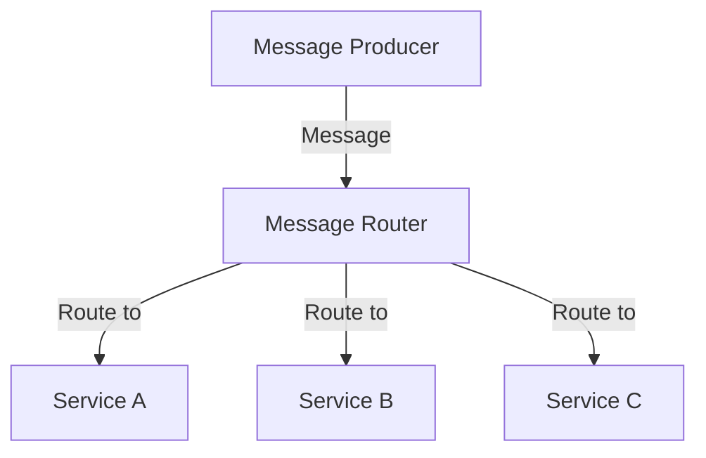
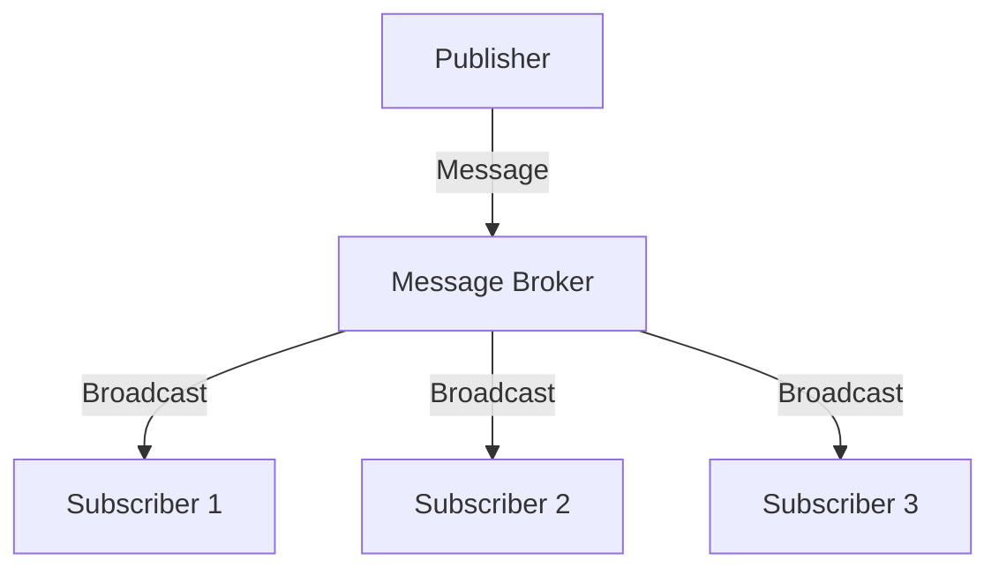

## 13.1 Introduction to Enterprise Integration Patterns

In the ever-evolving landscape of software development, integrating disparate systems within an enterprise is a complex challenge. Enterprise Integration Patterns (EIPs) provide a standardized approach to solving these integration problems, ensuring seamless communication and data exchange across heterogeneous systems. In this section, we will explore what EIPs are, their importance in modern software architecture, and how Ruby can be leveraged to implement these patterns effectively.

### What Are Enterprise Integration Patterns?

Enterprise Integration Patterns are a collection of design patterns that offer solutions to common problems encountered when integrating enterprise applications and services. These patterns provide a framework for designing robust, scalable, and maintainable integration solutions. EIPs address various aspects of integration, including message routing, transformation, and processing, enabling systems to communicate efficiently.

### Importance of EIPs in Software Architecture

EIPs are crucial in software architecture for several reasons:

1. **Standardization**: They provide a common language and set of practices for developers, making it easier to design and implement integration solutions.

2. **Scalability**: EIPs facilitate the development of scalable systems by promoting loose coupling and modular design.

3. **Maintainability**: By using well-defined patterns, integration solutions become easier to understand, maintain, and extend.

4. **Interoperability**: EIPs enable seamless communication between heterogeneous systems, regardless of their underlying technologies.

### Challenges of Integrating Heterogeneous Systems

Integrating diverse systems within an enterprise poses several challenges:

- **Data Format Differences**: Systems often use different data formats, requiring transformation and mapping to ensure compatibility.

- **Communication Protocols**: Different systems may use various communication protocols, necessitating protocol bridging.

- **Scalability and Performance**: Integration solutions must handle varying loads and ensure high performance.

- **Error Handling and Reliability**: Robust error handling and fault tolerance are essential to maintain system reliability.

### A Brief History of Enterprise Integration Patterns

The concept of Enterprise Integration Patterns was popularized by Gregor Hohpe and Bobby Woolf in their seminal book, "Enterprise Integration Patterns: Designing, Building, and Deploying Messaging Solutions." Published in 2003, the book introduced a catalog of patterns that address various integration challenges, drawing on real-world experiences and best practices.

### Relevance of EIPs in Modern Applications

With the rise of microservices and distributed systems, EIPs have become increasingly relevant. Modern applications often consist of numerous independent services that must communicate and collaborate effectively. EIPs provide the tools and techniques needed to design integration solutions that support these complex architectures.

### Implementing EIPs with Ruby

Ruby, known for its simplicity and elegance, is a powerful language for implementing Enterprise Integration Patterns. Its dynamic nature and rich ecosystem of libraries and frameworks make it an excellent choice for building integration solutions.

#### Key Tools and Frameworks in Ruby

Several tools and frameworks in Ruby facilitate enterprise integration:

- **Ruby on Rails**: While primarily a web application framework, Rails provides features like Active Job and Action Cable that can be used for integration tasks.

- **Sidekiq**: A background processing library that supports job queues, making it suitable for implementing asynchronous messaging patterns.

- **Resque**: Another background job processing library that integrates well with Redis, useful for message queuing.

- **RabbitMQ**: A message broker that can be used with Ruby to implement messaging patterns like Publish/Subscribe and Message Routing.

- **Kafka**: A distributed streaming platform that can be integrated with Ruby for handling high-throughput data streams.

### Visualizing Enterprise Integration Patterns

To better understand EIPs, let's visualize some common patterns using Hugo-compatible Mermaid.js diagrams.

#### Message Router Pattern



*Caption: The Message Router pattern directs messages to different services based on specific criteria.*

#### Publish/Subscribe Pattern



*Caption: The Publish/Subscribe pattern allows multiple subscribers to receive messages from a single publisher.*

### Ruby Code Example: Implementing a Simple Message Router

Let's implement a simple message router in Ruby using a hash to map message types to handlers.

```ruby
# Define message handlers
class ServiceA
  def handle(message)
    puts "Service A handling: #{message}"
  end
end

class ServiceB
  def handle(message)
    puts "Service B handling: #{message}"
  end
end

# Message Router
class MessageRouter
  def initialize
    @routes = {
      'type_a' => ServiceA.new,
      'type_b' => ServiceB.new
    }
  end

  def route(message_type, message)
    handler = @routes[message_type]
    handler.handle(message) if handler
  end
end

# Usage
router = MessageRouter.new
router.route('type_a', 'Hello from Type A')
router.route('type_b', 'Hello from Type B')
```

*Explanation: In this example, we define two services, `ServiceA` and `ServiceB`, each with a `handle` method. The `MessageRouter` class maps message types to these services and routes messages accordingly.*

### Try It Yourself

Experiment with the code by adding a new service and message type. Modify the `MessageRouter` to handle the new type and observe how the routing logic adapts.

### Key Takeaways

- **Enterprise Integration Patterns** provide a structured approach to solving integration challenges in software architecture.
- **Ruby** offers a flexible and powerful platform for implementing EIPs, with a rich ecosystem of tools and libraries.
- **Visualizing patterns** helps in understanding their structure and flow, making it easier to apply them in real-world scenarios.

### Further Reading

- [Enterprise Integration Patterns Book](https://www.enterpriseintegrationpatterns.com/)
- [Ruby on Rails Guides](https://guides.rubyonrails.org/)
- [RabbitMQ Documentation](https://www.rabbitmq.com/documentation.html)
- [Kafka Documentation](https://kafka.apache.org/documentation/)

## Quiz: Introduction to Enterprise Integration Patterns



### What are Enterprise Integration Patterns (EIPs)?

- [x] A collection of design patterns for integrating enterprise applications
- [ ] A set of coding standards for Ruby
- [ ] A type of database schema
- [ ] A framework for building web applications

> **Explanation:** EIPs are design patterns that provide solutions for integrating enterprise applications and services.

### Why are EIPs important in software architecture?

- [x] They provide standardization, scalability, and maintainability
- [ ] They increase the complexity of systems
- [ ] They are only relevant for small applications
- [ ] They replace the need for databases

> **Explanation:** EIPs offer standardization, scalability, and maintainability, making them crucial for robust software architecture.

### What is a common challenge in integrating heterogeneous systems?

- [x] Data format differences
- [ ] Lack of programming languages
- [ ] Excessive use of databases
- [ ] Over-reliance on a single protocol

> **Explanation:** Data format differences are a common challenge, requiring transformation and mapping for compatibility.

### Who popularized the concept of Enterprise Integration Patterns?

- [x] Gregor Hohpe and Bobby Woolf
- [ ] Martin Fowler
- [ ] Kent Beck
- [ ] Robert C. Martin

> **Explanation:** Gregor Hohpe and Bobby Woolf popularized EIPs in their book "Enterprise Integration Patterns."

### How can Ruby be used to implement EIPs?

- [x] By leveraging its dynamic nature and rich ecosystem of libraries
- [ ] By using only built-in Ruby methods
- [ ] By avoiding external libraries
- [ ] By focusing solely on web development

> **Explanation:** Ruby's dynamic nature and rich ecosystem of libraries make it suitable for implementing EIPs.

### What is the role of a Message Router in EIPs?

- [x] Directs messages to different services based on criteria
- [ ] Stores messages in a database
- [ ] Encrypts messages for security
- [ ] Deletes messages after processing

> **Explanation:** A Message Router directs messages to different services based on specific criteria.

### Which Ruby tool is suitable for implementing asynchronous messaging patterns?

- [x] Sidekiq
- [ ] RSpec
- [ ] Sinatra
- [ ] Capybara

> **Explanation:** Sidekiq is a background processing library suitable for asynchronous messaging patterns.

### What does the Publish/Subscribe pattern allow?

- [x] Multiple subscribers to receive messages from a single publisher
- [ ] Only one subscriber to receive messages
- [ ] Messages to be stored indefinitely
- [ ] Messages to be encrypted

> **Explanation:** The Publish/Subscribe pattern allows multiple subscribers to receive messages from a single publisher.

### What is a key benefit of using EIPs in microservices architecture?

- [x] They enable seamless communication between services
- [ ] They eliminate the need for databases
- [ ] They reduce the number of services needed
- [ ] They increase the complexity of the system

> **Explanation:** EIPs enable seamless communication between services, which is crucial in microservices architecture.

### True or False: EIPs are only relevant for legacy systems.

- [ ] True
- [x] False

> **Explanation:** EIPs are relevant for both legacy and modern systems, especially with the rise of microservices and distributed architectures.



Remember, mastering Enterprise Integration Patterns is a journey. As you continue to explore and implement these patterns, you'll gain deeper insights into building scalable and maintainable applications. Keep experimenting, stay curious, and enjoy the process!
