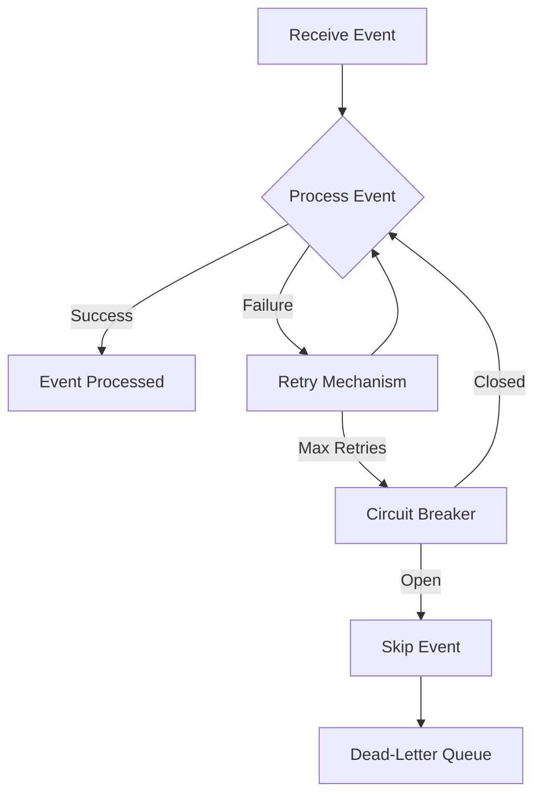

## 13.10 Resilient Event Processing

In the world of distributed systems and microservices, event-driven architectures have become a cornerstone for building scalable and responsive applications. However, with the benefits of such architectures come challenges, particularly in ensuring that event processing is resilient to failures. In this section, we will explore strategies for building resilient event processing systems in Ruby, focusing on techniques that handle failures gracefully and ensure reliable message processing.

### Importance of Resilience in Event-Driven Architectures

Resilience is the ability of a system to withstand and recover from failures. In event-driven architectures, where components communicate through events or messages, resilience is crucial. Failures can occur due to network issues, service downtimes, or unexpected errors in message processing. Without resilience, these failures can lead to data loss, inconsistent states, and degraded user experiences.

#### Key Concepts of Resilient Event Processing

1. **Retry Mechanisms**: Automatically retrying failed operations to handle transient errors.
2. **Circuit Breakers**: Preventing cascading failures by temporarily halting requests to a failing service.
3. **Dead-Letter Queues**: Capturing messages that cannot be processed successfully after multiple attempts.
4. **Idempotency**: Ensuring that repeated processing of the same message does not lead to unintended side effects.
5. **At-Least-Once Delivery**: Guaranteeing that each message is processed at least once, even in the face of failures.

### Techniques for Building Resilient Systems

#### Retry Mechanisms

Retry mechanisms are essential for handling transient errors, such as temporary network failures or service unavailability. In Ruby, we can implement retry logic using libraries like `retryable` or by manually coding retry loops.

**Example: Implementing a Retry Mechanism**

```ruby
require 'retryable'

Retryable.retryable(tries: 3, on: [Net::ReadTimeout, Net::OpenTimeout]) do
  # Attempt to process the event
  process_event(event)
end

def process_event(event)
  # Simulate event processing
  puts "Processing event: #{event}"
  # Raise an error to simulate a transient failure
  raise Net::ReadTimeout if rand > 0.7
end
```

In this example, the `Retryable.retryable` block will attempt to process the event up to three times if a `Net::ReadTimeout` or `Net::OpenTimeout` occurs.

#### Circuit Breakers

Circuit breakers are a pattern used to prevent a system from repeatedly trying to execute an operation that is likely to fail. This helps in avoiding cascading failures and allows the system to recover gracefully.

**Example: Using a Circuit Breaker**

```ruby
require 'circuit_breaker'

breaker = CircuitBreaker.new(timeout: 5, threshold: 3)

begin
  breaker.run do
    # Attempt to process the event
    process_event(event)
  end
rescue CircuitBreaker::OpenCircuitError
  puts "Circuit is open. Skipping event processing."
end
```

In this example, the circuit breaker will open if the operation fails three times consecutively, preventing further attempts for a specified timeout period.

#### Dead-Letter Queues

Dead-letter queues (DLQs) are used to capture messages that cannot be processed successfully after multiple attempts. This allows for manual inspection and handling of problematic messages.

**Example: Implementing a Dead-Letter Queue**

```ruby
require 'aws-sdk-sqs'

sqs = Aws::SQS::Client.new(region: 'us-east-1')

def process_event(event)
  # Simulate event processing
  puts "Processing event: #{event}"
  # Raise an error to simulate a failure
  raise StandardError if rand > 0.8
end

def handle_event(event)
  retries = 0
  begin
    process_event(event)
  rescue StandardError => e
    retries += 1
    if retries < 3
      retry
    else
      send_to_dead_letter_queue(event)
    end
  end
end

def send_to_dead_letter_queue(event)
  sqs.send_message(queue_url: 'https://sqs.us-east-1.amazonaws.com/123456789012/dead-letter-queue', message_body: event.to_json)
  puts "Event sent to dead-letter queue: #{event}"
end
```

In this example, if an event fails to process after three attempts, it is sent to a dead-letter queue for further investigation.

#### Idempotency and At-Least-Once Delivery

Idempotency ensures that processing the same message multiple times does not lead to unintended side effects. This is crucial in systems that guarantee at-least-once delivery, where a message may be delivered more than once.

**Example: Ensuring Idempotency**

```ruby
require 'digest'

processed_events = {}

def process_event(event)
  event_id = Digest::SHA256.hexdigest(event.to_json)
  return if processed_events.key?(event_id)

  # Simulate event processing
  puts "Processing event: #{event}"
  processed_events[event_id] = true
end
```

In this example, we use a hash to track processed events by their unique identifiers, ensuring that each event is processed only once.

### Monitoring and Alerting Practices

Monitoring and alerting are critical components of resilient event processing systems. They help detect failures and anomalies, allowing for timely intervention.

#### Key Monitoring Metrics

1. **Event Processing Latency**: Time taken to process an event.
2. **Error Rates**: Frequency of errors during event processing.
3. **Queue Depth**: Number of messages in the queue waiting to be processed.

**Example: Monitoring with Prometheus**

```yaml
# prometheus.yml
scrape_configs:
  - job_name: 'event_processor'
    static_configs:
      - targets: ['localhost:9090']
```

In this example, Prometheus is configured to scrape metrics from an event processor running on `localhost`.

### Best Practices for Designing Fault-Tolerant Systems

1. **Design for Failure**: Assume that failures will occur and plan accordingly.
2. **Implement Backoff Strategies**: Use exponential backoff for retry mechanisms to avoid overwhelming services.
3. **Use Timeouts and Circuit Breakers**: Prevent long-running operations and cascading failures.
4. **Ensure Idempotency**: Design operations to be idempotent to handle retries gracefully.
5. **Monitor and Alert**: Continuously monitor system health and set up alerts for anomalies.

### Visualizing Resilient Event Processing

Below is a diagram illustrating the flow of resilient event processing, including retry mechanisms, circuit breakers, and dead-letter queues.



### Conclusion

Building resilient event processing systems in Ruby involves implementing strategies that handle failures gracefully and ensure reliable message processing. By using retry mechanisms, circuit breakers, dead-letter queues, and ensuring idempotency, we can design systems that are fault-tolerant and capable of recovering from failures. Monitoring and alerting further enhance resilience by providing insights into system health and enabling timely interventions.

Remember, resilience is not a one-time effort but an ongoing process of monitoring, learning, and adapting to new challenges. Keep experimenting, stay curious, and enjoy the journey of building robust and scalable event-driven systems in Ruby!

## Quiz: Resilient Event Processing



### What is the primary purpose of retry mechanisms in event processing?

- [x] To handle transient errors by retrying failed operations
- [ ] To permanently stop processing events after a failure
- [ ] To increase the speed of event processing
- [ ] To decrease the number of processed events

> **Explanation:** Retry mechanisms are used to handle transient errors by retrying failed operations, increasing the chances of successful processing.

### How does a circuit breaker help in resilient event processing?

- [x] By preventing cascading failures and allowing the system to recover
- [ ] By increasing the number of retries for failed operations
- [ ] By permanently stopping all event processing
- [ ] By decreasing the latency of event processing

> **Explanation:** A circuit breaker prevents cascading failures by temporarily halting requests to a failing service, allowing the system to recover.

### What is the role of a dead-letter queue?

- [x] To capture messages that cannot be processed successfully after multiple attempts
- [ ] To permanently delete failed messages
- [ ] To increase the speed of message processing
- [ ] To decrease the number of processed messages

> **Explanation:** A dead-letter queue captures messages that cannot be processed successfully after multiple attempts, allowing for manual inspection and handling.

### Why is idempotency important in event processing?

- [x] To ensure that repeated processing of the same message does not lead to unintended side effects
- [ ] To increase the speed of event processing
- [ ] To decrease the number of processed events
- [ ] To permanently stop processing events after a failure

> **Explanation:** Idempotency ensures that repeated processing of the same message does not lead to unintended side effects, which is crucial in systems with at-least-once delivery semantics.

### What is at-least-once delivery?

- [x] Guaranteeing that each message is processed at least once, even in the face of failures
- [ ] Ensuring that each message is processed exactly once
- [ ] Guaranteeing that each message is processed at most once
- [ ] Ensuring that no messages are processed

> **Explanation:** At-least-once delivery guarantees that each message is processed at least once, even in the face of failures, which may result in duplicate processing.

### Which of the following is a key monitoring metric for event processing systems?

- [x] Event Processing Latency
- [ ] Number of retries
- [ ] Number of processed events
- [ ] Number of failed events

> **Explanation:** Event Processing Latency is a key monitoring metric that measures the time taken to process an event, providing insights into system performance.

### What is the purpose of exponential backoff in retry mechanisms?

- [x] To avoid overwhelming services by gradually increasing the wait time between retries
- [ ] To permanently stop retries after a failure
- [ ] To decrease the wait time between retries
- [ ] To increase the speed of retries

> **Explanation:** Exponential backoff gradually increases the wait time between retries to avoid overwhelming services and improve the chances of successful processing.

### How can monitoring and alerting enhance resilience in event processing systems?

- [x] By providing insights into system health and enabling timely interventions
- [ ] By permanently stopping event processing after a failure
- [ ] By increasing the speed of event processing
- [ ] By decreasing the number of processed events

> **Explanation:** Monitoring and alerting provide insights into system health and enable timely interventions, enhancing resilience in event processing systems.

### What is a common practice to ensure fault tolerance in event processing systems?

- [x] Design for failure and implement backoff strategies
- [ ] Permanently stop processing events after a failure
- [ ] Increase the speed of event processing
- [ ] Decrease the number of processed events

> **Explanation:** Designing for failure and implementing backoff strategies are common practices to ensure fault tolerance in event processing systems.

### True or False: Resilience in event processing is a one-time effort.

- [ ] True
- [x] False

> **Explanation:** Resilience is not a one-time effort but an ongoing process of monitoring, learning, and adapting to new challenges.


