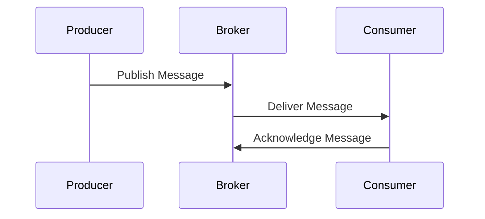

## 13.2 Messaging Systems and Message Brokers

In the realm of enterprise integration, messaging systems and message brokers play a pivotal role in enabling asynchronous communication between disparate components of a system. This section delves into the intricacies of messaging systems, defines message brokers, and explores their functionality and benefits. We will also provide practical examples of interfacing with popular message brokers using Ruby, along with best practices for designing message-based communication.

### Understanding Messaging Systems

Messaging systems are a cornerstone of modern distributed architectures, facilitating communication between different parts of a system without requiring them to be directly connected or aware of each other's existence. This decoupling is achieved through the use of messages, which are discrete units of data that can be sent from one component to another.

#### Key Concepts

- **Asynchronous Communication**: Messaging systems allow components to communicate without waiting for a response, enabling them to continue processing other tasks.
- **Decoupling**: By using messages, components can operate independently, reducing dependencies and increasing flexibility.
- **Scalability**: Messaging systems can handle large volumes of messages, making them suitable for high-traffic applications.

### What Are Message Brokers?

Message brokers are software intermediaries that facilitate the exchange of messages between components. They provide a robust infrastructure for message queuing, routing, and delivery, ensuring that messages are reliably transmitted even in the face of network failures or component downtime.

#### Functionality of Message Brokers

- **Message Queuing**: Brokers store messages in queues until they can be processed by the receiving component.
- **Routing**: Brokers can route messages to the appropriate destination based on predefined rules or patterns.
- **Delivery Guarantees**: Brokers ensure that messages are delivered at least once, exactly once, or at most once, depending on the configuration.

### Benefits of Asynchronous Messaging

Asynchronous messaging offers several advantages that make it an attractive choice for enterprise integration:

- **Improved Performance**: By decoupling components, systems can handle more requests simultaneously, improving overall throughput.
- **Fault Tolerance**: If a component fails, messages can be stored and processed once the component is back online, ensuring no data is lost.
- **Flexibility**: New components can be added or removed without affecting the rest of the system, allowing for easier scaling and maintenance.

### Popular Message Brokers

Several message brokers are widely used in the industry, each with its own strengths and use cases. Let's explore some of the most popular ones:

#### RabbitMQ

[RabbitMQ](https://www.rabbitmq.com/) is a widely-used open-source message broker that implements the Advanced Message Queuing Protocol (AMQP). It is known for its reliability, ease of use, and extensive plugin system.

#### Apache Kafka

[Apache Kafka](https://kafka.apache.org/) is a distributed event streaming platform designed for high-throughput, fault-tolerant messaging. It is particularly well-suited for real-time data processing and analytics.

#### Redis

[Redis](https://redis.io/) is an in-memory data structure store that can also function as a message broker. It is known for its speed and simplicity, making it a popular choice for applications that require fast message delivery.

### Interfacing with Message Brokers Using Ruby

Ruby provides several libraries for interfacing with message brokers, allowing developers to easily integrate messaging systems into their applications. Let's explore how to use some of these libraries with popular message brokers.

#### RabbitMQ with the `bunny` Gem

The `bunny` gem is a popular Ruby client for RabbitMQ, providing a simple and intuitive API for publishing and consuming messages.

```ruby
# Install the bunny gem
# gem install bunny

require 'bunny'

# Establish a connection to RabbitMQ
connection = Bunny.new
connection.start

# Create a channel
channel = connection.create_channel

# Declare a queue
queue = channel.queue('hello')

# Publish a message to the queue
channel.default_exchange.publish('Hello, World!', routing_key: queue.name)
puts " [x] Sent 'Hello, World!'"

# Close the connection
connection.close
```

In this example, we establish a connection to RabbitMQ, create a channel, declare a queue, and publish a message to the queue. The message is then consumed by a separate process or component.

#### Apache Kafka with the `ruby-kafka` Gem

The `ruby-kafka` gem is a robust client for Apache Kafka, providing a comprehensive API for producing and consuming messages.

```ruby
# Install the ruby-kafka gem
# gem install ruby-kafka

require 'kafka'

# Create a Kafka client
kafka = Kafka.new(seed_brokers: ['kafka://localhost:9092'])

# Produce a message to a topic
kafka.deliver_message('Hello, Kafka!', topic: 'greetings')

# Consume messages from a topic
kafka.each_message(topic: 'greetings') do |message|
  puts "Received message: #{message.value}"
end
```

This example demonstrates how to produce and consume messages using Kafka. We create a Kafka client, deliver a message to a topic, and consume messages from the same topic.

#### Redis with the `redis` Gem

The `redis` gem provides a simple interface for interacting with Redis, including its messaging capabilities.

```ruby
# Install the redis gem
# gem install redis

require 'redis'

# Create a Redis client
redis = Redis.new

# Publish a message to a channel
redis.publish('chat', 'Hello, Redis!')

# Subscribe to a channel and consume messages
redis.subscribe('chat') do |on|
  on.message do |channel, message|
    puts "Received message: #{message} from channel: #{channel}"
  end
end
```

In this example, we use Redis to publish and subscribe to messages on a channel. The `subscribe` method listens for messages and processes them as they arrive.

### Best Practices for Designing Message-Based Communication

When designing message-based communication systems, it's important to follow best practices to ensure reliability, scalability, and maintainability.

#### Use Idempotent Consumers

Ensure that message consumers are idempotent, meaning they can process the same message multiple times without adverse effects. This is crucial for handling duplicate messages and ensuring data consistency.

#### Implement Dead Letter Queues

Use dead letter queues to handle messages that cannot be processed successfully. This allows you to isolate problematic messages and investigate issues without disrupting the entire system.

#### Monitor and Log Message Traffic

Implement monitoring and logging to track message traffic and identify potential bottlenecks or failures. This can help you proactively address issues and optimize system performance.

#### Design for Scalability

Design your messaging system to scale horizontally by adding more consumers or brokers as needed. This ensures that your system can handle increased load without degradation in performance.

### Try It Yourself

To deepen your understanding of messaging systems and message brokers, try modifying the code examples provided. Experiment with different message brokers, queues, and topics to see how they affect message delivery and processing. Consider implementing additional features such as message filtering or priority queues.

### Visualizing Messaging Systems

Let's visualize a simple messaging system using a message broker to facilitate communication between two components.



In this diagram, the producer publishes a message to the broker, which then delivers it to the consumer. The consumer acknowledges receipt of the message, completing the communication cycle.

### References and Links

- [RabbitMQ Documentation](https://www.rabbitmq.com/documentation.html)
- [Apache Kafka Documentation](https://kafka.apache.org/documentation/)
- [Redis Documentation](https://redis.io/documentation)
- [Bunny Gem](https://rubygems.org/gems/bunny)
- [Ruby-Kafka Gem](https://rubygems.org/gems/ruby-kafka)
- [Redis Gem](https://rubygems.org/gems/redis)

### Knowledge Check

- What are the key benefits of using messaging systems in enterprise integration?
- How do message brokers facilitate asynchronous communication?
- What are some popular message brokers, and what are their strengths?
- How can you interface with RabbitMQ, Kafka, and Redis using Ruby?
- What are some best practices for designing message-based communication systems?

### Embrace the Journey

Remember, mastering messaging systems and message brokers is a journey. As you progress, you'll build more complex and scalable applications. Keep experimenting, stay curious, and enjoy the process!

## Quiz: Messaging Systems and Message Brokers



### What is the primary role of a message broker in a messaging system?

- [x] Facilitate the exchange of messages between components
- [ ] Store data persistently
- [ ] Execute business logic
- [ ] Manage user authentication

> **Explanation:** A message broker acts as an intermediary to facilitate the exchange of messages between different components of a system.

### Which of the following is a benefit of asynchronous messaging?

- [x] Improved performance
- [ ] Increased coupling
- [ ] Reduced scalability
- [ ] Synchronous communication

> **Explanation:** Asynchronous messaging improves performance by allowing components to communicate without waiting for a response, enabling them to handle more requests simultaneously.

### Which Ruby gem is commonly used to interface with RabbitMQ?

- [x] bunny
- [ ] ruby-kafka
- [ ] redis
- [ ] sidekiq

> **Explanation:** The `bunny` gem is a popular Ruby client for RabbitMQ, providing an API for publishing and consuming messages.

### What is a dead letter queue used for?

- [x] Handling messages that cannot be processed successfully
- [ ] Storing all processed messages
- [ ] Delivering messages to multiple consumers
- [ ] Encrypting messages

> **Explanation:** A dead letter queue is used to handle messages that cannot be processed successfully, allowing for isolation and investigation of problematic messages.

### Which message broker is known for its high-throughput and fault-tolerant messaging?

- [x] Apache Kafka
- [ ] RabbitMQ
- [ ] Redis
- [ ] ActiveMQ

> **Explanation:** Apache Kafka is designed for high-throughput, fault-tolerant messaging, making it suitable for real-time data processing and analytics.

### What is the purpose of message routing in a message broker?

- [x] Directing messages to the appropriate destination
- [ ] Encrypting messages
- [ ] Storing messages persistently
- [ ] Executing business logic

> **Explanation:** Message routing involves directing messages to the appropriate destination based on predefined rules or patterns.

### How can you ensure that a message consumer is idempotent?

- [x] Design it to process the same message multiple times without adverse effects
- [ ] Ensure it processes each message only once
- [ ] Use synchronous communication
- [ ] Store messages persistently

> **Explanation:** An idempotent consumer can process the same message multiple times without adverse effects, ensuring data consistency even in the presence of duplicate messages.

### What is the primary advantage of decoupling components in a messaging system?

- [x] Increased flexibility and maintainability
- [ ] Reduced performance
- [ ] Increased dependencies
- [ ] Synchronous communication

> **Explanation:** Decoupling components increases flexibility and maintainability by allowing them to operate independently, reducing dependencies.

### Which of the following is a common use case for Redis as a message broker?

- [x] Fast message delivery
- [ ] High-throughput event streaming
- [ ] Complex message routing
- [ ] Persistent data storage

> **Explanation:** Redis is known for its speed and simplicity, making it a popular choice for applications that require fast message delivery.

### True or False: Message brokers can only deliver messages synchronously.

- [ ] True
- [x] False

> **Explanation:** Message brokers primarily facilitate asynchronous communication, allowing components to communicate without waiting for a response.




