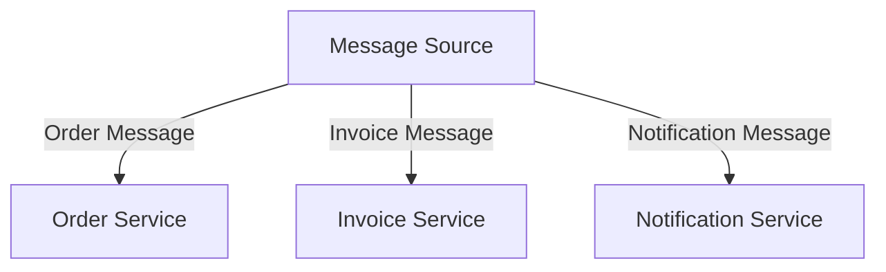

## 13.3 Message Routing Patterns

In the world of enterprise integration, message routing patterns play a crucial role in ensuring that messages are delivered to the correct destination. These patterns help in directing messages from senders to receivers based on specific criteria, making sure that the communication between different systems is efficient and reliable. In this section, we will delve into various message routing patterns, their implementation in Ruby, and how they can be leveraged using RabbitMQ.

### The Need for Message Routing

In a distributed system, different components need to communicate with each other to perform various tasks. This communication often involves sending messages between components. However, not all messages are meant for all components. Message routing patterns help in determining the path a message should take to reach its intended recipient. This is especially important in scenarios where:

- **Multiple Consumers**: There are multiple consumers, and each message is relevant to only a subset of them.
- **Dynamic Routing**: The destination of a message may change based on its content or other criteria.
- **Load Balancing**: Messages need to be distributed evenly across multiple instances of a service.

### Key Message Routing Patterns

Let's explore some of the key message routing patterns and how they can be implemented in Ruby.

#### Content-Based Router

**Intent**: Direct messages to different destinations based on the content of the message.

**Applicability**: Use this pattern when messages need to be routed to different consumers based on their content.

**Implementation in Ruby**:

```ruby
class ContentBasedRouter
  def initialize(routes)
    @routes = routes
  end

  def route(message)
    @routes.each do |condition, destination|
      if condition.call(message)
        destination.receive(message)
        break
      end
    end
  end
end

# Example usage
routes = {
  ->(msg) { msg[:type] == 'order' } => OrderService.new,
  ->(msg) { msg[:type] == 'invoice' } => InvoiceService.new
}

router = ContentBasedRouter.new(routes)
router.route({ type: 'order', content: 'Order details' })
```

**Design Considerations**: Ensure that the conditions are mutually exclusive to avoid routing a message to multiple destinations unintentionally.

#### Message Filter

**Intent**: Remove unwanted messages from a message stream.

**Applicability**: Use this pattern when you need to filter out messages that are not relevant to the consumer.

**Implementation in Ruby**:

```ruby
class MessageFilter
  def initialize(criteria)
    @criteria = criteria
  end

  def filter(messages)
    messages.select { |message| @criteria.call(message) }
  end
end

# Example usage
criteria = ->(msg) { msg[:priority] == 'high' }
filter = MessageFilter.new(criteria)
filtered_messages = filter.filter([{ priority: 'high', content: 'Urgent task' }, { priority: 'low', content: 'Routine task' }])
```

**Design Considerations**: Be cautious of performance implications when filtering large streams of messages.

#### Dynamic Router

**Intent**: Route messages to different destinations based on dynamic conditions.

**Applicability**: Use this pattern when the routing logic needs to change at runtime.

**Implementation in Ruby**:

```ruby
class DynamicRouter
  def initialize
    @routes = {}
  end

  def add_route(condition, destination)
    @routes[condition] = destination
  end

  def route(message)
    @routes.each do |condition, destination|
      if condition.call(message)
        destination.receive(message)
        break
      end
    end
  end
end

# Example usage
router = DynamicRouter.new
router.add_route(->(msg) { msg[:type] == 'notification' }, NotificationService.new)
router.route({ type: 'notification', content: 'New message' })
```

**Design Considerations**: Ensure that the routing logic is efficient and does not introduce significant latency.

### Using RabbitMQ for Message Routing

RabbitMQ is a powerful message broker that supports various exchange types to facilitate message routing. Let's explore how these exchange types can be used for implementing message routing patterns.

#### Direct Exchange

**Description**: Routes messages with a specific routing key to the queues that are bound with the same key.

**Example**:

```ruby
require 'bunny'

connection = Bunny.new
connection.start

channel = connection.create_channel
exchange = channel.direct('direct_logs')

queue = channel.queue('order_queue')
queue.bind(exchange, routing_key: 'order')

exchange.publish('Order message', routing_key: 'order')

connection.close
```

**Use Case**: Use direct exchange when you need to route messages to specific queues based on a routing key.

#### Topic Exchange

**Description**: Routes messages to one or many queues based on matching between a message routing key and the pattern that was used to bind a queue.

**Example**:

```ruby
require 'bunny'

connection = Bunny.new
connection.start

channel = connection.create_channel
exchange = channel.topic('topic_logs')

queue = channel.queue('order_queue')
queue.bind(exchange, routing_key: 'order.*')

exchange.publish('Order created', routing_key: 'order.created')

connection.close
```

**Use Case**: Use topic exchange when you need to route messages based on a pattern matching.

#### Fanout Exchange

**Description**: Routes messages to all the queues that are bound to it.

**Example**:

```ruby
require 'bunny'

connection = Bunny.new
connection.start

channel = connection.create_channel
exchange = channel.fanout('fanout_logs')

queue = channel.queue('all_logs')
queue.bind(exchange)

exchange.publish('Broadcast message')

connection.close
```

**Use Case**: Use fanout exchange when you need to broadcast messages to all queues.

### Scenarios and Considerations

- **Content-Based Router**: Best used when message content dictates the destination. Be mindful of the complexity of conditions and ensure they are efficient.
- **Message Filter**: Ideal for reducing noise in message streams. Consider the performance impact on large datasets.
- **Dynamic Router**: Useful when routing logic needs to adapt to changing conditions. Ensure that the dynamic nature does not introduce latency.

### Performance and Complexity

When implementing message routing patterns, consider the following:

- **Performance**: Ensure that routing logic is efficient and does not become a bottleneck.
- **Scalability**: Design routing logic to handle increased message loads gracefully.
- **Complexity**: Keep routing logic simple and maintainable to avoid introducing errors.

### Try It Yourself

Experiment with the code examples provided. Try modifying the routing conditions or adding new routes to see how the system behaves. This hands-on approach will help solidify your understanding of message routing patterns.

### Visualizing Message Routing

Below is a diagram illustrating how a content-based router directs messages to different services based on message content.



### Summary

Message routing patterns are essential for directing messages to the appropriate destinations in a distributed system. By understanding and implementing patterns like Content-Based Router, Message Filter, and Dynamic Router, you can ensure efficient and reliable communication between system components. RabbitMQ provides powerful exchange types that can be leveraged to implement these patterns effectively.

## Quiz: Message Routing Patterns



### What is the primary purpose of message routing patterns?

- [x] To direct messages to the appropriate destination
- [ ] To encrypt messages for security
- [ ] To compress messages for efficiency
- [ ] To store messages for later retrieval

> **Explanation:** Message routing patterns are used to direct messages to the appropriate destination based on specific criteria.

### Which pattern would you use to route messages based on their content?

- [x] Content-Based Router
- [ ] Message Filter
- [ ] Dynamic Router
- [ ] Fanout Exchange

> **Explanation:** The Content-Based Router pattern directs messages to different destinations based on the content of the message.

### What is a key consideration when using a Message Filter?

- [x] Performance implications on large streams
- [ ] Ensuring messages are encrypted
- [ ] Compressing messages for storage
- [ ] Ensuring messages are logged

> **Explanation:** When using a Message Filter, it's important to consider the performance implications on large streams of messages.

### How does a Direct Exchange in RabbitMQ route messages?

- [x] Based on a specific routing key
- [ ] Based on message content
- [ ] By broadcasting to all queues
- [ ] By pattern matching

> **Explanation:** A Direct Exchange routes messages to queues that are bound with a specific routing key.

### Which exchange type would you use for broadcasting messages to all queues?

- [x] Fanout Exchange
- [ ] Direct Exchange
- [ ] Topic Exchange
- [ ] Content-Based Router

> **Explanation:** A Fanout Exchange routes messages to all the queues that are bound to it.

### What is a Dynamic Router used for?

- [x] Routing messages based on dynamic conditions
- [ ] Filtering messages based on priority
- [ ] Encrypting messages for security
- [ ] Compressing messages for efficiency

> **Explanation:** A Dynamic Router routes messages to different destinations based on dynamic conditions that can change at runtime.

### Which pattern is best for reducing noise in message streams?

- [x] Message Filter
- [ ] Content-Based Router
- [ ] Dynamic Router
- [ ] Fanout Exchange

> **Explanation:** A Message Filter is used to remove unwanted messages from a message stream, reducing noise.

### What should be considered when designing routing logic?

- [x] Efficiency and maintainability
- [ ] Encryption and compression
- [ ] Storage and retrieval
- [ ] Logging and monitoring

> **Explanation:** When designing routing logic, it's important to ensure that it is efficient and maintainable.

### What is the role of a Topic Exchange in RabbitMQ?

- [x] Routing messages based on pattern matching
- [ ] Routing messages based on a specific key
- [ ] Broadcasting messages to all queues
- [ ] Filtering messages based on content

> **Explanation:** A Topic Exchange routes messages to one or many queues based on matching between a message routing key and the pattern that was used to bind a queue.

### True or False: A Content-Based Router can route a message to multiple destinations.

- [x] True
- [ ] False

> **Explanation:** A Content-Based Router can route a message to multiple destinations if the conditions are not mutually exclusive.



Remember, mastering message routing patterns is a journey. Keep experimenting, stay curious, and enjoy the process of building scalable and maintainable applications with Ruby!

---
