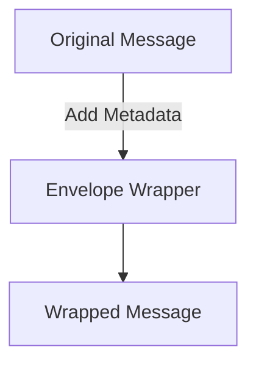
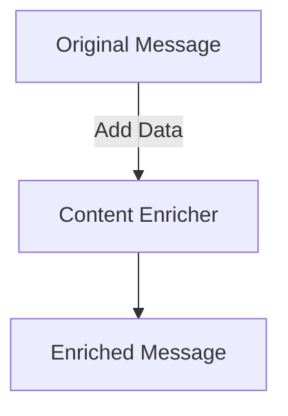
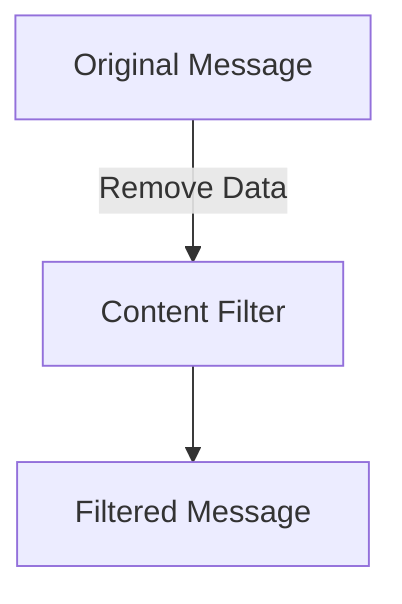
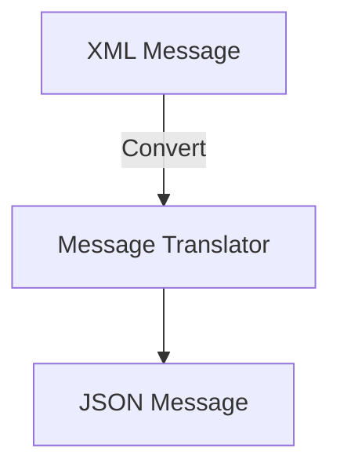
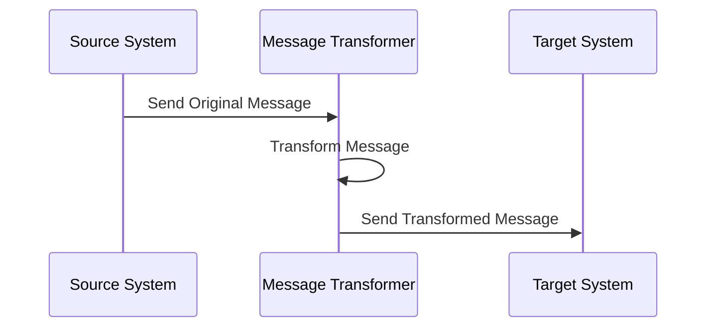

## 13.4 Message Transformation Patterns

In the realm of enterprise integration, message transformation patterns play a crucial role in ensuring that messages exchanged between disparate systems are compatible and meaningful. As businesses grow and integrate with various platforms, the need to transform messages to fit different system requirements becomes paramount. This section delves into the necessity of message transformation, explores key patterns, and demonstrates how to implement these transformations in Ruby.

### Why Message Transformation is Necessary

In a typical enterprise environment, systems often communicate using different data formats and structures. For instance, one system might use XML while another uses JSON. Without transformation, these systems would be unable to understand each other, leading to integration failures. Message transformation ensures that data is converted into a format that is compatible with the receiving system, maintaining data integrity and facilitating smooth communication.

### Key Message Transformation Patterns

Let's explore some of the most common message transformation patterns: Envelope Wrapper, Content Enricher, Content Filter, and Message Translator.

#### Envelope Wrapper

**Intent**: The Envelope Wrapper pattern involves adding metadata or additional information to a message without altering its core content. This is useful for routing or processing messages in a specific way.

**Example in Ruby**:
```ruby
class EnvelopeWrapper
  def wrap(message, metadata)
    { envelope: { metadata: metadata, content: message } }
  end
end

# Usage
wrapper = EnvelopeWrapper.new
message = { data: "Important data" }
metadata = { timestamp: Time.now, sender: "System A" }
wrapped_message = wrapper.wrap(message, metadata)
puts wrapped_message
```

**Diagram**:


#### Content Enricher

**Intent**: The Content Enricher pattern adds additional data to a message from an external source, enhancing its value and completeness.

**Example in Ruby**:
```ruby
class ContentEnricher
  def enrich(message, additional_data)
    message.merge(additional_data)
  end
end

# Usage
enricher = ContentEnricher.new
message = { user_id: 123 }
additional_data = { user_name: "John Doe", email: "john.doe@example.com" }
enriched_message = enricher.enrich(message, additional_data)
puts enriched_message
```

**Diagram**:


#### Content Filter

**Intent**: The Content Filter pattern removes unnecessary or sensitive information from a message before it is sent to the next system.

**Example in Ruby**:
```ruby
class ContentFilter
  def filter(message, keys_to_remove)
    message.reject { |key, _| keys_to_remove.include?(key) }
  end
end

# Usage
filter = ContentFilter.new
message = { user_id: 123, password: "secret", email: "john.doe@example.com" }
filtered_message = filter.filter(message, [:password])
puts filtered_message
```

**Diagram**:


#### Message Translator

**Intent**: The Message Translator pattern converts a message from one format to another, such as from XML to JSON.

**Example in Ruby**:
```ruby
require 'json'
require 'nokogiri'

class MessageTranslator
  def xml_to_json(xml_message)
    doc = Nokogiri::XML(xml_message)
    Hash.from_xml(doc.to_s).to_json
  end
end

# Usage
translator = MessageTranslator.new
xml_message = "<user><id>123</id><name>John Doe</name></user>"
json_message = translator.xml_to_json(xml_message)
puts json_message
```

**Diagram**:


### Implementing Transformations in Ruby

Ruby offers several libraries and gems that facilitate message transformation, particularly for JSON transformations. Two popular gems are `jbuilder` and `active_model_serializers`.

#### Using `jbuilder` for JSON Transformations

`jbuilder` is a gem that provides a simple way to create JSON structures in Ruby.

**Example**:
```ruby
# Gemfile
gem 'jbuilder'

# Usage
require 'jbuilder'

json = Jbuilder.encode do |json|
  json.user do
    json.id 123
    json.name "John Doe"
  end
end

puts json
```

#### Using `active_model_serializers` for JSON Transformations

`active_model_serializers` is another powerful gem for serializing Ruby objects into JSON.

**Example**:
```ruby
# Gemfile
gem 'active_model_serializers'

# Usage
class UserSerializer < ActiveModel::Serializer
  attributes :id, :name, :email
end

user = User.new(id: 123, name: "John Doe", email: "john.doe@example.com")
serializer = UserSerializer.new(user)
puts serializer.to_json
```

### Maintaining Data Integrity During Transformations

When transforming messages, it's crucial to maintain data integrity to ensure that the information remains accurate and reliable. This involves validating data before and after transformation, handling errors gracefully, and ensuring that no data is lost or corrupted during the process.

### Handling Format Conversions

In enterprise integration, it's common to convert between different data formats such as XML, JSON, and YAML. Ruby provides several libraries to facilitate these conversions.

**Example of XML to JSON Conversion**:
```ruby
require 'json'
require 'nokogiri'

xml_message = "<user><id>123</id><name>John Doe</name></user>"
doc = Nokogiri::XML(xml_message)
json_message = Hash.from_xml(doc.to_s).to_json
puts json_message
```

**Example of JSON to YAML Conversion**:
```ruby
require 'json'
require 'yaml'

json_message = '{"id":123,"name":"John Doe"}'
hash = JSON.parse(json_message)
yaml_message = hash.to_yaml
puts yaml_message
```

### Try It Yourself

Experiment with the code examples provided by modifying the data structures or adding new fields. Try converting between different formats and observe how the transformations affect the data. This hands-on approach will deepen your understanding of message transformation patterns.

### Visualizing Message Transformation

To better understand how message transformation patterns work, let's visualize the process using a sequence diagram.

**Sequence Diagram**:


### Key Takeaways

- Message transformation patterns are essential for ensuring compatibility between different systems in an enterprise environment.
- Patterns like Envelope Wrapper, Content Enricher, Content Filter, and Message Translator provide structured approaches to modifying messages.
- Ruby offers powerful tools and libraries for implementing these transformations, such as `jbuilder` and `active_model_serializers`.
- Maintaining data integrity and handling format conversions are critical aspects of message transformation.

### Embrace the Journey

Remember, mastering message transformation patterns is just one step in building scalable and maintainable applications. As you continue to explore Ruby design patterns, you'll gain the skills needed to tackle complex integration challenges. Keep experimenting, stay curious, and enjoy the journey!

## Quiz: Message Transformation Patterns



### What is the primary purpose of message transformation patterns?

- [x] To ensure compatibility between different systems
- [ ] To increase message size
- [ ] To encrypt messages
- [ ] To reduce network latency

> **Explanation:** Message transformation patterns modify messages to fit the requirements of different systems, ensuring compatibility and smooth integration.

### Which pattern involves adding metadata to a message?

- [x] Envelope Wrapper
- [ ] Content Enricher
- [ ] Content Filter
- [ ] Message Translator

> **Explanation:** The Envelope Wrapper pattern involves adding metadata or additional information to a message without altering its core content.

### What does the Content Enricher pattern do?

- [x] Adds additional data to a message
- [ ] Removes unnecessary data from a message
- [ ] Converts a message format
- [ ] Encrypts a message

> **Explanation:** The Content Enricher pattern adds additional data to a message from an external source, enhancing its value and completeness.

### Which Ruby gem is used for creating JSON structures?

- [x] jbuilder
- [ ] nokogiri
- [ ] devise
- [ ] pundit

> **Explanation:** `jbuilder` is a gem that provides a simple way to create JSON structures in Ruby.

### What is the role of the Message Translator pattern?

- [x] Converts a message from one format to another
- [ ] Adds metadata to a message
- [ ] Filters out sensitive information
- [ ] Encrypts a message

> **Explanation:** The Message Translator pattern converts a message from one format to another, such as from XML to JSON.

### How can data integrity be maintained during transformations?

- [x] By validating data before and after transformation
- [ ] By ignoring errors
- [ ] By reducing message size
- [ ] By encrypting messages

> **Explanation:** Maintaining data integrity involves validating data before and after transformation, handling errors gracefully, and ensuring no data is lost or corrupted.

### Which pattern removes unnecessary information from a message?

- [x] Content Filter
- [ ] Envelope Wrapper
- [ ] Content Enricher
- [ ] Message Translator

> **Explanation:** The Content Filter pattern removes unnecessary or sensitive information from a message before it is sent to the next system.

### What is a common use case for the Envelope Wrapper pattern?

- [x] Adding routing information to a message
- [ ] Converting message formats
- [ ] Filtering sensitive data
- [ ] Encrypting messages

> **Explanation:** The Envelope Wrapper pattern is commonly used to add routing or processing information to a message.

### Which library is used for XML parsing in Ruby?

- [x] nokogiri
- [ ] jbuilder
- [ ] active_model_serializers
- [ ] devise

> **Explanation:** `nokogiri` is a library used for parsing XML and HTML in Ruby.

### True or False: Message transformation patterns can only be used with JSON data.

- [ ] True
- [x] False

> **Explanation:** Message transformation patterns can be used with various data formats, including XML, JSON, and YAML.




