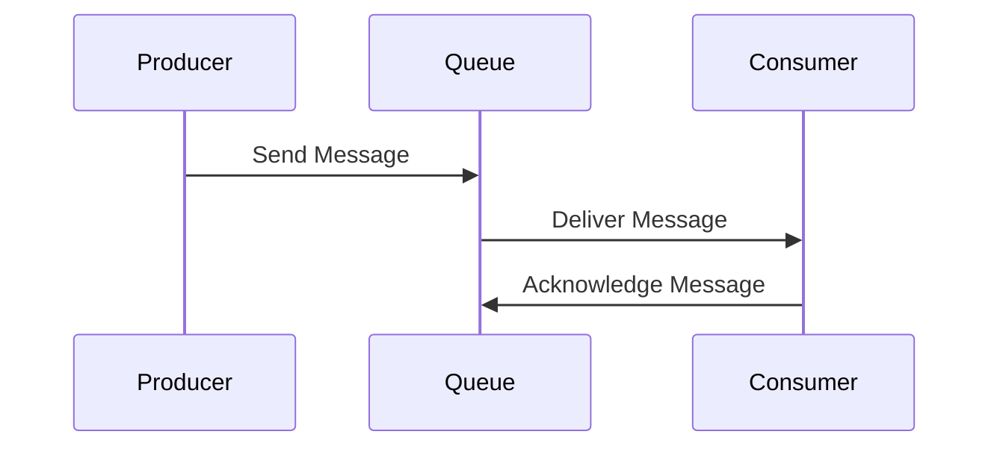

## 13.5 Message Endpoint Patterns

In the realm of enterprise integration, message endpoints play a crucial role as the interfaces between messaging systems and application code. They serve as the entry and exit points for messages, ensuring that data flows smoothly and reliably between different components of a distributed system. In this section, we'll delve into the concept of message endpoints, explore different types, and demonstrate how to implement them in Ruby applications. We'll also discuss strategies for handling message acknowledgments, retries, idempotency, and ordering, while highlighting best practices for ensuring endpoint reliability and fault tolerance.

### What Are Message Endpoints?

Message endpoints are the components in a messaging system that facilitate communication between applications and the messaging infrastructure. They act as the bridge that connects the application logic with the messaging system, enabling the sending and receiving of messages. In a distributed architecture, message endpoints are essential for decoupling components, allowing them to communicate asynchronously and independently.

#### Key Roles of Message Endpoints:

- **Message Producers**: Components that send messages to the messaging system.
- **Message Consumers**: Components that receive messages from the messaging system.
- **Polling Consumers**: Consumers that periodically check for new messages.
- **Event-Driven Consumers**: Consumers that react to new messages as they arrive.

### Types of Message Endpoints

Let's explore the different types of message endpoints and their roles in a messaging system.

#### Message Producers

Message producers are responsible for sending messages to the messaging system. They encapsulate the logic for creating and dispatching messages, ensuring that the data is correctly formatted and routed to the appropriate destination.

##### Example: Implementing a Message Producer in Ruby

```ruby
require 'bunny'

class MessageProducer
  def initialize(queue_name)
    @connection = Bunny.new
    @connection.start
    @channel = @connection.create_channel
    @queue = @channel.queue(queue_name)
  end

  def send_message(message)
    @queue.publish(message)
    puts "Message sent: #{message}"
  end

  def close
    @connection.close
  end
end

# Usage
producer = MessageProducer.new('task_queue')
producer.send_message('Hello, World!')
producer.close
```

In this example, we use the Bunny gem to interact with a RabbitMQ messaging system. The `MessageProducer` class establishes a connection, creates a channel, and sends messages to a specified queue.

#### Message Consumers

Message consumers are responsible for receiving and processing messages from the messaging system. They listen for incoming messages and execute the necessary business logic upon receipt.

##### Example: Implementing a Message Consumer in Ruby

```ruby
require 'bunny'

class MessageConsumer
  def initialize(queue_name)
    @connection = Bunny.new
    @connection.start
    @channel = @connection.create_channel
    @queue = @channel.queue(queue_name)
  end

  def start
    puts 'Waiting for messages...'
    @queue.subscribe(block: true) do |_delivery_info, _properties, body|
      puts "Received message: #{body}"
      process_message(body)
    end
  end

  def process_message(message)
    # Implement message processing logic here
    puts "Processing message: #{message}"
  end

  def close
    @connection.close
  end
end

# Usage
consumer = MessageConsumer.new('task_queue')
consumer.start
```

The `MessageConsumer` class listens for messages on a specified queue and processes them using the `process_message` method. This example demonstrates a simple event-driven consumer using Bunny.

#### Polling Consumers

Polling consumers periodically check the messaging system for new messages. This approach is useful when the consumer needs to control the rate of message processing or when the messaging system does not support event-driven consumption.

##### Example: Implementing a Polling Consumer in Ruby

```ruby
require 'bunny'

class PollingConsumer
  def initialize(queue_name)
    @connection = Bunny.new
    @connection.start
    @channel = @connection.create_channel
    @queue = @channel.queue(queue_name)
  end

  def poll
    loop do
      delivery_info, _properties, body = @queue.pop
      if body
        puts "Polled message: #{body}"
        process_message(body)
      else
        sleep(1) # Wait before polling again
      end
    end
  end

  def process_message(message)
    # Implement message processing logic here
    puts "Processing message: #{message}"
  end

  def close
    @connection.close
  end
end

# Usage
polling_consumer = PollingConsumer.new('task_queue')
polling_consumer.poll
```

In this example, the `PollingConsumer` class uses a loop to repeatedly check for new messages. If a message is available, it is processed; otherwise, the consumer waits before polling again.

#### Event-Driven Consumers

Event-driven consumers react to messages as they arrive, providing a more responsive and efficient approach to message consumption. This pattern is ideal for real-time applications where immediate processing is required.

### Handling Message Acknowledgments and Retries

In a messaging system, it's crucial to handle message acknowledgments and retries to ensure reliable message delivery and processing.

#### Message Acknowledgments

Acknowledgments confirm that a message has been successfully received and processed. In RabbitMQ, for example, consumers can acknowledge messages manually or automatically.

##### Example: Manual Acknowledgment in Ruby

```ruby
require 'bunny'

class AcknowledgingConsumer
  def initialize(queue_name)
    @connection = Bunny.new
    @connection.start
    @channel = @connection.create_channel
    @queue = @channel.queue(queue_name)
  end

  def start
    puts 'Waiting for messages...'
    @queue.subscribe(manual_ack: true, block: true) do |delivery_info, _properties, body|
      puts "Received message: #{body}"
      process_message(body)
      @channel.ack(delivery_info.delivery_tag)
    end
  end

  def process_message(message)
    # Implement message processing logic here
    puts "Processing message: #{message}"
  end

  def close
    @connection.close
  end
end

# Usage
ack_consumer = AcknowledgingConsumer.new('task_queue')
ack_consumer.start
```

In this example, the consumer manually acknowledges each message after processing it. This approach ensures that messages are not lost if the consumer crashes before processing is complete.

#### Message Retries

Retries are necessary when message processing fails. Implementing a retry mechanism ensures that messages are not lost and can be reprocessed.

##### Example: Implementing Retries in Ruby

```ruby
require 'bunny'

class RetryConsumer
  MAX_RETRIES = 3

  def initialize(queue_name)
    @connection = Bunny.new
    @connection.start
    @channel = @connection.create_channel
    @queue = @channel.queue(queue_name)
  end

  def start
    puts 'Waiting for messages...'
    @queue.subscribe(manual_ack: true, block: true) do |delivery_info, _properties, body|
      retries = 0
      begin
        process_message(body)
        @channel.ack(delivery_info.delivery_tag)
      rescue StandardError => e
        retries += 1
        if retries <= MAX_RETRIES
          puts "Error processing message, retrying... (#{retries}/#{MAX_RETRIES})"
          retry
        else
          puts "Failed to process message after #{MAX_RETRIES} attempts: #{e.message}"
          @channel.nack(delivery_info.delivery_tag, false, false)
        end
      end
    end
  end

  def process_message(message)
    # Implement message processing logic here
    puts "Processing message: #{message}"
  end

  def close
    @connection.close
  end
end

# Usage
retry_consumer = RetryConsumer.new('task_queue')
retry_consumer.start
```

In this example, the consumer attempts to process a message up to a maximum number of retries. If processing fails after the maximum retries, the message is negatively acknowledged and not requeued.

### Ensuring Idempotency and Message Ordering

Idempotency and message ordering are critical for maintaining data consistency and integrity in a messaging system.

#### Idempotency

Idempotency ensures that processing a message multiple times has the same effect as processing it once. This property is essential for handling duplicate messages or retries.

##### Example: Implementing Idempotency in Ruby

```ruby
require 'digest'

class IdempotentConsumer
  def initialize(queue_name)
    @processed_messages = Set.new
    @connection = Bunny.new
    @connection.start
    @channel = @connection.create_channel
    @queue = @channel.queue(queue_name)
  end

  def start
    puts 'Waiting for messages...'
    @queue.subscribe(manual_ack: true, block: true) do |delivery_info, _properties, body|
      message_id = Digest::SHA256.hexdigest(body)
      unless @processed_messages.include?(message_id)
        process_message(body)
        @processed_messages.add(message_id)
      end
      @channel.ack(delivery_info.delivery_tag)
    end
  end

  def process_message(message)
    # Implement message processing logic here
    puts "Processing message: #{message}"
  end

  def close
    @connection.close
  end
end

# Usage
idempotent_consumer = IdempotentConsumer.new('task_queue')
idempotent_consumer.start
```

In this example, the consumer uses a set to track processed messages by their hash. This approach ensures that each message is processed only once.

#### Message Ordering

Message ordering ensures that messages are processed in the order they were sent. This property is crucial for maintaining the sequence of operations in certain applications.

##### Example: Ensuring Message Ordering in Ruby

```ruby
require 'bunny'

class OrderedConsumer
  def initialize(queue_name)
    @connection = Bunny.new
    @connection.start
    @channel = @connection.create_channel
    @queue = @channel.queue(queue_name)
  end

  def start
    puts 'Waiting for messages...'
    @queue.subscribe(manual_ack: true, block: true) do |delivery_info, _properties, body|
      process_message(body)
      @channel.ack(delivery_info.delivery_tag)
    end
  end

  def process_message(message)
    # Implement message processing logic here
    puts "Processing message: #{message}"
  end

  def close
    @connection.close
  end
end

# Usage
ordered_consumer = OrderedConsumer.new('task_queue')
ordered_consumer.start
```

In this example, the consumer processes messages in the order they are received from the queue, ensuring that the sequence is maintained.

### Best Practices for Endpoint Reliability and Fault Tolerance

To ensure the reliability and fault tolerance of message endpoints, consider the following best practices:

- **Use Durable Queues**: Ensure that queues are durable to prevent message loss in case of server failures.
- **Implement Acknowledgments**: Use manual acknowledgments to confirm message processing and prevent data loss.
- **Handle Retries Gracefully**: Implement retry mechanisms with exponential backoff to handle transient failures.
- **Ensure Idempotency**: Design message processing logic to be idempotent, preventing duplicate processing.
- **Monitor and Log**: Continuously monitor and log message processing to detect and resolve issues promptly.
- **Test for Failures**: Regularly test the system for failure scenarios to ensure robustness and resilience.

### Visualizing Message Endpoint Patterns

To better understand the flow of messages through endpoints, let's visualize the interaction between producers, consumers, and the messaging system.



This sequence diagram illustrates the basic interaction between a message producer, a queue, and a consumer. The producer sends a message to the queue, which then delivers it to the consumer. The consumer processes the message and sends an acknowledgment back to the queue.

### Try It Yourself

Experiment with the provided code examples by modifying the message content, queue names, or retry logic. Try implementing additional features such as logging, error handling, or message filtering to enhance the functionality of your message endpoints.

### References and Further Reading

- [RabbitMQ Documentation](https://www.rabbitmq.com/documentation.html)
- [Bunny Gem Documentation](https://rubybunny.info/)
- [Enterprise Integration Patterns](https://www.enterpriseintegrationpatterns.com/)

### Knowledge Check

Before moving on, take a moment to review the key concepts covered in this section. Consider the following questions:

- What are the roles of message producers and consumers in a messaging system?
- How can you ensure idempotency in message processing?
- What strategies can be used to handle message retries and acknowledgments?

Remember, mastering message endpoint patterns is a crucial step in building reliable and scalable distributed systems. Keep experimenting, stay curious, and enjoy the journey!

## Quiz: Message Endpoint Patterns



### What is the primary role of a message producer in a messaging system?

- [x] To send messages to the messaging system
- [ ] To receive messages from the messaging system
- [ ] To process messages in the messaging system
- [ ] To store messages in a database

> **Explanation:** A message producer is responsible for sending messages to the messaging system, acting as the entry point for data into the system.

### How does a polling consumer differ from an event-driven consumer?

- [x] A polling consumer periodically checks for new messages, while an event-driven consumer reacts to messages as they arrive.
- [ ] A polling consumer reacts to messages as they arrive, while an event-driven consumer periodically checks for new messages.
- [ ] Both polling and event-driven consumers react to messages as they arrive.
- [ ] Both polling and event-driven consumers periodically check for new messages.

> **Explanation:** A polling consumer actively checks for new messages at regular intervals, whereas an event-driven consumer passively waits for messages to be delivered to it.

### What is the purpose of message acknowledgments in a messaging system?

- [x] To confirm that a message has been successfully received and processed
- [ ] To send a message back to the producer
- [ ] To delete a message from the queue
- [ ] To store a message in a database

> **Explanation:** Message acknowledgments are used to confirm that a message has been successfully received and processed, ensuring reliable delivery.

### Why is idempotency important in message processing?

- [x] To ensure that processing a message multiple times has the same effect as processing it once
- [ ] To increase the speed of message processing
- [ ] To reduce the size of messages
- [ ] To improve the security of message processing

> **Explanation:** Idempotency ensures that processing a message multiple times does not result in unintended side effects, which is crucial for handling retries and duplicates.

### What is a common strategy for handling message retries?

- [x] Implementing a retry mechanism with exponential backoff
- [ ] Sending the message to a different queue
- [ ] Ignoring the message after the first failure
- [ ] Storing the message in a database

> **Explanation:** Implementing a retry mechanism with exponential backoff helps manage transient failures by gradually increasing the wait time between retries.

### Which of the following is a best practice for ensuring message ordering?

- [x] Processing messages in the order they are received from the queue
- [ ] Randomly selecting messages from the queue
- [ ] Processing messages based on their size
- [ ] Ignoring the order of messages

> **Explanation:** To ensure message ordering, it's important to process messages in the order they are received from the queue.

### What is the benefit of using durable queues in a messaging system?

- [x] To prevent message loss in case of server failures
- [ ] To increase the speed of message processing
- [ ] To reduce the size of messages
- [ ] To improve the security of message processing

> **Explanation:** Durable queues ensure that messages are not lost in the event of server failures, providing reliability and fault tolerance.

### How can you monitor and log message processing effectively?

- [x] By continuously monitoring and logging message processing to detect and resolve issues promptly
- [ ] By ignoring message processing logs
- [ ] By only logging errors
- [ ] By manually checking message processing

> **Explanation:** Continuous monitoring and logging of message processing help detect and resolve issues promptly, ensuring system reliability.

### What is the role of a message consumer in a messaging system?

- [x] To receive and process messages from the messaging system
- [ ] To send messages to the messaging system
- [ ] To store messages in a database
- [ ] To delete messages from the queue

> **Explanation:** A message consumer is responsible for receiving and processing messages from the messaging system, acting as the exit point for data from the system.

### True or False: Message endpoints are only used in synchronous communication systems.

- [ ] True
- [x] False

> **Explanation:** Message endpoints are used in both synchronous and asynchronous communication systems, facilitating communication between applications and the messaging infrastructure.




