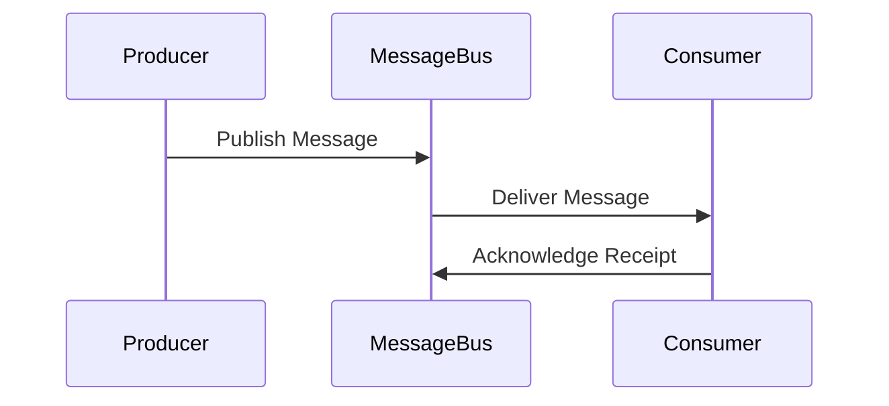

## 13.6 Messaging Infrastructure Patterns

In the realm of enterprise integration, messaging infrastructure patterns play a pivotal role in enabling communication between disparate systems. These patterns provide the backbone for scalable, maintainable, and secure messaging architectures. In this section, we will delve into the core concepts of messaging channels, explore key patterns such as Message Bus, Channel Adapter, and Messaging Gateway, and provide practical examples of implementing these patterns in Ruby.

### Understanding Messaging Channels

**Messaging channels** are the conduits through which messages flow between different components of a system. They are essential for decoupling the sender and receiver, allowing them to operate independently. Channels can be thought of as virtual pipes that carry data from one point to another, ensuring that messages are delivered reliably and efficiently.

#### Importance of Messaging Channels

- **Decoupling**: Channels separate the concerns of message producers and consumers, allowing them to evolve independently.
- **Scalability**: By distributing messages across multiple channels, systems can handle increased loads without bottlenecks.
- **Flexibility**: Channels can be configured to support various messaging patterns, such as point-to-point or publish-subscribe.

### Key Messaging Infrastructure Patterns

Let's explore some of the fundamental messaging infrastructure patterns that are crucial for building robust systems.

#### Message Bus Pattern

The **Message Bus** pattern is a central hub that facilitates communication between different components of a system. It acts as an intermediary, routing messages from producers to consumers. This pattern is particularly useful in large-scale systems where multiple services need to communicate with each other.

##### Key Participants

- **Producers**: Components that send messages to the bus.
- **Consumers**: Components that receive messages from the bus.
- **Bus**: The central hub that manages message routing.

##### Applicability

- Use the Message Bus pattern when you need to integrate multiple services or applications.
- It is ideal for systems that require loose coupling and scalability.

##### Sample Code Snippet

```ruby
# Define a simple message bus
class MessageBus
  def initialize
    @channels = {}
  end

  def subscribe(channel, &block)
    @channels[channel] ||= []
    @channels[channel] << block
  end

  def publish(channel, message)
    return unless @channels[channel]

    @channels[channel].each do |subscriber|
      subscriber.call(message)
    end
  end
end

# Usage
bus = MessageBus.new

# Subscribe to a channel
bus.subscribe('orders') do |message|
  puts "Received order: #{message}"
end

# Publish a message
bus.publish('orders', 'Order #123')
```

##### Design Considerations

- **Scalability**: Ensure the bus can handle high volumes of messages.
- **Security**: Implement authentication and authorization to protect message integrity.

#### Channel Adapter Pattern

The **Channel Adapter** pattern is used to connect different messaging systems or protocols. It acts as a bridge, translating messages from one format to another, enabling interoperability between systems.

##### Key Participants

- **Source System**: The system that sends messages.
- **Target System**: The system that receives messages.
- **Adapter**: The component that translates messages between the source and target systems.

##### Applicability

- Use the Channel Adapter pattern when integrating systems with different messaging protocols.
- It is suitable for legacy systems that need to communicate with modern applications.

##### Sample Code Snippet

```ruby
# Define a channel adapter
class ChannelAdapter
  def initialize(source, target)
    @source = source
    @target = target
  end

  def translate(message)
    # Convert message format
    translated_message = message.upcase
    @target.receive(translated_message)
  end
end

# Usage
class SourceSystem
  def send(message, adapter)
    adapter.translate(message)
  end
end

class TargetSystem
  def receive(message)
    puts "Received translated message: #{message}"
  end
end

source = SourceSystem.new
target = TargetSystem.new
adapter = ChannelAdapter.new(source, target)

source.send('hello world', adapter)
```

##### Design Considerations

- **Compatibility**: Ensure the adapter can handle different message formats and protocols.
- **Performance**: Optimize translation logic to minimize latency.

#### Messaging Gateway Pattern

The **Messaging Gateway** pattern provides a unified interface for sending and receiving messages. It abstracts the underlying messaging infrastructure, allowing clients to interact with it without worrying about the details.

##### Key Participants

- **Client**: The component that interacts with the gateway.
- **Gateway**: The interface that abstracts the messaging infrastructure.
- **Messaging System**: The underlying system that handles message delivery.

##### Applicability

- Use the Messaging Gateway pattern to simplify client interactions with complex messaging systems.
- It is ideal for systems that require a consistent interface for messaging operations.

##### Sample Code Snippet

```ruby
# Define a messaging gateway
class MessagingGateway
  def initialize(messaging_system)
    @messaging_system = messaging_system
  end

  def send_message(channel, message)
    @messaging_system.publish(channel, message)
  end

  def receive_message(channel, &block)
    @messaging_system.subscribe(channel, &block)
  end
end

# Usage
class MessagingSystem
  def publish(channel, message)
    puts "Publishing message to #{channel}: #{message}"
  end

  def subscribe(channel, &block)
    puts "Subscribed to #{channel}"
    block.call("Sample message from #{channel}")
  end
end

system = MessagingSystem.new
gateway = MessagingGateway.new(system)

gateway.send_message('notifications', 'New notification')
gateway.receive_message('notifications') do |message|
  puts "Received message: #{message}"
end
```

##### Design Considerations

- **Abstraction**: Ensure the gateway provides a simple and consistent interface.
- **Extensibility**: Design the gateway to support additional messaging features as needed.

### Setting Up Messaging Infrastructure with Ruby

To implement these patterns in Ruby, we can leverage various libraries and tools that simplify the process of setting up messaging infrastructure.

#### Using RabbitMQ with Bunny

RabbitMQ is a popular message broker that supports various messaging patterns. The Bunny gem provides a Ruby client for interacting with RabbitMQ.

```ruby
require 'bunny'

# Establish a connection
connection = Bunny.new
connection.start

# Create a channel
channel = connection.create_channel

# Declare a queue
queue = channel.queue('task_queue', durable: true)

# Publish a message
channel.default_exchange.publish('Hello, World!', routing_key: queue.name)

puts " [x] Sent 'Hello, World!'"

# Close the connection
connection.close
```

#### Using Kafka with Ruby-Kafka

Kafka is another powerful messaging system that excels in handling large volumes of data. The Ruby-Kafka gem provides a client for interacting with Kafka.

```ruby
require 'kafka'

# Create a Kafka client
kafka = Kafka.new(seed_brokers: ['kafka://localhost:9092'])

# Produce a message
kafka.deliver_message('Hello, Kafka!', topic: 'greetings')

# Consume messages
consumer = kafka.consumer(group_id: 'my-consumer')
consumer.subscribe('greetings')

consumer.each_message do |message|
  puts "Received message: #{message.value}"
end
```

### Abstracting Messaging Details with Gateways and Adapters

By using gateways and adapters, we can abstract the complexities of the underlying messaging infrastructure, making it easier to manage and extend.

#### Implementing a Messaging Gateway

A messaging gateway can provide a unified interface for interacting with different messaging systems, allowing us to switch between them without changing client code.

```ruby
class UnifiedMessagingGateway
  def initialize(rabbitmq_client, kafka_client)
    @rabbitmq_client = rabbitmq_client
    @kafka_client = kafka_client
  end

  def send_message(system, message)
    case system
    when :rabbitmq
      @rabbitmq_client.publish(message)
    when :kafka
      @kafka_client.deliver_message(message)
    else
      raise "Unsupported messaging system: #{system}"
    end
  end
end

# Usage
rabbitmq_client = Bunny.new
kafka_client = Kafka.new(seed_brokers: ['kafka://localhost:9092'])

gateway = UnifiedMessagingGateway.new(rabbitmq_client, kafka_client)
gateway.send_message(:rabbitmq, 'Hello via RabbitMQ')
gateway.send_message(:kafka, 'Hello via Kafka')
```

### Considerations for Scalability and Security

When designing messaging infrastructure, it's crucial to consider scalability and security to ensure the system can handle growth and protect sensitive data.

#### Scalability Considerations

- **Load Balancing**: Distribute messages across multiple channels or brokers to prevent bottlenecks.
- **Horizontal Scaling**: Add more instances of messaging components to handle increased loads.
- **Partitioning**: Divide messages into partitions to improve throughput and parallel processing.

#### Security Considerations

- **Authentication**: Verify the identity of message producers and consumers.
- **Authorization**: Control access to messaging channels and resources.
- **Encryption**: Protect messages in transit and at rest to prevent unauthorized access.

### Visualizing Messaging Infrastructure

To better understand the flow of messages in a messaging infrastructure, let's visualize the components and their interactions using a sequence diagram.



### Try It Yourself

Now that we've covered the basics of messaging infrastructure patterns, it's time to experiment with the code examples provided. Try modifying the message bus to support different types of messages or implement additional security measures. Experiment with different messaging systems like RabbitMQ and Kafka to see how they handle message delivery and scaling.

### Summary

In this section, we've explored the fundamental messaging infrastructure patterns that are essential for building scalable and secure systems. By understanding and implementing patterns like Message Bus, Channel Adapter, and Messaging Gateway, we can create robust messaging architectures that facilitate communication between disparate systems. Remember, the key to success is to keep experimenting and adapting these patterns to suit your specific needs.

## Quiz: Messaging Infrastructure Patterns



### What is the primary purpose of a messaging channel in a messaging infrastructure?

- [x] To decouple message producers and consumers
- [ ] To store messages permanently
- [ ] To encrypt messages
- [ ] To provide a user interface for messaging

> **Explanation:** Messaging channels decouple producers and consumers, allowing them to operate independently.

### Which pattern acts as a central hub for routing messages between components?

- [x] Message Bus
- [ ] Channel Adapter
- [ ] Messaging Gateway
- [ ] Singleton

> **Explanation:** The Message Bus pattern acts as a central hub for routing messages.

### What is the role of a Channel Adapter in messaging infrastructure?

- [x] To translate messages between different systems or protocols
- [ ] To encrypt messages
- [ ] To store messages
- [ ] To provide a user interface

> **Explanation:** A Channel Adapter translates messages between different systems or protocols.

### Which pattern provides a unified interface for sending and receiving messages?

- [x] Messaging Gateway
- [ ] Message Bus
- [ ] Channel Adapter
- [ ] Observer

> **Explanation:** The Messaging Gateway pattern provides a unified interface for messaging operations.

### What is a key consideration when designing a Message Bus?

- [x] Scalability
- [ ] User interface design
- [ ] Color scheme
- [ ] Font size

> **Explanation:** Scalability is crucial to ensure the Message Bus can handle high volumes of messages.

### Which Ruby gem is commonly used for interacting with RabbitMQ?

- [x] Bunny
- [ ] Rails
- [ ] Sinatra
- [ ] RSpec

> **Explanation:** The Bunny gem is commonly used for interacting with RabbitMQ.

### What is the primary benefit of using a Messaging Gateway?

- [x] Simplifies client interactions with complex messaging systems
- [ ] Provides a graphical user interface
- [ ] Stores messages permanently
- [ ] Encrypts messages

> **Explanation:** A Messaging Gateway simplifies client interactions by abstracting the messaging infrastructure.

### Which of the following is a security consideration for messaging infrastructure?

- [x] Authentication
- [ ] Font size
- [ ] Color scheme
- [ ] User interface design

> **Explanation:** Authentication is a key security consideration to verify the identity of message producers and consumers.

### What is one way to improve the scalability of a messaging infrastructure?

- [x] Load balancing
- [ ] Increasing font size
- [ ] Changing color scheme
- [ ] Adding more user interfaces

> **Explanation:** Load balancing helps distribute messages to prevent bottlenecks and improve scalability.

### True or False: A Channel Adapter is used to provide a user interface for messaging systems.

- [ ] True
- [x] False

> **Explanation:** A Channel Adapter is used to translate messages between different systems, not to provide a user interface.



Remember, this is just the beginning. As you progress, you'll build more complex and interactive messaging systems. Keep experimenting, stay curious, and enjoy the journey!
