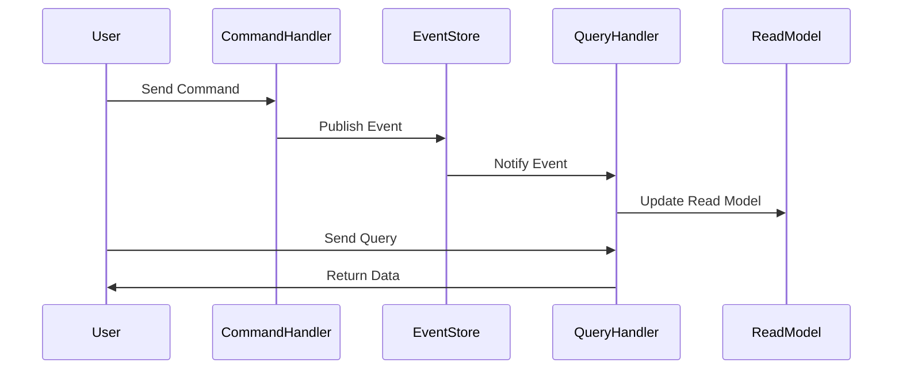

## 13.8 Event Sourcing and CQRS

In the realm of enterprise application development, two architectural patterns stand out for their ability to handle complex systems with high scalability and auditability: Event Sourcing and Command Query Responsibility Segregation (CQRS). These patterns are particularly useful in Ruby applications, where dynamic typing and metaprogramming can be leveraged to implement sophisticated solutions. In this section, we will delve into these patterns, exploring their concepts, benefits, challenges, and best practices for implementation in Ruby.

### Understanding Event Sourcing

**Event Sourcing** is a pattern that captures all changes to the application state as a sequence of events. Instead of storing the current state of an entity, Event Sourcing records every state change as an event. This approach provides a complete history of changes, enabling features such as audit logs, temporal queries, and the ability to reconstruct past states.

#### Key Concepts of Event Sourcing

- **Event Store**: A specialized database that stores events. Each event represents a state change and is immutable.
- **Event Replay**: The process of reconstructing the current state by replaying all events from the event store.
- **Event Sourcing Handler**: A component that processes events to update the application state or trigger side effects.

#### Benefits of Event Sourcing

- **Auditability**: Every change is recorded, providing a complete audit trail.
- **Temporal Queries**: Ability to query the state of the system at any point in time.
- **Flexibility**: Easy to add new features that require historical data.

#### Challenges of Event Sourcing

- **Complexity**: Requires careful design to manage event schemas and versioning.
- **Storage**: Can lead to large volumes of data, necessitating efficient storage solutions.
- **Eventual Consistency**: Systems using Event Sourcing may not be immediately consistent.

### Understanding CQRS

**Command Query Responsibility Segregation (CQRS)** is a pattern that separates read and write operations. In CQRS, commands are used to change the state, while queries are used to read the state. This separation allows for optimized read and write models, which can be scaled independently.

#### Key Concepts of CQRS

- **Command Model**: Handles write operations and is responsible for processing commands that change the state.
- **Query Model**: Handles read operations and is optimized for retrieving data.
- **Command Handlers**: Components that execute commands and update the state.
- **Query Handlers**: Components that execute queries and return data.

#### Benefits of CQRS

- **Scalability**: Read and write models can be scaled independently.
- **Performance**: Optimized models for read and write operations improve performance.
- **Flexibility**: Easier to evolve the system by modifying one model without affecting the other.

#### Challenges of CQRS

- **Complexity**: Increases the complexity of the system architecture.
- **Consistency**: Requires mechanisms to ensure eventual consistency between models.

### Complementary Nature of Event Sourcing and CQRS

Event Sourcing and CQRS are often used together to build robust systems. Event Sourcing provides a reliable way to capture all changes, while CQRS allows for efficient querying and command processing. Together, they enable systems to handle high loads, provide detailed audit logs, and support complex business logic.

### Implementing Event Sourcing and CQRS in Ruby

Ruby, with its dynamic nature and powerful libraries, is well-suited for implementing Event Sourcing and CQRS. One popular library for this purpose is [Rails Event Store](https://railseventstore.org/), which provides tools for building event-driven applications in Ruby on Rails.

#### Example: Implementing Event Sourcing with Rails Event Store

Let's explore how to implement Event Sourcing using Rails Event Store. We'll create a simple application that tracks user account transactions.

```ruby
# Gemfile
gem 'rails_event_store'

# Run bundle install to install the gem

# Create an event
class AccountCredited < RailsEventStore::Event
end

# Create an event store
event_store = RailsEventStore::Client.new

# Publish an event
event = AccountCredited.new(data: { amount: 100, currency: 'USD' })
event_store.publish(event, stream_name: 'account-123')

# Subscribe to events
event_store.subscribe(to: [AccountCredited]) do |event|
  puts "Account credited with #{event.data[:amount]} #{event.data[:currency]}"
end

# Replay events
event_store.read.stream('account-123').each do |event|
  puts "Replaying event: #{event.event_type} with data #{event.data}"
end
```

In this example, we define an `AccountCredited` event and use Rails Event Store to publish and subscribe to events. We also demonstrate how to replay events from the event store.

#### Example: Implementing CQRS with Rails Event Store

To implement CQRS, we need to separate our command and query models. Let's extend our previous example to include CQRS.

```ruby
# Command model
class CreditAccount
  def initialize(event_store)
    @event_store = event_store
  end

  def call(account_id, amount)
    event = AccountCredited.new(data: { account_id: account_id, amount: amount })
    @event_store.publish(event, stream_name: "account-#{account_id}")
  end
end

# Query model
class AccountBalanceQuery
  def initialize(event_store)
    @event_store = event_store
  end

  def call(account_id)
    events = @event_store.read.stream("account-#{account_id}").to_a
    events.reduce(0) { |balance, event| balance + event.data[:amount] }
  end
end

# Usage
event_store = RailsEventStore::Client.new
credit_account = CreditAccount.new(event_store)
account_balance_query = AccountBalanceQuery.new(event_store)

credit_account.call('123', 100)
puts "Account balance: #{account_balance_query.call('123')}"
```

In this example, we define a `CreditAccount` command model and an `AccountBalanceQuery` query model. The command model publishes events to the event store, while the query model reads events to calculate the account balance.

### Best Practices for Designing Systems with Event Sourcing and CQRS

- **Event Versioning**: Plan for changes in event schemas by implementing versioning strategies.
- **Eventual Consistency**: Design your system to handle eventual consistency, using techniques such as compensating transactions.
- **Testing**: Thoroughly test your event handlers and command/query models to ensure correctness.
- **Monitoring**: Implement monitoring to track event processing and detect issues early.
- **Documentation**: Document your event schemas and system architecture to facilitate maintenance and onboarding.

### Visualizing Event Sourcing and CQRS

To better understand the flow of events and commands in a system using Event Sourcing and CQRS, let's visualize the architecture using Mermaid.js.



This diagram illustrates the flow of commands and events in a system using Event Sourcing and CQRS. The user sends a command, which is processed by the command handler. The command handler publishes an event to the event store, which notifies the query handler to update the read model. The user can then send a query to retrieve data from the read model.

### Conclusion

Event Sourcing and CQRS are powerful patterns for building scalable and maintainable enterprise applications in Ruby. By capturing all changes as events and separating read and write operations, these patterns provide auditability, scalability, and flexibility. However, they also introduce complexity and require careful design to manage consistency and storage. By following best practices and leveraging tools like Rails Event Store, developers can successfully implement these patterns in their applications.

### Quiz: Event Sourcing and CQRS



### What is the primary purpose of Event Sourcing?

- [x] To capture all changes to application state as a sequence of events
- [ ] To separate read and write operations
- [ ] To optimize database queries
- [ ] To reduce application complexity

> **Explanation:** Event Sourcing captures all changes to the application state as a sequence of events, providing a complete history of changes.

### What does CQRS stand for?

- [x] Command Query Responsibility Segregation
- [ ] Command Query Read Segregation
- [ ] Command Queue Responsibility Segregation
- [ ] Command Query Response Segregation

> **Explanation:** CQRS stands for Command Query Responsibility Segregation, a pattern that separates read and write operations.

### How do Event Sourcing and CQRS complement each other?

- [x] Event Sourcing captures changes as events, while CQRS separates read and write operations
- [ ] Event Sourcing optimizes read operations, while CQRS captures changes as events
- [ ] Event Sourcing and CQRS are unrelated patterns
- [ ] Event Sourcing and CQRS both focus on reducing database load

> **Explanation:** Event Sourcing captures changes as events, providing a complete history, while CQRS separates read and write operations for optimized performance.

### What is a key benefit of using Event Sourcing?

- [x] Auditability
- [ ] Immediate consistency
- [ ] Reduced storage requirements
- [ ] Simplified architecture

> **Explanation:** Event Sourcing provides auditability by capturing all changes as events, allowing for a complete history of changes.

### What is a challenge associated with CQRS?

- [x] Increased complexity
- [ ] Immediate consistency
- [ ] Reduced scalability
- [ ] Simplified architecture

> **Explanation:** CQRS increases the complexity of the system architecture by separating read and write models.

### Which Ruby library is commonly used for implementing Event Sourcing?

- [x] Rails Event Store
- [ ] ActiveRecord
- [ ] RSpec
- [ ] Sinatra

> **Explanation:** Rails Event Store is a popular library for implementing Event Sourcing in Ruby applications.

### What is eventual consistency?

- [x] A state where the system becomes consistent over time
- [ ] A state where the system is always consistent
- [ ] A state where the system is never consistent
- [ ] A state where the system is immediately consistent

> **Explanation:** Eventual consistency means that the system will become consistent over time, but may not be immediately consistent.

### What is a command handler in CQRS?

- [x] A component that processes commands and updates the state
- [ ] A component that processes queries and returns data
- [ ] A component that stores events
- [ ] A component that manages user authentication

> **Explanation:** A command handler in CQRS processes commands and updates the state of the system.

### What is the role of an event store in Event Sourcing?

- [x] To store events as a sequence of state changes
- [ ] To store the current state of entities
- [ ] To store user authentication data
- [ ] To store application configuration

> **Explanation:** An event store in Event Sourcing stores events as a sequence of state changes, providing a complete history.

### True or False: Event Sourcing and CQRS can be used independently.

- [x] True
- [ ] False

> **Explanation:** Event Sourcing and CQRS can be used independently, but they are often used together to complement each other.



Remember, mastering Event Sourcing and CQRS is a journey. As you continue to explore these patterns, you'll discover new ways to build scalable and maintainable applications. Keep experimenting, stay curious, and enjoy the journey!
