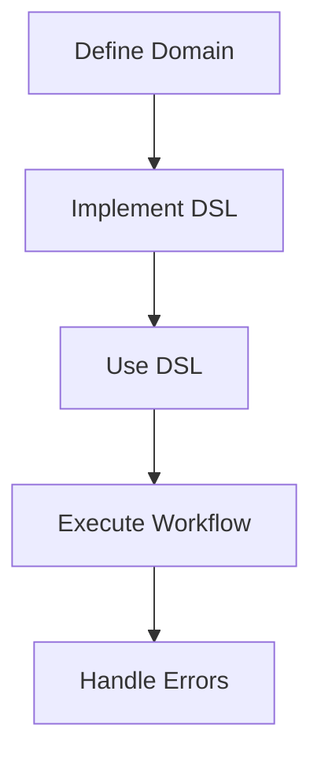

## 14.1 Building Internal DSLs

### Introduction to Internal DSLs

In the realm of software development, Domain-Specific Languages (DSLs) are specialized mini-languages tailored to a specific problem domain. They offer a way to express solutions in a language that closely aligns with the domain's concepts and terminology. Ruby, with its flexible syntax and powerful metaprogramming capabilities, is an ideal language for creating internal DSLs.

**Internal DSLs** are embedded within a host language, leveraging its syntax and semantics. They differ from **external DSLs**, which are standalone languages with their own parsers and interpreters. Internal DSLs are often more convenient to implement and maintain because they utilize the existing infrastructure of the host language.

### Benefits of Using DSLs

1. **Improved Readability**: DSLs allow developers to write code that reads like natural language, making it easier to understand and maintain.
2. **Domain Alignment**: By using terminology familiar to domain experts, DSLs bridge the gap between developers and stakeholders.
3. **Reduced Complexity**: DSLs abstract away boilerplate code, allowing developers to focus on the core logic.
4. **Enhanced Productivity**: With a DSL, developers can express complex operations concisely, speeding up development.

### Examples of Well-Known Ruby DSLs

Ruby is renowned for its expressive DSLs. Here are a few notable examples:

- **RSpec**: A testing framework that allows developers to write human-readable test cases.
- **Rails Routing**: Provides a clean syntax for defining routes in Ruby on Rails applications.
- **Capistrano**: A tool for automating deployment tasks, using a DSL to define deployment scripts.

### Creating an Internal DSL in Ruby

Let's dive into building an internal DSL in Ruby. We'll create a simple DSL for defining workflows, using Ruby's block syntax and metaprogramming features.

#### Step 1: Define the Domain

First, we need to understand the domain and define the vocabulary. For our workflow DSL, we'll use terms like `task`, `execute`, and `on_error`.

#### Step 2: Implement the DSL

We'll start by creating a `Workflow` class that will serve as the context for our DSL.

```ruby
class Workflow
  def initialize(&block)
    @tasks = []
    instance_eval(&block) if block_given?
  end

  def task(name, &block)
    @tasks << { name: name, action: block }
  end

  def execute
    @tasks.each do |task|
      begin
        puts "Executing task: #{task[:name]}"
        task[:action].call
      rescue => e
        puts "Error executing task #{task[:name]}: #{e.message}"
      end
    end
  end
end
```

#### Step 3: Use the DSL

Now, let's see how we can use our DSL to define a workflow.

```ruby
workflow = Workflow.new do
  task "Task 1" do
    puts "Performing Task 1"
  end

  task "Task 2" do
    puts "Performing Task 2"
    raise "An error occurred"
  end

  task "Task 3" do
    puts "Performing Task 3"
  end
end

workflow.execute
```

#### Explanation

- **`instance_eval`**: This method allows us to evaluate the block in the context of the `Workflow` instance, enabling the DSL syntax.
- **Blocks**: We use blocks to define the actions for each task, providing flexibility and encapsulation.

### Advanced Techniques for DSLs

Ruby's metaprogramming capabilities offer powerful tools for building DSLs. Let's explore some advanced techniques.

#### Using `method_missing`

The `method_missing` method allows us to handle calls to undefined methods, providing a way to extend our DSL dynamically.

```ruby
class Workflow
  def method_missing(name, *args, &block)
    if block_given?
      task(name.to_s, &block)
    else
      super
    end
  end
end
```

With this addition, we can define tasks without explicitly calling the `task` method:

```ruby
workflow = Workflow.new do
  Task1 do
    puts "Performing Task 1"
  end

  Task2 do
    puts "Performing Task 2"
    raise "An error occurred"
  end
end
```

#### Using `instance_exec`

`instance_exec` is similar to `instance_eval`, but it allows passing arguments to the block, providing more flexibility.

```ruby
class Workflow
  def task(name, &block)
    @tasks << { name: name, action: block }
  end

  def execute
    @tasks.each do |task|
      begin
        puts "Executing task: #{task[:name]}"
        instance_exec(&task[:action])
      rescue => e
        puts "Error executing task #{task[:name]}: #{e.message}"
      end
    end
  end
end
```

### Best Practices for DSL Design

1. **Keep It Simple**: A DSL should be intuitive and easy to use. Avoid unnecessary complexity.
2. **Use Domain Language**: Align the DSL's vocabulary with the domain's terminology.
3. **Provide Clear Error Messages**: Help users understand what went wrong and how to fix it.
4. **Document the DSL**: Provide comprehensive documentation and examples.
5. **Test the DSL**: Ensure the DSL behaves as expected through thorough testing.

### Visualizing DSL Structure

To better understand the flow of our DSL, let's visualize the structure using a Mermaid.js flowchart.



**Figure 1**: Workflow DSL Structure

### Try It Yourself

Experiment with the workflow DSL by adding new tasks, handling errors differently, or extending the DSL with new features. Consider adding support for conditional execution or parallel tasks.

### References and Further Reading

- [Ruby Metaprogramming: A Primer](https://www.rubyguides.com/2018/11/ruby-metaprogramming/)
- [RSpec Documentation](https://rspec.info/documentation/)
- [Ruby on Rails Routing Guide](https://guides.rubyonrails.org/routing.html)

### Knowledge Check

- What is the main difference between internal and external DSLs?
- How does `instance_eval` contribute to DSL design?
- Why is it important to align a DSL's vocabulary with the domain's terminology?

### Embrace the Journey

Building internal DSLs in Ruby is a rewarding endeavor that enhances your applications' expressiveness and maintainability. Remember, this is just the beginning. As you progress, you'll discover new ways to leverage Ruby's capabilities to create powerful, domain-specific solutions. Keep experimenting, stay curious, and enjoy the journey!

## Quiz: Building Internal DSLs



### What is an internal DSL?

- [x] A DSL embedded within a host language
- [ ] A standalone language with its own parser
- [ ] A graphical user interface
- [ ] A type of database query language

> **Explanation:** An internal DSL is embedded within a host language, leveraging its syntax and semantics.

### Which Ruby feature is commonly used to implement DSLs?

- [x] Metaprogramming
- [ ] Static typing
- [ ] Garbage collection
- [ ] Threading

> **Explanation:** Metaprogramming allows Ruby developers to create flexible and expressive DSLs.

### What is the purpose of `instance_eval` in a DSL?

- [x] To evaluate a block in the context of an instance
- [ ] To define a new class
- [ ] To handle exceptions
- [ ] To manage memory

> **Explanation:** `instance_eval` evaluates a block in the context of an instance, enabling DSL syntax.

### What is a benefit of using DSLs?

- [x] Improved readability
- [ ] Increased complexity
- [ ] Slower performance
- [ ] Less maintainability

> **Explanation:** DSLs improve readability by allowing code to be written in a domain-specific language.

### Which method can handle calls to undefined methods in Ruby?

- [x] `method_missing`
- [ ] `initialize`
- [ ] `to_s`
- [ ] `inspect`

> **Explanation:** `method_missing` allows handling calls to undefined methods, useful for extending DSLs.

### What should a DSL's vocabulary align with?

- [x] The domain's terminology
- [ ] The operating system
- [ ] The database schema
- [ ] The network protocol

> **Explanation:** A DSL's vocabulary should align with the domain's terminology for clarity and relevance.

### What is a key practice in DSL design?

- [x] Keep it simple
- [ ] Make it complex
- [ ] Use technical jargon
- [ ] Avoid documentation

> **Explanation:** Keeping a DSL simple ensures it is intuitive and easy to use.

### What is `method_missing` used for in DSLs?

- [x] To dynamically handle undefined method calls
- [ ] To initialize objects
- [ ] To manage memory
- [ ] To perform calculations

> **Explanation:** `method_missing` is used to dynamically handle undefined method calls, enhancing DSL flexibility.

### What is an example of a well-known Ruby DSL?

- [x] RSpec
- [ ] JavaScript
- [ ] HTML
- [ ] SQL

> **Explanation:** RSpec is a well-known Ruby DSL for writing human-readable test cases.

### True or False: Internal DSLs require their own parser.

- [x] False
- [ ] True

> **Explanation:** Internal DSLs do not require their own parser as they are embedded within a host language.




