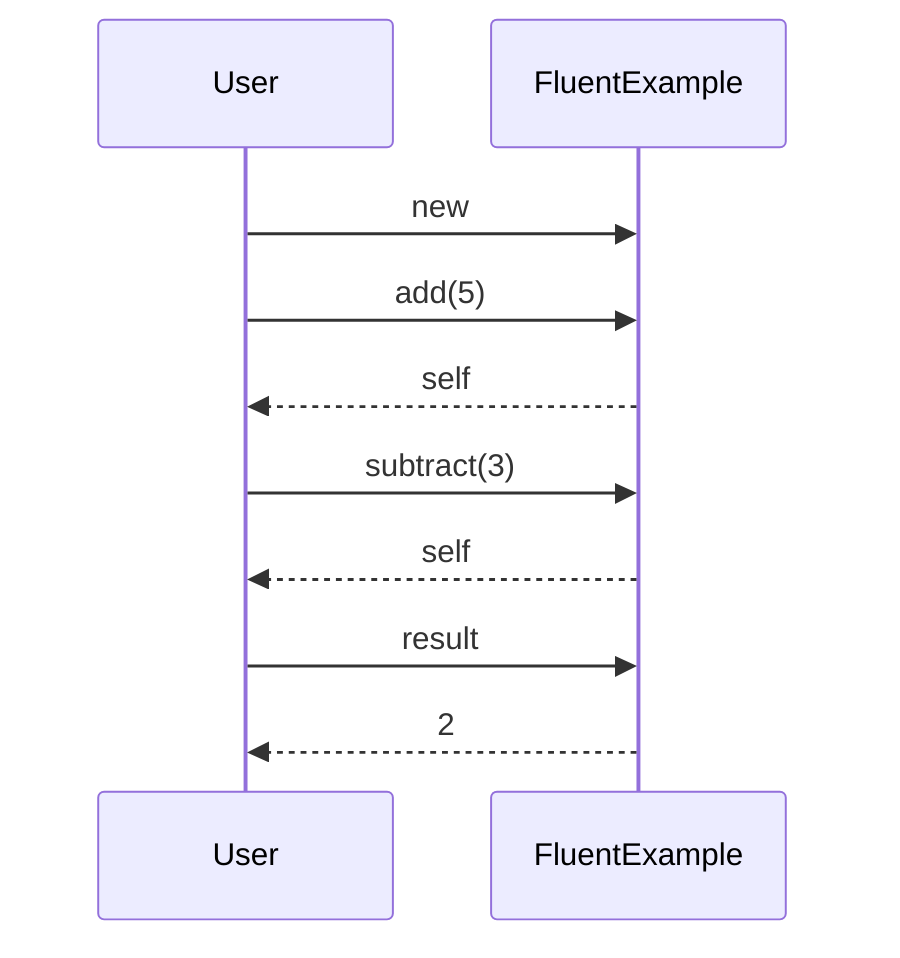

## 14.2 Creating Fluent Interfaces

Fluent interfaces are a powerful design pattern that enhances code readability and expressiveness by allowing method chaining. In Ruby, this pattern is particularly effective due to the language's dynamic nature and flexible syntax. In this section, we will explore the concept of fluent interfaces, how method chaining works in Ruby, and how to implement it in your own classes. We will also look at examples from popular libraries like ActiveRecord and discuss the benefits and considerations of using fluent interfaces.

### What Are Fluent Interfaces?

Fluent interfaces are a design pattern that allows for the chaining of method calls in a way that reads like natural language. This pattern is characterized by:

- **Method Chaining**: Each method returns an object, allowing the next method to be called on it.
- **Expressiveness**: The code reads like a sentence, making it more intuitive and easier to understand.
- **Readability**: By reducing the need for intermediate variables, fluent interfaces make the code more concise and readable.

#### Characteristics of Fluent Interfaces

1. **Chained Method Calls**: Methods are designed to return the object itself, enabling a sequence of calls.
2. **Self-Referencing**: Methods often return `self` to maintain the chain.
3. **Natural Language Syntax**: The sequence of method calls should read like a sentence, enhancing readability.
4. **Minimal State**: Fluent interfaces often maintain minimal internal state, focusing on the sequence of operations.

### Method Chaining in Ruby

Ruby's object-oriented nature makes it an ideal language for implementing fluent interfaces. Method chaining in Ruby involves returning `self` from methods so that subsequent methods can be called on the same object.

#### How Method Chaining Works

When you call a method on an object in Ruby, the method returns a value. If the method returns `self`, you can immediately call another method on the result. This is the essence of method chaining.

```ruby
class FluentExample
  def initialize
    @value = 0
  end

  def add(number)
    @value += number
    self
  end

  def subtract(number)
    @value -= number
    self
  end

  def result
    @value
  end
end

calculation = FluentExample.new
result = calculation.add(5).subtract(3).result
puts result # Output: 2
```

In this example, each method (`add` and `subtract`) returns `self`, allowing the next method to be called on the same object. This pattern is the foundation of fluent interfaces.

### Examples of Fluent Interfaces in Popular Libraries

One of the most well-known examples of fluent interfaces in Ruby is ActiveRecord, the ORM used in Ruby on Rails. ActiveRecord allows for expressive database queries through method chaining.

#### ActiveRecord Query Example

```ruby
# Assuming a User model with fields :name and :age
users = User.where(age: 18..25).order(:name).limit(10)
```

In this example, the `where`, `order`, and `limit` methods are chained together to form a query that reads like a sentence. Each method returns an ActiveRecord::Relation object, allowing the chain to continue.

### Implementing Fluent Interfaces in Custom Classes

To implement fluent interfaces in your own classes, follow these steps:

1. **Return `self` from Methods**: Ensure that each method returns `self` to allow chaining.
2. **Design Methods for Readability**: Name methods in a way that makes the chain read naturally.
3. **Handle Edge Cases**: Consider how to handle `nil` values and other edge cases to prevent breaking the chain.

#### Example: Building a Fluent Interface

Let's create a simple class that demonstrates a fluent interface for building a URL.

```ruby
class UrlBuilder
  def initialize
    @url = ""
  end

  def protocol(protocol)
    @url += "#{protocol}://"
    self
  end

  def domain(domain)
    @url += domain
    self
  end

  def path(path)
    @url += "/#{path}"
    self
  end

  def query(params)
    query_string = params.map { |key, value| "#{key}=#{value}" }.join("&")
    @url += "?#{query_string}"
    self
  end

  def build
    @url
  end
end

url = UrlBuilder.new
              .protocol("https")
              .domain("example.com")
              .path("search")
              .query(q: "ruby", page: 1)
              .build

puts url # Output: https://example.com/search?q=ruby&page=1
```

In this example, each method modifies the internal state of the `UrlBuilder` object and returns `self`, allowing the chain to continue. The `build` method returns the final URL.

### Considerations for Fluent Interfaces

When designing fluent interfaces, consider the following:

- **Returning `self`**: Ensure methods return `self` to maintain the chain.
- **Handling `nil` Values**: Consider how to handle `nil` values to prevent breaking the chain. You might want to use safe navigation operators or default values.
- **Error Handling**: Implement error handling to manage invalid states or inputs gracefully.
- **Performance**: Be mindful of performance implications, especially if the chain involves complex operations or large data sets.

### Benefits of Fluent Interfaces

Fluent interfaces offer several benefits:

- **Improved Readability**: Code reads like a sentence, making it easier to understand.
- **Expressiveness**: The sequence of operations is clear and concise.
- **Reduced Boilerplate**: Eliminates the need for intermediate variables, reducing clutter.
- **Enhanced Maintainability**: Easier to modify and extend due to its clear structure.

### Visualizing Fluent Interfaces

To better understand the flow of method chaining in fluent interfaces, let's visualize the process using a sequence diagram.



This diagram illustrates the sequence of method calls in the `FluentExample` class, showing how each method returns `self` to allow the chain to continue.

### Try It Yourself

Now that we've explored fluent interfaces, try modifying the `UrlBuilder` class to add support for setting a port number. Experiment with different method names and chaining sequences to see how they affect readability and functionality.

### References and Further Reading

- [Ruby on Rails Guides: Active Record Query Interface](https://guides.rubyonrails.org/active_record_querying.html)
- [Martin Fowler's Article on Fluent Interfaces](https://martinfowler.com/bliki/FluentInterface.html)

### Knowledge Check

1. What is the primary purpose of fluent interfaces?
2. How does method chaining work in Ruby?
3. Why is returning `self` important in fluent interfaces?
4. What are some benefits of using fluent interfaces?
5. How can you handle `nil` values in a fluent interface?

### Embrace the Journey

Remember, creating fluent interfaces is about making your code more readable and expressive. As you experiment with this pattern, you'll find new ways to simplify and enhance your code. Keep exploring, stay curious, and enjoy the journey!

## Quiz: Creating Fluent Interfaces



### What is a fluent interface primarily used for?

- [x] To enhance code readability and expressiveness
- [ ] To improve performance
- [ ] To enforce strict typing
- [ ] To simplify error handling

> **Explanation:** Fluent interfaces are designed to make code more readable and expressive by allowing method chaining.

### In Ruby, what is essential for enabling method chaining?

- [x] Returning `self` from methods
- [ ] Using global variables
- [ ] Implementing inheritance
- [ ] Using class variables

> **Explanation:** Returning `self` from methods allows the next method to be called on the same object, enabling method chaining.

### Which of the following is a characteristic of fluent interfaces?

- [x] Chained method calls
- [ ] Strict type enforcement
- [ ] Use of global variables
- [ ] Complex syntax

> **Explanation:** Fluent interfaces are characterized by chained method calls that enhance readability and expressiveness.

### What is a common use case for fluent interfaces in Ruby?

- [x] Building complex queries in ActiveRecord
- [ ] Managing memory allocation
- [ ] Implementing security protocols
- [ ] Handling file I/O operations

> **Explanation:** Fluent interfaces are commonly used in ActiveRecord to build complex queries through method chaining.

### How can you handle `nil` values in a fluent interface?

- [x] Use safe navigation operators
- [x] Provide default values
- [ ] Ignore them
- [ ] Use global variables

> **Explanation:** Handling `nil` values can be done using safe navigation operators or providing default values to prevent breaking the chain.

### What is a benefit of using fluent interfaces?

- [x] Improved code readability
- [ ] Increased memory usage
- [ ] Slower execution time
- [ ] More complex syntax

> **Explanation:** Fluent interfaces improve code readability by making it more expressive and concise.

### Which method should return `self` in a fluent interface?

- [x] Methods that are part of the chain
- [ ] Only the first method
- [ ] Only the last method
- [ ] Methods that do not modify state

> **Explanation:** Methods that are part of the chain should return `self` to allow the chain to continue.

### What is a potential drawback of fluent interfaces?

- [x] Difficulty in handling errors
- [ ] Increased code readability
- [ ] Reduced expressiveness
- [ ] More intermediate variables

> **Explanation:** Fluent interfaces can make error handling more challenging due to the chaining of methods.

### Can fluent interfaces be used in languages other than Ruby?

- [x] True
- [ ] False

> **Explanation:** Fluent interfaces can be implemented in many programming languages, not just Ruby.

### What is a key consideration when designing fluent interfaces?

- [x] Ensuring methods return `self`
- [ ] Using global variables
- [ ] Implementing complex algorithms
- [ ] Enforcing strict typing

> **Explanation:** Ensuring methods return `self` is crucial for maintaining the chain in fluent interfaces.


