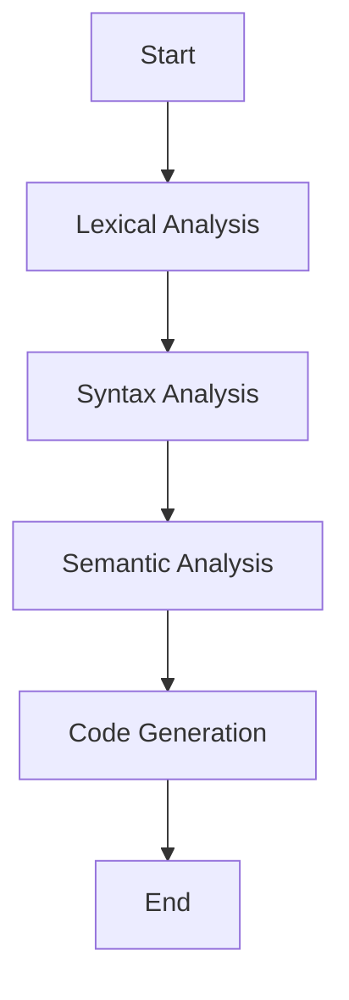

## 14.3 External DSLs with Parsers

In this section, we delve into the fascinating world of external domain-specific languages (DSLs) and how to build them using parsers in Ruby. External DSLs are powerful tools that allow developers to create languages tailored to specific problem domains, enhancing expressiveness and maintainability. Let's explore what external DSLs are, how to create them, and the tools available in Ruby to facilitate this process.

### Understanding External DSLs

**External DSLs** are languages designed to solve specific problems within a particular domain. Unlike internal DSLs, which are embedded within a host language (like Ruby), external DSLs are defined outside the host language and require parsing to interpret. They are often used to provide a more natural syntax for domain experts who may not be familiar with programming.

#### Use Cases for External DSLs

External DSLs are particularly useful in scenarios where:

- **Domain Experts Need Direct Involvement**: When domain experts need to write or read the language without deep programming knowledge.
- **Complex Domain Logic**: When the domain logic is complex and requires a specialized language to express it clearly.
- **Separation of Concerns**: When you want to separate domain logic from application logic for better maintainability.

### The Process of Parsing and Interpreting

Parsing is the process of analyzing a string of symbols, either in natural language or computer languages, conforming to the rules of a formal grammar. In the context of external DSLs, parsing involves converting the DSL code into a format that can be understood and executed by a program.

#### Steps in Parsing

1. **Lexical Analysis**: Breaking down the input into tokens.
2. **Syntax Analysis**: Checking the tokens against the grammar rules.
3. **Semantic Analysis**: Ensuring the syntax is meaningful within the context.
4. **Code Generation**: Translating the parsed structure into executable code or another form.

### Tools for Building Parsers in Ruby

Ruby provides several tools for building parsers, each with its own strengths and use cases. Let's explore some popular ones:

#### Treetop

[Treetop](https://github.com/nathansplace/treetop) is a Ruby library for building parsers using a PEG (Parsing Expression Grammar) approach. It allows you to define grammars in a declarative way and generate parsers from them.

**Example: Defining a Grammar with Treetop**

```ruby
# arithmetic.treetop
grammar Arithmetic
  rule expression
    term (add_op term)*
  end

  rule term
    factor (mul_op factor)*
  end

  rule factor
    number / '(' expression ')'
  end

  rule add_op
    '+' / '-'
  end

  rule mul_op
    '*' / '/'
  end

  rule number
    [0-9]+
  end
end
```

**Building a Parser**

```ruby
require 'treetop'
Treetop.load('arithmetic')

parser = ArithmeticParser.new
result = parser.parse('3 + 5 * (10 - 4)')

if result
  puts "Parsed successfully!"
else
  puts "Parsing failed."
end
```

#### Parslet

[Parslet](http://kschiess.github.io/parslet/) is another Ruby library for building parsers, known for its simplicity and ease of use. It uses a PEG-based approach similar to Treetop but provides a more Ruby-like syntax.

**Example: Building a Parser with Parslet**

```ruby
require 'parslet'

class ArithmeticParser < Parslet::Parser
  rule(:expression) { term >> (add_op >> term).repeat }
  rule(:term) { factor >> (mul_op >> factor).repeat }
  rule(:factor) { number | str('(') >> expression >> str(')') }
  rule(:add_op) { match['+-'] }
  rule(:mul_op) { match['*/'] }
  rule(:number) { match['0-9'].repeat(1) }

  root(:expression)
end

parser = ArithmeticParser.new
result = parser.parse('3 + 5 * (10 - 4)')
puts "Parsed successfully!" if result
```

#### Racc

[Racc](https://docs.ruby-lang.org/en/2.0.0/Racc.html) is a LALR(1) parser generator for Ruby, similar to tools like Yacc and Bison. It's suitable for more complex parsing tasks where performance is a concern.

**Example: Using Racc**

```ruby
# calculator.y
class Calculator
  rule
    expression: expression '+' term { result = val[0] + val[2] }
             | expression '-' term { result = val[0] - val[2] }
             | term { result = val[0] }
    ;

    term: term '*' factor { result = val[0] * val[2] }
        | term '/' factor { result = val[0] / val[2] }
        | factor { result = val[0] }
    ;

    factor: '(' expression ')' { result = val[1] }
          | number { result = val[0] }
    ;

    number: /\d+/ { result = val[0].to_i }
    ;
  end
end
```

### When to Prefer External DSLs

External DSLs are preferred when:

- **Domain-Specific Syntax**: You need a syntax that closely matches the domain language.
- **Complex Parsing Logic**: The parsing logic is too complex to be embedded within the host language.
- **Separation of Concerns**: You want to keep the domain logic separate from the application code.

### Challenges in Building External DSLs

Building external DSLs comes with its own set of challenges:

- **Error Handling**: Providing meaningful error messages can be difficult.
- **Performance**: Parsing can be computationally expensive, especially for complex grammars.
- **Maintenance**: Keeping the DSL and its parser up-to-date with domain changes can be challenging.

### Visualizing the Parsing Process

To better understand the parsing process, let's visualize it using a flowchart:



This flowchart represents the typical stages of parsing an external DSL, from lexical analysis to code generation.

### Try It Yourself

Experiment with the provided code examples by modifying the grammar rules or input expressions. Try adding new operators or handling different types of expressions to see how the parser behaves.

### Conclusion

External DSLs offer a powerful way to express domain-specific logic in a clear and maintainable manner. By leveraging tools like Treetop, Parslet, and Racc, Ruby developers can create custom parsers that bring these languages to life. While there are challenges in building and maintaining external DSLs, the benefits they offer in terms of expressiveness and separation of concerns make them a valuable tool in a developer's arsenal.

Remember, this is just the beginning. As you progress, you'll build more complex and interactive DSLs. Keep experimenting, stay curious, and enjoy the journey!

## Quiz: External DSLs with Parsers



### What is an external DSL?

- [x] A language defined outside the host language, requiring parsing.
- [ ] A language embedded within the host language.
- [ ] A language used only for internal application logic.
- [ ] A language that does not require parsing.

> **Explanation:** External DSLs are defined outside the host language and require parsing to interpret.

### Which tool is NOT used for building parsers in Ruby?

- [ ] Treetop
- [ ] Parslet
- [x] Nokogiri
- [ ] Racc

> **Explanation:** Nokogiri is a library for parsing XML and HTML, not for building parsers for DSLs.

### What is the first step in the parsing process?

- [x] Lexical Analysis
- [ ] Syntax Analysis
- [ ] Semantic Analysis
- [ ] Code Generation

> **Explanation:** Lexical Analysis is the first step, where the input is broken down into tokens.

### What does PEG stand for?

- [x] Parsing Expression Grammar
- [ ] Parsing Evaluation Grammar
- [ ] Parser Execution Grammar
- [ ] Parsing External Grammar

> **Explanation:** PEG stands for Parsing Expression Grammar, a formal grammar for describing languages.

### Which of the following is a challenge in building external DSLs?

- [x] Error Handling
- [ ] Easy Maintenance
- [ ] Simple Parsing Logic
- [ ] Low Performance Overhead

> **Explanation:** Error handling is a challenge due to the complexity of providing meaningful messages.

### What is the purpose of semantic analysis in parsing?

- [x] Ensuring the syntax is meaningful within the context.
- [ ] Breaking down the input into tokens.
- [ ] Checking tokens against grammar rules.
- [ ] Translating parsed structure into executable code.

> **Explanation:** Semantic analysis ensures that the syntax is meaningful within the context of the language.

### When should you prefer an external DSL over an internal DSL?

- [x] When you need a domain-specific syntax.
- [ ] When the parsing logic is simple.
- [ ] When you want to embed the language within Ruby.
- [ ] When you don't need separation of concerns.

> **Explanation:** External DSLs are preferred when a domain-specific syntax is needed.

### What is the role of Treetop in Ruby?

- [x] Building parsers using a PEG approach.
- [ ] Parsing XML and HTML documents.
- [ ] Managing Ruby dependencies.
- [ ] Providing a web framework for Ruby applications.

> **Explanation:** Treetop is used for building parsers using a Parsing Expression Grammar approach.

### What is a key benefit of using external DSLs?

- [x] Enhanced expressiveness for domain-specific logic.
- [ ] Reduced complexity in parsing.
- [ ] Simplified error handling.
- [ ] Improved performance over internal DSLs.

> **Explanation:** External DSLs enhance expressiveness for domain-specific logic.

### True or False: External DSLs are always faster than internal DSLs.

- [ ] True
- [x] False

> **Explanation:** External DSLs can be slower due to the overhead of parsing and interpreting the language.


