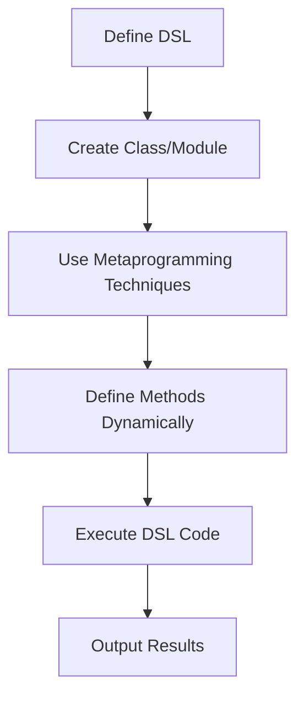

## 14.4 Metaprogramming Techniques for DSLs

In the world of Ruby programming, Domain-Specific Languages (DSLs) offer a powerful way to create expressive and concise code tailored to specific problem domains. By leveraging Ruby's metaprogramming capabilities, we can craft DSLs that are both flexible and intuitive. This section will guide you through the metaprogramming techniques that make DSLs possible, using methods like `define_method`, `class_eval`, and more. We'll explore how to manipulate scopes and contexts, manage method visibility, and strike a balance between the power of DSLs and the clarity of code.

### Understanding DSLs and Metaprogramming

Before diving into the techniques, let's clarify what DSLs and metaprogramming are:

- **Domain-Specific Language (DSL):** A DSL is a specialized language designed to solve problems in a specific domain. Unlike general-purpose programming languages, DSLs are tailored to particular tasks, making them more expressive and easier to use within their domain.

- **Metaprogramming:** Metaprogramming refers to the practice of writing code that can manipulate other code. In Ruby, this means using the language's dynamic features to alter classes, methods, and objects at runtime.

### How Metaprogramming Enables DSL Creation

Metaprogramming is the backbone of DSL creation in Ruby. It allows us to define methods dynamically, evaluate code within specific contexts, and manipulate the structure of classes and modules. This flexibility is what makes Ruby an ideal language for building DSLs.

#### Key Metaprogramming Techniques

1. **Dynamic Method Definition with `define_method`:** This method allows us to define methods at runtime, which is crucial for creating flexible DSLs.

2. **Evaluating Code with `class_eval` and `instance_eval`:** These methods enable us to execute code within the context of a class or an instance, allowing for dynamic modifications.

3. **Manipulating Scopes and Contexts:** By controlling the scope in which code is executed, we can simplify DSL syntax and enhance readability.

4. **Managing Method Visibility and Namespace Pollution:** It's essential to ensure that DSLs do not interfere with existing code, which requires careful management of method visibility and namespaces.

### Dynamic Method Definition with `define_method`

The `define_method` is a powerful tool in Ruby's metaprogramming arsenal. It allows us to define methods dynamically, which is particularly useful when creating DSLs that need to respond to a variety of commands or inputs.

#### Example: Creating a Simple DSL

Let's create a simple DSL for defining tasks:

```ruby
class TaskManager
  def initialize
    @tasks = {}
  end

  def define_task(name, &block)
    @tasks[name] = block
    self.class.define_method(name) do
      puts "Executing task: #{name}"
      @tasks[name].call
    end
  end
end

task_manager = TaskManager.new
task_manager.define_task(:greet) { puts "Hello, World!" }
task_manager.greet
```

In this example, we use `define_method` to create a method for each task defined. This allows us to call tasks as if they were regular methods, providing a clean and intuitive interface.

### Evaluating Code with `class_eval` and `instance_eval`

The `class_eval` and `instance_eval` methods allow us to execute code within the context of a class or an instance, respectively. This is useful for adding methods or altering behavior dynamically.

#### Example: Extending a Class with `class_eval`

```ruby
class Calculator
  def self.add_operation(name, &block)
    class_eval do
      define_method(name, &block)
    end
  end
end

Calculator.add_operation(:multiply) do |a, b|
  a * b
end

calc = Calculator.new
puts calc.multiply(3, 4) # Outputs: 12
```

Here, `class_eval` is used to add a new operation to the `Calculator` class. This technique is powerful for extending classes with new functionality on the fly.

### Manipulating Scopes and Contexts

One of the challenges in creating DSLs is managing the scope in which code is executed. By carefully controlling scope, we can simplify DSL syntax and make it more intuitive.

#### Example: Simplifying Syntax with `instance_eval`

```ruby
class Configurator
  def initialize
    @settings = {}
  end

  def set(key, value)
    @settings[key] = value
  end

  def configure(&block)
    instance_eval(&block)
  end

  def show_settings
    @settings
  end
end

config = Configurator.new
config.configure do
  set :timeout, 30
  set :retries, 5
end

puts config.show_settings # Outputs: {:timeout=>30, :retries=>5}
```

In this example, `instance_eval` allows us to execute the block within the context of the `Configurator` instance, enabling a clean and simple syntax for setting configuration options.

### Managing Method Visibility and Namespace Pollution

When creating DSLs, it's crucial to manage method visibility and avoid polluting the global namespace. This ensures that the DSL does not interfere with other parts of the application.

#### Example: Using Modules to Encapsulate DSLs

```ruby
module DSL
  def self.included(base)
    base.extend(ClassMethods)
  end

  module ClassMethods
    def dsl_method(name, &block)
      define_method(name, &block)
    end
  end
end

class MyDSL
  include DSL

  dsl_method(:say_hello) do
    puts "Hello from DSL!"
  end
end

dsl_instance = MyDSL.new
dsl_instance.say_hello
```

By encapsulating DSL methods within a module, we can control their visibility and prevent them from affecting other parts of the application.

### Balancing DSL Power and Code Clarity

While DSLs offer powerful capabilities, it's important to balance this power with code clarity. A DSL should be intuitive and easy to read, without sacrificing the flexibility that makes it useful.

#### Tips for Maintaining Clarity

- **Keep Syntax Simple:** Avoid overly complex constructs that may confuse users.
- **Provide Clear Documentation:** Ensure that users understand how to use the DSL effectively.
- **Limit Scope:** Restrict the DSL's influence to specific areas of the application to prevent unintended side effects.

### Visualizing DSL Structure

To better understand how DSLs are structured, let's visualize the process of defining and using a DSL in Ruby.



This diagram illustrates the flow from defining a DSL to executing its code and producing results. By following this process, we can create DSLs that are both powerful and easy to use.

### Try It Yourself

Experiment with the examples provided by modifying the code to add new features or change existing behavior. For instance, try adding a new task to the `TaskManager` DSL or extend the `Calculator` class with additional operations.

### References and Further Reading

- [Ruby Metaprogramming](https://ruby-doc.org/core-2.7.0/doc/syntax/miscellaneous_rdoc.html#label-Metaprogramming)
- [Understanding Ruby DSLs](https://www.sitepoint.com/ruby-dsls/)
- [Metaprogramming Ruby 2: Program Like the Ruby Pros](https://pragprog.com/titles/ppmetr2/metaprogramming-ruby-2/)

### Knowledge Check

- What is the purpose of `define_method` in Ruby?
- How does `class_eval` differ from `instance_eval`?
- Why is it important to manage method visibility in DSLs?

### Embrace the Journey

Remember, mastering metaprogramming and DSL creation is a journey. As you explore these techniques, you'll gain a deeper understanding of Ruby's capabilities and how to harness them effectively. Keep experimenting, stay curious, and enjoy the process!

## Quiz: Metaprogramming Techniques for DSLs



### What is the primary purpose of using `define_method` in Ruby DSLs?

- [x] To define methods dynamically at runtime
- [ ] To evaluate code within a specific context
- [ ] To manage method visibility
- [ ] To handle exceptions

> **Explanation:** `define_method` is used to define methods dynamically, which is crucial for creating flexible DSLs.

### How does `class_eval` differ from `instance_eval`?

- [x] `class_eval` evaluates code in the context of a class, while `instance_eval` evaluates in the context of an instance
- [ ] `class_eval` is used for defining methods, while `instance_eval` is used for executing blocks
- [ ] `class_eval` is slower than `instance_eval`
- [ ] `class_eval` is safer than `instance_eval`

> **Explanation:** `class_eval` and `instance_eval` differ in the context in which they evaluate code, with `class_eval` operating at the class level and `instance_eval` at the instance level.

### Why is managing method visibility important in DSLs?

- [x] To prevent interference with other parts of the application
- [ ] To increase the performance of the DSL
- [ ] To simplify the syntax of the DSL
- [ ] To ensure compatibility with older Ruby versions

> **Explanation:** Managing method visibility is crucial to avoid namespace pollution and ensure that the DSL does not interfere with other parts of the application.

### What is a key benefit of using modules to encapsulate DSL methods?

- [x] It helps control method visibility and prevent namespace pollution
- [ ] It makes the DSL faster
- [ ] It simplifies the syntax of the DSL
- [ ] It allows for easier debugging

> **Explanation:** Encapsulating DSL methods within modules helps control their visibility and prevents them from affecting other parts of the application.

### What is the role of `instance_eval` in simplifying DSL syntax?

- [x] It allows executing code within the context of an instance, enabling cleaner syntax
- [ ] It defines methods dynamically
- [ ] It manages method visibility
- [ ] It handles exceptions

> **Explanation:** `instance_eval` allows executing code within the context of an instance, which simplifies the syntax of DSLs by enabling a more intuitive interface.

### Which method would you use to add a new operation to a class dynamically?

- [x] `class_eval`
- [ ] `instance_eval`
- [ ] `define_method`
- [ ] `method_missing`

> **Explanation:** `class_eval` is used to add new operations to a class dynamically by evaluating code within the class context.

### What is a common pitfall when using metaprogramming for DSLs?

- [x] Namespace pollution
- [ ] Increased performance
- [ ] Simplified syntax
- [ ] Enhanced readability

> **Explanation:** A common pitfall of metaprogramming is namespace pollution, where methods defined dynamically can interfere with existing code.

### How can you prevent a DSL from interfering with other parts of an application?

- [x] By managing method visibility and using modules
- [ ] By using `instance_eval` exclusively
- [ ] By avoiding the use of `define_method`
- [ ] By writing extensive documentation

> **Explanation:** Managing method visibility and using modules to encapsulate DSL methods helps prevent interference with other parts of an application.

### What is the main advantage of using DSLs in Ruby?

- [x] They provide an expressive and concise way to solve problems in specific domains
- [ ] They increase the performance of Ruby applications
- [ ] They simplify the installation of Ruby gems
- [ ] They enhance the security of Ruby applications

> **Explanation:** DSLs offer an expressive and concise way to solve problems within specific domains, making them a powerful tool in Ruby programming.

### True or False: Metaprogramming in Ruby allows for static code analysis.

- [ ] True
- [x] False

> **Explanation:** Metaprogramming in Ruby involves dynamic code manipulation, which is not conducive to static code analysis.




