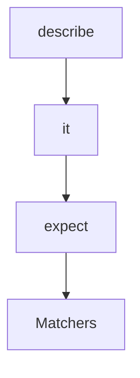
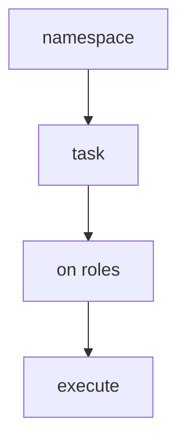

## 14.5 Case Study: RSpec and Capistrano

In the world of Ruby, Domain-Specific Languages (DSLs) have emerged as powerful tools that allow developers to write more expressive and readable code tailored to specific problem domains. Two of the most successful examples of DSLs in Ruby are RSpec and Capistrano. In this case study, we will delve into the design and implementation of these tools, exploring how they leverage Ruby's metaprogramming capabilities to create intuitive and powerful DSLs.

### Introduction to RSpec and Capistrano

#### RSpec

RSpec is a testing tool for Ruby, designed to help developers write human-readable specifications for their code. It is widely used in the Ruby community for behavior-driven development (BDD), allowing developers to describe the expected behavior of their applications in a clear and concise manner.

- **Purpose**: To provide a framework for writing and executing test cases in a way that is both expressive and easy to understand.
- **Website**: [RSpec Official Website](https://rspec.info/)

#### Capistrano

Capistrano is a remote server automation and deployment tool written in Ruby. It is used to automate the deployment of web applications, making it easier to manage complex deployment processes across multiple servers.

- **Purpose**: To simplify the deployment process by automating tasks such as code updates, database migrations, and server restarts.
- **Website**: [Capistrano Official Website](https://capistranorb.com/)

### Analyzing the DSL Components

#### RSpec DSL

RSpec's DSL is designed to make test cases look like natural language specifications. This is achieved through a combination of Ruby's flexible syntax and metaprogramming capabilities.

- **Example Syntax**:
  ```ruby
  RSpec.describe 'An example group' do
    it 'has an example' do
      expect(true).to be true
    end
  end
  ```

- **Components**:
  - **`describe`**: Defines a group of related tests.
  - **`it`**: Describes a specific example or test case.
  - **`expect`**: Sets up an expectation for the test.

- **Enhancements**:
  - **Readability**: The syntax is designed to read like a sentence, making it easier to understand the purpose of each test.
  - **Flexibility**: Allows for the creation of custom matchers and shared examples, enhancing reusability.

#### Capistrano DSL

Capistrano's DSL is focused on defining tasks and workflows for deployment. It abstracts away the complexity of server interactions, allowing developers to focus on the deployment logic.

- **Example Syntax**:
  ```ruby
  namespace :deploy do
    task :restart do
      on roles(:app), in: :sequence, wait: 5 do
        execute :touch, release_path.join('tmp/restart.txt')
      end
    end
  end
  ```

- **Components**:
  - **`namespace`**: Organizes tasks into logical groups.
  - **`task`**: Defines a specific task to be executed.
  - **`on`**: Specifies the roles and conditions for task execution.

- **Enhancements**:
  - **Modularity**: Tasks can be easily reused and combined to create complex workflows.
  - **Scalability**: Supports deployment to multiple servers with minimal configuration.

### Metaprogramming in RSpec and Capistrano

Metaprogramming is a key technique used in both RSpec and Capistrano to create their DSLs. By dynamically defining methods and classes, these tools can provide a flexible and expressive syntax.

#### RSpec Metaprogramming

- **Dynamic Method Definition**: RSpec uses metaprogramming to define methods like `describe` and `it` at runtime, allowing for a fluid and natural syntax.
- **Example**:
  ```ruby
  def describe(description, &block)
    ExampleGroup.new(description, &block).run
  end
  ```

- **Benefits**:
  - **Customization**: Developers can extend RSpec with custom matchers and helpers.
  - **Simplicity**: The DSL hides the complexity of the underlying test framework.

#### Capistrano Metaprogramming

- **Task Definition**: Capistrano uses metaprogramming to define tasks and namespaces, enabling developers to create reusable deployment scripts.
- **Example**:
  ```ruby
  def task(name, &block)
    tasks[name] = block
  end
  ```

- **Benefits**:
  - **Flexibility**: Tasks can be defined and modified at runtime, allowing for dynamic deployment strategies.
  - **Abstraction**: The DSL abstracts away the details of SSH and server interactions.

### Lessons Learned from RSpec and Capistrano

Creating a successful DSL in Ruby involves several key principles, as demonstrated by RSpec and Capistrano:

1. **Focus on Readability**: A DSL should be easy to read and understand, allowing developers to express their intentions clearly.

2. **Leverage Metaprogramming**: Use Ruby's metaprogramming capabilities to create flexible and dynamic DSLs that can be easily extended and customized.

3. **Encapsulate Complexity**: Hide the complexity of the underlying implementation, allowing developers to focus on the domain-specific logic.

4. **Promote Reusability**: Design the DSL to be modular and reusable, enabling developers to build upon existing components.

5. **Ensure Scalability**: Consider the scalability of the DSL, ensuring it can handle complex workflows and large-scale applications.

### Code Examples and Try It Yourself

#### RSpec Example

Let's create a simple RSpec test suite for a calculator application:

```ruby
# calculator.rb
class Calculator
  def add(a, b)
    a + b
  end

  def subtract(a, b)
    a - b
  end
end

# calculator_spec.rb
require 'rspec'
require_relative 'calculator'

RSpec.describe Calculator do
  let(:calculator) { Calculator.new }

  it 'adds two numbers' do
    expect(calculator.add(2, 3)).to eq(5)
  end

  it 'subtracts two numbers' do
    expect(calculator.subtract(5, 3)).to eq(2)
  end
end
```

**Try It Yourself**: Modify the `Calculator` class to include multiplication and division methods, and write corresponding tests.

#### Capistrano Example

Here's a basic Capistrano deployment script for a Rails application:

```ruby
# config/deploy.rb
lock '3.16.0'

set :application, 'my_app'
set :repo_url, 'git@example.com:me/my_repo.git'

namespace :deploy do
  task :restart do
    on roles(:app), in: :sequence, wait: 5 do
      execute :touch, release_path.join('tmp/restart.txt')
    end
  end

  after :finishing, 'deploy:cleanup'
end
```

**Try It Yourself**: Add a task to run database migrations after deploying the application.

### Visualizing DSL Design

To better understand the structure and flow of RSpec and Capistrano DSLs, let's visualize their components using Mermaid.js diagrams.

#### RSpec DSL Structure



**Description**: This diagram illustrates the flow of an RSpec test, starting with the `describe` block, followed by individual `it` examples, which contain `expect` statements with matchers.

#### Capistrano DSL Structure



**Description**: This diagram shows the structure of a Capistrano deployment script, with tasks organized under namespaces and executed on specified roles.

### References and Further Reading

For more information on RSpec and Capistrano, visit their official websites:

- RSpec: [https://rspec.info/](https://rspec.info/)
- Capistrano: [https://capistranorb.com/](https://capistranorb.com/)

### Knowledge Check

- What are the key components of RSpec's DSL?
- How does Capistrano use metaprogramming to define tasks?
- What lessons can be learned from the design of RSpec and Capistrano?

### Embrace the Journey

Remember, mastering DSLs in Ruby is a journey. As you explore and experiment with RSpec and Capistrano, you'll gain valuable insights into creating your own DSLs. Keep experimenting, stay curious, and enjoy the journey!

## Quiz: Case Study: RSpec and Capistrano



### What is the primary purpose of RSpec in Ruby?

- [x] To provide a framework for writing and executing test cases.
- [ ] To automate server deployment processes.
- [ ] To manage Ruby dependencies.
- [ ] To handle database migrations.

> **Explanation:** RSpec is designed to help developers write and execute test cases in a clear and expressive manner.

### Which component of RSpec is used to define a group of related tests?

- [x] `describe`
- [ ] `it`
- [ ] `expect`
- [ ] `context`

> **Explanation:** The `describe` block is used to define a group of related tests in RSpec.

### What is the role of metaprogramming in Capistrano?

- [x] To define tasks and namespaces dynamically.
- [ ] To manage database connections.
- [ ] To handle HTTP requests.
- [ ] To perform data validation.

> **Explanation:** Capistrano uses metaprogramming to define tasks and namespaces, allowing for flexible and dynamic deployment scripts.

### How does RSpec enhance the readability of test cases?

- [x] By using a natural language-like syntax.
- [ ] By providing detailed error messages.
- [ ] By integrating with IDEs.
- [ ] By supporting multiple programming languages.

> **Explanation:** RSpec's DSL is designed to read like natural language, making test cases more readable and understandable.

### Which of the following is a benefit of using DSLs like RSpec and Capistrano?

- [x] Improved readability and expressiveness.
- [ ] Increased execution speed.
- [ ] Reduced memory usage.
- [ ] Enhanced graphical user interfaces.

> **Explanation:** DSLs like RSpec and Capistrano improve the readability and expressiveness of code by providing a syntax tailored to specific domains.

### What is the function of the `task` method in Capistrano?

- [x] To define a specific task to be executed.
- [ ] To manage database migrations.
- [ ] To configure server settings.
- [ ] To handle user authentication.

> **Explanation:** The `task` method in Capistrano is used to define specific tasks that can be executed during deployment.

### How can developers extend RSpec with custom matchers?

- [x] By using Ruby's metaprogramming capabilities.
- [ ] By writing C extensions.
- [ ] By modifying the Ruby interpreter.
- [ ] By using external libraries.

> **Explanation:** Developers can extend RSpec with custom matchers using Ruby's metaprogramming capabilities, allowing for more expressive tests.

### What is a key principle in designing a successful DSL?

- [x] Focus on readability and expressiveness.
- [ ] Maximize execution speed.
- [ ] Minimize code length.
- [ ] Ensure compatibility with all programming languages.

> **Explanation:** A successful DSL should focus on readability and expressiveness, allowing developers to clearly express their intentions.

### Which diagramming tool is used to visualize the structure of RSpec and Capistrano DSLs?

- [x] Mermaid.js
- [ ] Graphviz
- [ ] PlantUML
- [ ] Lucidchart

> **Explanation:** Mermaid.js is used to create diagrams that visualize the structure of RSpec and Capistrano DSLs.

### True or False: Capistrano is primarily used for testing Ruby applications.

- [ ] True
- [x] False

> **Explanation:** Capistrano is primarily used for automating server deployment processes, not for testing Ruby applications.


