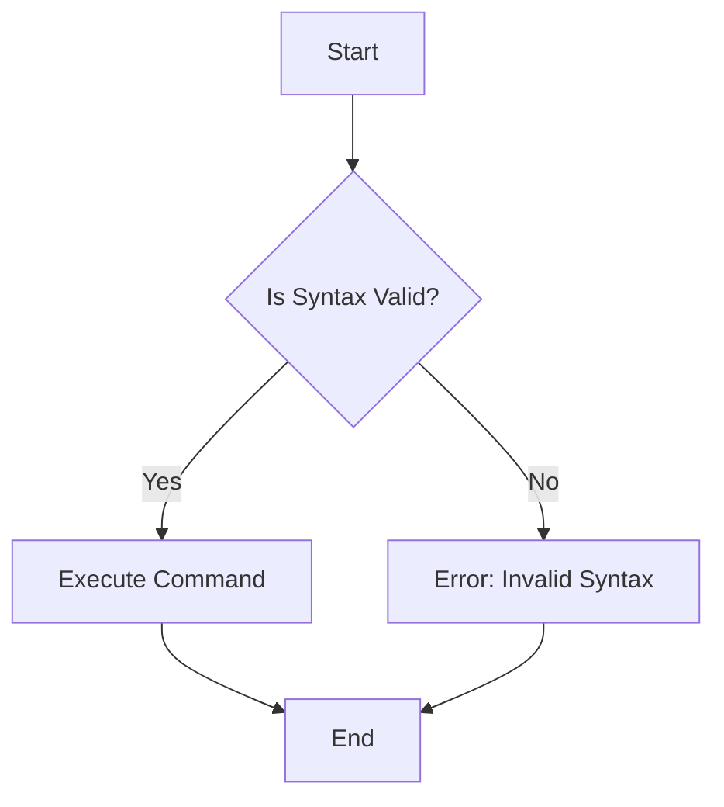

## 14.6 Testing and Documenting DSLs

Domain-Specific Languages (DSLs) are powerful tools that allow developers to create specialized mini-languages tailored to specific problem domains. In Ruby, DSLs are often used to simplify complex configurations, automate repetitive tasks, and provide a more intuitive interface for users. However, the power of DSLs comes with the responsibility of ensuring they are both reliable and user-friendly. This section will guide you through the best practices for testing and documenting DSLs to ensure they are robust, maintainable, and easy to adopt.

### Importance of Testing DSLs

Testing DSLs is crucial for several reasons:

1. **Reliability**: Ensuring that the DSL behaves as expected under various conditions.
2. **Maintainability**: Facilitating future changes and enhancements without introducing bugs.
3. **User Confidence**: Providing assurance to users that the DSL is stable and trustworthy.
4. **Syntax Validation**: Ensuring that the DSL syntax is correct and intuitive.

### Strategies for Writing Tests for DSL Code

Testing a DSL involves verifying both its syntax and semantics. Here are some strategies to consider:

#### 1. Unit Testing

- **Focus on Core Components**: Test the core components of your DSL, such as parsers, interpreters, and compilers.
- **Isolate Tests**: Ensure that each test is independent and does not rely on the state of other tests.

```ruby
# Example of a simple unit test for a DSL parser
require 'minitest/autorun'
require_relative 'my_dsl_parser'

class TestMyDSLParser < Minitest::Test
  def test_valid_syntax
    input = "command 'do_something'"
    parser = MyDSLParser.new(input)
    assert parser.valid_syntax?
  end

  def test_invalid_syntax
    input = "invalid command"
    parser = MyDSLParser.new(input)
    refute parser.valid_syntax?
  end
end
```

#### 2. Integration Testing

- **Test End-to-End Scenarios**: Ensure that the DSL works correctly when integrated with other components.
- **Simulate Real-World Use Cases**: Write tests that mimic how users will interact with the DSL.

```ruby
# Example of an integration test for a DSL
require 'minitest/autorun'
require_relative 'my_dsl'

class TestMyDSLIntegration < Minitest::Test
  def test_dsl_execution
    dsl_script = <<-DSL
      setup do
        use 'feature_x'
      end

      execute do
        run 'task_y'
      end
    DSL

    result = MyDSL.execute(dsl_script)
    assert_equal 'task_y completed', result
  end
end
```

#### 3. Edge Case Testing

- **Identify Edge Cases**: Consider unusual or extreme inputs that might break the DSL.
- **Test Boundary Conditions**: Ensure that the DSL handles edge cases gracefully.

```ruby
# Example of testing edge cases
class TestMyDSLEdgeCases < Minitest::Test
  def test_empty_input
    input = ""
    parser = MyDSLParser.new(input)
    assert_raises(MyDSL::SyntaxError) { parser.parse }
  end

  def test_large_input
    input = "command 'do_something' " * 1000
    parser = MyDSLParser.new(input)
    assert parser.valid_syntax?
  end
end
```

### Ensuring Syntax Correctness

Syntax correctness is a fundamental aspect of a DSL. Here are some tips to ensure your DSL's syntax is correct:

- **Define a Clear Grammar**: Use a formal grammar to define the syntax of your DSL.
- **Use Parsers**: Implement parsers to validate and interpret the DSL syntax.
- **Provide Meaningful Error Messages**: Help users understand syntax errors by providing clear and informative error messages.

### Role of Documentation in DSL Adoption

Documentation is key to helping users understand and adopt your DSL. It serves as both a reference and a guide for users. Here are some best practices for documenting DSLs:

#### 1. Comprehensive Reference Documentation

- **Document All Features**: Ensure that every feature of the DSL is documented.
- **Provide Syntax Diagrams**: Use diagrams to visually represent the syntax of the DSL.

#### 2. Usage Guides and Tutorials

- **Create Step-by-Step Tutorials**: Help users get started with the DSL through guided tutorials.
- **Include Examples**: Provide examples of common use cases and scenarios.

#### 3. API Documentation

- **Use Tools Like YARD**: Generate API documentation using tools like YARD to ensure consistency and readability.

```ruby
# Example of using YARD for documentation
# @param [String] command The command to execute
# @return [String] The result of the command
def execute_command(command)
  # Implementation here
end
```

### Tools for Generating Documentation

Several tools can help you generate documentation for your DSL:

- **YARD**: A popular tool for generating API documentation in Ruby. It supports custom tags and can be extended to document DSLs.
- **RDoc**: Another tool for generating documentation, which is included with Ruby.
- **Sphinx**: A documentation generator that can be used for more complex documentation needs.

### Writing Clear Examples and Usage Guides

Examples and usage guides are essential for helping users understand how to use your DSL effectively. Here are some tips:

- **Use Real-World Scenarios**: Provide examples that reflect real-world use cases.
- **Explain Each Step**: Break down examples into steps and explain each one clearly.
- **Encourage Experimentation**: Invite users to modify examples and experiment with the DSL.

### Visualizing DSL Syntax and Execution

Visual aids can enhance understanding of DSL syntax and execution. Use diagrams to illustrate:

- **Syntax Trees**: Represent the structure of DSL commands.
- **Execution Flow**: Show how commands are executed in sequence.



### Knowledge Check

To reinforce your understanding, consider the following questions:

- How would you test a DSL that interacts with external systems?
- What strategies would you use to document a complex DSL feature?
- How can you ensure that your DSL remains maintainable as it evolves?

### Try It Yourself

Experiment with the code examples provided in this section. Try modifying the DSL syntax or adding new features, and see how the tests and documentation need to be updated accordingly.

### Embrace the Journey

Remember, creating a DSL is an iterative process. As you refine your DSL, continue to test and document it thoroughly. This will not only improve the quality of your DSL but also enhance the experience for its users. Keep experimenting, stay curious, and enjoy the journey!

## Quiz: Testing and Documenting DSLs



### What is the primary purpose of testing a DSL?

- [x] To ensure reliability and maintainability
- [ ] To make the DSL more complex
- [ ] To reduce the number of features
- [ ] To increase the syntax errors

> **Explanation:** Testing a DSL ensures that it is reliable and maintainable, providing confidence to users and developers.

### Which tool is commonly used for generating Ruby documentation?

- [x] YARD
- [ ] Javadoc
- [ ] Doxygen
- [ ] Sphinx

> **Explanation:** YARD is a popular tool for generating documentation in Ruby, supporting custom tags and extensions.

### What is an edge case in the context of DSL testing?

- [x] An unusual or extreme input that might break the DSL
- [ ] A common use case
- [ ] A syntax error
- [ ] A feature request

> **Explanation:** Edge cases are unusual or extreme inputs that can potentially break the DSL, and they should be tested thoroughly.

### Why is it important to provide meaningful error messages in a DSL?

- [x] To help users understand and correct syntax errors
- [ ] To confuse users
- [ ] To make the DSL harder to use
- [ ] To reduce the number of features

> **Explanation:** Meaningful error messages help users understand and correct syntax errors, improving the user experience.

### What should be included in a comprehensive reference documentation for a DSL?

- [x] All features and syntax diagrams
- [ ] Only the most complex features
- [ ] Only the simplest features
- [ ] No examples

> **Explanation:** Comprehensive reference documentation should include all features and syntax diagrams to aid user understanding.

### How can you encourage users to experiment with a DSL?

- [x] Provide examples and invite modifications
- [ ] Restrict access to the DSL
- [ ] Limit the number of features
- [ ] Provide no documentation

> **Explanation:** Providing examples and inviting users to modify them encourages experimentation and learning.

### What is the role of integration testing in DSL development?

- [x] To ensure the DSL works correctly with other components
- [ ] To test only the syntax
- [ ] To reduce the number of features
- [ ] To make the DSL more complex

> **Explanation:** Integration testing ensures that the DSL works correctly when integrated with other components, simulating real-world use cases.

### Which of the following is a strategy for writing tests for DSL code?

- [x] Unit testing
- [ ] Ignoring edge cases
- [ ] Avoiding syntax validation
- [ ] Reducing test coverage

> **Explanation:** Unit testing is a strategy for writing tests for DSL code, focusing on core components and ensuring syntax correctness.

### What is the benefit of using parsers in DSL development?

- [x] To validate and interpret the DSL syntax
- [ ] To make the DSL more complex
- [ ] To reduce the number of features
- [ ] To increase syntax errors

> **Explanation:** Parsers are used to validate and interpret the DSL syntax, ensuring correctness and reliability.

### True or False: Documentation is not necessary for a DSL.

- [ ] True
- [x] False

> **Explanation:** Documentation is essential for a DSL, as it helps users understand and adopt the language effectively.


