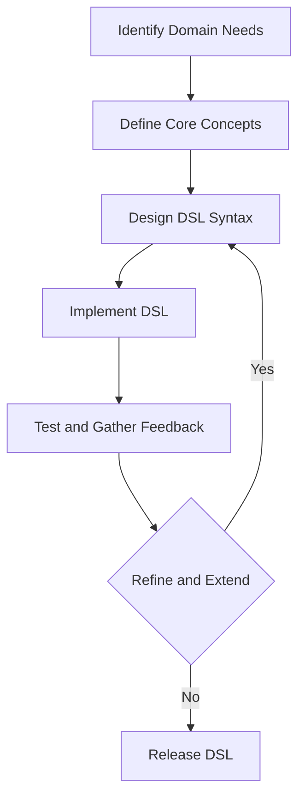

## 14.7 Best Practices for DSL Development

Creating Domain-Specific Languages (DSLs) in Ruby can significantly enhance the expressiveness and efficiency of your code, allowing you to tailor solutions to specific problem domains. However, developing effective DSLs requires careful consideration of design principles and best practices. In this section, we will explore key guidelines for creating DSLs that are simple, intuitive, and maintainable.

### Understanding Domain-Specific Languages

Before diving into best practices, let's clarify what a DSL is. A DSL is a programming language or specification language dedicated to a particular problem domain. Unlike general-purpose programming languages, DSLs are designed to express solutions in a way that is natural for the domain experts.

#### Types of DSLs

- **Internal DSLs**: These are built within a host language, leveraging its syntax and capabilities. Ruby's flexibility makes it an excellent choice for creating internal DSLs.
- **External DSLs**: These are standalone languages with their own syntax and parsers, often requiring more effort to implement.

### Key Principles for Designing DSLs

#### Simplicity and Intuitiveness

1. **Focus on the Domain**: Ensure that your DSL is tailored to the specific needs of the domain. Avoid adding features that do not directly address domain problems.

2. **Use Familiar Concepts**: Leverage concepts and terminology familiar to domain experts. This makes the DSL more accessible and reduces the learning curve.

3. **Minimize Syntax**: Keep the syntax as simple as possible. The goal is to make the DSL easy to read and write, even for those who are not programmers.

4. **Provide Clear Abstractions**: Abstract away complexity and provide a clear, concise interface for users. This helps in focusing on what needs to be done rather than how it is done.

#### Consistent Syntax and Conventions

1. **Establish Conventions**: Define and adhere to consistent naming conventions and syntax rules. Consistency aids in readability and reduces cognitive load.

2. **Leverage Ruby Idioms**: Utilize Ruby's idiomatic constructs to make the DSL feel natural to Ruby developers. This includes using blocks, method chaining, and other Ruby-specific features.

3. **Avoid Overusing Metaprogramming**: While Ruby's metaprogramming capabilities are powerful, overusing them can lead to code that is difficult to understand and maintain. Use metaprogramming judiciously to enhance, not complicate, your DSL.

#### Iterative Development and User Feedback

1. **Start Small**: Begin with a minimal set of features and gradually expand based on user feedback. This iterative approach helps in refining the DSL to better meet user needs.

2. **Engage with Users**: Regularly gather feedback from domain experts and users. Their insights are invaluable in shaping the DSL to be more effective and user-friendly.

3. **Test Extensively**: Ensure that your DSL is thoroughly tested. This includes unit tests for individual components and integration tests for the DSL as a whole.

#### Maintaining and Extending DSLs

1. **Document Extensively**: Provide comprehensive documentation for your DSL, including usage examples and explanations of key concepts. Good documentation is crucial for user adoption and understanding.

2. **Design for Extensibility**: Anticipate future needs and design your DSL to be easily extendable. This might involve modularizing components or providing hooks for customization.

3. **Monitor Performance**: Keep an eye on the performance of your DSL, especially as it grows. Optimize where necessary to ensure that it remains efficient.

### Code Example: A Simple Internal DSL in Ruby

Let's explore a simple example of an internal DSL in Ruby for defining workflows:

```ruby
class Workflow
  def initialize(&block)
    @steps = []
    instance_eval(&block) if block_given?
  end

  def step(name, &block)
    @steps << { name: name, action: block }
  end

  def execute
    @steps.each do |step|
      puts "Executing step: #{step[:name]}"
      step[:action].call
    end
  end
end

# Define a workflow using the DSL
workflow = Workflow.new do
  step "Initialize" do
    puts "Initializing..."
  end

  step "Process Data" do
    puts "Processing data..."
  end

  step "Finalize" do
    puts "Finalizing..."
  end
end

# Execute the workflow
workflow.execute
```

#### Explanation

- **DSL Structure**: The `Workflow` class provides a DSL for defining a series of steps. Each step has a name and an associated action.
- **Instance Evaluation**: The `instance_eval` method allows the block to be evaluated in the context of the `Workflow` instance, enabling the DSL syntax.
- **Execution**: The `execute` method iterates over the defined steps and executes each action.

### Visualizing DSL Development

To better understand the flow of DSL development, let's visualize the process using a flowchart:



**Description**: This flowchart illustrates the iterative process of DSL development, starting from identifying domain needs to releasing the DSL after refinement.

### Tips for Successful DSL Development

- **Keep It Domain-Focused**: Always align the DSL with the specific needs of the domain. Avoid adding generic programming constructs that dilute its purpose.
- **Prioritize Usability**: Design the DSL with the end-user in mind. Ensure that it is intuitive and easy to use for domain experts.
- **Iterate and Improve**: Continuously refine the DSL based on user feedback and evolving domain requirements.
- **Balance Power and Simplicity**: Strive to provide powerful abstractions while maintaining simplicity and clarity in the DSL's design.

### Knowledge Check

- **What is the primary goal of a DSL?**
  - To provide a language that is tailored to a specific domain, making it easier for domain experts to express solutions.

- **Why is consistency important in DSL design?**
  - Consistent syntax and conventions enhance readability and reduce the learning curve for users.

- **How can user feedback improve a DSL?**
  - User feedback helps identify pain points and areas for improvement, leading to a more effective and user-friendly DSL.

### Try It Yourself

Experiment with the provided workflow DSL example. Try adding new steps or modifying existing ones to see how the DSL adapts to changes. Consider how you might extend the DSL to include conditional logic or parallel execution of steps.

### Conclusion

Developing DSLs in Ruby can greatly enhance the expressiveness and efficiency of your code, but it requires careful consideration of design principles and best practices. By focusing on simplicity, consistency, and user feedback, you can create DSLs that are both powerful and easy to use. Remember, the journey of DSL development is iterative and collaborative, so keep refining and improving your DSL to better meet the needs of its users.

## Quiz: Best Practices for DSL Development



### What is the primary goal of a DSL?

- [x] To provide a language tailored to a specific domain
- [ ] To replace general-purpose programming languages
- [ ] To increase the complexity of code
- [ ] To make programming more difficult

> **Explanation:** A DSL is designed to simplify and tailor solutions for a specific domain, making it easier for domain experts to express solutions.

### Why is simplicity important in DSL design?

- [x] It makes the DSL easier to read and write
- [ ] It increases the complexity of the DSL
- [ ] It makes the DSL harder to maintain
- [ ] It reduces the number of users

> **Explanation:** Simplicity ensures that the DSL is accessible and easy to use, even for those who are not programmers.

### How can user feedback improve a DSL?

- [x] By identifying pain points and areas for improvement
- [ ] By making the DSL more complex
- [ ] By reducing the number of features
- [ ] By ignoring user needs

> **Explanation:** User feedback helps refine the DSL to better meet user needs and improve its effectiveness.

### What is a key benefit of consistent syntax in a DSL?

- [x] Enhanced readability and reduced learning curve
- [ ] Increased complexity
- [ ] Reduced usability
- [ ] Increased user confusion

> **Explanation:** Consistent syntax makes the DSL easier to understand and use, reducing the cognitive load on users.

### What should be avoided when using metaprogramming in DSLs?

- [x] Overusing it at the expense of code clarity
- [ ] Using it to enhance the DSL
- [ ] Using it to simplify the DSL
- [ ] Using it to improve performance

> **Explanation:** While metaprogramming is powerful, overusing it can lead to code that is difficult to understand and maintain.

### What is the benefit of starting small in DSL development?

- [x] It allows for gradual expansion based on user feedback
- [ ] It makes the DSL more complex
- [ ] It reduces the number of users
- [ ] It increases the initial development time

> **Explanation:** Starting small allows for iterative development, enabling the DSL to evolve based on user needs and feedback.

### Why is documentation important for DSLs?

- [x] It aids in user adoption and understanding
- [ ] It increases the complexity of the DSL
- [ ] It reduces the number of users
- [ ] It makes the DSL harder to use

> **Explanation:** Good documentation is crucial for helping users understand and effectively use the DSL.

### How can performance be monitored in a DSL?

- [x] By optimizing where necessary to ensure efficiency
- [ ] By ignoring performance issues
- [ ] By reducing the number of features
- [ ] By increasing the complexity

> **Explanation:** Monitoring and optimizing performance ensures that the DSL remains efficient and effective as it grows.

### What is a key consideration when designing for extensibility in DSLs?

- [x] Anticipating future needs and providing hooks for customization
- [ ] Ignoring future needs
- [ ] Reducing the number of features
- [ ] Increasing the complexity

> **Explanation:** Designing for extensibility allows the DSL to adapt to future requirements and user needs.

### True or False: A DSL should always replace general-purpose programming languages.

- [ ] True
- [x] False

> **Explanation:** A DSL is not meant to replace general-purpose languages but to complement them by providing domain-specific solutions.



Remember, this is just the beginning. As you progress, you'll build more complex and interactive DSLs. Keep experimenting, stay curious, and enjoy the journey!
