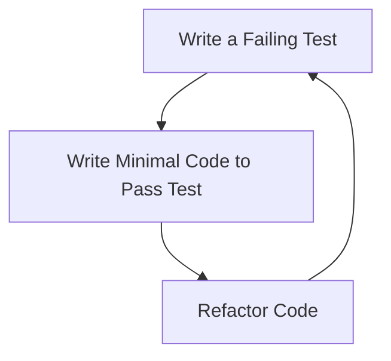

## 15.1 Test-Driven Development (TDD) in Ruby

Test-Driven Development (TDD) is a software development approach that emphasizes writing tests before writing the actual code. This methodology is particularly effective in Ruby, thanks to its expressive syntax and powerful testing frameworks like RSpec and Minitest. In this section, we will delve into the core principles of TDD, explore its benefits, and provide practical examples to help you integrate TDD into your Ruby projects.

### Understanding Test-Driven Development

TDD is built around a simple yet powerful cycle known as **Red, Green, Refactor**:

1. **Red**: Write a test that defines a function or improvements of a function, which should fail initially because the functionality is not yet implemented.
2. **Green**: Write the minimum amount of code necessary to pass the test.
3. **Refactor**: Clean up the code while ensuring that all tests still pass, improving the code's structure and readability without altering its behavior.

This cycle is repeated for each new feature or improvement, ensuring that the codebase remains robust and maintainable.

### Benefits of TDD

Implementing TDD in your Ruby projects offers several advantages:

- **Improved Code Quality**: By writing tests first, developers are forced to think through the design and requirements of their code, leading to cleaner and more reliable implementations.
- **Better Design**: TDD encourages decoupling and modular design, as code must be testable in isolation.
- **Reduced Bugs**: With tests covering all functionalities, bugs are caught early in the development process.
- **Documentation**: Tests serve as documentation for the codebase, providing clear examples of how functions are expected to behave.
- **Confidence in Refactoring**: Developers can refactor code with confidence, knowing that the tests will catch any unintended changes in behavior.

### Writing Tests First: RSpec and Minitest

Ruby offers several testing frameworks, with RSpec and Minitest being the most popular. Let's explore how to write tests first using these frameworks.

#### RSpec Example

RSpec is a behavior-driven development (BDD) framework that provides a readable syntax for writing tests.

```ruby
# spec/calculator_spec.rb
require 'rspec'
require_relative '../calculator'

RSpec.describe Calculator do
  describe '#add' do
    it 'returns the sum of two numbers' do
      calculator = Calculator.new
      expect(calculator.add(2, 3)).to eq(5)
    end
  end
end
```

In this example, we define a test for an `add` method in a `Calculator` class. The test expects the method to return the sum of two numbers.

#### Minitest Example

Minitest is a lightweight testing framework that comes with Ruby's standard library.

```ruby
# test/test_calculator.rb
require 'minitest/autorun'
require_relative '../calculator'

class TestCalculator < Minitest::Test
  def test_add
    calculator = Calculator.new
    assert_equal 5, calculator.add(2, 3)
  end
end
```

Here, we use Minitest to achieve the same goal as the RSpec example, testing the `add` method of the `Calculator` class.

### How TDD Influences Code Structure

TDD naturally leads to better code structure by encouraging:

- **Decoupling**: Code must be testable in isolation, which promotes separation of concerns.
- **Modularity**: Smaller, focused methods and classes are easier to test and maintain.
- **Clear Interfaces**: Tests define how classes and methods should interact, leading to well-defined interfaces.

### Best Practices for TDD

To maximize the benefits of TDD, consider the following best practices:

- **Write Small, Incremental Tests**: Focus on one small piece of functionality at a time. This keeps tests manageable and provides quick feedback.
- **Keep Tests Independent**: Each test should be able to run independently of others, ensuring that failures are isolated and easier to diagnose.
- **Refactor Regularly**: Use the refactor step to improve code quality and maintainability.
- **Use Descriptive Test Names**: Clearly describe what each test is verifying to improve readability and maintainability.
- **Mock External Dependencies**: Use mocks and stubs to isolate the code under test from external systems.

### Common Misconceptions and Challenges

Despite its benefits, TDD is often misunderstood. Here are some common misconceptions and challenges:

- **TDD Slows Down Development**: While TDD may initially seem slower, it saves time in the long run by reducing bugs and simplifying maintenance.
- **TDD is Only for New Projects**: TDD can be integrated into existing projects by gradually adding tests as new features are developed or existing code is refactored.
- **TDD Guarantees Bug-Free Code**: While TDD reduces the likelihood of bugs, it does not eliminate them entirely. Tests must be well-designed and comprehensive.

### Try It Yourself

To get hands-on experience with TDD in Ruby, try modifying the examples provided:

- Add a `subtract` method to the `Calculator` class and write tests for it.
- Experiment with edge cases, such as adding negative numbers or large integers.
- Refactor the `Calculator` class to improve its design and ensure all tests still pass.

### Visualizing the TDD Cycle

To better understand the TDD process, let's visualize the Red, Green, Refactor cycle:



This diagram illustrates the iterative nature of TDD, where each cycle builds upon the previous one to enhance the codebase.

### References and Further Reading

- [RSpec Documentation](https://rspec.info/documentation/)
- [Minitest Documentation](https://ruby-doc.org/stdlib-2.7.0/libdoc/minitest/rdoc/Minitest.html)
- [Test-Driven Development by Example](https://www.amazon.com/Test-Driven-Development-Kent-Beck/dp/0321146530) by Kent Beck

### Knowledge Check

- What are the three steps in the TDD cycle?
- How does TDD influence code design?
- What are some common misconceptions about TDD?

### Embrace the Journey

Remember, TDD is a journey, not a destination. As you practice TDD, you'll develop a deeper understanding of your code and its requirements. Keep experimenting, stay curious, and enjoy the process of building robust Ruby applications.

## Quiz: Test-Driven Development (TDD) in Ruby



### What is the first step in the TDD cycle?

- [x] Write a failing test
- [ ] Write the code
- [ ] Refactor the code
- [ ] Deploy the application

> **Explanation:** The first step in TDD is to write a test that fails because the functionality is not yet implemented.

### Which of the following is a benefit of TDD?

- [x] Improved code quality
- [x] Better design
- [ ] Increased code complexity
- [ ] Guaranteed bug-free code

> **Explanation:** TDD improves code quality and design by encouraging thoughtful planning and modularity, but it does not guarantee bug-free code.

### Which Ruby testing framework is known for its behavior-driven development approach?

- [x] RSpec
- [ ] Minitest
- [ ] Test::Unit
- [ ] Cucumber

> **Explanation:** RSpec is a BDD framework that provides a readable syntax for writing tests.

### What should tests be in order to be effective?

- [x] Independent
- [ ] Dependent on other tests
- [ ] Complex
- [ ] Rarely run

> **Explanation:** Tests should be independent to ensure that failures are isolated and easier to diagnose.

### What is a common misconception about TDD?

- [x] TDD slows down development
- [ ] TDD improves code quality
- [ ] TDD encourages decoupling
- [ ] TDD is only for new projects

> **Explanation:** A common misconception is that TDD slows down development, but it actually saves time in the long run by reducing bugs and simplifying maintenance.

### How does TDD influence code structure?

- [x] Encourages decoupling
- [x] Promotes modularity
- [ ] Increases complexity
- [ ] Discourages refactoring

> **Explanation:** TDD encourages decoupling and modularity, leading to cleaner and more maintainable code.

### What is the purpose of the refactor step in TDD?

- [x] Improve code quality
- [ ] Add new features
- [ ] Write more tests
- [ ] Deploy the application

> **Explanation:** The refactor step is used to improve code quality and maintainability without altering its behavior.

### Which of the following is a best practice for TDD?

- [x] Write small, incremental tests
- [ ] Write large, comprehensive tests
- [ ] Avoid refactoring
- [ ] Depend on external systems

> **Explanation:** Writing small, incremental tests provides quick feedback and keeps tests manageable.

### What is a challenge in adopting TDD?

- [x] Initial learning curve
- [ ] Lack of testing frameworks
- [ ] Inability to refactor
- [ ] Difficulty in writing tests

> **Explanation:** The initial learning curve can be a challenge, but with practice, TDD becomes a valuable tool for developers.

### TDD can be integrated into existing projects.

- [x] True
- [ ] False

> **Explanation:** TDD can be integrated into existing projects by gradually adding tests as new features are developed or existing code is refactored.


