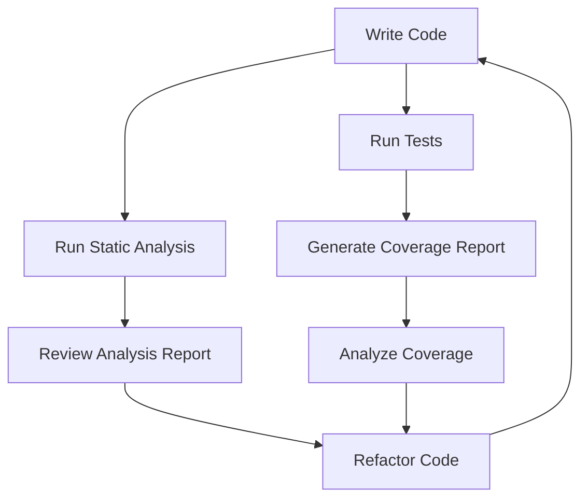

## 15.10 Code Coverage and Static Analysis

In the realm of software development, ensuring the quality and maintainability of code is paramount. Two critical practices that aid in achieving this are code coverage and static analysis. These practices help developers identify potential issues early, enforce coding standards, and ensure that the codebase remains robust and scalable. In this section, we will delve into the concepts of code coverage and static analysis, explore the tools available for Ruby developers, and provide practical examples to illustrate their application.

### Understanding Code Coverage

**Code coverage** is a metric used to determine the extent to which the source code of a program is executed when a particular test suite runs. It provides insights into which parts of the code are being tested and which are not, helping developers identify untested areas that might contain bugs.

#### Significance of Code Coverage

- **Identifying Untested Code**: Code coverage highlights parts of the code that are not covered by tests, allowing developers to focus their testing efforts on these areas.
- **Improving Test Quality**: By ensuring that a higher percentage of code is covered by tests, developers can increase the likelihood of catching bugs and reducing defects.
- **Facilitating Refactoring**: With comprehensive test coverage, developers can refactor code with confidence, knowing that any changes will be validated by the existing tests.

### Tools for Measuring Code Coverage in Ruby

One of the most popular tools for measuring code coverage in Ruby is **SimpleCov**. SimpleCov is a powerful code coverage analysis tool that integrates seamlessly with Ruby applications and provides detailed reports on test coverage.

#### Setting Up SimpleCov

To get started with SimpleCov, you need to add it to your Gemfile:

```ruby
# Gemfile
gem 'simplecov', require: false, group: :test
```

After installing the gem, configure SimpleCov in your test helper file:

```ruby
# test/test_helper.rb or spec/spec_helper.rb
require 'simplecov'
SimpleCov.start
```

This configuration will start collecting coverage data whenever your tests are run.

#### Interpreting Coverage Reports

Once SimpleCov is set up, running your test suite will generate a coverage report. This report typically includes:

- **Overall Coverage Percentage**: Indicates the percentage of code covered by tests.
- **File-Specific Coverage**: Shows coverage details for each file in the codebase.
- **Uncovered Lines**: Highlights specific lines of code that are not covered by any test.

Here's an example of how a SimpleCov report might look:

```plaintext
COVERAGE: 90.00% -- 180/200 lines in 10 files
```

#### Limitations of Coverage Metrics

While code coverage is a valuable metric, it's important to recognize its limitations:

- **Coverage Does Not Equal Quality**: A high coverage percentage does not guarantee that the tests are effective or that the code is bug-free.
- **Focus on Meaningful Tests**: Aim for meaningful tests that validate the behavior of the code rather than simply increasing the coverage percentage.
- **Avoid Coverage Obsession**: Strive for a balance between achieving high coverage and writing quality tests.

### Introduction to Static Analysis

**Static analysis** involves examining the source code without executing it to identify potential issues, enforce coding standards, and detect code smells. It helps maintain code quality by providing feedback on code style, complexity, and potential errors.

#### Benefits of Static Analysis

- **Early Detection of Issues**: Static analysis tools can catch potential bugs and code smells before the code is even run.
- **Enforcing Coding Standards**: These tools help ensure that the code adheres to predefined style guides and best practices.
- **Improving Code Readability**: By enforcing consistent coding styles, static analysis makes the codebase more readable and maintainable.

### Tools for Static Analysis in Ruby

One of the most widely used static analysis tools for Ruby is **RuboCop**. RuboCop is a Ruby gem that provides a comprehensive suite of style checks and code quality metrics.

#### Setting Up RuboCop

To use RuboCop, add it to your Gemfile:

```ruby
# Gemfile
gem 'rubocop', require: false, group: :development
```

After installing the gem, you can run RuboCop from the command line:

```bash
$ bundle exec rubocop
```

#### Configuring RuboCop

RuboCop can be configured using a `.rubocop.yml` file, where you can specify which checks to enable or disable, as well as customize the rules to fit your project's needs.

Example configuration:

```yaml
# .rubocop.yml
AllCops:
  TargetRubyVersion: 3.0

Metrics/LineLength:
  Max: 100

Style/StringLiterals:
  EnforcedStyle: double_quotes
```

#### Detecting Code Smells and Enforcing Style Guidelines

RuboCop provides feedback on various aspects of code quality, including:

- **Code Complexity**: Identifies methods that are too complex and suggests refactoring.
- **Style Violations**: Enforces consistent coding styles, such as indentation, naming conventions, and line length.
- **Potential Bugs**: Detects common mistakes, such as unused variables or unreachable code.

### Visualizing Code Coverage and Static Analysis

To better understand the workflow of code coverage and static analysis, let's visualize the process using a flowchart:



**Description**: This flowchart illustrates the iterative process of writing code, running tests, generating coverage reports, performing static analysis, and refactoring code based on the insights gained.

### Practical Example: Combining SimpleCov and RuboCop

Let's walk through a practical example of using SimpleCov and RuboCop together to improve code quality.

#### Step 1: Set Up SimpleCov

Add SimpleCov to your test suite as described earlier. Run your tests to generate a coverage report.

#### Step 2: Analyze Coverage Report

Review the coverage report to identify untested areas. Focus on writing tests for critical parts of the code that are not covered.

#### Step 3: Run RuboCop

Execute RuboCop to analyze the codebase for style violations and potential issues. Address any warnings or errors reported by RuboCop.

#### Step 4: Refactor and Test

Based on the insights from SimpleCov and RuboCop, refactor the code to improve quality and maintainability. Write additional tests to cover newly added or refactored code.

#### Step 5: Iterate

Repeat the process iteratively to continuously improve the codebase.

### Try It Yourself

To get hands-on experience, try modifying the code examples provided in this section. Experiment with different configurations in SimpleCov and RuboCop to see how they affect the coverage and analysis reports. This will help you gain a deeper understanding of how these tools can be tailored to fit your project's needs.

### Key Takeaways

- **Code Coverage**: A metric that helps identify untested parts of the codebase, but should not be the sole focus.
- **Static Analysis**: A technique for examining code without executing it, useful for enforcing coding standards and detecting potential issues.
- **SimpleCov and RuboCop**: Essential tools for Ruby developers to measure code coverage and perform static analysis, respectively.
- **Iterative Improvement**: Continuously refine the codebase by iterating through testing, coverage analysis, and static analysis.

### References and Further Reading

- [SimpleCov GitHub Repository](https://github.com/simplecov-ruby/simplecov)
- [RuboCop Official Website](https://rubocop.org/)
- [Ruby Style Guide](https://rubystyle.guide/)

## Quiz: Code Coverage and Static Analysis



### What is the primary purpose of code coverage?

- [x] To identify untested parts of the codebase
- [ ] To improve code execution speed
- [ ] To enforce coding standards
- [ ] To refactor code automatically

> **Explanation:** Code coverage helps identify which parts of the code are not covered by tests, allowing developers to focus on those areas.

### Which tool is commonly used for measuring code coverage in Ruby?

- [x] SimpleCov
- [ ] RuboCop
- [ ] RSpec
- [ ] Bundler

> **Explanation:** SimpleCov is a popular tool for measuring code coverage in Ruby applications.

### What does a static analysis tool like RuboCop help enforce?

- [x] Coding standards and style guidelines
- [ ] Test coverage percentage
- [ ] Code execution speed
- [ ] Automatic code refactoring

> **Explanation:** RuboCop enforces coding standards and style guidelines to ensure consistency and quality in the codebase.

### What is a limitation of code coverage metrics?

- [x] High coverage does not guarantee effective tests
- [ ] It automatically fixes code issues
- [ ] It improves code readability
- [ ] It increases code execution speed

> **Explanation:** High code coverage does not necessarily mean that the tests are effective or that the code is bug-free.

### How can static analysis improve code quality?

- [x] By detecting potential bugs and enforcing style guidelines
- [ ] By increasing code execution speed
- [ ] By generating test cases automatically
- [ ] By reducing code complexity

> **Explanation:** Static analysis detects potential issues and enforces coding standards, which helps improve code quality.

### Which file is used to configure RuboCop?

- [x] .rubocop.yml
- [ ] Gemfile
- [ ] Rakefile
- [ ] .gitignore

> **Explanation:** RuboCop is configured using a `.rubocop.yml` file, where rules and checks can be customized.

### What is the benefit of using both SimpleCov and RuboCop together?

- [x] Comprehensive code quality assessment
- [ ] Faster code execution
- [ ] Automatic code refactoring
- [ ] Increased test coverage

> **Explanation:** Using both tools provides a comprehensive assessment of code quality by measuring coverage and enforcing style guidelines.

### What should be the focus when interpreting coverage reports?

- [x] Writing meaningful tests for uncovered code
- [ ] Achieving 100% coverage
- [ ] Reducing code execution time
- [ ] Increasing code complexity

> **Explanation:** The focus should be on writing meaningful tests for uncovered code rather than solely aiming for high coverage.

### What does RuboCop's Metrics/LineLength check enforce?

- [x] Maximum line length in the code
- [ ] Minimum test coverage percentage
- [ ] Code execution speed
- [ ] Number of methods in a class

> **Explanation:** The Metrics/LineLength check enforces a maximum line length to maintain readability.

### True or False: Static analysis tools can automatically fix all code issues.

- [ ] True
- [x] False

> **Explanation:** Static analysis tools can detect issues and suggest fixes, but they do not automatically fix all code issues.



Remember, this is just the beginning. As you progress, you'll build more complex and interactive applications. Keep experimenting, stay curious, and enjoy the journey!
