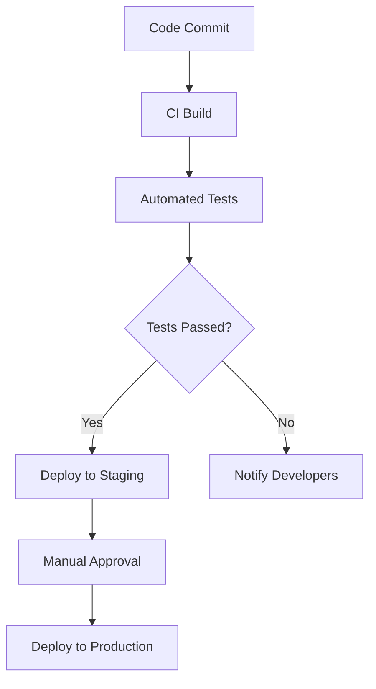

## 15.11 Continuous Integration and Deployment

In the fast-paced world of software development, delivering high-quality applications quickly and efficiently is crucial. Continuous Integration (CI) and Continuous Deployment/Delivery (CD) are practices that help achieve this by automating the testing and deployment processes. In this section, we will explore the concepts of CI/CD, their benefits, and how to implement them in Ruby applications using popular tools like GitHub Actions, Travis CI, and Jenkins.

### Understanding Continuous Integration and Continuous Deployment/Delivery

**Continuous Integration (CI)** is a development practice where developers integrate code into a shared repository frequently, ideally several times a day. Each integration is verified by an automated build and test process, allowing teams to detect problems early.

**Continuous Deployment (CD)** extends CI by automatically deploying every change that passes the automated tests to production. Continuous Delivery, on the other hand, ensures that the code is always in a deployable state, but the actual deployment is a manual step.

### Benefits of CI/CD in Software Development

Implementing CI/CD offers several advantages:

- **Faster Time to Market**: By automating testing and deployment, teams can release features and fixes more quickly.
- **Improved Code Quality**: Automated tests catch bugs early, reducing the chances of defects reaching production.
- **Reduced Manual Effort**: Automation minimizes the need for manual testing and deployment, freeing up developers to focus on coding.
- **Enhanced Collaboration**: CI/CD encourages frequent code integration, promoting collaboration and reducing integration conflicts.
- **Increased Confidence**: With automated tests and deployments, teams can be more confident in the stability and reliability of their software.

### Setting Up CI Pipelines

Let's explore how to set up CI pipelines using popular services like GitHub Actions, Travis CI, and Jenkins.

#### GitHub Actions

GitHub Actions is a powerful CI/CD tool integrated directly into GitHub. It allows you to automate workflows for building, testing, and deploying your code.

Here's an example of setting up a CI pipeline for a Ruby application using GitHub Actions:

```yaml
name: Ruby CI

on:
  push:
    branches:
      - main
  pull_request:
    branches:
      - main

jobs:
  build:
    runs-on: ubuntu-latest

    steps:
    - uses: actions/checkout@v2
    - name: Set up Ruby
      uses: ruby/setup-ruby@v1
      with:
        ruby-version: 3.0
    - name: Install dependencies
      run: bundle install
    - name: Run tests
      run: bundle exec rspec
```

In this example, the workflow is triggered on pushes and pull requests to the `main` branch. It checks out the code, sets up Ruby, installs dependencies, and runs tests using RSpec.

#### Travis CI

Travis CI is another popular CI service that integrates seamlessly with GitHub repositories. Here's how you can set up a basic CI pipeline for a Ruby project:

```yaml
language: ruby
rvm:
  - 3.0
before_install:
  - gem install bundler
script:
  - bundle exec rspec
```

This configuration specifies the Ruby version and installs the necessary gems before running the test suite with RSpec.

#### Jenkins

Jenkins is a widely-used open-source automation server that supports building, deploying, and automating any project. To set up a CI pipeline in Jenkins:

1. **Install Jenkins**: Download and install Jenkins from [jenkins.io](https://jenkins.io/).
2. **Create a New Job**: In Jenkins, create a new Freestyle project.
3. **Configure Source Code Management**: Connect your GitHub repository.
4. **Add Build Steps**: Add build steps to install dependencies and run tests.

Here's a simple shell script you might use in Jenkins:

```bash
#!/bin/bash
bundle install
bundle exec rspec
```

### Automating Testing, Code Quality Checks, and Deployments

Automating testing and code quality checks is a crucial part of CI/CD. Here are some best practices:

- **Unit Testing**: Use tools like RSpec or Minitest to write unit tests for your Ruby code.
- **Code Quality Checks**: Integrate tools like RuboCop for static code analysis to enforce coding standards.
- **Security Scans**: Use tools like Brakeman to scan for security vulnerabilities in your Ruby on Rails applications.

For deployment automation, consider using tools like Capistrano or Heroku for Ruby applications. These tools can automate the deployment process, ensuring that your application is deployed consistently across environments.

### Best Practices for Maintaining a CI/CD Pipeline

To maintain an effective CI/CD pipeline, follow these best practices:

- **Keep Pipelines Fast**: Optimize your CI/CD pipeline to run quickly by parallelizing tests and using caching.
- **Monitor Pipeline Health**: Regularly monitor the health of your CI/CD pipeline to ensure it runs smoothly.
- **Version Control Configuration**: Store your CI/CD configuration in version control to track changes and collaborate with your team.
- **Secure Your Pipeline**: Protect sensitive information like API keys and credentials using secrets management tools.

### Handling Secrets and Configuration in CI/CD Environments

Managing secrets and configuration securely is critical in CI/CD environments. Here are some strategies:

- **Environment Variables**: Use environment variables to store sensitive information and access them in your CI/CD pipeline.
- **Secrets Management Tools**: Use tools like HashiCorp Vault or AWS Secrets Manager to manage secrets securely.
- **Configuration Files**: Store non-sensitive configuration in version-controlled files and use environment-specific overrides for sensitive data.

### Visualizing CI/CD Pipelines

To better understand the flow of a CI/CD pipeline, let's visualize it using a Mermaid.js diagram:



This diagram illustrates a typical CI/CD pipeline where code commits trigger a build, followed by automated tests. If tests pass, the code is deployed to a staging environment, and upon manual approval, it is deployed to production.

### Try It Yourself

To get hands-on experience with CI/CD, try setting up a simple Ruby project with a CI pipeline using GitHub Actions or Travis CI. Experiment with adding automated tests and code quality checks. Modify the pipeline to deploy to a staging environment and observe how changes are automatically tested and deployed.

### Knowledge Check

- What are the key differences between Continuous Integration and Continuous Deployment?
- How can you automate code quality checks in a CI/CD pipeline?
- What tools can you use to manage secrets in a CI/CD environment?

### Summary

In this section, we explored the concepts of Continuous Integration and Continuous Deployment, their benefits, and how to implement them in Ruby applications. We discussed setting up CI pipelines using GitHub Actions, Travis CI, and Jenkins, and highlighted best practices for maintaining a CI/CD pipeline. Remember, implementing CI/CD is a journey, and continuous improvement is key to reaping its full benefits.

## Quiz: Continuous Integration and Deployment



### What is Continuous Integration (CI)?

- [x] A practice where developers frequently integrate code into a shared repository
- [ ] A process of manually deploying code to production
- [ ] A method of writing code without testing
- [ ] A technique for managing project documentation

> **Explanation:** Continuous Integration involves integrating code frequently into a shared repository, verified by automated builds and tests.

### What is the main benefit of Continuous Deployment (CD)?

- [x] Automating the deployment of every change that passes tests to production
- [ ] Requiring manual approval for every deployment
- [ ] Reducing the need for automated tests
- [ ] Increasing the complexity of the deployment process

> **Explanation:** Continuous Deployment automates the deployment of changes that pass tests, ensuring quick and reliable delivery to production.

### Which tool is integrated directly into GitHub for CI/CD?

- [x] GitHub Actions
- [ ] Jenkins
- [ ] Travis CI
- [ ] CircleCI

> **Explanation:** GitHub Actions is integrated directly into GitHub, allowing for seamless CI/CD workflows.

### What is a common tool for static code analysis in Ruby?

- [x] RuboCop
- [ ] RSpec
- [ ] Capistrano
- [ ] Heroku

> **Explanation:** RuboCop is used for static code analysis in Ruby to enforce coding standards.

### How can you securely manage secrets in a CI/CD environment?

- [x] Use environment variables and secrets management tools
- [ ] Store them in plain text files
- [ ] Hardcode them in the source code
- [ ] Share them via email

> **Explanation:** Secrets should be managed using environment variables and secrets management tools to ensure security.

### What is the purpose of automated tests in a CI/CD pipeline?

- [x] To catch bugs early and ensure code quality
- [ ] To slow down the deployment process
- [ ] To replace manual testing entirely
- [ ] To increase the complexity of the codebase

> **Explanation:** Automated tests catch bugs early and ensure code quality, making the deployment process more reliable.

### What is a best practice for maintaining a CI/CD pipeline?

- [x] Keep pipelines fast and monitor their health
- [ ] Avoid using version control for configuration
- [ ] Run all tests manually
- [ ] Ignore pipeline failures

> **Explanation:** Keeping pipelines fast and monitoring their health are best practices for maintaining an effective CI/CD pipeline.

### What is the role of manual approval in a CI/CD pipeline?

- [x] To approve deployments to production after testing
- [ ] To manually run tests
- [ ] To write deployment scripts
- [ ] To integrate code into the repository

> **Explanation:** Manual approval is often required before deploying to production to ensure readiness and compliance.

### Which of the following is a CI/CD service that integrates with GitHub?

- [x] Travis CI
- [ ] Docker
- [ ] AWS Lambda
- [ ] PostgreSQL

> **Explanation:** Travis CI is a CI/CD service that integrates with GitHub for automated builds and tests.

### True or False: Continuous Delivery requires every change to be deployed to production automatically.

- [ ] True
- [x] False

> **Explanation:** Continuous Delivery ensures the code is always in a deployable state, but the actual deployment to production is a manual step.



Remember, this is just the beginning. As you progress, you'll build more complex and interactive CI/CD pipelines. Keep experimenting, stay curious, and enjoy the journey!
