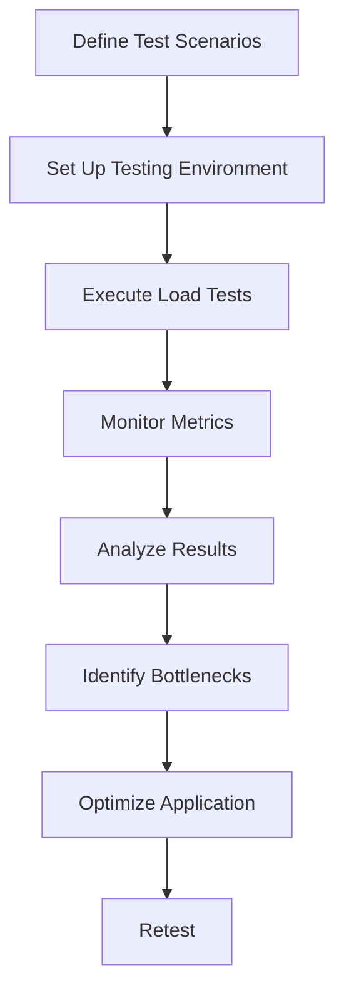

## 15.12 Performance and Load Testing

In the world of software development, ensuring that your Ruby applications can handle the expected load and perform efficiently is crucial. Performance and load testing are essential practices that help developers identify bottlenecks, optimize resource usage, and ensure a smooth user experience. In this section, we will explore the purpose of performance and load testing, introduce popular tools, and provide practical examples to help you simulate load on a Ruby application. We'll also discuss key metrics to monitor, how to analyze results, and the importance of testing in environments similar to production.

### Understanding Performance and Load Testing

**Performance Testing** is the process of determining the speed, responsiveness, and stability of a computer, network, software program, or device under a workload. It helps ensure that the application meets the performance criteria and provides a good user experience.

**Load Testing**, a subset of performance testing, involves simulating a specific number of users or transactions to determine how the application behaves under expected load conditions. It helps identify the maximum operating capacity of an application and any bottlenecks that might impede performance.

### Purpose of Performance and Load Testing

1. **Identify Bottlenecks**: Determine parts of the application that are slow or inefficient.
2. **Ensure Scalability**: Verify that the application can handle increased loads as the user base grows.
3. **Optimize Resource Usage**: Ensure efficient use of CPU, memory, and other resources.
4. **Improve User Experience**: Provide a seamless and responsive experience to end-users.
5. **Prevent Downtime**: Identify potential issues before they affect the production environment.

### Tools for Performance and Load Testing

Several tools are available for performance and load testing. Here, we introduce three popular ones:

#### 1. JMeter

[JMeter](https://jmeter.apache.org/) is an open-source tool designed for load testing and measuring performance. It is widely used due to its flexibility and support for various protocols, including HTTP, HTTPS, SOAP, and more.

#### 2. BlazeMeter

[BlazeMeter](https://www.blazemeter.com/) is a cloud-based performance testing tool that extends JMeter's capabilities. It allows for large-scale load testing and provides detailed analytics and reporting.

#### 3. Siege

[Siege](https://www.joedog.org/siege-home/) is a lightweight command-line tool for HTTP load testing. It is simple to use and effective for quick performance assessments.

### Simulating Load on a Ruby Application

To effectively simulate load on a Ruby application, follow these steps:

#### Step 1: Define Test Scenarios

Identify the critical user journeys and actions that need to be tested. This could include logging in, searching, or processing transactions.

#### Step 2: Set Up the Testing Environment

Ensure that the testing environment closely resembles the production environment to get accurate results. This includes hardware, software, network configurations, and data sets.

#### Step 3: Use JMeter for Load Testing

Let's create a simple JMeter test plan to simulate load on a Ruby web application.

```xml
<jmeterTestPlan version="1.2" properties="5.0" jmeter="5.4.1">
  <hashTree>
    <TestPlan guiclass="TestPlanGui" testclass="TestPlan" testname="Test Plan" enabled="true">
      <stringProp name="TestPlan.comments"></stringProp>
      <boolProp name="TestPlan.functional_mode">false</boolProp>
      <boolProp name="TestPlan.tearDown_on_shutdown">true</boolProp>
      <boolProp name="TestPlan.serialize_threadgroups">false</boolProp>
      <elementProp name="TestPlan.user_defined_variables" elementType="Arguments" guiclass="ArgumentsPanel" testclass="Arguments" testname="User Defined Variables" enabled="true">
        <collectionProp name="Arguments.arguments"/>
      </elementProp>
      <stringProp name="TestPlan.user_define_classpath"></stringProp>
    </TestPlan>
    <hashTree>
      <ThreadGroup guiclass="ThreadGroupGui" testclass="ThreadGroup" testname="Thread Group" enabled="true">
        <stringProp name="ThreadGroup.on_sample_error">continue</stringProp>
        <elementProp name="ThreadGroup.main_controller" elementType="LoopController" guiclass="LoopControlPanel" testclass="LoopController" testname="Loop Controller" enabled="true">
          <boolProp name="LoopController.continue_forever">false</boolProp>
          <stringProp name="LoopController.loops">1</stringProp>
        </elementProp>
        <stringProp name="ThreadGroup.num_threads">10</stringProp>
        <stringProp name="ThreadGroup.ramp_time">10</stringProp>
        <longProp name="ThreadGroup.start_time">1633024800000</longProp>
        <longProp name="ThreadGroup.end_time">1633028400000</longProp>
        <boolProp name="ThreadGroup.scheduler">false</boolProp>
        <stringProp name="ThreadGroup.duration"></stringProp>
        <stringProp name="ThreadGroup.delay"></stringProp>
      </ThreadGroup>
      <hashTree>
        <HTTPSamplerProxy guiclass="HttpTestSampleGui" testclass="HTTPSamplerProxy" testname="HTTP Request" enabled="true">
          <elementProp name="HTTPsampler.Arguments" elementType="Arguments">
            <collectionProp name="Arguments.arguments"/>
          </elementProp>
          <stringProp name="HTTPSampler.domain">example.com</stringProp>
          <stringProp name="HTTPSampler.port"></stringProp>
          <stringProp name="HTTPSampler.protocol">http</stringProp>
          <stringProp name="HTTPSampler.contentEncoding"></stringProp>
          <stringProp name="HTTPSampler.path">/login</stringProp>
          <stringProp name="HTTPSampler.method">GET</stringProp>
          <boolProp name="HTTPSampler.follow_redirects">true</boolProp>
          <boolProp name="HTTPSampler.auto_redirects">false</boolProp>
          <boolProp name="HTTPSampler.use_keepalive">true</boolProp>
          <boolProp name="HTTPSampler.DO_MULTIPART_POST">false</boolProp>
          <stringProp name="HTTPSampler.monitor">false</stringProp>
          <stringProp name="HTTPSampler.embedded_url_re"></stringProp>
          <stringProp name="HTTPSampler.connect_timeout"></stringProp>
          <stringProp name="HTTPSampler.response_timeout"></stringProp>
        </HTTPSamplerProxy>
        <hashTree/>
      </hashTree>
    </hashTree>
  </hashTree>
</jmeterTestPlan>
```

**Explanation**: This JMeter test plan simulates 10 users accessing the `/login` endpoint of a web application. The `ramp_time` is set to 10 seconds, meaning the users will be added gradually over this period.

#### Step 4: Use Siege for Quick Load Testing

Siege is perfect for quick tests. Here's how you can use it:

```bash
siege -c 10 -t 1M http://example.com/login
```

**Explanation**: This command simulates 10 concurrent users accessing the `/login` endpoint for 1 minute.

### Key Metrics to Monitor

When conducting performance and load testing, it's crucial to monitor the following metrics:

1. **Response Time**: The time taken to receive a response from the server after a request is made.
2. **Throughput**: The number of requests processed by the server in a given time frame.
3. **Error Rate**: The percentage of requests that result in errors.
4. **Resource Utilization**: CPU, memory, disk, and network usage.
5. **Latency**: The delay before a transfer of data begins following an instruction for its transfer.

### Analyzing Results and Identifying Bottlenecks

Once the tests are complete, analyze the results to identify bottlenecks:

1. **Review Response Times**: Identify any requests that have significantly higher response times.
2. **Check Throughput**: Ensure that the throughput meets the expected levels.
3. **Monitor Resource Utilization**: Look for any resource that is consistently at high usage.
4. **Identify Error Patterns**: Analyze error logs to identify common issues.

### Importance of Testing in Production-like Environments

Testing in environments that closely mimic production is essential for accurate results. Differences in hardware, software, network configurations, or data can lead to misleading results. Ensure that the test environment is as close to production as possible to get reliable insights.

### Try It Yourself

Experiment with the tools and examples provided. Try modifying the JMeter test plan to simulate different user scenarios or use Siege to test other endpoints. Observe how changes in the test parameters affect the results.

### Visualizing Performance Testing Workflow



**Description**: This flowchart illustrates the workflow of performance testing, from defining test scenarios to optimizing the application and retesting.

### References and Further Reading

- [JMeter Documentation](https://jmeter.apache.org/usermanual/index.html)
- [BlazeMeter Guide](https://www.blazemeter.com/guide)
- [Siege User Guide](https://www.joedog.org/siege-manual/)

### Knowledge Check

- What are the key differences between performance testing and load testing?
- How can you simulate load on a Ruby application using JMeter?
- What metrics should you monitor during load testing?
- Why is it important to test in environments similar to production?

### Embrace the Journey

Remember, performance and load testing are iterative processes. As you gain more insights into your application's behavior under load, you'll be better equipped to optimize and ensure a seamless user experience. Keep experimenting, stay curious, and enjoy the journey!

## Quiz: Performance and Load Testing



### What is the primary purpose of performance testing?

- [x] To determine the speed, responsiveness, and stability of an application under a workload.
- [ ] To identify security vulnerabilities in an application.
- [ ] To ensure the application has no bugs.
- [ ] To test the user interface design.

> **Explanation:** Performance testing focuses on assessing the speed, responsiveness, and stability of an application under various conditions.

### Which tool is NOT typically used for load testing?

- [ ] JMeter
- [ ] BlazeMeter
- [x] Git
- [ ] Siege

> **Explanation:** Git is a version control system, not a load testing tool.

### What does the `-c` flag in the Siege command represent?

- [ ] The number of requests to send.
- [x] The number of concurrent users.
- [ ] The duration of the test.
- [ ] The URL to test.

> **Explanation:** The `-c` flag in Siege specifies the number of concurrent users to simulate.

### Why is it important to test in environments similar to production?

- [x] To ensure accurate and reliable test results.
- [ ] To save on testing costs.
- [ ] To reduce the complexity of testing.
- [ ] To avoid using real data.

> **Explanation:** Testing in environments similar to production ensures that the test results are accurate and reflective of real-world conditions.

### Which metric indicates the number of requests processed by the server in a given time frame?

- [ ] Response Time
- [x] Throughput
- [ ] Latency
- [ ] Error Rate

> **Explanation:** Throughput measures the number of requests processed by the server in a specific time frame.

### What is the role of BlazeMeter in performance testing?

- [x] It extends JMeter's capabilities for large-scale load testing.
- [ ] It is used for version control.
- [ ] It provides a graphical user interface for Ruby applications.
- [ ] It is a tool for testing user interfaces.

> **Explanation:** BlazeMeter is a cloud-based tool that extends JMeter's capabilities for large-scale load testing and provides detailed analytics.

### What does a high error rate during load testing indicate?

- [x] Potential issues or bottlenecks in the application.
- [ ] The application is performing optimally.
- [ ] The test environment is not set up correctly.
- [ ] The application has excellent scalability.

> **Explanation:** A high error rate indicates potential issues or bottlenecks that need to be addressed.

### What is the significance of response time in performance testing?

- [x] It measures the time taken to receive a response from the server after a request is made.
- [ ] It indicates the number of concurrent users.
- [ ] It measures the total number of requests sent.
- [ ] It is a measure of the application's security.

> **Explanation:** Response time is a critical metric that measures how quickly the server responds to requests.

### What does the term "bottleneck" refer to in performance testing?

- [x] A point in the application where performance is limited or slowed down.
- [ ] A security vulnerability.
- [ ] A feature that enhances application speed.
- [ ] A tool used for testing.

> **Explanation:** A bottleneck is a point in the application where performance is limited or slowed down, affecting overall efficiency.

### True or False: Load testing can help prevent application downtime.

- [x] True
- [ ] False

> **Explanation:** Load testing helps identify potential issues before they affect the production environment, thus preventing downtime.


