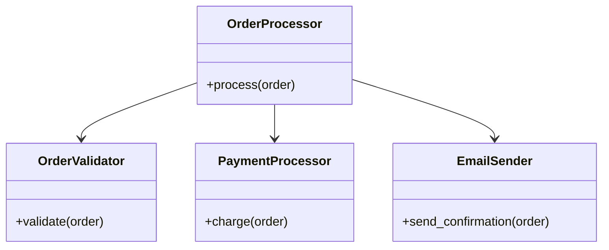

## 15.13 Designing for Testability

In the world of software development, testability is a crucial aspect that directly impacts the quality and maintainability of code. Designing for testability means writing code that is easy to test, which in turn leads to more reliable and robust applications. In this section, we will explore the principles and practices that can help you design Ruby code with testability in mind. We will cover concepts such as single responsibility, loose coupling, dependency injection, and more, providing examples and insights into how these principles can be applied in Ruby development.

### Why Designing for Testability is Important

Designing for testability is not just about making it easier to write tests; it is about creating a codebase that is more modular, flexible, and maintainable. Here are some reasons why testability is important:

- **Improved Code Quality**: Testable code is often cleaner and more organized, leading to fewer bugs and easier maintenance.
- **Faster Development**: With a testable codebase, developers can quickly write and run tests, catching issues early in the development process.
- **Easier Refactoring**: Testable code is typically more modular, making it easier to refactor and improve without introducing new bugs.
- **Better Collaboration**: A codebase that is easy to test is also easier for new team members to understand and work with.

### Principles of Designing for Testability

To design code that is easy to test, we need to adhere to certain principles. Let's explore some of these principles in detail.

#### Single Responsibility Principle

The Single Responsibility Principle (SRP) states that a class should have only one reason to change, meaning it should have only one job or responsibility. This principle helps in creating small, focused classes that are easier to test.

**Example:**

```ruby
# Before applying SRP
class OrderProcessor
  def process(order)
    validate_order(order)
    charge_payment(order)
    send_confirmation_email(order)
  end

  private

  def validate_order(order)
    # Validation logic
  end

  def charge_payment(order)
    # Payment processing logic
  end

  def send_confirmation_email(order)
    # Email sending logic
  end
end

# After applying SRP
class OrderValidator
  def validate(order)
    # Validation logic
  end
end

class PaymentProcessor
  def charge(order)
    # Payment processing logic
  end
end

class EmailSender
  def send_confirmation(order)
    # Email sending logic
  end
end

class OrderProcessor
  def initialize(validator, payment_processor, email_sender)
    @validator = validator
    @payment_processor = payment_processor
    @email_sender = email_sender
  end

  def process(order)
    @validator.validate(order)
    @payment_processor.charge(order)
    @payment_sender.send_confirmation(order)
  end
end
```

By breaking down the `OrderProcessor` class into smaller classes, each with a single responsibility, we make it easier to test each component in isolation.

#### Loose Coupling

Loose coupling refers to reducing the dependencies between components in a system. This makes it easier to test components independently and replace them without affecting other parts of the system.

**Example:**

```ruby
# Tightly coupled code
class ReportGenerator
  def generate
    data = Database.fetch_data
    # Generate report using data
  end
end

# Loosely coupled code
class ReportGenerator
  def initialize(data_source)
    @data_source = data_source
  end

  def generate
    data = @data_source.fetch_data
    # Generate report using data
  end
end

class DatabaseDataSource
  def fetch_data
    # Fetch data from database
  end
end

class ApiDataSource
  def fetch_data
    # Fetch data from API
  end
end

# Usage
report_generator = ReportGenerator.new(DatabaseDataSource.new)
report_generator.generate
```

By using dependency injection to pass the data source to the `ReportGenerator`, we can easily test the `ReportGenerator` with different data sources.

#### Dependency Injection

Dependency Injection (DI) is a technique where an object receives its dependencies from an external source rather than creating them itself. This makes it easier to test objects in isolation by providing mock or stub dependencies.

**Example:**

```ruby
class UserService
  def initialize(user_repository)
    @user_repository = user_repository
  end

  def find_user(id)
    @user_repository.find(id)
  end
end

class UserRepository
  def find(id)
    # Find user in database
  end
end

# Usage
user_repository = UserRepository.new
user_service = UserService.new(user_repository)
user_service.find_user(1)
```

In this example, the `UserService` class receives a `UserRepository` instance through its constructor. This allows us to easily test `UserService` by passing a mock `UserRepository`.

### Writing Code with Testability in Mind

When writing code, it's important to keep testability in mind from the start. Here are some practices to consider:

- **Use Interfaces and Abstract Classes**: Define clear interfaces or abstract classes for components, allowing for easy substitution and testing.
- **Favor Composition Over Inheritance**: Composition allows for more flexible and testable designs compared to inheritance.
- **Write Small, Focused Methods**: Small methods are easier to test and understand.
- **Avoid Global State**: Global state can make tests unpredictable and difficult to manage.

### Modular Design and Clear Interfaces

Modular design involves breaking down a system into smaller, independent modules that can be developed, tested, and maintained separately. Clear interfaces between modules facilitate testing by defining expected behaviors and interactions.

**Example:**

```ruby
module PaymentGateway
  def process_payment(amount)
    # Process payment logic
  end
end

class Order
  include PaymentGateway

  def complete_order
    process_payment(100)
    # Other order completion logic
  end
end
```

By defining a `PaymentGateway` module, we create a clear interface for payment processing that can be easily tested and reused across different classes.

### Refactoring Code to Improve Testability

Refactoring is the process of restructuring existing code without changing its external behavior. It is often necessary to refactor code to improve its testability. Here are some refactoring techniques:

- **Extract Method**: Break down large methods into smaller, more focused methods.
- **Extract Class**: Move related methods and data into a new class to reduce complexity.
- **Introduce Parameter Object**: Replace multiple parameters with a single object to simplify method signatures.
- **Replace Conditional with Polymorphism**: Use polymorphism to replace complex conditional logic with simpler, more testable code.

### Including Tests as Part of the Development Process

Testing should be an integral part of the development process, not an afterthought. Here are some practices to ensure testing is part of your workflow:

- **Test-Driven Development (TDD)**: Write tests before writing the actual code to ensure that the code meets the specified requirements.
- **Continuous Integration (CI)**: Use CI tools to automatically run tests whenever code is committed, ensuring that new changes do not break existing functionality.
- **Code Coverage Tools**: Use tools to measure code coverage and identify untested parts of the codebase.

### Try It Yourself

To get hands-on experience with designing for testability, try modifying the code examples provided. Experiment with different design patterns and refactoring techniques to see how they affect testability. Consider writing tests for each component and observe how changes in design impact the ease of testing.

### Visualizing Testability Concepts

To better understand the relationships between components and how they affect testability, let's visualize some of these concepts using Mermaid.js diagrams.



**Diagram Description**: This class diagram illustrates the relationships between the `OrderProcessor`, `OrderValidator`, `PaymentProcessor`, and `EmailSender` classes. By separating responsibilities, we create a more modular and testable design.

### Knowledge Check

- What is the Single Responsibility Principle, and how does it improve testability?
- How does loose coupling facilitate testing?
- What is dependency injection, and why is it important for testability?
- How can modular design and clear interfaces enhance testability?
- What are some refactoring techniques that can improve testability?

### Summary

Designing for testability is a fundamental aspect of creating high-quality, maintainable Ruby applications. By adhering to principles such as single responsibility, loose coupling, and dependency injection, we can create code that is easier to test and maintain. Modular design and clear interfaces further enhance testability, while refactoring techniques can help improve existing code. By including tests as part of the development process, we ensure that our code remains reliable and robust.

Remember, designing for testability is an ongoing process. As you continue to develop and maintain your codebase, keep these principles in mind to create applications that are not only functional but also easy to test and maintain.

## Quiz: Designing for Testability



### What is the primary benefit of designing code for testability?

- [x] Improved code quality and maintainability
- [ ] Faster execution of code
- [ ] Reduced memory usage
- [ ] Increased code complexity

> **Explanation:** Designing for testability leads to improved code quality and maintainability, making it easier to identify and fix bugs.

### Which principle states that a class should have only one reason to change?

- [x] Single Responsibility Principle
- [ ] Open/Closed Principle
- [ ] Liskov Substitution Principle
- [ ] Interface Segregation Principle

> **Explanation:** The Single Responsibility Principle (SRP) states that a class should have only one reason to change, focusing on a single responsibility.

### How does loose coupling benefit testability?

- [x] It allows components to be tested independently.
- [ ] It increases the number of dependencies.
- [ ] It makes code execution faster.
- [ ] It reduces the need for interfaces.

> **Explanation:** Loose coupling reduces dependencies between components, allowing them to be tested independently.

### What is dependency injection?

- [x] A technique where an object receives its dependencies from an external source
- [ ] A method of creating dependencies within a class
- [ ] A way to increase coupling between components
- [ ] A process of removing dependencies from a class

> **Explanation:** Dependency injection is a technique where an object receives its dependencies from an external source, making it easier to test.

### Which of the following is a benefit of modular design?

- [x] Easier testing and maintenance
- [ ] Increased code complexity
- [ ] Reduced code readability
- [ ] Faster code execution

> **Explanation:** Modular design breaks down a system into smaller, independent modules, making it easier to test and maintain.

### What is the purpose of refactoring code?

- [x] To improve the structure and readability of code without changing its behavior
- [ ] To add new features to the code
- [ ] To increase the execution speed of the code
- [ ] To remove all dependencies from the code

> **Explanation:** Refactoring improves the structure and readability of code without changing its external behavior, often enhancing testability.

### How does Test-Driven Development (TDD) contribute to testability?

- [x] By ensuring tests are written before the actual code
- [ ] By eliminating the need for tests
- [ ] By increasing the complexity of tests
- [ ] By reducing the number of tests needed

> **Explanation:** TDD involves writing tests before the actual code, ensuring that the code meets the specified requirements and is testable.

### What is a common refactoring technique to improve testability?

- [x] Extract Method
- [ ] Add Method
- [ ] Remove Method
- [ ] Duplicate Method

> **Explanation:** Extract Method is a refactoring technique that breaks down large methods into smaller, more focused methods, improving testability.

### What is the role of interfaces in testability?

- [x] They define expected behaviors and interactions, facilitating testing.
- [ ] They increase the complexity of the code.
- [ ] They reduce the need for testing.
- [ ] They make code execution faster.

> **Explanation:** Interfaces define expected behaviors and interactions, making it easier to test components in isolation.

### True or False: Global state can make tests unpredictable and difficult to manage.

- [x] True
- [ ] False

> **Explanation:** Global state can lead to unpredictable tests and make it difficult to manage test environments, reducing testability.



Remember, designing for testability is a journey. As you continue to develop your skills, keep experimenting, stay curious, and enjoy the process of creating high-quality, maintainable Ruby applications.
