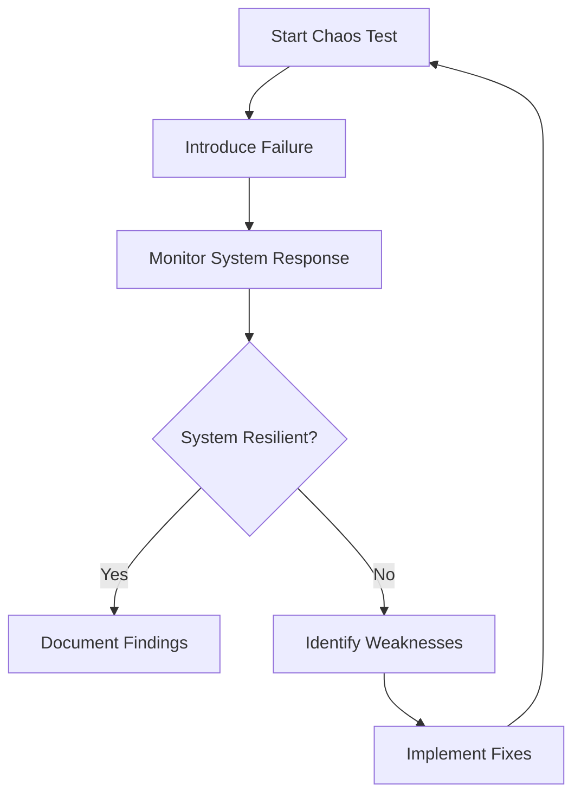

## 15.14 Advanced Testing Techniques

In the ever-evolving landscape of software development, ensuring the robustness and reliability of applications is paramount. As Ruby developers, we have a plethora of testing techniques at our disposal, ranging from unit tests to integration tests. However, as applications grow in complexity, traditional testing methods may not suffice. This is where advanced testing techniques like fuzz testing, chaos testing, and testing in production come into play. These methods help uncover edge cases, ensure system resilience, and validate real-world performance.

### Understanding Advanced Testing Techniques

Advanced testing techniques are designed to push the boundaries of traditional testing by introducing unexpected scenarios, simulating failures, and validating systems in real-world environments. These techniques aim to uncover hidden bugs, ensure system resilience, and provide insights into how applications behave under stress.

#### Key Objectives of Advanced Testing

- **Uncover Hidden Bugs**: Identify edge cases and unexpected behaviors that traditional tests might miss.
- **Ensure System Resilience**: Test the system's ability to withstand failures and recover gracefully.
- **Validate Real-World Performance**: Assess how the application performs in production-like environments.

### Fuzz Testing

Fuzz testing, or fuzzing, is a technique that involves providing random or unexpected inputs to a program to discover vulnerabilities and bugs. This method is particularly effective in identifying security flaws, such as buffer overflows and input validation errors.

#### How Fuzz Testing Works

Fuzz testing involves generating a large number of random inputs and feeding them into the application. The goal is to observe how the application handles these inputs and identify any crashes, hangs, or unexpected behaviors.

```ruby
# Simple Fuzz Testing Example in Ruby

def process_input(input)
  # Simulate processing input
  puts "Processing: #{input}"
  raise "Unexpected input!" if input == "crash"
end

def fuzz_test
  inputs = ["valid", "test", "crash", "random", "unexpected"]
  inputs.each do |input|
    begin
      process_input(input)
    rescue => e
      puts "Error: #{e.message}"
    end
  end
end

fuzz_test
```

In this example, we simulate a simple fuzz test by providing a set of inputs to the `process_input` method. The method raises an error for a specific input, simulating a crash scenario.

#### Tools for Fuzz Testing

Several tools can assist in automating fuzz testing:

- **AFL (American Fuzzy Lop)**: A popular fuzz testing tool that uses genetic algorithms to generate test cases.
- **LibFuzzer**: A library for in-process, coverage-guided fuzz testing.
- **Fuzzinator**: A customizable fuzzing framework for testing various types of applications.

#### Benefits of Fuzz Testing

- **Automated Bug Discovery**: Fuzz testing can automatically discover bugs that might be missed by manual testing.
- **Security Vulnerability Detection**: It is particularly effective in identifying security vulnerabilities.

#### Challenges of Fuzz Testing

- **False Positives**: Fuzz testing can generate false positives, requiring manual verification.
- **Resource Intensive**: It can be resource-intensive, requiring significant computational power.

### Chaos Testing

Chaos testing, also known as chaos engineering, involves intentionally introducing failures into a system to test its resilience. The goal is to ensure that the system can withstand and recover from unexpected disruptions.

#### How Chaos Testing Works

Chaos testing involves simulating failures in a controlled environment to observe how the system responds. This can include shutting down servers, introducing network latency, or simulating hardware failures.



This diagram illustrates the chaos testing process, where failures are introduced, system responses are monitored, and findings are documented.

#### Tools for Chaos Testing

- **Chaos Monkey**: A tool developed by Netflix to randomly terminate instances in production to ensure system resilience.
- **Gremlin**: A platform for simulating real-world failures in a controlled environment.
- **Chaos Toolkit**: An open-source tool for automating chaos experiments.

#### Benefits of Chaos Testing

- **Improved Resilience**: Helps identify weaknesses and improve system resilience.
- **Real-World Failure Simulation**: Simulates real-world failures to test system robustness.

#### Challenges of Chaos Testing

- **Risk of Disruption**: Chaos testing can disrupt services if not conducted carefully.
- **Requires Mature Infrastructure**: It requires a mature testing culture and infrastructure to implement safely.

### Testing in Production

Testing in production involves validating the application in a live environment. This technique provides insights into how the application performs under real-world conditions.

#### Considerations for Testing in Production

- **Minimize Risk**: Use techniques like feature flags and canary releases to minimize risk.
- **Monitor Closely**: Monitor the application closely to detect and respond to issues quickly.
- **Communicate Clearly**: Ensure clear communication with stakeholders about testing activities.

#### Guidelines for Responsible Testing in Production

- **Use Feature Flags**: Deploy new features behind feature flags to control exposure.
- **Implement Canary Releases**: Gradually roll out changes to a small subset of users before full deployment.
- **Monitor and Rollback**: Monitor the application closely and be prepared to roll back changes if issues arise.

### Emphasizing a Mature Testing Culture

Implementing advanced testing techniques requires a mature testing culture and infrastructure. This includes:

- **Comprehensive Test Coverage**: Ensure comprehensive test coverage with unit, integration, and end-to-end tests.
- **Continuous Integration and Deployment**: Use CI/CD pipelines to automate testing and deployment processes.
- **Robust Monitoring and Logging**: Implement robust monitoring and logging to detect and respond to issues quickly.

### Conclusion

Advanced testing techniques like fuzz testing, chaos testing, and testing in production are invaluable tools for ensuring the robustness and resilience of Ruby applications. By implementing these techniques responsibly, we can uncover hidden bugs, improve system resilience, and validate real-world performance. Remember, a mature testing culture and infrastructure are essential for successful implementation.

### Try It Yourself

Experiment with the fuzz testing example provided. Try adding new inputs or modifying the `process_input` method to simulate different scenarios. Observe how the application responds and consider how you might handle unexpected inputs in your own applications.

## Quiz: Advanced Testing Techniques



### What is the primary goal of fuzz testing?

- [x] To discover vulnerabilities and bugs by providing random inputs
- [ ] To simulate real-world failures in a controlled environment
- [ ] To validate application performance in production
- [ ] To improve system resilience through chaos engineering

> **Explanation:** Fuzz testing aims to discover vulnerabilities and bugs by providing random or unexpected inputs to the application.

### Which tool is commonly used for chaos testing?

- [ ] AFL
- [ ] LibFuzzer
- [x] Chaos Monkey
- [ ] Fuzzinator

> **Explanation:** Chaos Monkey is a tool developed by Netflix for chaos testing, which involves randomly terminating instances in production to ensure system resilience.

### What is a key consideration when testing in production?

- [ ] Use genetic algorithms to generate test cases
- [x] Minimize risk using feature flags and canary releases
- [ ] Introduce network latency to simulate failures
- [ ] Automate bug discovery through random inputs

> **Explanation:** When testing in production, it's important to minimize risk using techniques like feature flags and canary releases.

### What is the primary benefit of chaos testing?

- [ ] Automated bug discovery
- [ ] Security vulnerability detection
- [x] Improved system resilience
- [ ] Real-world performance validation

> **Explanation:** Chaos testing helps improve system resilience by simulating real-world failures and identifying weaknesses.

### Which of the following is a challenge of fuzz testing?

- [x] False positives
- [ ] Improved resilience
- [ ] Real-world failure simulation
- [ ] Requires mature infrastructure

> **Explanation:** Fuzz testing can generate false positives, requiring manual verification to distinguish between actual bugs and false alarms.

### What is the role of feature flags in testing in production?

- [ ] To introduce failures in a controlled environment
- [x] To control exposure of new features
- [ ] To automate bug discovery
- [ ] To simulate network latency

> **Explanation:** Feature flags are used to control the exposure of new features, allowing for safer testing in production environments.

### What is a key benefit of testing in production?

- [ ] Automated bug discovery
- [ ] Security vulnerability detection
- [ ] Improved system resilience
- [x] Real-world performance validation

> **Explanation:** Testing in production provides insights into how the application performs under real-world conditions, validating its performance.

### Which tool is used for fuzz testing?

- [x] AFL
- [ ] Chaos Monkey
- [ ] Gremlin
- [ ] Chaos Toolkit

> **Explanation:** AFL (American Fuzzy Lop) is a popular tool for fuzz testing, which uses genetic algorithms to generate test cases.

### What is a key challenge of chaos testing?

- [ ] Automated bug discovery
- [ ] Security vulnerability detection
- [x] Risk of disruption
- [ ] Real-world performance validation

> **Explanation:** Chaos testing can disrupt services if not conducted carefully, making it a challenging technique to implement.

### True or False: Chaos testing requires a mature testing culture and infrastructure.

- [x] True
- [ ] False

> **Explanation:** Chaos testing requires a mature testing culture and infrastructure to implement safely and effectively.



Remember, this is just the beginning. As you progress, you'll build more complex and resilient applications. Keep experimenting, stay curious, and enjoy the journey!

---
