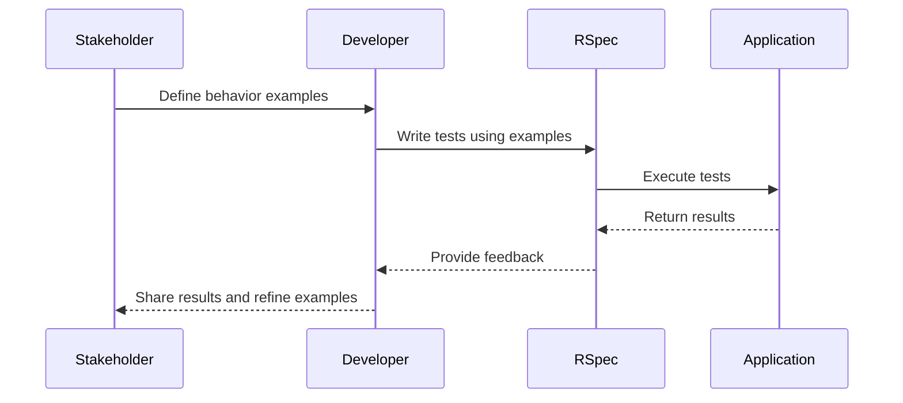

## 15.2 Behavior-Driven Development (BDD) with RSpec

Behavior-Driven Development (BDD) is a software development approach that enhances collaboration between developers, testers, and non-technical stakeholders. By focusing on the behavior of an application, BDD ensures that all parties have a shared understanding of the system's functionality. In this section, we will delve into BDD and how RSpec, a popular testing framework for Ruby, facilitates this approach.

### Understanding Behavior-Driven Development (BDD)

**Behavior-Driven Development (BDD)** is an extension of Test-Driven Development (TDD) that emphasizes specification by example. It encourages writing tests in a natural language that describes the behavior of the application from the user's perspective. This approach helps bridge the communication gap between technical and non-technical team members.

#### Key Principles of BDD

1. **Specification by Example**: BDD focuses on examples to specify the behavior of the system. These examples serve as both documentation and automated tests.
2. **Ubiquitous Language**: BDD promotes the use of a common language that is understandable by all stakeholders, ensuring clarity and reducing misunderstandings.
3. **Collaboration**: BDD fosters collaboration between developers, testers, and business stakeholders, ensuring that everyone is aligned on the expected behavior of the application.

### RSpec: A Tool for BDD in Ruby

**RSpec** is a testing framework for Ruby that supports BDD by providing a domain-specific language (DSL) for writing tests. Its syntax is designed to be readable and expressive, making it easy to describe the behavior of the application in a way that is understandable by all team members.

#### RSpec Syntax and Structure

RSpec's syntax is built around three main components: `describe`, `context`, and `it` blocks. These components help organize tests and make them more readable.

- **`describe` Block**: Used to group related tests. It typically describes a class or method.
- **`context` Block**: Provides additional context for a group of tests, often used to specify different scenarios or conditions.
- **`it` Block**: Represents an individual test case, describing a specific behavior or expectation.

Here's a simple example to illustrate these components:

```ruby
# spec/calculator_spec.rb
RSpec.describe Calculator do
  describe '#add' do
    context 'when adding two positive numbers' do
      it 'returns the sum of the numbers' do
        calculator = Calculator.new
        expect(calculator.add(2, 3)).to eq(5)
      end
    end

    context 'when adding a positive and a negative number' do
      it 'returns the correct sum' do
        calculator = Calculator.new
        expect(calculator.add(2, -3)).to eq(-1)
      end
    end
  end
end
```

### Writing Descriptive Tests with RSpec

RSpec encourages writing tests that are descriptive and focus on the behavior of the application. This is achieved through the use of matchers and custom matchers.

#### Matchers in RSpec

Matchers are used to express expected outcomes in RSpec tests. They make assertions about the state of the system under test. Some common matchers include:

- **`eq`**: Checks for equality.
- **`be`**: Checks for object identity.
- **`include`**: Checks for inclusion.
- **`match`**: Checks for regular expression matches.

Example of using matchers:

```ruby
# spec/string_spec.rb
RSpec.describe 'String' do
  describe '#length' do
    it 'returns the number of characters in the string' do
      expect('hello'.length).to eq(5)
    end
  end

  describe '#include?' do
    it 'returns true if the string contains the given substring' do
      expect('hello'.include?('ell')).to be true
    end
  end
end
```

#### Custom Matchers

RSpec allows the creation of custom matchers to express complex expectations in a more readable way. Custom matchers can be defined using the `RSpec::Matchers.define` method.

Example of a custom matcher:

```ruby
# spec/support/custom_matchers.rb
RSpec::Matchers.define :be_a_multiple_of do |expected|
  match do |actual|
    actual % expected == 0
  end
end

# spec/number_spec.rb
RSpec.describe 'Number' do
  describe '#even?' do
    it 'returns true if the number is a multiple of 2' do
      expect(4).to be_a_multiple_of(2)
    end
  end
end
```

### Collaboration and Communication with BDD

One of the key benefits of BDD is improved collaboration between developers and stakeholders. By writing tests in a language that is understandable by all parties, BDD ensures that everyone is on the same page regarding the expected behavior of the application.

#### Role of BDD in Collaboration

- **Shared Understanding**: BDD tests serve as living documentation, providing a clear specification of the system's behavior.
- **Feedback Loop**: BDD facilitates a fast feedback loop, allowing stakeholders to validate the behavior of the application early in the development process.
- **Alignment**: BDD helps align the development team with business goals, ensuring that the application meets the needs of the users.

### Importance of Readable and Maintainable Tests

Readable and maintainable tests are crucial for the long-term success of a project. BDD, with its focus on descriptive tests, ensures that tests are easy to understand and maintain.

#### Best Practices for Readable Tests

1. **Use Descriptive Names**: Ensure that test names clearly describe the behavior being tested.
2. **Organize Tests Logically**: Group related tests using `describe` and `context` blocks.
3. **Avoid Duplication**: Use shared examples and helper methods to reduce duplication.
4. **Keep Tests Focused**: Each test should focus on a single behavior or expectation.

### Try It Yourself

To get hands-on experience with BDD and RSpec, try modifying the code examples provided in this section. Experiment with different matchers, create custom matchers, and write tests for a simple Ruby class. This will help reinforce your understanding of BDD and RSpec.

### Visualizing BDD with RSpec

To better understand the flow of BDD with RSpec, let's visualize the process using a sequence diagram.



This diagram illustrates the collaborative process of BDD, where stakeholders define behavior examples, developers write tests using these examples, and RSpec provides feedback on the application's behavior.

### References and Further Reading

- [RSpec Documentation](https://rspec.info/documentation/)
- [Cucumber: A Tool for BDD](https://cucumber.io/)
- [The RSpec Book: Behaviour Driven Development with RSpec, Cucumber, and Friends](https://pragprog.com/titles/achbd/the-rspec-book/)

### Knowledge Check

To reinforce your understanding of BDD and RSpec, consider the following questions:

1. What is the main focus of Behavior-Driven Development?
2. How does RSpec facilitate BDD in Ruby?
3. What are the key components of RSpec's syntax?
4. How do matchers enhance the readability of RSpec tests?
5. Why is collaboration important in BDD?

### Embrace the Journey

Remember, mastering BDD with RSpec is a journey. As you continue to practice and apply these concepts, you'll become more proficient in writing tests that are both descriptive and maintainable. Keep experimenting, stay curious, and enjoy the process of building robust Ruby applications!

## Quiz: Behavior-Driven Development (BDD) with RSpec



### What is the primary focus of Behavior-Driven Development (BDD)?

- [x] Specification by example
- [ ] Code optimization
- [ ] Database design
- [ ] User interface design

> **Explanation:** BDD focuses on specifying the behavior of the system through examples that serve as both documentation and automated tests.

### Which RSpec block is used to group related tests?

- [x] `describe`
- [ ] `context`
- [ ] `it`
- [ ] `expect`

> **Explanation:** The `describe` block is used in RSpec to group related tests, typically describing a class or method.

### What is the purpose of matchers in RSpec?

- [x] To express expected outcomes in tests
- [ ] To define new classes
- [ ] To manage database connections
- [ ] To handle exceptions

> **Explanation:** Matchers in RSpec are used to express expected outcomes in tests, making assertions about the state of the system under test.

### How does BDD improve collaboration?

- [x] By using a common language understandable by all stakeholders
- [ ] By reducing the number of tests
- [ ] By focusing on code performance
- [ ] By simplifying database queries

> **Explanation:** BDD improves collaboration by using a common language that is understandable by all stakeholders, ensuring clarity and reducing misunderstandings.

### What is a custom matcher in RSpec?

- [x] A user-defined matcher for complex expectations
- [ ] A built-in matcher for simple checks
- [ ] A method for handling exceptions
- [ ] A tool for database migrations

> **Explanation:** A custom matcher in RSpec is a user-defined matcher that allows for expressing complex expectations in a more readable way.

### Which RSpec block represents an individual test case?

- [x] `it`
- [ ] `describe`
- [ ] `context`
- [ ] `expect`

> **Explanation:** The `it` block in RSpec represents an individual test case, describing a specific behavior or expectation.

### Why is it important to have readable and maintainable tests?

- [x] To ensure long-term success of a project
- [ ] To reduce code execution time
- [ ] To minimize database usage
- [ ] To simplify user interface design

> **Explanation:** Readable and maintainable tests are crucial for the long-term success of a project, as they ensure that tests are easy to understand and maintain.

### What does the `context` block in RSpec provide?

- [x] Additional context for a group of tests
- [ ] A way to define new classes
- [ ] A method for handling exceptions
- [ ] A tool for optimizing performance

> **Explanation:** The `context` block in RSpec provides additional context for a group of tests, often used to specify different scenarios or conditions.

### How can BDD tests serve as living documentation?

- [x] By providing a clear specification of the system's behavior
- [ ] By reducing the number of lines of code
- [ ] By optimizing database queries
- [ ] By simplifying user interface design

> **Explanation:** BDD tests serve as living documentation by providing a clear specification of the system's behavior, ensuring that everyone is on the same page regarding the expected behavior of the application.

### True or False: BDD focuses solely on technical aspects of development.

- [ ] True
- [x] False

> **Explanation:** False. BDD focuses on the behavior of the application from the user's perspective, ensuring collaboration between technical and non-technical stakeholders.


