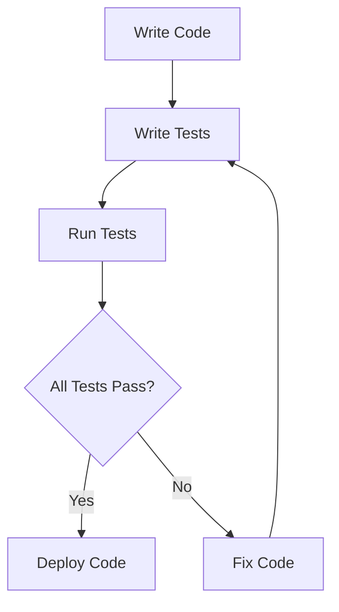

## 15.3 Unit Testing with Minitest

Unit testing is a crucial aspect of software development, ensuring that individual components of your application work as intended. In Ruby, Minitest is a powerful yet lightweight framework that provides a complete suite of testing facilities supporting TDD, BDD, mocking, and benchmarking. In this section, we'll delve into Minitest, exploring its features, how to create test cases and assertions, and best practices for integrating it into your development workflow.

### Introduction to Minitest

Minitest is the default testing library for Ruby, included in the Ruby standard library since version 1.9. It is known for its simplicity and speed, making it an excellent choice for developers who prefer a minimalistic approach to testing. Minitest supports both unit testing and behavior-driven development (BDD), offering a flexible framework that can be extended with plugins or custom assertions.

#### Key Features of Minitest

- **Lightweight and Fast**: Minitest is designed to be simple and fast, with minimal overhead.
- **Comprehensive**: It supports unit testing, BDD, mocking, and benchmarking.
- **Extensible**: You can extend Minitest with plugins or custom assertions to suit your testing needs.
- **Integration**: Minitest integrates seamlessly with Continuous Integration (CI) systems, making it easy to automate your testing process.

### Creating Test Cases with Minitest

To get started with Minitest, you need to create test cases that define the expected behavior of your code. A test case is a class that inherits from `Minitest::Test`, and each test method within the class should start with the word `test_`.

```ruby
require 'minitest/autorun'

class CalculatorTest < Minitest::Test
  def setup
    @calculator = Calculator.new
  end

  def test_addition
    assert_equal 4, @calculator.add(2, 2)
  end

  def test_subtraction
    assert_equal 0, @calculator.subtract(2, 2)
  end
end
```

In this example, we define a `CalculatorTest` class with two test methods: `test_addition` and `test_subtraction`. The `setup` method is used to initialize any common setup code needed for the tests.

### Assertions in Minitest

Assertions are the core of any test case, allowing you to verify that your code behaves as expected. Minitest provides a variety of assertions to handle different scenarios:

- `assert`: Ensures that a condition is true.
- `assert_equal`: Checks if two values are equal.
- `assert_nil`: Verifies that a value is `nil`.
- `assert_raises`: Ensures that a specific exception is raised.

Here's how you can use these assertions in your tests:

```ruby
def test_division
  assert_equal 2, @calculator.divide(4, 2)
end

def test_division_by_zero
  assert_raises(ZeroDivisionError) { @calculator.divide(4, 0) }
end
```

### Differences Between Minitest and RSpec

While both Minitest and RSpec are popular testing frameworks in Ruby, they have different philosophies and use cases:

- **Syntax**: Minitest uses a more traditional, xUnit-style syntax, while RSpec offers a more expressive, domain-specific language (DSL).
- **Configuration**: Minitest is minimalistic with little configuration, whereas RSpec provides more configuration options and features out of the box.
- **Community and Ecosystem**: RSpec has a larger community and more plugins available, but Minitest's simplicity can be an advantage for smaller projects or teams preferring less overhead.

### Extending Minitest with Plugins and Custom Assertions

Minitest's extensibility allows you to create plugins or custom assertions to enhance your testing suite. You can define custom assertions by creating methods within your test classes or by extending `Minitest::Assertions`.

```ruby
module Minitest::Assertions
  def assert_even(number)
    assert number.even?, "Expected #{number} to be even"
  end
end

class NumberTest < Minitest::Test
  def test_even_number
    assert_even 4
  end
end
```

### Best Practices for Organizing Test Files

Organizing your test files effectively is crucial for maintaining a scalable and maintainable test suite. Here are some best practices:

- **Directory Structure**: Place your test files in a `test` directory at the root of your project.
- **Naming Conventions**: Use descriptive names for your test files and classes, matching the structure of your application code.
- **Test Coverage**: Ensure that each class and method in your application has corresponding tests.

### Integrating Minitest with Continuous Integration Systems

Minitest integrates seamlessly with CI systems, enabling automated testing as part of your development workflow. Popular CI tools like Jenkins, Travis CI, and GitHub Actions can easily run Minitest suites, providing feedback on code changes and ensuring code quality.

To integrate Minitest with a CI system, you typically need to:

1. **Configure the CI Environment**: Set up the Ruby environment and dependencies using a Gemfile.
2. **Run Tests Automatically**: Configure the CI tool to run `rake test` or `ruby -Ilib:test` commands to execute your test suite.
3. **Monitor Test Results**: Use the CI tool's dashboard to monitor test results and receive notifications for failed tests.

### Try It Yourself

Now that we've covered the basics of Minitest, let's try modifying the code examples to deepen your understanding:

- **Add More Tests**: Extend the `CalculatorTest` class with additional test cases for multiplication and division.
- **Create Custom Assertions**: Define a custom assertion to check if a number is odd.
- **Integrate with CI**: Set up a simple CI pipeline using GitHub Actions to run your Minitest suite.

### Visualizing Minitest Workflow

To better understand how Minitest fits into the development process, let's visualize the workflow using a Mermaid.js diagram:



This diagram illustrates the iterative process of writing code, writing tests, running tests, and deploying code if all tests pass. If tests fail, you return to fixing the code and rerunning the tests.

### References and Further Reading

For more information on Minitest and unit testing in Ruby, consider exploring the following resources:

- [Minitest Documentation](https://github.com/seattlerb/minitest)
- [Ruby Testing Guide](https://ruby-doc.org/stdlib-2.7.0/libdoc/minitest/rdoc/Minitest.html)
- [Continuous Integration with GitHub Actions](https://docs.github.com/en/actions)

### Knowledge Check

To reinforce your understanding of Minitest, consider the following questions:

- What are the key differences between Minitest and RSpec?
- How can you extend Minitest with custom assertions?
- What are some best practices for organizing test files in a Ruby project?

### Summary

In this section, we've explored Minitest, Ruby's standard unit testing framework, and how it can be used to write efficient and lightweight tests. We've covered creating test cases, using assertions, extending Minitest with plugins, and integrating it with CI systems. By following best practices and experimenting with the examples provided, you can enhance your testing skills and ensure the quality of your Ruby applications.

Remember, this is just the beginning. As you progress, you'll build more complex and interactive applications. Keep experimenting, stay curious, and enjoy the journey!

## Quiz: Unit Testing with Minitest



### What is Minitest in Ruby?

- [x] A lightweight testing framework included in Ruby's standard library.
- [ ] A database management tool.
- [ ] A web development framework.
- [ ] A version control system.

> **Explanation:** Minitest is a lightweight testing framework included in Ruby's standard library, designed for unit testing and more.

### Which method is used to define a test case in Minitest?

- [ ] `def case_`
- [x] `def test_`
- [ ] `def example_`
- [ ] `def spec_`

> **Explanation:** In Minitest, test methods should start with `test_` to be recognized as test cases.

### How can you assert that a value is `nil` in Minitest?

- [ ] `assert_zero`
- [ ] `assert_false`
- [x] `assert_nil`
- [ ] `assert_empty`

> **Explanation:** `assert_nil` is used to verify that a value is `nil`.

### What is the purpose of the `setup` method in Minitest?

- [ ] To tear down test data.
- [x] To initialize common setup code for tests.
- [ ] To define test assertions.
- [ ] To run tests in parallel.

> **Explanation:** The `setup` method is used to initialize any common setup code needed for the tests.

### Which of the following is a key difference between Minitest and RSpec?

- [x] Minitest uses a traditional xUnit-style syntax.
- [ ] Minitest is more configurable out of the box.
- [ ] RSpec is included in Ruby's standard library.
- [ ] RSpec is faster than Minitest.

> **Explanation:** Minitest uses a traditional xUnit-style syntax, whereas RSpec offers a more expressive DSL.

### How can you extend Minitest with custom assertions?

- [ ] By modifying the Ruby core.
- [x] By creating methods within test classes or extending `Minitest::Assertions`.
- [ ] By using a different testing framework.
- [ ] By writing shell scripts.

> **Explanation:** You can define custom assertions by creating methods within your test classes or by extending `Minitest::Assertions`.

### What is a best practice for organizing test files in a Ruby project?

- [ ] Place test files in the `lib` directory.
- [x] Place test files in a `test` directory at the root of your project.
- [ ] Use random names for test files.
- [ ] Avoid using a directory structure.

> **Explanation:** It's a best practice to place your test files in a `test` directory at the root of your project.

### How does Minitest integrate with Continuous Integration systems?

- [ ] By requiring manual test execution.
- [x] By running tests automatically as part of the CI pipeline.
- [ ] By using a separate testing framework.
- [ ] By disabling test notifications.

> **Explanation:** Minitest integrates with CI systems by running tests automatically as part of the CI pipeline.

### What command is typically used to run Minitest tests?

- [ ] `ruby test`
- [ ] `rails test`
- [x] `rake test`
- [ ] `bundle exec`

> **Explanation:** `rake test` is commonly used to run Minitest tests.

### True or False: Minitest supports both unit testing and behavior-driven development (BDD).

- [x] True
- [ ] False

> **Explanation:** Minitest supports both unit testing and behavior-driven development (BDD), offering flexibility in testing approaches.


