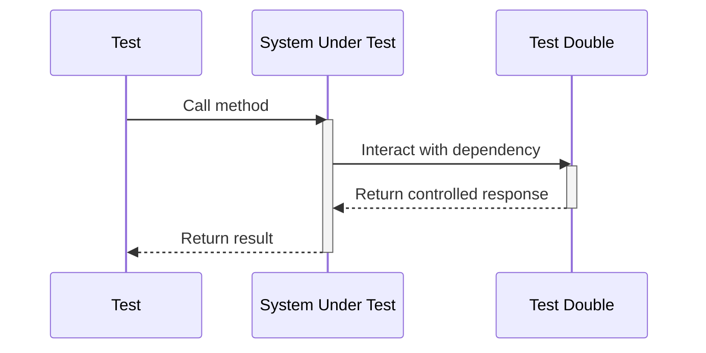

## 15.4 Mocking, Stubbing, and Test Doubles

In the realm of software testing, particularly unit testing, the concepts of mocking, stubbing, and test doubles play a pivotal role. These techniques allow developers to isolate the unit of code being tested by replacing its dependencies with controlled substitutes. This section will delve into these concepts, providing a comprehensive understanding of their use in Ruby, especially with popular testing frameworks like RSpec, RR, and Mocha.

### Understanding Test Doubles

**Test doubles** are generic terms for any object that stands in for a real object in a test. They are used to simulate the behavior of complex, real objects that are not the focus of the test. Test doubles can be categorized into several types, including mocks, stubs, spies, and fakes.

#### Mocks

**Mocks** are objects pre-programmed with expectations which form a specification of the calls they are expected to receive. They are used to verify that certain interactions occur between objects. Mocks are particularly useful when you want to ensure that a method is called with specific arguments.

#### Stubs

**Stubs** are objects that provide predefined responses to method calls made during the test. Unlike mocks, stubs do not assert that any interactions occur. They are primarily used to control the indirect inputs of the system under test by providing canned answers to calls made during the test.

#### Spies

**Spies** are a type of test double that record information about how they were called, such as the number of times a method was called and with what arguments. They are useful for verifying interactions after the fact.

#### Fakes

**Fakes** are objects that have working implementations, but are simplified versions of the real objects. They are often used when the real object is too complex or unavailable.

### Why Use Test Doubles?

Test doubles are crucial in unit testing for several reasons:

- **Isolation**: They help isolate the unit of code being tested by replacing its dependencies, ensuring that tests are not affected by the behavior of external components.
- **Control**: They allow you to control the behavior of dependencies, making it easier to test edge cases and error conditions.
- **Performance**: They can improve test performance by replacing slow or resource-intensive components with lightweight substitutes.
- **Reliability**: They enhance test reliability by removing dependencies on external systems that may be unreliable or unavailable.

### When to Use Test Doubles

Use test doubles when:

- The real object is difficult to set up or configure.
- The real object has non-deterministic behavior.
- The real object is slow or resource-intensive.
- The real object does not yet exist or is under development.
- You need to test interactions between objects.

### Using RSpec for Mocking and Stubbing

RSpec is a popular testing framework in Ruby that provides powerful mocking and stubbing capabilities. Let's explore how to use RSpec to create mocks and stubs.

#### Creating Stubs with RSpec

In RSpec, you can create stubs using the `allow` method. Here's a simple example:

```ruby
class User
  def name
    "John Doe"
  end
end

RSpec.describe User do
  it "returns a stubbed name" do
    user = User.new
    allow(user).to receive(:name).and_return("Jane Doe")
    expect(user.name).to eq("Jane Doe")
  end
end
```

In this example, we use `allow` to stub the `name` method of the `User` class to return "Jane Doe" instead of the actual name.

#### Creating Mocks with RSpec

Mocks in RSpec are created using the `expect` method. Here's how you can create a mock:

```ruby
class Order
  def process(payment)
    payment.charge
  end
end

RSpec.describe Order do
  it "charges the payment" do
    payment = double("Payment")
    expect(payment).to receive(:charge)
    order = Order.new
    order.process(payment)
  end
end
```

In this example, we create a mock `Payment` object and set an expectation that the `charge` method will be called.

### Using RR for Mocking and Stubbing

[RR](https://github.com/rr/rr) is another Ruby library for mocking and stubbing. It provides a different syntax and some unique features compared to RSpec.

#### Stubbing with RR

Here's how you can create a stub using RR:

```ruby
require 'rr'

class Calculator
  def add(a, b)
    a + b
  end
end

RSpec.describe Calculator do
  include RR::Adapters::RSpec2

  it "returns a stubbed result" do
    calculator = Calculator.new
    stub(calculator).add(1, 2) { 5 }
    expect(calculator.add(1, 2)).to eq(5)
  end
end
```

#### Mocking with RR

RR also allows you to create mocks with a simple syntax:

```ruby
require 'rr'

class Printer
  def print(document)
    # printing logic
  end
end

RSpec.describe Printer do
  include RR::Adapters::RSpec2

  it "calls the print method" do
    printer = Printer.new
    mock(printer).print("document")
    printer.print("document")
  end
end
```

### Using Mocha for Mocking and Stubbing

[Mocha](https://github.com/freerange/mocha) is another library that provides mocking and stubbing capabilities for Ruby.

#### Stubbing with Mocha

Here's how you can use Mocha to create a stub:

```ruby
require 'mocha/api'

class Weather
  def forecast
    "sunny"
  end
end

RSpec.describe Weather do
  include Mocha::API

  it "returns a stubbed forecast" do
    weather = Weather.new
    weather.stubs(:forecast).returns("rainy")
    expect(weather.forecast).to eq("rainy")
  end
end
```

#### Mocking with Mocha

Mocha also allows you to create mocks:

```ruby
require 'mocha/api'

class Logger
  def log(message)
    # logging logic
  end
end

RSpec.describe Logger do
  include Mocha::API

  it "logs a message" do
    logger = Logger.new
    logger.expects(:log).with("Hello, world!")
    logger.log("Hello, world!")
  end
end
```

### Best Practices for Using Mocks and Stubs

While mocks and stubs are powerful tools, they should be used judiciously to avoid creating brittle tests. Here are some best practices:

- **Use Mocks and Stubs Sparingly**: Overusing mocks and stubs can lead to tests that are tightly coupled to the implementation, making them brittle and difficult to maintain.
- **Focus on Behavior, Not Implementation**: Write tests that focus on the behavior of the system under test, rather than its implementation details.
- **Avoid Mocking External Libraries**: Instead of mocking external libraries, consider using integration tests to verify their behavior.
- **Keep Tests Simple**: Avoid complex setups and configurations in your tests. Keep them simple and focused on the behavior being tested.
- **Regularly Refactor Tests**: Just like production code, tests should be regularly refactored to improve readability and maintainability.

### Maintaining Test Reliability

To ensure that your tests remain reliable and meaningful, follow these guidelines:

- **Test One Thing at a Time**: Each test should focus on a single aspect of the system under test.
- **Use Descriptive Test Names**: Use clear and descriptive names for your tests to make it easy to understand what they are testing.
- **Keep Tests Independent**: Ensure that tests do not depend on each other. Each test should be able to run independently.
- **Regularly Run Tests**: Run your tests regularly to catch regressions early.

### Try It Yourself

To get a better understanding of mocking and stubbing, try modifying the examples provided above. For instance, change the return values of stubs or the expectations of mocks to see how the tests behave. Experiment with different libraries like RR and Mocha to see which one fits your needs best.

### Visualizing Test Doubles

To better understand the relationships and interactions between test doubles and the system under test, let's visualize these concepts using a sequence diagram.



This diagram illustrates how a test interacts with the system under test, which in turn interacts with a test double to simulate the behavior of a real dependency.

### Knowledge Check

- What is the difference between a mock and a stub?
- When should you use a test double in your tests?
- How can you create a mock in RSpec?
- What are some best practices for using mocks and stubs?

### Summary

In this section, we've explored the concepts of mocking, stubbing, and test doubles in Ruby. We've seen how these techniques can be used to isolate units of code during testing, providing control and reliability. By using libraries like RSpec, RR, and Mocha, we can create powerful and flexible tests that focus on the behavior of the system under test. Remember to use these tools judiciously to maintain the reliability and maintainability of your tests.

## Quiz: Mocking, Stubbing, and Test Doubles



### What is a test double?

- [x] An object that stands in for a real object in a test
- [ ] A real object used in testing
- [ ] A type of test framework
- [ ] A testing strategy

> **Explanation:** A test double is an object that stands in for a real object in a test, used to simulate the behavior of complex, real objects.

### What is the primary purpose of a mock?

- [x] To verify that certain interactions occur between objects
- [ ] To provide predefined responses to method calls
- [ ] To record information about how they were called
- [ ] To have working implementations

> **Explanation:** Mocks are used to verify that certain interactions occur between objects, ensuring that methods are called with specific arguments.

### How do you create a stub in RSpec?

- [x] Using the `allow` method
- [ ] Using the `expect` method
- [ ] Using the `mock` method
- [ ] Using the `stub` method

> **Explanation:** In RSpec, you create stubs using the `allow` method to provide predefined responses to method calls.

### What is a spy in testing?

- [x] A type of test double that records information about how they were called
- [ ] An object pre-programmed with expectations
- [ ] An object that provides predefined responses
- [ ] A simplified version of a real object

> **Explanation:** Spies are test doubles that record information about how they were called, such as the number of times a method was called and with what arguments.

### Which library provides mocking and stubbing capabilities in Ruby?

- [x] RSpec
- [x] RR
- [x] Mocha
- [ ] Rails

> **Explanation:** RSpec, RR, and Mocha are libraries that provide mocking and stubbing capabilities in Ruby.

### What is a fake in testing?

- [x] An object that has working implementations but is simplified
- [ ] An object pre-programmed with expectations
- [ ] An object that provides predefined responses
- [ ] A type of test double that records information

> **Explanation:** Fakes are objects that have working implementations but are simplified versions of the real objects.

### What is the best practice for using mocks and stubs?

- [x] Use them sparingly to avoid creating brittle tests
- [ ] Use them extensively to cover all possible scenarios
- [ ] Mock external libraries to ensure their behavior
- [ ] Focus on implementation details

> **Explanation:** Use mocks and stubs sparingly to avoid creating brittle tests that are tightly coupled to the implementation.

### How can you create a mock in RR?

- [x] Using the `mock` method
- [ ] Using the `allow` method
- [ ] Using the `expect` method
- [ ] Using the `stub` method

> **Explanation:** In RR, you create mocks using the `mock` method to set expectations on method calls.

### What should you focus on when writing tests?

- [x] The behavior of the system under test
- [ ] The implementation details of the system
- [ ] Mocking all dependencies
- [ ] Using complex setups

> **Explanation:** Focus on the behavior of the system under test, rather than its implementation details, to write meaningful tests.

### True or False: Mocks and stubs should be used to test interactions between objects.

- [x] True
- [ ] False

> **Explanation:** True. Mocks and stubs are used to test interactions between objects, ensuring that methods are called with specific arguments and providing controlled responses.



Remember, mastering the use of mocks, stubs, and test doubles is an essential skill for writing effective and reliable tests. Keep experimenting, stay curious, and enjoy the journey of becoming a better Ruby developer!
