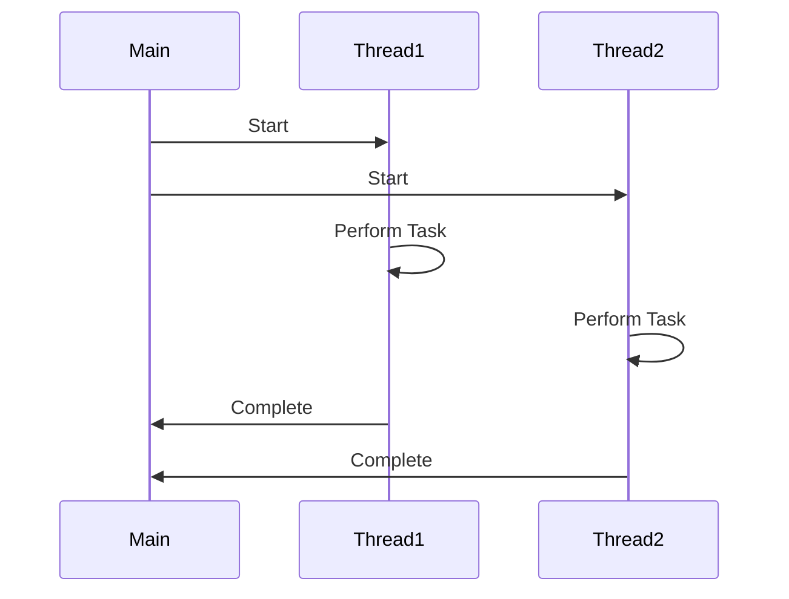

## 15.6 Testing Asynchronous and Concurrent Code

Testing asynchronous and concurrent code is a critical aspect of ensuring the reliability and correctness of applications that leverage Ruby's concurrency features. Asynchronous operations and concurrency introduce complexities that can lead to subtle bugs if not properly tested. In this section, we will explore the challenges of testing asynchronous code, provide practical examples using popular libraries like Delayed Job and Sidekiq, and discuss techniques for ensuring determinism and correctness in multi-threaded environments.

### Challenges of Testing Asynchronous Code

Asynchronous code execution can lead to non-deterministic behavior, making it challenging to test. Here are some common challenges:

- **Timing Issues**: Asynchronous operations may complete at different times, leading to race conditions.
- **State Management**: Shared state between threads can lead to inconsistencies if not properly synchronized.
- **Error Handling**: Asynchronous errors may not be immediately visible, complicating debugging.
- **Determinism**: Ensuring tests produce consistent results despite the inherent non-determinism of concurrency.

To address these challenges, we need robust testing strategies and tools.

### Testing Background Jobs with Delayed Job and Sidekiq

Background job processing is a common use case for asynchronous operations. Libraries like Delayed Job and Sidekiq are popular choices for managing background jobs in Ruby applications.

#### Delayed Job

Delayed Job is a simple and flexible library for background job processing. It uses a database table to store jobs and can be easily integrated into Rails applications.

**Example: Testing with Delayed Job**

```ruby
# app/jobs/example_job.rb
class ExampleJob < ApplicationJob
  queue_as :default

  def perform(*args)
    # Perform some asynchronous task
    puts "Processing job with args: #{args.inspect}"
  end
end

# spec/jobs/example_job_spec.rb
require 'rails_helper'

RSpec.describe ExampleJob, type: :job do
  it 'processes the job with correct arguments' do
    expect {
      ExampleJob.perform_later('test_arg')
    }.to have_enqueued_job.with('test_arg')
  end
end
```

In this example, we define a simple job and test its enqueuing using RSpec. The `have_enqueued_job` matcher verifies that the job is enqueued with the correct arguments.

#### Sidekiq

Sidekiq is a more robust and performant background job processor that uses Redis for job storage. It supports concurrency and is widely used in production environments.

**Example: Testing with Sidekiq**

```ruby
# app/workers/example_worker.rb
class ExampleWorker
  include Sidekiq::Worker

  def perform(arg)
    # Perform some asynchronous task
    puts "Processing job with arg: #{arg}"
  end
end

# spec/workers/example_worker_spec.rb
require 'rails_helper'
require 'sidekiq/testing'

Sidekiq::Testing.fake!

RSpec.describe ExampleWorker, type: :worker do
  it 'enqueues a job with correct argument' do
    expect {
      ExampleWorker.perform_async('test_arg')
    }.to change(ExampleWorker.jobs, :size).by(1)
  end

  it 'processes the job' do
    ExampleWorker.perform_async('test_arg')
    ExampleWorker.drain
    # Add assertions to verify job processing
  end
end
```

In this Sidekiq example, we use `Sidekiq::Testing.fake!` to simulate job processing. The `perform_async` method enqueues a job, and `drain` processes all enqueued jobs. This allows us to test both job enqueuing and processing.

### Using Synchronization Primitives in Tests

Synchronization primitives like mutexes and condition variables can help manage shared state and ensure thread safety in tests.

**Example: Using Mutex in Tests**

```ruby
require 'thread'

mutex = Mutex.new
shared_resource = 0

threads = 10.times.map do
  Thread.new do
    mutex.synchronize do
      shared_resource += 1
    end
  end
end

threads.each(&:join)
puts shared_resource # Should output 10
```

In this example, a mutex is used to synchronize access to a shared resource, ensuring that increments are thread-safe.

### Timeouts, Waiting for Conditions, and Ensuring Determinism

When testing asynchronous code, it's crucial to handle timeouts and wait for specific conditions to ensure tests are deterministic.

**Example: Waiting for Conditions**

```ruby
require 'timeout'

def wait_for_condition(timeout: 5)
  Timeout.timeout(timeout) do
    loop do
      break if yield
      sleep 0.1
    end
  end
end

# Usage in a test
wait_for_condition { some_condition_met? }
```

This utility method waits for a condition to be met within a specified timeout, raising an error if the condition is not met in time.

### Tools for Testing Concurrency

Several tools and libraries can assist with testing concurrency in Ruby:

- **RSpec's async**: RSpec provides support for testing asynchronous code with tags and matchers. [Learn more about RSpec's async](https://relishapp.com/rspec/rspec-core/v/3-9/docs/command-line/command-options#--tag).

- **Concurrent-Ruby**: A library that provides abstractions for concurrency, such as futures and promises, which can be useful in tests.

- **Celluloid**: An actor-based concurrency library that simplifies concurrent programming and testing.

### Try It Yourself

Experiment with the provided examples by modifying the job arguments or adding additional assertions. Try using different synchronization primitives or testing tools to see how they affect the test outcomes.

### Visualizing Concurrency

To better understand concurrency, let's visualize a simple multi-threaded program using a sequence diagram.



This diagram illustrates the flow of a program where two threads perform tasks concurrently and report back to the main thread upon completion.

### Knowledge Check

- What are the main challenges of testing asynchronous code?
- How can you ensure thread safety when accessing shared resources?
- What tools can assist with testing concurrency in Ruby?

### Summary

Testing asynchronous and concurrent code in Ruby requires careful consideration of timing, state management, and error handling. By leveraging libraries like Delayed Job and Sidekiq, using synchronization primitives, and employing tools like RSpec's async, we can ensure our tests are robust and reliable. Remember, testing concurrency is an iterative process that benefits from experimentation and continuous learning.

## Quiz: Testing Asynchronous and Concurrent Code



### What is a common challenge when testing asynchronous code?

- [x] Timing issues
- [ ] Lack of libraries
- [ ] Excessive memory usage
- [ ] Limited language support

> **Explanation:** Timing issues arise because asynchronous operations may complete at different times, leading to race conditions.

### Which library is used for background job processing in Ruby?

- [x] Sidekiq
- [ ] RSpec
- [ ] Nokogiri
- [ ] Sinatra

> **Explanation:** Sidekiq is a popular library for background job processing in Ruby, using Redis for job storage.

### How can you ensure thread safety when accessing shared resources?

- [x] Use a mutex
- [ ] Use a global variable
- [ ] Use a constant
- [ ] Use a class variable

> **Explanation:** A mutex can be used to synchronize access to shared resources, ensuring thread safety.

### What does the `have_enqueued_job` matcher do in RSpec?

- [x] Verifies that a job is enqueued with the correct arguments
- [ ] Executes a job immediately
- [ ] Deletes a job from the queue
- [ ] Pauses job processing

> **Explanation:** The `have_enqueued_job` matcher checks that a job is enqueued with the expected arguments.

### Which tool provides abstractions for concurrency in Ruby?

- [x] Concurrent-Ruby
- [ ] Rails
- [ ] Sinatra
- [ ] Nokogiri

> **Explanation:** Concurrent-Ruby provides abstractions like futures and promises for concurrency in Ruby.

### What is the purpose of using `Sidekiq::Testing.fake!` in tests?

- [x] Simulate job processing
- [ ] Increase job priority
- [ ] Decrease job execution time
- [ ] Delete jobs from the queue

> **Explanation:** `Sidekiq::Testing.fake!` allows you to simulate job processing without executing them immediately.

### What does the `Timeout.timeout` method do?

- [x] Raises an error if a block does not complete within a specified time
- [ ] Delays execution of a block
- [ ] Increases execution time of a block
- [ ] Logs execution time of a block

> **Explanation:** `Timeout.timeout` raises an error if the block does not complete within the specified time, useful for waiting for conditions.

### Which synchronization primitive can be used to manage shared state?

- [x] Mutex
- [ ] Array
- [ ] Hash
- [ ] String

> **Explanation:** A mutex is a synchronization primitive used to manage access to shared state, ensuring thread safety.

### What is the benefit of using RSpec's async?

- [x] Testing asynchronous code with tags and matchers
- [ ] Increasing test execution speed
- [ ] Reducing test complexity
- [ ] Simplifying test setup

> **Explanation:** RSpec's async provides support for testing asynchronous code using tags and matchers.

### True or False: Asynchronous errors are always immediately visible.

- [ ] True
- [x] False

> **Explanation:** Asynchronous errors may not be immediately visible, complicating debugging and error handling.



Remember, this is just the beginning. As you progress, you'll build more complex and interactive applications. Keep experimenting, stay curious, and enjoy the journey!
