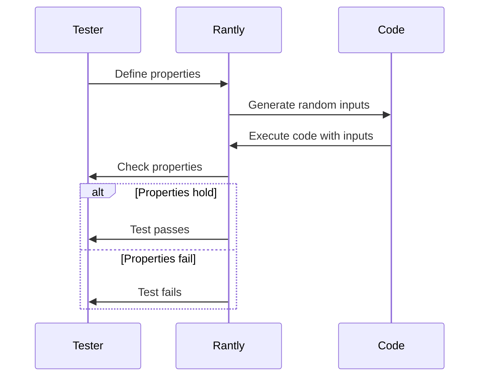

## 15.7 Property-Based Testing with Rantly

In the realm of software testing, ensuring that your application behaves correctly across a wide range of inputs is crucial. Traditional testing methods often involve writing specific test cases with predefined inputs and expected outputs. However, this approach can miss edge cases and unexpected behaviors. Enter **property-based testing**, a powerful technique that tests the properties of your code against a vast array of inputs. In this section, we'll explore property-based testing in Ruby using the Rantly library.

### Understanding Property-Based Testing

**Property-based testing** is a testing methodology where you define properties or invariants that your code should satisfy, and then test these properties against a wide range of automatically generated inputs. Instead of specifying exact input-output pairs, you describe the general characteristics that should hold true for any input.

#### Advantages of Property-Based Testing

1. **Comprehensive Coverage**: By generating a wide range of inputs, property-based testing can uncover edge cases that traditional tests might miss.
2. **Robustness**: It helps ensure that your code behaves correctly under various conditions, improving its robustness.
3. **Automation**: Once properties are defined, the testing framework automatically generates and tests inputs, reducing manual effort.
4. **Discovery of Hidden Assumptions**: It can reveal implicit assumptions in your code that you might not have considered.

### Introducing Rantly

[Rantly](https://github.com/hayeah/rantly) is a Ruby library that facilitates property-based testing by generating random test data. It allows you to define properties and then tests these properties against a multitude of generated inputs.

#### How Rantly Works

Rantly generates random data based on the specifications you provide. It supports a variety of data types, including integers, strings, arrays, and custom objects. By leveraging Rantly, you can create complex data structures and test your code's properties against them.

### Writing Property Tests with Rantly

Let's dive into writing property tests using Rantly. We'll start with a simple example and gradually explore more complex scenarios.

#### Example: Testing a Sorting Function

Consider a simple sorting function. A fundamental property of a sorting algorithm is that the output list should be sorted, and it should contain the same elements as the input list.

```ruby
require 'rantly'
require 'rantly/shrinks'
require 'rantly/rspec_extensions'

def sort(array)
  array.sort
end

RSpec.describe 'Sorting' do
  it 'sorts an array' do
    property_of {
      array(10) { integer }
    }.check { |arr|
      sorted = sort(arr)
      expect(sorted).to eq(arr.sort)
      expect(sorted).to contain_exactly(*arr)
    }
  end
end
```

In this example, we use Rantly to generate arrays of integers. The `property_of` block defines the property we want to test: the sorted array should be equal to the input array sorted using Ruby's built-in `sort` method, and it should contain the same elements.

### Uncovering Edge Cases

One of the significant benefits of property-based testing is its ability to uncover edge cases. By generating a wide range of inputs, Rantly can reveal unexpected behaviors in your code.

#### Example: Testing a String Reversal Function

Let's test a string reversal function. A property of this function is that reversing a string twice should yield the original string.

```ruby
def reverse_string(str)
  str.reverse
end

RSpec.describe 'String Reversal' do
  it 'reverses a string correctly' do
    property_of {
      string
    }.check { |str|
      expect(reverse_string(reverse_string(str))).to eq(str)
    }
  end
end
```

This test will generate various strings, including edge cases like empty strings and strings with special characters, ensuring that the reversal function behaves correctly in all scenarios.

### Scenarios for Effective Property-Based Testing

Property-based testing is particularly effective in the following scenarios:

1. **Algorithms**: Testing properties of algorithms, such as sorting, searching, and mathematical computations.
2. **Data Structures**: Verifying invariants of data structures, such as trees and graphs.
3. **String Manipulations**: Ensuring correctness of string operations, like parsing and formatting.
4. **Mathematical Functions**: Validating properties of mathematical functions, such as commutativity and associativity.

### Limitations and Mitigations

While property-based testing is powerful, it has limitations:

1. **Complexity**: Defining properties for complex systems can be challenging.
   - **Mitigation**: Start with simple properties and gradually build complexity.
2. **Performance**: Generating and testing large amounts of data can be time-consuming.
   - **Mitigation**: Use Rantly's shrinking capabilities to minimize test cases and focus on failing scenarios.
3. **False Positives**: Incorrect property definitions can lead to false positives.
   - **Mitigation**: Carefully review and validate properties before testing.

### Try It Yourself

Experiment with Rantly by modifying the examples above. Try generating different types of data, such as arrays of strings or nested data structures. Observe how Rantly handles various inputs and edge cases.

### Visualizing Property-Based Testing

To better understand the flow of property-based testing, let's visualize the process using a sequence diagram.



This diagram illustrates how Rantly generates inputs, executes the code, and checks whether the properties hold.

### References and Further Reading

- [Rantly GitHub Repository](https://github.com/hayeah/rantly)
- [Property-Based Testing with Rantly](https://www.rubydoc.info/gems/rantly)
- [Introduction to Property-Based Testing](https://fsharpforfunandprofit.com/posts/property-based-testing/)

### Knowledge Check

- What is property-based testing, and how does it differ from traditional testing?
- How does Rantly generate random test data?
- What are some advantages of using property-based testing?
- In what scenarios is property-based testing particularly effective?
- What are some limitations of property-based testing, and how can they be mitigated?

### Embrace the Journey

Remember, property-based testing is a journey towards more robust and reliable software. As you explore this technique, you'll discover new ways to ensure your code behaves correctly across a wide range of inputs. Keep experimenting, stay curious, and enjoy the journey!

## Quiz: Property-Based Testing with Rantly



### What is a key advantage of property-based testing?

- [x] It uncovers edge cases by testing a wide range of inputs.
- [ ] It requires less setup than traditional testing.
- [ ] It is faster than unit testing.
- [ ] It eliminates the need for manual testing.

> **Explanation:** Property-based testing generates a wide range of inputs, which helps uncover edge cases that might be missed by traditional testing methods.

### How does Rantly generate test data?

- [x] By using random data generation based on specifications.
- [ ] By using predefined test cases.
- [ ] By analyzing past test results.
- [ ] By using machine learning algorithms.

> **Explanation:** Rantly generates random test data based on the specifications provided, allowing for comprehensive testing across a wide range of inputs.

### Which of the following is a scenario where property-based testing is effective?

- [x] Testing algorithms and data structures.
- [ ] Testing user interfaces.
- [ ] Testing network latency.
- [ ] Testing database connections.

> **Explanation:** Property-based testing is particularly effective for testing algorithms and data structures, where properties can be defined and tested against various inputs.

### What is a limitation of property-based testing?

- [x] Defining properties for complex systems can be challenging.
- [ ] It cannot test mathematical functions.
- [ ] It is not suitable for testing algorithms.
- [ ] It is only applicable to Ruby.

> **Explanation:** Defining properties for complex systems can be challenging, but starting with simple properties and gradually building complexity can mitigate this limitation.

### How can false positives in property-based testing be mitigated?

- [x] Carefully review and validate properties before testing.
- [ ] Use more random inputs.
- [ ] Increase the number of test cases.
- [ ] Use a different testing framework.

> **Explanation:** Carefully reviewing and validating properties before testing can help mitigate false positives in property-based testing.

### What is the purpose of Rantly's shrinking capabilities?

- [x] To minimize test cases and focus on failing scenarios.
- [ ] To increase the number of test cases.
- [ ] To generate more complex data structures.
- [ ] To improve test performance.

> **Explanation:** Rantly's shrinking capabilities help minimize test cases and focus on failing scenarios, improving the efficiency of property-based testing.

### What is a property in property-based testing?

- [x] A general characteristic that should hold true for any input.
- [ ] A specific input-output pair.
- [ ] A type of test case.
- [ ] A feature of the testing framework.

> **Explanation:** In property-based testing, a property is a general characteristic that should hold true for any input, rather than a specific input-output pair.

### What is the main goal of property-based testing?

- [x] To ensure code behaves correctly across a wide range of inputs.
- [ ] To reduce the number of test cases.
- [ ] To eliminate manual testing.
- [ ] To improve test performance.

> **Explanation:** The main goal of property-based testing is to ensure that code behaves correctly across a wide range of inputs, improving robustness and reliability.

### Which library is used for property-based testing in Ruby?

- [x] Rantly
- [ ] RSpec
- [ ] Minitest
- [ ] Capybara

> **Explanation:** Rantly is a Ruby library used for property-based testing, allowing for the generation of random test data and the testing of properties.

### True or False: Property-based testing can only be used for testing algorithms.

- [ ] True
- [x] False

> **Explanation:** False. Property-based testing can be used for testing a variety of scenarios, including algorithms, data structures, string manipulations, and mathematical functions.




