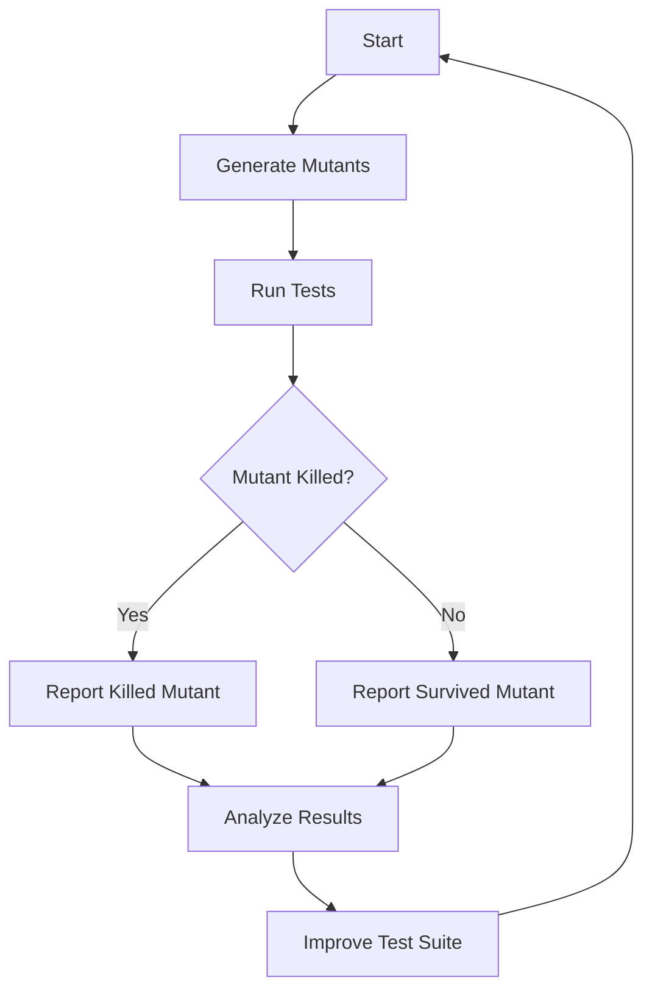

## 15.8 Mutation Testing with Mutant

Mutation testing is a powerful technique used to evaluate the effectiveness of your test suites. By introducing small changes, or mutations, to your code, mutation testing checks whether your tests can detect these changes. This process helps identify weak spots in your test coverage and ultimately leads to higher code quality.

### Understanding Mutation Testing

Mutation testing involves creating multiple versions of your code, each with a small modification, known as a mutant. These mutants are then tested against your existing test suite. If a test fails due to the mutation, the mutant is considered "killed." If the test suite passes despite the mutation, the mutant "survives," indicating a potential weakness in the test suite.

#### Purpose of Mutation Testing

- **Assess Test Suite Effectiveness**: Mutation testing helps determine how well your tests can detect errors in the code.
- **Identify Weak Tests**: It highlights tests that do not adequately cover the code or fail to assert the correct behavior.
- **Improve Code Quality**: By refining your tests based on mutation testing feedback, you can enhance the robustness of your codebase.

### Introducing Mutant: A Ruby Mutation Testing Tool

[Mutant](https://github.com/mbj/mutant) is a popular mutation testing tool for Ruby. It automates the process of generating mutants and running them against your test suite. Mutant integrates seamlessly with Ruby projects, making it an excellent choice for developers looking to improve their test coverage and code quality.

#### How Mutant Works

1. **Generate Mutants**: Mutant creates variations of your code by introducing small changes, such as altering operators, changing constants, or modifying control flow.
2. **Run Tests**: Each mutant is tested against your existing test suite.
3. **Analyze Results**: Mutant reports which mutants were killed and which survived, providing insights into the effectiveness of your tests.

### Setting Up Mutant in Your Ruby Project

To get started with Mutant, you need to install it and configure it for your project. Follow these steps:

1. **Install Mutant**: Add Mutant to your Gemfile and run `bundle install`.

   ```ruby
   gem 'mutant', group: :test
   ```

2. **Configure Mutant**: Create a configuration file, typically named `.mutant.yml`, to specify which parts of your codebase to test.

   ```yaml
   integration: rspec
   includes:
     - lib
   ```

3. **Run Mutant**: Execute Mutant from the command line to start the mutation testing process.

   ```bash
   bundle exec mutant -r ./lib --use rspec
   ```

### Interpreting Mutation Testing Results

Mutant provides detailed reports on the status of each mutant. Here's how to interpret these results:

- **Killed Mutants**: These are mutants that were detected by your test suite. A high kill rate indicates a strong test suite.
- **Survived Mutants**: These mutants were not detected by your tests, suggesting areas where your tests may be lacking.
- **Timeouts**: If a mutant causes tests to run indefinitely, it results in a timeout. This may indicate performance issues in your tests.

#### Example of Mutation Testing Output

```plaintext
Mutant configuration:
Matcher:         #<Mutant::Matcher::Config match_expressions: [#<Mutant::Expression:0x00007f9c3c0a3b28 @syntax_tree=#<Parser::AST::Node:0x00007f9c3c0a3b50 @type=:send, @children=[nil, :foo]>, @scope_name=nil>]>

Mutant environment:
Subjects:        1
Mutations:       3
Results:         3
Kills:           2
Alive:           1
Runtime:         0.02s
Killtime:        0.01s
Overhead:        100.00%
Coverage:        66.67%
```

### Improving Test Suites with Mutation Testing Feedback

Once you've identified survived mutants, you can take steps to improve your test suite:

1. **Analyze Survived Mutants**: Understand why these mutants were not detected. Are there missing test cases or assertions?
2. **Enhance Test Coverage**: Add new tests or improve existing ones to cover the scenarios missed by your test suite.
3. **Refactor Code**: Sometimes, survived mutants indicate code that is difficult to test. Refactoring such code can make it more testable.

### Benefits of Mutation Testing

- **Increased Confidence**: By ensuring your tests can detect subtle changes in the code, you gain confidence in the reliability of your software.
- **Higher Code Quality**: Mutation testing encourages writing more comprehensive tests, leading to cleaner and more maintainable code.
- **Early Detection of Bugs**: It helps catch potential bugs early in the development process, reducing the cost of fixing them later.

### Visualizing Mutation Testing Process

To better understand the mutation testing process, let's visualize it using a flowchart:



### Try It Yourself

Experiment with Mutant in your Ruby projects. Try modifying the code examples and observe how changes affect the mutation testing results. Consider the following exercises:

- **Exercise 1**: Introduce a new method in your code and see how well your tests cover it.
- **Exercise 2**: Deliberately weaken a test and observe how it affects the mutation testing results.
- **Exercise 3**: Refactor a piece of code to make it more testable and rerun Mutant to see the impact.

### Knowledge Check

- **Question**: What is the primary purpose of mutation testing?
- **Challenge**: How can you improve your test suite based on survived mutants?

### Conclusion

Mutation testing with Mutant is a valuable practice for Ruby developers aiming to build scalable and maintainable applications. By identifying weak tests and improving test coverage, you can enhance the quality and reliability of your codebase. Remember, this is just the beginning. As you progress, you'll build more robust test suites and write cleaner code. Keep experimenting, stay curious, and enjoy the journey!

## Quiz: Mutation Testing with Mutant



### What is the primary purpose of mutation testing?

- [x] To assess the effectiveness of test suites
- [ ] To improve code performance
- [ ] To refactor code
- [ ] To deploy applications

> **Explanation:** Mutation testing evaluates how well your test suite can detect changes in the code, ensuring its effectiveness.

### Which tool is commonly used for mutation testing in Ruby?

- [ ] RSpec
- [x] Mutant
- [ ] Capybara
- [ ] Cucumber

> **Explanation:** Mutant is a popular tool for performing mutation testing in Ruby projects.

### What does a "survived" mutant indicate?

- [ ] A test case passed
- [x] A potential weakness in the test suite
- [ ] A bug in the code
- [ ] An error in the test runner

> **Explanation:** A survived mutant means the test suite did not detect the change, indicating a potential weakness.

### How can you improve your test suite based on mutation testing feedback?

- [x] By adding new tests or improving existing ones
- [ ] By removing tests
- [ ] By ignoring survived mutants
- [ ] By refactoring the entire codebase

> **Explanation:** Enhancing test coverage by adding or improving tests helps address weaknesses identified by mutation testing.

### What is a "killed" mutant?

- [x] A mutant detected by the test suite
- [ ] A mutant that caused a test to pass
- [ ] A mutant that was ignored
- [ ] A mutant that survived

> **Explanation:** A killed mutant is one that was detected and caused a test to fail, indicating effective test coverage.

### What is the first step in the mutation testing process with Mutant?

- [x] Generate mutants
- [ ] Run tests
- [ ] Analyze results
- [ ] Improve test suite

> **Explanation:** The first step is to generate mutants by introducing small changes to the code.

### What does a high kill rate indicate in mutation testing?

- [x] A strong test suite
- [ ] Poor code quality
- [ ] Ineffective tests
- [ ] High code complexity

> **Explanation:** A high kill rate suggests that the test suite is effective at detecting changes in the code.

### What should you do if a mutant causes a timeout?

- [x] Investigate potential performance issues
- [ ] Ignore the mutant
- [ ] Remove the test
- [ ] Refactor the entire codebase

> **Explanation:** Timeouts may indicate performance issues in the tests, which should be investigated.

### How does mutation testing contribute to code quality?

- [x] By encouraging comprehensive test coverage
- [ ] By reducing code complexity
- [ ] By increasing code performance
- [ ] By simplifying code logic

> **Explanation:** Mutation testing promotes writing comprehensive tests, leading to higher code quality.

### True or False: Mutation testing can help catch potential bugs early in the development process.

- [x] True
- [ ] False

> **Explanation:** Mutation testing helps identify weaknesses in test suites, allowing developers to catch potential bugs early.


