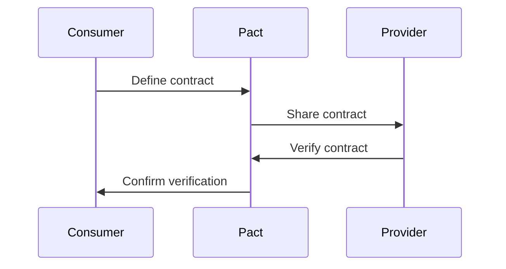

## 15.9 Contract Testing for Services

In the world of microservices and APIs, ensuring that different services can communicate effectively is crucial. Contract testing plays a vital role in this process by verifying that services adhere to predefined contracts. This section will delve into the concept of contract testing, its importance, and how tools like Pact can be used for consumer-driven contract testing in Ruby.

### What is Contract Testing?

Contract testing is a testing methodology that ensures that two systems (usually a client and a server) can communicate with each other as expected. This is particularly important in microservices architectures, where services are often developed and deployed independently. Contract testing verifies that the interactions between services adhere to a contract, which is a shared understanding of how services should communicate.

#### Importance of Contract Testing

1. **Prevents Integration Issues**: By ensuring that services adhere to their contracts, contract testing helps prevent integration issues that can arise when services are updated independently.
2. **Facilitates Independent Development**: Teams can develop and deploy services independently, confident that their changes won't break other services.
3. **Improves Communication**: Contract testing encourages clear communication between teams about the expected behavior of services.
4. **Enhances Reliability**: By catching potential issues early, contract testing enhances the reliability of the overall system.

### Tools for Contract Testing

One of the most popular tools for contract testing is [Pact](https://pact.io/), which supports consumer-driven contract testing. This approach allows the consumer of a service to define the expected interactions with the provider, ensuring that the provider meets these expectations.

#### Pact: Consumer-Driven Contract Testing

Pact is a tool that enables consumer-driven contract testing, where the consumer of a service defines the contract. This approach ensures that the provider meets the consumer's expectations, reducing the risk of integration issues.

**Key Features of Pact:**

- **Consumer-Driven**: The consumer defines the contract, ensuring that the provider meets the consumer's needs.
- **Language Support**: Pact supports multiple languages, including Ruby, making it a versatile choice for contract testing.
- **Pact Broker**: A tool for sharing contracts and verification results between teams.

### Writing Consumer and Provider Tests in Ruby

Let's explore how to write consumer and provider tests using Pact in Ruby. We'll start by setting up a simple consumer and provider service.

#### Setting Up the Consumer

Suppose we have a consumer service that needs to fetch user data from a provider service. We'll start by defining the expected interaction using Pact.

```ruby
# Gemfile
gem 'pact'

# spec/service_consumers/pacts/consumer-provider.json
require 'pact/consumer/rspec'

Pact.service_consumer "Consumer" do
  has_pact_with "Provider" do
    mock_service :provider do
      port 1234
    end
  end
end

describe "User Service" do
  before do
    provider
      .given("a user with ID 1 exists")
      .upon_receiving("a request for user data")
      .with(method: :get, path: '/users/1')
      .will_respond_with(
        status: 200,
        headers: { 'Content-Type' => 'application/json' },
        body: { id: 1, name: 'John Doe' }
      )
  end

  it "fetches user data" do
    response = Net::HTTP.get(URI('http://localhost:1234/users/1'))
    expect(response).to include('John Doe')
  end
end
```

In this example, we define a contract where the consumer expects the provider to return user data for a given user ID.

#### Setting Up the Provider

Next, we'll set up the provider to verify that it meets the consumer's expectations.

```ruby
# Gemfile
gem 'pact'

# spec/service_providers/pacts/provider-consumer.json
require 'pact/provider/rspec'

Pact.service_provider "Provider" do
  honours_pact_with "Consumer" do
    pact_uri '../service_consumers/pacts/consumer-provider.json'
  end
end

Pact.provider_states_for "Consumer" do
  provider_state "a user with ID 1 exists" do
    set_up do
      # Set up data for the provider
    end
  end
end

describe "Provider" do
  it "verifies the contract with the consumer" do
    Pact.provider_verifier.verify
  end
end
```

In this provider test, we verify that the provider meets the expectations defined by the consumer.

### Best Practices for Contract Testing

1. **Keep Contracts Up-to-Date**: Regularly update contracts to reflect changes in service interactions.
2. **Automate Contract Verification**: Integrate contract verification into your CI/CD pipeline to catch issues early.
3. **Communicate Changes**: Ensure that changes to contracts are communicated to all relevant teams.
4. **Use Pact Broker**: Utilize the Pact Broker to share contracts and verification results between teams.

### Role of Communication in Contract Testing

Effective communication between teams is crucial for successful contract testing. Teams must collaborate to define and update contracts, ensuring that all parties are aware of changes and their implications.

### Visualizing Contract Testing Workflow

To better understand the contract testing workflow, let's visualize the process using a sequence diagram.



This diagram illustrates the flow of information between the consumer, Pact, and the provider during the contract testing process.

### Try It Yourself

To deepen your understanding of contract testing, try modifying the consumer and provider tests to handle different scenarios, such as handling errors or different data formats. Experiment with adding new interactions and see how they affect the contract verification process.

### References and Links

- [Pact Documentation](https://docs.pact.io/)
- [Consumer-Driven Contracts: A Service Evolution Pattern](https://martinfowler.com/articles/consumerDrivenContracts.html)

### Knowledge Check

- What is the primary goal of contract testing?
- How does Pact facilitate consumer-driven contract testing?
- Why is communication important in contract testing?

### Embrace the Journey

Remember, contract testing is an ongoing process that requires collaboration and communication between teams. As you continue to explore contract testing, keep experimenting and refining your approach to ensure reliable service integrations.

## Quiz: Contract Testing for Services



### What is the primary purpose of contract testing?

- [x] To ensure that services adhere to predefined contracts
- [ ] To test the performance of services
- [ ] To verify the security of services
- [ ] To check the scalability of services

> **Explanation:** Contract testing ensures that services adhere to predefined contracts, preventing integration issues.

### Which tool is commonly used for consumer-driven contract testing in Ruby?

- [x] Pact
- [ ] RSpec
- [ ] Cucumber
- [ ] Selenium

> **Explanation:** Pact is a popular tool for consumer-driven contract testing in Ruby.

### What is a key feature of consumer-driven contract testing?

- [x] The consumer defines the contract
- [ ] The provider defines the contract
- [ ] Contracts are automatically generated
- [ ] Contracts are not required

> **Explanation:** In consumer-driven contract testing, the consumer defines the contract to ensure the provider meets their expectations.

### How does contract testing improve communication between teams?

- [x] By encouraging clear communication about expected service behavior
- [ ] By eliminating the need for communication
- [ ] By automating all interactions
- [ ] By reducing the number of teams involved

> **Explanation:** Contract testing encourages clear communication about expected service behavior, improving collaboration.

### What is the role of the Pact Broker?

- [x] To share contracts and verification results between teams
- [ ] To execute tests automatically
- [ ] To generate contracts
- [ ] To manage service deployments

> **Explanation:** The Pact Broker is used to share contracts and verification results between teams.

### Why is it important to keep contracts up-to-date?

- [x] To reflect changes in service interactions
- [ ] To reduce testing time
- [ ] To simplify the testing process
- [ ] To eliminate the need for provider tests

> **Explanation:** Keeping contracts up-to-date ensures they reflect changes in service interactions, preventing integration issues.

### How can contract verification be automated?

- [x] By integrating it into the CI/CD pipeline
- [ ] By using manual testing
- [ ] By writing more unit tests
- [ ] By reducing the number of contracts

> **Explanation:** Automating contract verification in the CI/CD pipeline helps catch issues early.

### What is a benefit of using consumer-driven contract testing?

- [x] It ensures the provider meets the consumer's needs
- [ ] It reduces the need for testing
- [ ] It simplifies service development
- [ ] It eliminates integration issues

> **Explanation:** Consumer-driven contract testing ensures the provider meets the consumer's needs, reducing integration issues.

### What is the first step in the contract testing workflow?

- [x] Define the contract
- [ ] Verify the contract
- [ ] Share the contract
- [ ] Deploy the services

> **Explanation:** The first step in the contract testing workflow is to define the contract.

### True or False: Contract testing eliminates the need for integration testing.

- [ ] True
- [x] False

> **Explanation:** Contract testing complements integration testing but does not eliminate the need for it.



By understanding and implementing contract testing, you can ensure that your services communicate effectively, reducing the risk of integration issues and enhancing the reliability of your applications. Keep exploring and refining your approach to contract testing to build scalable and maintainable applications.
